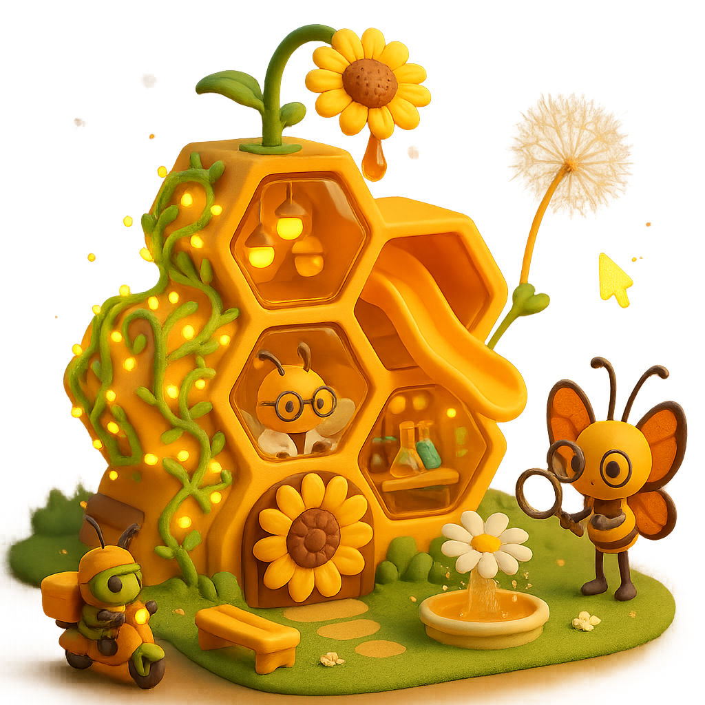
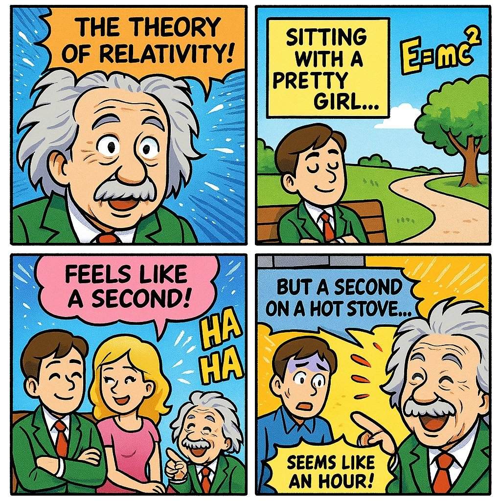
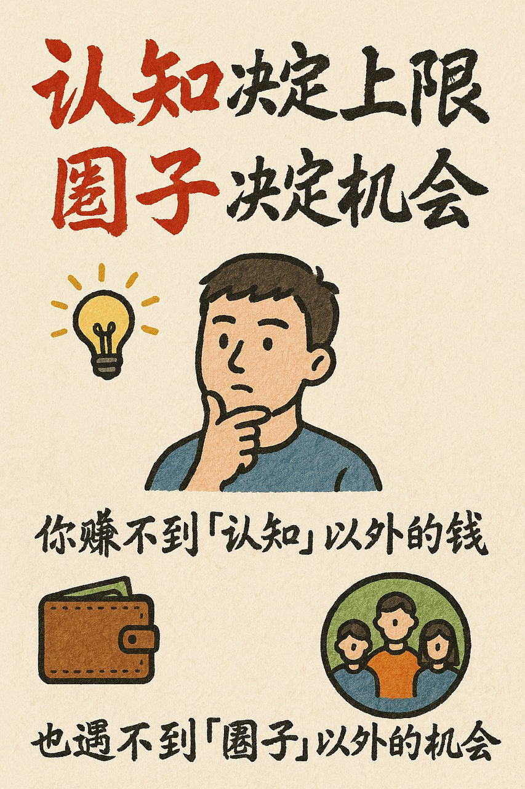

<a id="readme-top"></a>
# GPT-4o Image Prompts

🎉 欢迎来到 GPT‑4o 图片提示词（Prompts）精选！提示词持续更新中。。。

这里收集了 OpenAI 最新多模态模型 GPT‑4o 生成图片的精彩案例和提示词（Prompts）。

---
<a id="join_chat"></a>
## 加入群聊《AI交流群-GPT4o提示词》
<div style="display: flex; justify-content: space-between;">


</div>

---

<a id="prompt-toc"></a>
## 📖 案例目录
*   [案例 100：终极跨界 ](#prompt-100)
*   [案例 99：玩具盒中的历史 ](#prompt-99)
*   [案例 98：3D卡通雕塑风格 ](#prompt-98)
*   [案例 97：复古电脑开机画面解析为ASCII艺术 ](#prompt-97)
*   [案例 96：3D蒸汽朋克Logo ](#prompt-96)
*   [案例 95：品牌平面纸风格 ](#prompt-95)
*   [案例 94：制药风格商品 ](#prompt-94)
*   [案例 93：不同情绪状态的思想泡泡 ](#prompt-93)
*   [案例 92：霓虹玻璃发光 ](#prompt-92)
*   [案例 91：动感雕塑 ](#prompt-91)
*   [案例 90：将您的标志变成毛毡纹理 ](#prompt-90)
*   [案例 89：海洋中三艘不同的奇幻帆船 ](#prompt-89)
*   [案例 88：AirBnB任何东西 ](#prompt-88)
*   [案例 87：品牌解锁童年回忆 ](#prompt-87)
*   [案例 86：未来的OpenAI可穿戴设备 ](#prompt-86)
*   [案例 85：知名戏曲片段的MBTI人格类型卡片 ](#prompt-85)
*   [案例 84：渐变挤出Google I/O 2025大会视觉效果 ](#prompt-84)
*   [案例 83：Glitch矢量徽标样式 ](#prompt-83)
*   [案例 82：霓虹花卉和谐插图 ](#prompt-82)
*   [案例 81：品牌乐器 ](#prompt-81)
*   [案例 80：水果的形状 ](#prompt-80)
*   [案例 79：Alloy图标 ](#prompt-79)
*   [案例 78：毛绒形式表情符号 ](#prompt-78)
*   [案例 77：3D零食卡通世界 ](#prompt-77)
*   [案例 76：黑白漫画风格插图 ](#prompt-76)
*   [案例 75：可爱干净的底座立体模型 ](#prompt-75)
*   [案例 74：3D可爱粉彩粘土图标 ](#prompt-74)
*   [案例 73：有趣的毛茸茸字母 ](#prompt-73)
*   [案例 72：超现实主义油画 ](#prompt-72)
*   [案例 71：景观洞穴入口的形状 ](#prompt-71)
*   [案例 70：重新构想的玫瑰金 ](#prompt-70)
*   [案例 69：品牌折叠纸 ](#prompt-69)
*   [案例 68：透明容器里有一个微型的3D世界 ](#prompt-68)
*   [案例 67：可爱微缩场景 ](#prompt-67)
*   [案例 66：霓虹灯风格工具 ](#prompt-66)
*   [案例 65：皱巴巴的纸片 ](#prompt-65)
*   [案例 64：洞壁画 ](#prompt-64)
*   [案例 63：选择你的阵营 ](#prompt-63)
*   [案例 62：品牌设计指南海报 ](#prompt-62)
*   [案例 61：破碎的真相 ](#prompt-61)
*   [案例 60：令人垂涎欲滴的广告 ](#prompt-60)
*   [案例 59：军事计划 ](#prompt-59)
*   [案例 58：血月下的决斗 ](#prompt-58)
*   [案例 57：手工毛线纹理 ](#prompt-57)
*   [案例 56：玻璃盒内的图像可视化 ](#prompt-56)
*   [案例 55：彩色卡通俏皮图标和徽标 ](#prompt-55)
*   [案例 54：三种形状和三种颜色 ](#prompt-54)
*   [案例 53：由鲜花组成的小房子 ](#prompt-53)
*   [案例 52：清洁琴键的小人物 ](#prompt-52)
*   [案例 51：霓虹灯发光的可爱动物 ](#prompt-51)
*   [案例 50：通过钥匙孔看世界 ](#prompt-50)
*   [案例 49：超现实海洋图案 ](#prompt-49)
*   [案例 48：警方照片风格 ](#prompt-48)
*   [案例 47：无声电影场景 ](#prompt-47)
*   [案例 46：简单的输入中构思和创建有影响力的图像 ](#prompt-46)
*   [案例 45：复古锡玩具立体模型风格 ](#prompt-45)
*   [案例 44：附魔粒子泛光 ](#prompt-44)
*   [案例 43：Airbnb风格的图标 ](#prompt-43)
*   [案例 42：Logo超写实微型摄影 ](#prompt-42)
*   [案例 41：卡通角色转换成超写实人类 ](#prompt-41)
*   [案例 40：品牌领导骑行 ](#prompt-40)
*   [案例 39：网络矩阵梦境 ](#prompt-39)
*   [案例 38：捷克木偶风格 ](#prompt-38)
*   [案例 37：Logo放进我的世界中 ](#prompt-37)
*   [案例 36：马赛克壁画 ](#prompt-36)
*   [案例 35：人物戏剧夸张风格 ](#prompt-35)
*   [案例 34：云的艺术 ](#prompt-34)
*   [案例 33：复古像素UI图标 ](#prompt-33)
*   [案例 32：卡通风格文本标志 ](#prompt-32)
*   [案例 31：超写实拼图肖像 ](#prompt-31)
*   [案例 30：公司金币 ](#prompt-30)
*   [案例 29：面包形态 ](#prompt-29)
*   [案例 28：狭窄走廊里奔跑 ](#prompt-28)
*   [案例 27：品牌奢华之物从天而降 ](#prompt-27)
*   [案例 26：水流身份 ](#prompt-26)
*   [案例 25：按键删除周一 ](#prompt-25)
*   [案例 24：新市场中的美妆品牌 ](#prompt-24)
*   [案例 23：平面设计等边风格 ](#prompt-23)
*   [案例 22：自定义气球 ](#prompt-22)
*   [案例 21：产品变成纸玻璃 ](#prompt-21)
*   [案例 20：透明塑料袋装物体 ](#prompt-20)
*   [案例 19：Emoji变成一个花盆 ](#prompt-19)
*   [案例 18：品牌我的世界风格 ](#prompt-18)
*   [案例 17：未来一瞥 ](#prompt-17)
*   [案例 16：品牌星球世界 ](#prompt-16)
*   [案例 15：树屋 ](#prompt-15)
*   [案例 14：创意广告 ](#prompt-14)
*   [案例 13：创意广告 ](#prompt-13)
*   [案例 12：创意广告 ](#prompt-12)
*   [案例 11：品牌之爱话术 ](#prompt-11)
*   [案例 10：熔化变异文本 ](#prompt-10)
*   [案例 9：青花瓷风格 ](#prompt-9)
*   [案例 8：刺绣插图风格 ](#prompt-8)
*   [案例 7：刺绣肖像 ](#prompt-7)
*   [案例 6：金色抽象综合风格 ](#prompt-6)
*   [案例 5：创建你自己的GTA角色 ](#prompt-5)
*   [案例 4：马斯克在公园画画 ](#prompt-4)
*   [案例 3：蜜蜂科学城 ](#prompt-3)
*   [案例 2：四格漫画 (相对论) ](#prompt-2)
*   [案例 1：手绘风格的信息图卡片 ](#prompt-1)

---
<a id="prompt-100"></a>
## 案例 100：终极跨界 (来源 [@TheRelianceAI](https://x.com/TheRelianceAI/status/1925146916133712191))


**提示词：**
```
Imagine [CHARAKTER 1] and [Charakter 2] casually sitting together at a table in a [FAST FOOD BRAND] restaurant. The atmosphere is relaxed and light-hearted, with the two characters engaged in an amusing or deep conversation over trays of food and drinks.
```

<a id="prompt-99"></a>
## 案例 99：玩具盒中的历史 (来源 [@TheRelianceAI](https://x.com/TheRelianceAI/status/1925223613055017251))


**提示词：**
```
An ultra-realistic top-down photograph of a 3D-printed diorama inside a beige cardboard box, with the lid being held open by two human hands. The interior of the box reveals a miniature landscape of [COUNTRY NAME], featuring iconic landmarks, terrain, buildings, rivers, vegetation, and crowds of tiny, detailed human figures. The diorama is filled with vibrant, geographically appropriate elements, all crafted in a tactile, toy-like style using matte 3D-printed textures with visible layer lines. At the top, the inside of the box lid displays the phrase “[COUNTRY NAME]” in large, colorful, raised plastic letters—each letter in a different bright color. The lighting is warm and cinematic, highlighting the textures and shadows to evoke a sense of realism and charm, as if the viewer is opening a magical miniature version of the natio
```

<a id="prompt-98"></a>
## 案例 98：3D卡通雕塑风格 (来源 [@aziz4ai](https://x.com/aziz4ai/status/1925301120252924356))


**提示词：**
```
a soft 3D cartoon-style sculpture of [brand product], made of smooth clay-like textures and vibrant pastel colors, placed in a minimalist isometric scene that complements the product’s nature, clean composition, gentle lighting, subtle shadows, with the product’s logo and a 3-word slogan displayed clearly belo
```

<a id="prompt-97"></a>
## 案例 97：复古电脑开机画面解析为ASCII艺术 (来源 [@Gdgtify](https://x.com/Gdgtify/status/1925176250626159053))


**提示词：**
```
Retro CRT computer boot screen that resolves into ASCII-art of NYC's tallest building
```

<a id="prompt-96"></a>
## 案例 96：3D蒸汽朋克Logo (来源 [@MayorKingAI](https://x.com/MayorKingAI/status/1925144570553327620))


**提示词：**
```
3D sculpted logo of [LOGO NAME], in a steampunk style, made of aged brass and oxidized iron, with visible rivets, gears, and vintage mechanical elements, distressed and weathered surface, rich copper and bronze tones, engraved with Victorian-style filigree, retro-industrial design, soft spotlight lighting, neutral background, hyper-realistic render, ultra-high resolution, symmetrical composition
```

<a id="prompt-95"></a>
## 案例 95：品牌平面纸风格 (来源 [@HBCoop_](https://x.com/HBCoop_/status/1925213900192043236))


**提示词：**
```
A flat branded paper folds itself into the full 3D shape of a [Air Jordan 1 shoes], mid-motion. Dramatic studio lighting, origami texture detail, gradient shadows, Japanese minimalism feel.
```
```
A flat branded paper folds itself into the full 3D shape of a [Jansport backpack], mid-motion. Dramatic studio lighting, origami texture detail, gradient shadows, Japanese minimalism feel.
```

<a id="prompt-94"></a>
## 案例 94：制药风格商品 (来源 [@azed_ai](https://x.com/azed_ai/status/1925197464099049735))


**提示词：**
```
A square-format digital photograph showing a fictional pharmaceutical-style product from [Brand Name] Pharmacy. The box is on the left, clean and minimalist, featuring bold text with the product name "[PRODUCT NAME]" and a witty line like "Take one [type] daily." Next to the box is a silver blister pack containing 6–10 themed pills or capsules shaped like [describe icon/logo/item, e.g., a coffee cup, burger, heart, Midjourney logo, etc.]. Neutral background, soft lighting, sharp focus, modern packaging aesthetic.
```

<a id="prompt-93"></a>
## 案例 93：不同情绪状态的思想泡泡 (来源 [@TheRelianceAI](https://x.com/TheRelianceAI/status/1925098220398465145))


**提示词：**
```
A [SUBJECT] sits alone in a minimalistic room filled with floating, semi-transparent thought bubbles. Each bubble contains a fragment of their face from different emotional states — smiling, crying, screaming — forming a psychological self-portrait suspended in mid-air.
```

<a id="prompt-92"></a>
## 案例 92：霓虹玻璃发光 (来源 [@alban_gz](https://x.com/alban_gz/status/1925446996468371893))


**提示词：**
```
Recreate this image using the parameters from the JSON provided.
{
  "name": "Neon Glass Glow",
  "style": {
    "material": {
      "type": "glass",
      "transparency": 0.92,
      "reflectivity": 1.0,
      "refractionIndex": 1.6,
      "color": "#ff00ff",
      "emission": {
        "color": "#ff66ff",
        "intensity": 0.8
      },
      "surfaceFinish": "glossy",
      "bloom": true,
      "detail": "high"
    },
    "outline": {
      "enabled": true,
      "color": "#ffccff",
      "width": 1.8
    },
    "lighting": {
      "type": "studio",
      "keyLightColor": "#ffffff",
      "keyLightIntensity": 1.0,
      "fillLightColor": "#9900ff",
      "fillLightIntensity": 0.7,
      "rimLightColor": "#00ffff",
      "rimLightIntensity": 0.7,
      "shadows": "crisp"
    },
    "background": {
      "type": "solid",
      "color": "#000000"
    },
    "render": {
      "shadows": true,
      "antiAliasing": true,
      "superSampling": "4x",
      "resolution": "high",
      "depthOfField": {
        "enabled": true,
        "focusDistance": 0.8,
        "blurAmount": 0.1
      }
    }
  }
}
```

<a id="prompt-91"></a>
## 案例 91：动感雕塑 (来源 [@azed_ai](https://x.com/azed_ai/status/1925490847564669153))


**提示词：**
```
A kinetic sculpture of a [subject], made of interlocking metal rods and panels in brushed [color1] and oxidized [color2]. Suspended in motion, with rotating parts casting mechanical shadows on a concrete pedestal.
```
**示例：**
```
A kinetic sculpture of a leaping dancer, made of interlocking metal rods and panels in brushed platinum and oxidized midnight blue. Suspended in motion, with rotating parts casting mechanical shadows on a concrete pedestal.
```

<a id="prompt-90"></a>
## 案例 90：将您的标志变成毛毡纹理 (来源 [@alex_prompter](https://x.com/alex_prompter/status/1925460683509899423))


**提示词：**
```
Retexture [BRAND NAME] logo following my JSON aesthetic below:
{
"style": "realistic needle-felted wool sculpture",
"subject_handling": {
"adapt_to_uploaded_image": true,
"preserve_original_shape_and_layout": true,
"preserve_uploaded_color_values": true,
"preserve_text_if_present": true,
"preserve_text_case": true,
"preserve_exact_letterforms": true,
"use_uploaded_image_as_pixel_map": true,
"prevent_color_estimation_or_stylization": true
},
"needle_felting": {
"material_type": "dyed wool fibers matched precisely to uploaded image pixels",
"texture_description": "fluffy soft felt with clear fiber strands",
"construction_style": "needle-felted, light irregularities allowed but no color bleeding",
"color_application_method": "direct color transfer from uploaded image to wool sculpture",
"prevent_auto_saturation_adjustment": true,
"prevent_color_fading": true,
"color_binding_mode": "pixel-level color fidelity per original image"
},
"lighting": {
"lighting_type": "neutral soft studio lighting",
"shadow": "soft, gray-toned shadows under the object only",
"highlight_behavior": "matte highlights only from felt surface — no bloom or color shift"
},
"background": {
"type": "plain matte studio",
"background_color": "pastel tone that contrasts with logo color",
"color_conflict_handling": "auto-adjust background brightness — do not alter logo colors"
},
"camera": {
"focus_style": "macro lens",
"depth_of_field": "shallow — full subject in sharp detail, soft background",
"angle": "frontal or slightly elevated, full subject visible"
},
"post_processing": {
"color_preservation_enforced": true,
"disable_auto-enhancement_or_tinting": true,
"no artistic reinterpretation": true,
"no auto-correction, bloom, or white balance adjustments": true
},
"image_constraints": {
"transparent_background": false,
"aspect_ratio_locked": true,
"include_text_if_present": true,
"preserve_text_case": true,
"preserve_uploaded_color_values": true,
"prevent_shape_or_color_change": true,
"enforce_exact_pixel_color_match_to_uploaded_image": true
},
"notes": "The uploaded image must be converted into a needle-felted wool sculpture using its exact colors and shape. Use pixel-level mapping to apply the uploaded color values to simulated dyed wool fibers. Do not change, brighten, dull, average, or blend colors. Text must remain intact and readable. Background should be soft pastel to contrast the logo — never adjust the logo to fit the scene."
}
```
**提示：上传一张图片**

<a id="prompt-89"></a>
## 案例 89：海洋中三艘不同的奇幻帆船 (来源 [@BeanieBlossom](https://x.com/BeanieBlossom/status/1925159751169810806))


**提示词：**
```
Three different fantasy sailboats in the ocean, multiple scenes of beautiful aurora borealis and colorful moons with snowy mountains, a dreamy, fantasy landscape, in the style of digital art.
```

<a id="prompt-88"></a>
## 案例 88：AirBnB 任何东西 (来源 [@R2_fieldworks](https://x.com/R2_fieldworks/status/1924433924106727531))


**提示词：**
```
A highly detailed 3D isometric icon of the following object: [OBJECT]

Style: Airbnb 2024 icon language — miniature diorama / emoji-like object with crisp edges, realistic textures, and soft handcrafted realism.  

Material: The object should clearly retains its fundamental qualities but look as if its made from a mixture of matte and plastic-like materials.  

View: three-quarter front-left isometric view with a slight top-down angle.  

Lighting: soft neutral studio lighting from the top-left with subtle shadows and gentle gloss highlights.  

Color palette: retain the fundamental colors from the object and include subtle gradients and no harsh contrasts.  

Background: clean white, no drop shadow or noise.  

Mood: minimal, charming, utilitarian, premium.  

Rendering: hyper-detailed, photorealistic object with depth and tactility, like a designer lifestyle emoji or miniature product model. 

Optional Add-on for Replication:  Use the attached photo as a reference for proportions and layout. Do not copy exactly — reinterpret it in the Airbnb icon aesthetic.
```

<a id="prompt-87"></a>
## 案例 87：品牌解锁童年回忆 (来源 [@TheRelianceAI](https://x.com/TheRelianceAI/status/1925606107608715268))


**提示词：**
```
A realistic, cinematic photograph of a vintage [BRAND NAME] item being gently lifted from a dusty stack of old children's books in a dimly lit attic. The item is designed in classic [BRAND NAME] style—featuring authentic patterns, textures, or logos (e.g. monograms, embossing, or signature motifs relevant to the brand). It is partially opened to reveal a miniature, warmly lit classroom inspired by [COUNTRY] school interiors, complete with small regional-style desks, a chalkboard with delicate handwriting in [LANGUAGE], and traditional local details like shoes, posters, or flags. A paper airplane hovers mid-air. The lighting is moody and nostalgic, with soft shadows and golden highlights suggesting afternoon light filtering through attic beams. On the top book cover at the bottom of the image, the [BRAND NAME] logo is written in an elegant, fountain-pen calligraphy style—subtle, integrated into the scene, and not obscuring the main subject.
```

<a id="prompt-86"></a>
## 案例 86：未来的OpenAI可穿戴设备 (来源 [@hc_dsn](https://x.com/hc_dsn/status/1925589916844794154))


**提示词：**
```
Create image with 1:1 ratio A next-gen wearable ai [device type] blending Jony Ive–inspired refined minimalism with a new material and interaction language symbolizing the power ChatGPT. The device is crafted from translucent aerogel fused with polished ceramic titanium, feather-light yet futuristic.  No seams, buttons, or traditional UI. Photographed floating against a pure white background, with a soft, diffused, nearly shadowless studio light.
```

<a id="prompt-85"></a>
## 案例 85：知名戏曲片段的MBTI人格类型卡片 (来源 [@op7418](https://x.com/op7418/status/1925869690120794320))


**提示词：**
```
# 任务目标
请生成一张基于中国古代知名戏曲片段的MBTI人格类型卡片图片，使戏曲场景扁平插画的情感内涵与MBTI人格特质相对应。，我需要生成的人各类型是[INTP]

## 内容要求
1. **场景选取**：从中国古代知名戏曲片段中提取能体现不同MBTI人格特质的代表性场景
2. **场景意境**：画面需表现完整戏剧场景，通过场景氛围体现对应的人格特质
3. **服饰真实性**：画面中人物必须穿着对应戏曲的正确戏服
4. **人格对应**：每个场景需精准对应一种MBTI人格类型的核心特质

## 卡片排版设计
参考图片样式：
- **顶部**：MBTI类型代码（如INFJ）
- **中部**：渐变色彩的抽象几何图形作为主视觉
- **底部**：
- 中文人格类型名称（如"提倡者"）
- 英文标语：（如"The world is your oyster"）
- 装饰性边框和星形符号

## 视觉风格
- 采用现代极简设计语言
- 渐变色彩与几何形状结合
- 保持神秘感与艺术性
- 整体色调柔和梦幻

## 技术规格
- 卡片尺寸采用标准比例
- 每张卡片需清晰标注MBTI类型代码
- 保持系列视觉一致性
```

<a id="prompt-84"></a>
## 案例 84：渐变挤出Google I/O 2025大会视觉效果 (来源 [@hckmstrrahul](https://x.com/hckmstrrahul/status/1925567579856453701))


**提示词：**
```
Retexture this image in the following JSON style aesthetic:
{
  "styleAesthetic": {
    "title": "Isometric Multicolor Extrusion with Grid Control",
    "overallVibe": "Playful modern 3D iconography with directional extrusion and dynamic isometric grids",
    "viewAngle": {
      "type": "Isometric",
      "facingDirection": "right",  // options: left, right, front
      "rotationDegrees": {
        "x": 30,
        "y": 30
      }
    },
    "renderingStyle": "Clean 3D extruded vector with soft lighting and high contrast between faces",
    "objectSurface": {
      "frontFace": {
        "color": "#ffffff",
        "material": "Matte white plastic",
        "lighting": "Soft diffuse"
      },
      "extrudedSide": {
        "type": "Multicolor gradient",
        "gradientStyle": "Diagonal sweep",
        "colorStops": [
          "#ff0040", "#ff8000", "#ffff00", "#00ff90", "#00cfff", "#8000ff"
        ],
        "material": "Glossy plastic",
        "lighting": "Ambient with light falloff"
      }
    },
    "extrusion": {
      "direction": "right",  // determines which side is extruded: left, right, front
      "depth": "moderate"
    },
    "shadows": {
      "type": "Drop shadow",
      "direction": "bottom-right",
      "opacity": 0.15,
      "blurRadius": "6px"
    },
    "background": {
      "type": "Isometric grid",
      "color": "#ffffff",
      "gridStyle": {
        "lineColor": "#e0e0e0",
        "lineWeight": "1px",
        "orientation": "opposite-extrusion"  // automatically flips grid lines to oppose the extrusion direction
      }
    },
    "moodKeywords": [
      "Dimensional",
      "Clean",
      "Geometric",
      "Colorful",
      "Tactile",
      "Structured"
    ]
  }
}
```

<a id="prompt-83"></a>
## 案例 83：Glitch 矢量徽标样式 (来源 [@Artedeingenio](https://x.com/Artedeingenio/status/1925844468294365289))


**提示词：**
```
A bold vector logo design in glitch art style, featuring distorted typography with RGB color channel shifts, fragmented lines, misaligned edges, digital noise effects, and a cyberpunk aesthetic. The logo appears corrupted or hacked, as if captured from a malfunctioning screen. Use a black or dark background for contrast, neon or high-saturation color palette, and sharp angular forms.
```
**示例想法：**
```
1、"X-CODE" in futuristic glitch style, with pixel breakups and neon overlays
2、A glitch vector logo for a rogue AI named “OBLIVION.EXE”, with red error overlays and corrupted circuitry
3、A circular emblem for “Station 404”, a hacked orbital base with broken planetary symbols and static flicker
4、A surveillance eye logo, distorted with chromatic aberration, layered static, and flickering digital interference
```

<a id="prompt-82"></a>
## 案例 82：霓虹花卉和谐插图 (来源 [@LudovicCreator](https://x.com/LudovicCreator/status/1926246931661042132))


**提示词：**
```
A Neon Floral Harmony illustration of [SUBJECT], with flowers and plants outlined in glowing neon hues. Use vibrant [COLOR1] and [COLOR2] to create a serene yet electrifying botanical scene
```
**示例：**
```
A Neon Floral Harmony illustration of a graceful hummingbird, with flowers and plants outlined in glowing neon hues. Use vibrant turquoise and magenta to create a serene yet electrifying botanical scene
```

<a id="prompt-81"></a>
## 案例 81：品牌乐器 (来源 [@TheRelianceAI](https://x.com/TheRelianceAI/status/1926148686884606257))


**提示词：**
```
A highly stylized and vibrant promotional image of a [INSTRUMENT] designed in the visual style of the [BRAND] brand — the instrument is reimagined with iconic colors, patterns, and aesthetic elements of the brand. Set in a dynamic, music-inspired environment, with glowing accents, product-style lighting, and joyful energy. Artistic fusion of music and design. 3D render look, high detail, vibrant colors, futuristic but playful.
```

<a id="prompt-80"></a>
## 案例 80：水果的形状 (来源 [@umesh_ai](https://x.com/umesh_ai/status/1926182194159972503))


**提示词：**
```
Create an image by arranging [NUMBER/AGGREGATE] of [FRUIT] strategically on a dark surface to form the shape of [OBJECT/EMOJI/LOGO]
```

<a id="prompt-79"></a>
## 案例 79：Alloy图标 (来源 [@hc_dsn](https://x.com/hc_dsn/status/1926095406871568670))


**提示词：**
```
create image with 1: 1 ratio  
turn a vector [ type
] icon with the following json style 
{
    "object": "icon",
    "material": {
        "primary_surface": "smooth matted translucent metallic",
        "finish": "iridescent sheen",
        "color_profile": {
            "base_color": "deep blue",
            "secondary_tones": [
                "black",
                "violet",
                "copper-orange highlights"
            ]
        },
        "panel_lines": {
            "material": "metallic copper",
            "visual_treatment": "glowing edge with subtle bevel"
        },
    },
    "lighting": {
        "type": "studio",
        "key_light": {
            "position": "top-left",
            "effect": "smooth gradient highlight across the surface"
        },
        "rim_light": {
            "position": "right side",
            "effect": "sharp metallic edge glow"
        },
        "reflections": {
            "character": "diffused but iridescent, hinting at a highly polished or lacquered surface"
        },
        "shadows": "soft edge, minimal ground contact due to floating presentation"
    },
    "background": {
        "color": "#FFF",
        "style": "solid matte",
    },
    "composition": {
        "camera_angle": "centered, eye-level",
        "depth_of_field": "none (sharp focus throughout)",
        "presentation": "floating, isolated subject"     "angle": "isometric style"
    },
    "visual_style": {
        "tone": "modern, high-impact",
        "inspiration": "sports branding meets futuristic product design",
        "aesthetic": "bold contrast, tech-luxury fusion"
    }
}
```

<a id="prompt-78"></a>
## 案例 78：毛绒形式表情符号 (来源 [@alban_gz](https://x.com/alban_gz/status/1925833589431619616))


**提示词：**
```
Recreate this [insert emoji] using the parameters from the JSON provided.
{
  "style": "Plushform Emoji",
  "description": "Transform the emoji into a soft, realistic plush object with high-quality fabric and detailed construction. Do not anthropomorphize the emoji — avoid adding faces or cartoon features. Focus on accurate textures, natural forms, and subtle design to give the plush object character.",
  "features": {
    "shape": "matching the emoji's form, with soft, slightly rounded plush adaptation",
    "texture": "realistic plush fabric with visible fiber detail and natural fabric folds",
    "color": "faithful to the emoji's palette, using slightly muted, tactile tones",
    "material": "stuffed toy fabric with visible stitching, seams, and high-quality finishing",
    "background": "neutral or softly textured to emphasize the plush object's form",
    "lighting": "soft professional studio lighting with subtle shadows and depth"
  },
  "examples": [
    "👌 becomes a plush hand in the OK gesture, with realistic fabric folds and seams.",
    "🎯 becomes a soft plush bullseye with layered fuzzy rings and slight dimensional padding.",
    "🎁 becomes a cube-shaped plush box with fabric ribbon, visible stitching, and realistic fabric texture.",
    "🌊 becomes a wave-shaped plush with curled foam tips, crafted in textured ocean blue fabrics."
  ]
}
```

<a id="prompt-77"></a>
## 案例 77：3D零食卡通世界 (来源 [@aziz4ai](https://x.com/aziz4ai/status/1925895453217898847))


**提示词：**
```
A 3D-rendered digital illustration featuring a retro-style food truck inspired by the brand [INSERT BRAND NAME], designed with smooth pastel colors and soft textures. A black-and-white cartoon character stands beside the truck, holding a product that visually represents the brand. The environment reflects the brand’s world—playful hills, trees, and skies stylized with its color palette and product shapes. The brand’s logo is clearly displayed on the truck, and a short slogan appears naturally within the scene. Format: 1:1, isometric view, cinematic lighting, clean and joyful composition.
```

<a id="prompt-76"></a>
## 案例 76：黑白漫画风格插图 (来源 [@CharaspowerAI](https://x.com/CharaspowerAI/status/1923778050845528388))


**提示词：**
```
Highly dramatic and epic black and white manga-style illustration of [Your character and description].  Powerful, dynamic pose, exaggerated features emphasizing the intensity of the scene. Background with explosive energy bursts, lightning effects, and a whirlwind of debris
```

<a id="prompt-75"></a>
## 案例 75：可爱干净的底座立体模型 (来源 [@CharaspowerAI](https://x.com/CharaspowerAI/status/1925593447802540408))


**提示词：**
```
Highly detailed 3D-rendered chibi figurine diorama of [Character A] and [Character B], captured in a [scene/action], inside a [thematic display case shape] with [material]. The background features [visual effects: debris, aura, lightning, scenery], dynamic pose. The title "[custom phrase]" is embossed at the top in [font/style], matching the tone. Lighting is [studio, cinematic, ambient], color palette of [main colors]. Designed in a collectible, stylized, viral-friendly aesthetic.
```

<a id="prompt-74"></a>
## 案例 74：3D可爱粉彩粘土图标 (来源 [@icreatelife](https://x.com/icreatelife/status/1926014358783430945))


**提示词：**
```
Tiny cute isometric [smiling - optional] [OBJECT] emoji, shape, soft lighting, soft pastel colors, [COLOR], 3d icon clay render, blender 3d, pastel background
```

<a id="prompt-73"></a>
## 案例 73：有趣的毛茸茸字母 (来源 [@Anima_Labs](https://x.com/Anima_Labs/status/1925933980781535629))


**提示词：**
```
A highly realistic 3D render of the letter [A-Z] designed as a full-body fluffy monster. The letter shape itself is the creature’s body — no separate head or limbs. The eyes, mouth, and other monster features are embedded naturally into the letter form. The monster expresses a [mischievous / grumpy / shy / joyful / sleepy / surprised / confident] emotion through its eyes and mouth shape. The texture is dense, soft, and realistic fur, with subtle volume and shadow. The color palette is bold but clean — solid vibrant tones like mint, lilac, sky blue, or coral (avoid rainbow gradients). Studio lighting on a simple pastel background. No hats, no party props — just a minimal, high-quality character design with playful expression.
```

<a id="prompt-72"></a>
## 案例 72：超现实主义油画 (来源 [@azed_ai](https://x.com/azed_ai/status/1926217150093549680))


**提示词：**
```
A surreal oil painting of a [subject], executed in the style of early 20th-century dreamscapes. Melting shapes, floating forms, and swirling [color1] and [color2] brushstrokes create a dreamlike dissonance.
```
**示例：**
```
A surreal oil painting of a man with a candle for a head, executed in the style of early 20th-century dreamscapes. Melting shapes, floating forms, and swirling burnt orange and midnight blue brushstrokes create a dreamlike dissonance.
```

<a id="prompt-71"></a>
## 案例 71：景观洞穴入口的形状 (来源 [@umesh_ai](https://x.com/umesh_ai/status/1925819339413836010))


**提示词：**
```
Prompt: An image of a [TYPE] landscape, featuring a cave entrance that is shaped exactly like the outline of a [SHAPE]. The cave should blend naturally into the rugged terrain of the mountain, with the entrance forming a clear and unmistakable [SHAPE] shape. This [SHAPE] shape should be simple and defined, without intricate details, emphasizing just the overall [SHAPE] outline. The surrounding environment should include [DETAILS], but these elements should not distract from the cave's   [SHAPE]-shaped entrance. The lighting in the scene should enhance the visibility and distinctiveness of the [SHAPE]-shaped cave entrance.
```

<a id="prompt-70"></a>
## 案例 70：重新构想的玫瑰金 (来源 [@aziz4ai](https://x.com/aziz4ai/status/1925933649267970074))


**提示词：**
```
Design a luxury-themed 1:1 image featuring a rose gold sculpture that embodies the essence of the jewelry brand “[BRAND NAME]”. The object must symbolically reflect the brand’s identity (e.g., falcon for Cartier, ring for Tiffany & Co., palm tree for Swarovski, camel for Prada). Embed premium crystal textures into key parts of the sculpture (e.g., wings, gem, leaves, or hump) to match the brand’s signature elegance. Use the brand’s iconic background color (e.g., Tiffany Blue, Swarovski White, Cartier Beige, Prada Sand) and place the official logo beneath the sculpture. Add a bold two-word slogan that aligns with the brand’s tone. Lighting should be pure white with high Kelvin value to ensure clarity and prevent yellow tint. The result must feel editorial, artistic, and visually exquisite.
```

<a id="prompt-69"></a>
## 案例 69：品牌折叠纸 (来源 [@HBCoop_](https://x.com/HBCoop_/status/1925600123200881024))


**提示词：**
```
A flat branded paper folds itself into the full 3D shape of a [insert product or item, e.g. “Coca-Cola bottle”, “Nike sneaker”, “Big Mac”], mid-motion. 

The paper colors match the [insert brand name] brand’s signature palette and the natural colors of the item (e.g., [describe key colors or ingredients, like “red and white for Coca-Cola”, “brown, green, yellow for Big Mac”]).

Dramatic studio lighting, origami texture detail, soft gradient shadows. Stylized with Japanese minimalism and elegant negative space. The scene captures a clean, elevated transformation from flat brand identity into sculptural product form.
```
**示例：**
```
A flat branded paper folds itself into the full 3D shape of a Tesla Cybertruck, mid-motion. Paper colors match Tesla’s sleek minimal palette: matte silver with black glass panels and red accent lines. Dramatic studio lighting, origami texture detail, gradient shadows, Japanese minimalism feel. No text.
```

<a id="prompt-68"></a>
## 案例 68：透明容器里有一个微型的3D世界  (来源 [@KoppulaMahende9](https://x.com/KoppulaMahende9/status/1920442464810270851))


**提示词：**
```
A giant [transparent or glossy] [object/container] with a miniature 3D diorama inside it, depicting [a symbolic or narrative scene], studio-lit with soft shadows, placed on a neutral matte surface. Emphasize visual contrast between the scale of the capsule and the detail within. Highlight texture, light refraction, and emotional tone (e.g., surreal, poetic, or sci-fi).
```
**示例：**
```
A giant glossy Water dropletwith a miniature 3D diorama inside it, depicting a Harvesting scene, studio-lit with soft shadows, placed on a neutral matte surface. Emphasize visual contrast between the scale of the capsule and the detail within. Highlight texture, light refraction, and emotional tone hyper-realistic.

```

<a id="prompt-67"></a>
## 案例 67：可爱微缩场景 (来源 [@ZHO_ZHO_ZHO](https://x.com/ZHO_ZHO_ZHO/status/1925878276133708224))


**提示词：**
```
{
    "style": "miniature handcrafted diorama",
    "material": "tree branches, cardboard, clay, moss, dried flowers, paper",
    "surface_texture": "organic, rough and varied (wood grain, soft moss, paper texture)",
    "lighting": {
        "type": "soft ambient natural light",
        "intensity": "low to moderate",
        "direction": "diffused overhead",
        "accent_colors": [
            "forest green",
            "earth brown",
            "soft beige",
            "muted pink"
        ],
        "reflections": false,
        "refractions": false,
        "dispersion_effects": false,
        "bloom": false
    },
    "color_scheme": {
        "primary": "natural greens and browns",
        "secondary": "soft neutral tones (cardboard, clay, paper)",
        "highlights": "light falling on the open book and cat’s glasses",
        "rim_light": "subtle natural edge light from the forest opening"
    },
    "background": {
        "color": "natural moss green",
        "vignette": false,
        "texture": "moss and dried floral structure"
    },
    "post_processing": {
        "chromatic_aberration": false,
        "glow": false,
        "high_contrast": false,
        "sharp_details": true,
        "film_grain": false
    },
    "form_composition": {
        "scene_elements": [
            "a small girl sitting on a balcony holding an open miniature book",
            "a cat with glasses observing the book's illustrations",
            "a treehouse made from twigs, cardboard, and clay",
            "balcony and surrounding forest made of moss and dried flowers"
        ],
        "scale": "miniature",
        "theme": "childlike wonder and storytelling in a handcrafted world",
        "visual_metaphor": [
            "curiosity",
            "quiet companionship",
            "imagination in nature"
        ]
    },
    "metadata": {
        "artist": "-Zho-",
        "series": "ZH4O"
    }
}
```

<a id="prompt-66"></a>
## 案例 66：霓虹灯风格工具 (来源 [@egeberkina](https://x.com/egeberkina/status/1926005869331849235))


**提示词：**
```
retexture the image attached based on the JSON aesthetic below
{
  "style": "hyperrealistic 3D render",
  "material": "high-gloss translucent rubber with iridescent coating",
  "surface_texture": "fine-grain pebbling with micro-specular highlights",
  "lighting": {
    "type": "studio HDRI",
    "intensity": "high",
    "direction": "multi-point with rim and backlight",
    "colors": ["electric blue", "magenta", "neon purple", "sunset orange"],
    "glow_effect": true,
    "chromatic_aberration": true,
    "bloom": true
  },
  "color_scheme": {
    "primary": "iridescent gradient",
    "highlights": "white light core reflections",
    "accent_edges": "black outlines with subtle glow"
  },
  "background": {
    "color": "solid black",
    "texture": "none",
    "contrast": "extreme to enhance subject glow"
  },
  "camera": {
    "angle": "straight-on center view",
    "focus": "sharp foreground, no depth blur",
    "lens": "macro with light distortion"
  },
  "post_processing": {
    "glow": true,
    "contrast_boost": true,
    "color_grading": "vibrant spectrum",
    "noise": "minimal"
  }
}
```

<a id="prompt-65"></a>
## 案例 65：皱巴巴的纸片 (来源 [@umesh_ai](https://x.com/umesh_ai/status/1925868463689462049))


**提示词：**
```
 A photorealistic image of the word '[NAME]' spelled out using torn, highly crumpled pieces of white paper. Each letter is painted in bold [COLOR] on individual scraps, arranged loosely and unevenly, as if placed casually by hand, on a wooden table. The composition should convey a natural, handmade aesthetic with visible creases, shadows, and wood grain detail
```

<a id="prompt-64"></a>
## 案例 64：洞壁画 (来源 [@azed_ai](https://x.com/azed_ai/status/1925854528831643689))


**提示词：**
```
A cave painting of a [subject], rendered with primitive ochres and charcoal lines on a rough stone wall. Smudged handprints, crude geometry, and flickering torchlight add a primal, ancient mood.
```

<a id="prompt-63"></a>
## 案例 63：选择你的阵营 (来源 [@aziz4ai](https://x.com/aziz4ai/status/1925595213726097803))


**提示词：**
```
A dramatic cinematic scene featuring two rival products placed side by side in a custom-designed environment that visually reflects their identities. The composition should include high contrast lighting, atmospheric effects like mist, fog, or neon glow, and hyper-detailed textures. Incorporate a powerful 3D slogan below or behind the products in bold stylized typography that fits the scene’s mood. The products must reflect the essence of [Brand A] and [Brand B] through color, lighting, and placement. Ultra-realistic, moody tones, 1:1 square format, with sharp depth of field and high resolution.
```

<a id="prompt-62"></a>
## 案例 62：品牌设计指南海报 (来源 [@ai4everyday](https://x.com/ai4everyday/status/1925838516979646795))


**提示词：**
```
Create a vertical 9:16 brand design guide poster using the uploaded product image. Adapt the design style to match the product’s niche and visual identity. Structure the poster with clear, elegant sections: (1) Large logo display and safe zone usage, (2) Product mockup centered and highlighted, (3) Primary and secondary color palette swatches with hex codes, (4) Typography guide with heading, subheading, body font samples, and line spacing specs, (5) Iconography or graphic motif examples used by the brand, (6) Image treatment style with sample lifestyle or studio visuals, (7) Grid system or layout rules, (8) Packaging mockups and surface applications, (9) Do’s & Don’ts with annotated visuals. Use minimalist white or soft neutral background with structured layout dividers and drop shadows. The result must be visually rich, clean, and suitable for a printed or digital brand book.
```

<a id="prompt-61"></a>
## 案例 61：破碎的真相 (来源 [@TheRelianceAI](https://x.com/TheRelianceAI/status/1925918144163450890))


**提示词：**
```
A close-up of [SUBJECT 1] holding a mirror shard to their face. The shard reflects a completely different [SUBJECT 2]. Around them, small cracks spread through the air like fractures in invisible glass, warping the space itself.
```

<a id="prompt-60"></a>
## 案例 60：令人垂涎欲滴的广告 (来源 [@aziz4ai](https://x.com/aziz4ai/status/1925470550035476622))


**提示词：**
```
a vertical 2:3 high-resolution food advertisement featuring the most iconic and delicious product from a well-known brand called [INSERT BRAND NAME]. The product appears centered with mouthwatering details — such as melted cheese, dripping chocolate, whipped cream, or condensation — depending on the product. The background should be a gradient or pastel tone inspired by the brand’s identity. At the top, display a bold slogan in a color that matches the brand’s style. At the bottom, include the official logo of the brand. Use cinematic studio lighting, soft shadows, and ultra-sharp textures to create a visually irresistible and minimal poster.
```

<a id="prompt-59"></a>
## 案例 59：军事计划 (来源 [@B_4AI](https://x.com/B_4AI/status/1925479609442738486))


**提示词：**
```
A humorous cartoon scene set inside a military training classroom, featuring a group of [Insect Name] soldiers sitting at desks, wearing tiny helmets and miniature combat gear. They listen attentively to their commander, who stands in front of a large board displaying a sketch of a threat to their existence — the enemy changes depending on the animal or insect. The commander explains the attack plan using a pointer, highlighting sensitive targets with red circles. Some soldiers take notes, others whisper tactical ideas to each other. The overall atmosphere blends seriousness with satire in an exaggerated cartoon style.
```

<a id="prompt-58"></a>
## 案例 58：血月下的决斗  (来源 [@B_4AI](https://x.com/B_4AI/status/1925509492298375388))


**提示词：**
```
[SUBJECT] in a cinematic painting, battling amid crumbling ruins under a colossal blood moon — ambient sparks flying. Set in an ancient valley, illuminated by firelight and shadows. soft [COLOR1] and vibrant [COLOR2], mood intense and epic.
```

<a id="prompt-57"></a>
## 案例 57：手工毛线纹理 (来源 [@ecommartinez](https://x.com/ecommartinez/status/1925272798479405479))


**提示词：**
```
Crea un render 3D fotorrealista de este logo hecho con hilo grueso y tejido a mano. El hilo debe parecer suave, esponjoso y de gran tamaño, con patrones visibles de tejido como bucles, giros y trenzas. Usa colores brillantes y saturados, estética cálida. Resalta la textura de las fibras, la suavidad del material y el acabado artesanal. Iluminación de estudio suave. Fondo blanco o crema limpio. El logo debe estar centrado y sin elementos adicionales. Cuadrado.
```

<a id="prompt-56"></a>
## 案例 56：玻璃盒内的图像可视化 (来源 [@umesh_ai](https://x.com/umesh_ai/status/1925462472825442469))


**提示词：**
```
photorealistic image of a [COLOR] 3D [SUBJECT] encased in a luxurious transparent box, viewed from an enhanced side angle to better reveal the 3D shape of the [SUBJECT]. The box should be white, exquisitely designed, featuring crystal-clear glass with refined, sharp edges
```

<a id="prompt-55"></a>
## 案例 55：彩色卡通俏皮图标和徽标 (来源 [@gnrlyxyz](https://x.com/gnrlyxyz/status/1925553233881145499))


**提示词：**
```
Create a 2D digital illustration of the [FIREFOX] logo in a colorful cartoon style with bold black outlines. The icon design should feature playful, vibrant solid colors such as pink, teal, orange, yellow, and purple, applied in a flat, bold way. Give the shapes a slightly exaggerated, bubbly form with rounded edges and fun details like starbursts, stripes, or spark effects if relevant. Keep the illustration simple and stylized with a hand-drawn look. Use thick outlines to emphasize form. Vector friendly. White background. Square aspect ratio.
```

<a id="prompt-54"></a>
## 案例 54：三种形状和三种颜色 (来源 [@umesh_ai](https://x.com/umesh_ai/status/1925569394924740817))


**提示词：**
```
Create a minimalist image of a [SUBJECT] using three geometric shapes, using a different color in each shape
```

<a id="prompt-53"></a>
## 案例 53：由鲜花组成的小房子 (来源 [@BeanieBlossom](https://x.com/BeanieBlossom/status/1925461720639971505))


**提示词：**
```
A small house made of flowers, a tree with colorful leaves growing on top and around the door, in the style of fantasy, mountainscape in the background, natural lighting, soft colors, rich details, and a full atmosphere, subtle painterly style
```

<a id="prompt-52"></a>
## 案例 52：清洁琴键的小人物 (来源 [@BeanieBlossom](https://x.com/BeanieBlossom/status/1925522114972713147))


**提示词：**
```
tilt-shift photo of a grand piano keyboard, side view from the left looking along the keys to the right, shallow depth of field, tiny human figures cleaning the piano keys with brushes, cloths, and buckets, whimsical and surreal scene, soft lighting, hyper-detailed, high realism
```

<a id="prompt-51"></a>
## 案例 51：霓虹灯发光的可爱动物 (来源 [@icreatelife](https://x.com/icreatelife/status/1923819449305509924))


**提示词：**
```
bioluminescent cute [ANIMAL], kawaii, chibi, [COLOR] neon backlit, 3d cartoon, big cute bright eyes, high definition
```

<a id="prompt-50"></a>
## 案例 50：通过钥匙孔看世界 (来源 [@icreatelife](https://x.com/icreatelife/status/1925268371227971871))


**提示词：**
```
looking through a [MATERIAL] keyhole towards a mythical [WORLD] dark fantasy, [very black background] around keyhole, sharp focus, photographic
```


<a id="prompt-49"></a>
## 案例 49：超现实海洋图案 (来源 [@umesh_ai](https://x.com/umesh_ai/status/1925424557638500838))


**提示词：**
```
Create a hyper-realistic image where [SHAPE] shape is formed by the magical parting of [wavy] blue ocean, with the [SHAPE] shape being a [COLOUR] empty land. The top view should show the water being pushed aside by an unseen force, creating the [SHAPE] with an ultra-thin line. The stark [COLOR] color of the [SHAPE] interior should contrast with the vibrant blue water around it, emphasizing the supernatural effect as if the water is being parted to reveal the [SHAPE] shape distinctly.
```

<a id="prompt-48"></a>
## 案例 48：警方照片风格 (来源 [@Artedeingenio](https://x.com/Artedeingenio/status/1925475465029919163))


**提示词：**
```
Transform this image into a realistic police mugshot.
Add a gray background with height markings, harsh frontal lighting, and a nameplate with the person's name and a case number.
The photo should look like an official FBI or police booking photo, vertical format (4:5), with a neutral expression and no accessories.
```

```
Convert this image into a 1940s noir-style police mugshot.
Use black and white with high contrast, aged paper texture in the background, and a mechanical-style nameplate.
The person should look like a classic film noir character.
```

```
Transform this image into a police mugshot in comic book ink style.
Use bold black lines, cross-hatching for shading, and a background with height chart lines.
Add a placard with a prisoner number and a slightly dramatic or expressive pose.
```

```
Turn this image into a satirical mugshot illustration.
Include a broken or torn poster background, a placard with a ridiculous crime (e.g. “charged with too much style”), and theatrical lighting.
Make the style cartoonish, exaggerated, and humorous.
```
**提示：上传一张图片**

<a id="prompt-47"></a>
## 案例 47：无声电影场景 (来源 [@LudovicCreator](https://x.com/LudovicCreator/status/1925469185288572953))


**提示词：**
```
[SUBJECT] depicted in a Sepia-Toned Silent Film Scene, evoking the drama and expression of early cinema. Use muted [COLOR1] and [COLOR2] sepia tones to enhance the nostalgic atmosphere
```

<a id="prompt-46"></a>
## 案例 46：简单的输入中构思和创建有影响力的图像 (来源 [@umesh_ai](https://x.com/umesh_ai/status/1925397022011527192))


**提示词：**
```
Create a surrealistic image about diabetes that conveys the message in a powerful and influential way. Plan and prepare the visual concept and prompt, then generate the image as a photograph with a caption.
```

<a id="prompt-45"></a>
## 案例 45：复古锡玩具立体模型风格 (来源 [@Artedeingenio](https://x.com/Artedeingenio/status/1920423915211375060))


**提示词：**
```
transform it into part of a miniature mechanical scene from the 1940s or ’50s, featuring:

➕Shiny enamel-painted metal characters and objects.
➕Riveted details and visible joints.
➕Illustrated cardboard backdrops with vintage charm.
➕Wind-up toy-style settings with gears and wheels.
```
**提示：上传一张图片**

<a id="prompt-44"></a>
## 案例 44：附魔粒子泛光 (来源 [@LudovicCreator](https://x.com/LudovicCreator/status/1925069047948849443))


**提示词：**
```
[SUBJECT] surrounded by an Enchanted Particle Bloom, with particles resembling magical flower petals or leaves. Employ soft, enchanting hues of [COLOR1] and [COLOR2] to create a sense of natural magic.
```

<a id="prompt-43"></a>
## 案例 43：Airbnb风格的图标 (来源 [@hc_dsn](https://x.com/hc_dsn/status/1924665909073084507))


**提示词：**
```
generate[concept] icon with this json style:
{
    "icon_style": {
        "perspective": "isometric",
        "geometry": {
            "proportions": "1:1 ratio canvas, with objects fitting comfortably within margins",
            "element_arrangement": "central dominant object, with supporting elements symmetrically or diagonally placed"
        },
        "composition": {
            "element_count": "2–4 main objects",
            "spatial_depth": "layered to create sense of dimension and slight elevation",
            "scale_consistency": "uniform object scale across icon set",
            "scene_density": "minimal to moderate, maintaining clarity and visual focus"
        },
        "lighting": {
            "type": "soft ambient light",
            "light_source": "subtle top-right or front-top direction",
            "shadow": "gentle drop shadows below and behind objects",
            "highlighting": "mild edge illumination to define forms"
        },
        "textures": {
            "material_finish": "semi-matte to satin surfaces",
            "surface_treatment": "smooth with light tactile variation (e.g., wood grain, soft textures)",
            "texture_realism": "stylized naturalism without hyper-realistic noise"
        },
        "render_quality": {
            "resolution": "high-resolution octane 3D rendering",
            "edge_definition": "crisp, no outlines; separation achieved via lighting and depth",
            "visual_clarity": "clean, readable shapes with minimal clutter"
        },
        "color_palette": {
            "tone": "naturalistic with slight saturation boost",
            "range": "harmonious muted tones with gentle contrast",
            "usage": "distinct colors per object to improve identification and readability"
        },
        "background": {
            "color": "#FFFFFF",
            "style": "pure white, flat",
            "texture": "none"
        },
        "stylistic_tone": "premium, friendly, clean with lifestyle or service-oriented appeal",
        "icon_behavior": {
            "branding_alignment": "neutral enough for broad applications",
            "scalability": "legible at small and medium sizes",
            "interchangeability": "part of a cohesive icon system with interchangeable subject matter"
        }
    }
}
```
**提示：[concept]替换为：Luxuries、Gym、Marketing、Fashion等等**

<a id="prompt-42"></a>
## 案例 42：Logo超写实微型摄影 (来源 [@alex_prompter](https://x.com/alex_prompter/status/1923036265013801025))


**提示词：**
```
Recreate this [BRAND NAME] logo follow the JSON aesthetic below: 
{
    "style": "hyperrealistic miniature photography",
    "scene": {
        "main_subject": "uploaded logo scaled to appear as a large physical object",
        "interaction": "tiny human figures interacting with the logo",
        "activities": [
            "cleaning the logo",
            "painting parts of the logo",
            "climbing ladders on the logo surface",
            "taking photographs of the logo"
        ],
        "environment": "studio-style white background to focus on details",
        "perspective": "frontal view with shallow depth of field for macro effect"
    },
    "logo_handling": {
        "preserve_original_logo_shape": true,
        "preserve_original_logo_colors": true,
        "preserve_text_in_logo": true,
        "use_logo_as_structural_object": true,
        "adapt_logo_to_3D_surface": true
    },
    "miniature_elements": {
        "figure_scale": "1:50 ratio to logo",
        "figure_details": "tiny realistic humans with props like brushes, ropes, and scaffolding",
        "interaction_type": "physical interaction, not illustration or overlay"
    },
    "lighting": {
        "key_light": "soft diffused white light from above",
        "fill_light": "mild side fill to reveal depth and volume",
        "shadows": "realistic and subtle around base and figures"
    },
    "camera": {
        "focus_mode": "macro with shallow depth of field",
        "angle": "slightly top-down to give sense of scale",
        "background": "clean white surface, no gradient, no transparency"
    },
    "post_processing": {
        "realism_enhancement": "preserve logo clarity, crisp text, no artistic blurring",
        "forbid_artistic_filters": true,
        "forbid_color_modifications": true
    },
    "image_constraints": {
        "transparent_background": false,
        "include_text": true,
        "adapt_to_uploaded_logo": true,
        "obey_logo_shape": true,
        "preserve_original_logo_colors": true
    },
    "notes": "The uploaded logo must be clearly recognizable, unmodified, and serve as the core structural element of the scene. Tiny people should interact with the logo realistically, as if it were a large 3D object in a physical miniature world."
}
```
**提示：需上传一张Logo/图片**

<a id="prompt-41"></a>
## 案例 41：卡通角色转换成超写实人类 (来源 [@The_Real_Bersek](https://x.com/The_Real_Bersek/status/1917174101627617752))


**提示词：**
```
Transform the cartoon character from the reference image into a hyper-realistic human while maintaining their core attributes (clothing, hairstyle, facial expression, accessories, and proportions, age and so on). Create a photorealistic portrait
```
**提示：需上传一张卡通图片**

<a id="prompt-40"></a>
## 案例 40：品牌领导骑行 (来源 [@aziz4ai](https://x.com/aziz4ai/status/1924527136657834468))


**提示词：**
```
A cinematic 1:1 scene featuring the iconic leader of [Brand Name] riding a futuristic electric motorcycle that reflects the brand’s identity. He wears a high-detail black or brand-colored carbon fiber leather jacket, with the [Brand Name] logo embroidered boldly on the chest and
```

<a id="prompt-39"></a>
## 案例 39：网络矩阵梦境 (来源 [@LudovicCreator](https://x.com/LudovicCreator/status/1924382022002250151))


**提示词：**
```
[SUBJECT] reinterpreted through Cyber Matrix Dreamscapes, where cascading streams of digital code form the immersive backdrop. Imbue the scene with radical neon [COLOR1] and luminous [COLOR2] accents to evoke a futuristic reality where art converges with algorithm
```

<a id="prompt-38"></a>
## 案例 38：捷克木偶风格 (来源 [@AllaAisling](https://x.com/AllaAisling/status/1924231647894896732))


**提示词：**
```
Hand-Carved Wooden Puppet (Czech Marionette Style)

A hand-carved wooden marionette interpretation of [SUBJECT], with jointed limbs, painted details, and a slightly eerie antique finish. Showcase theatrical posture, stage lighting, and cultural craftsmanship in the styling.
```

<a id="prompt-37"></a>
## 案例 37：Logo放进我的世界中 (来源 [@alex_prompter](https://x.com/alex_prompter/status/1924503062325989836))


**提示词：**
```
Recreate the [BRAND NAME] logo following the JSON Aesthetic below: {
"style": "Minecraft-style voxel 3D rendering",
"logo_handling": {
"adapt_to_uploaded_logo": true,
"rebuild_logo_using_voxel_blocks": true,
"use_original_logo_as_strict_pixel-color map": true,
"preserve_text_in_logo": true,
"preserve_text_case": true,
"preserve_original_logo_colors": true,
"preserve_shape_and_layout": true
"aspect_ratio": [INSERT ASPECT RATIO]
},
"minecraft_conversion": {
"voxel_depth": "medium thickness to show 3D volume",
"block_style": "authentic Minecraft texture mapping",
"color_strategy": "each block in the logo must match a pixel from the uploaded logo exactly — no estimation or stylistic substitution",
"voxel_material_match": "map logo pixels to Minecraft block colors that visually match pixel color as closely as possible — no creative enhancements",
"disable_palette_expansion": true
},
"scene_environment": {
"base": "neutral terrain (gray concrete or light stone)",
"background": "simple sky (clouds, no sun flare)",
"optional_elements": [
"Minecraft animals at a distance",
"terrain vegetation in background only"
],
"environment_color_policy": "environment must not share colors used in the logo to prevent blending or confusion"
},
"lighting": {
"neutral directional light": true,
"do_not_adjust_logo_colors_for_lighting": true,
"prevent_ambient_light_color_bleed": true
},
"camera": {
"angle": "slightly top-down with 3D logo centered",
"focus": "sharp focus on voxel logo only, environment softly rendered"
},
"render_quality": {
"voxel_texture_resolution": "high",
"shadows": "natural voxel-style ambient shadows only",
"disable_artistic_effects": true
},
"post_processing": {
"no glow effects": true,
"no color correction": true,
"disable AI reinterpretation of tones or palette": true
},
"image_constraints": {
"transparent_background": false,
"include_text": true,
"preserve_text_case": true,
"preserve_original_logo_colors": true,
"obey_uploaded_logo_shape": true,
"match_uploaded_logo_layout": true,
"enforce_color_source_from_logo_only": true
},
"notes": "Rebuild the uploaded logo using Minecraft-style voxel blocks. Every block must represent one pixel from the logo's original image. No creative license is allowed in color, shape, or layout. The environment is decorative only and must not affect logo readability or color perception. The final image should appear as if the logo were physically constructed in a Minecraft world using blocks that match its exact colors and shapes."
}
```
**提示：需要上传Logo图，记得填写[BRAND NAME]和[INSERT ASPECT RATIO]变量，品牌名称和宽高比。**

<a id="prompt-36"></a>
## 案例 36：马赛克壁画 (来源 [@azed_ai](https://x.com/azed_ai/status/1924405701985853714))


**提示词：**
```
A mosaic mural of a [subject], crafted from chipped ceramic and glass shards in sun-faded [color1] and weathered [color2]. Set into a cracked plaster wall, the irregular shapes and grout lines add a rustic, timeworn charm.
```

<a id="prompt-35"></a>
## 案例 35：人物戏剧夸张风格 (来源 [@dotey](https://x.com/dotey/status/1924288320881750108))


**提示词：**
```
A high-resolution vertical Pixar-style 3D character illustration.

Main character:  
Salvador Dalí — depicted as a tall, slim, and slightly exaggerated Pixar-style 3D character.  
Wearing a classic blue shirt, yellow tie, high-waisted plaid trousers with suspenders, and leather shoes.  
His iconic long upturned mustache, slick black hair, sharply arched eyebrows, and slightly eccentric posture.  
Stands with chest out, one hand on hip, head tilted slightly back in his typical theatrical flair.

Background:  
Flat, clean yellow background with subtle surface texture.  
Strong sunlight from top-left casts a distinct and enlarged shadow on the wall behind him.

Key Concept – Shadow as spiritual projection:  
The shadow cast behind him does **not** mirror his body shape.  
Instead, it takes the form of one of his most iconic artworks —  
a surreal melted clock with long dripping arms, inspired by “The Persistence of Memory”.

The melted clock shadow is positioned diagonally, starting from his shoulder,  
stretching wide and low across the yellow wall, surreal and fluid, yet unmistakably symbolic.

This shadow is **Dalí’s legacy made visible** — a symbolic extension of his identity through time, dream, and visual distortion.

Lighting & Rendering:  
Pixar-like rendering with detailed but stylized textures.  
Use subtle filmic grain, soft shadows, and warm color grading.  
Subtle sparkles or light speckles inside the shadow to evoke dreamlike texture.

Typography (top-left corner):  
“Salvador Dalí” in minimalist black sans-serif font, “Dalí” bolded.
```

<a id="prompt-34"></a>
## 案例 34：云的艺术 (来源 [@umesh_ai](https://x.com/umesh_ai/status/1924473546216292441))


**提示词：**
```
A photograph captures a daytime scene with a [SUBJECT/OBJECT] formed by scattered clouds in the sky, positioned above a [LOCATION]
```

<a id="prompt-33"></a>
## 案例 33：复古像素UI图标 (来源 [@egeberkina](https://x.com/egeberkina/status/1924462051474174222))


**提示词：**
```
retexture the image attached in the following json aesthetic style:
{
  "style": "Retro Pixel UI Icons",
  "resolution": "low (32x32 or 48x48)",
  "color_palette": [
    "#F2F2F2",  
    "#C0C0C0",  
    "#000000", 
    "#FFFFFF",  
    "#0000FF",  
    "#00FF00",  
    "#FFFF99",  
    "#008080" 
  ],
  "outline": {
    "enabled": true,
    "color": "#000000",
    "thickness": "1px"
  },
  "shading": {
    "method": "dithering",
    "colors_used": ["base color", "highlight", "shadow"],
    "pattern": "checkerboard or diagonal lines"
  },
  "lighting": {
    "type": "flat",
    "source": "top-left",
    "highlight_color": "#FFFFFF",
    "shadow_color": "#808080"
  },
  "background": {
    "color": "#F2F2F2",
    "type": "plain",
    "transparency": false
  },
  "object_properties": {
    "style": "pixel art",
    "perspective": "isometric or front-facing",
    "animation": {
      "enabled": false,
      "frame_style": "static pixel art"
    }
  }
}
```
**提示：需要上传一个参考图**

<a id="prompt-32"></a>
## 案例 32：卡通风格文本标志 (来源 [@gnrlyxyz](https://x.com/gnrlyxyz/status/1924466922545877098))


**提示词：**
```
Create a bold, warped cartoon-style text design with two distinct layers. The top layer should say “SUPER GNARLY” in warped bubble letters with a melty, drippy texture, like ghost slime or goo. The letters should feel heavy and organic, with a slightly psychedelic or paranormal vibe. The bottom layer should say “SOCIETY” in much smaller, script-like or handwritten-style letters that tuck underneath or nestle between the larger title letters. Both layers should be solid white with thick black outlines. No gradients, shading, or texture. Layout should be playful and a little chaotic, but still readable. Vector friendly. Blue background. Square aspect ratio.
```

<a id="prompt-31"></a>
## 案例 31：超写实拼图肖像 (来源 [@ZHO_ZHO_ZHO](https://x.com/ZHO_ZHO_ZHO/status/1923999321634283862))


**提示词：**
```
高分辨率的摄影棚人像，一位惊艳年轻模特「安妮海瑟薇」为主角。她拥有一头顺直的黑发，背景为白色，无任何可辨识的元素。她的脸略微侧转，但目光直视镜头，目光强烈而专注，毫无动摇。

她整张脸由拼图块组成——每一块都清晰可见，边缘整齐，具备细腻的立体感。她轻柔地用手指捏着一块刚从脸颊取下的拼图块，露出其下方一个空洞的黑色虚空。

光线集中且具方向性，几乎不产生阴影，但准确地勾勒出皮肤的轮廓与拼图结构的立体感。整体氛围超现实、精准且高度写实。

顶部有像时尚杂志一样的标题“ZHOGUE”（在人物后面）
```

<a id="prompt-30"></a>
## 案例 30：公司金币 (来源 [@umesh_ai](https://x.com/umesh_ai/status/1924526898840822207))


**提示词：**
```
Prompt: A high-resolution photograph of a gold coin featuring the [COMPANY NAME] logo at the center. The coin should have the year [YEAR] engraved at the top. Include finely detailed engravings, ornamental border patterns, and authentic coin textures like reeded edges, matte
```

<a id="prompt-29"></a>
## 案例 29：面包形态 (来源 [@azed_ai](https://x.com/azed_ai/status/1924479430157812140))


**提示词：**
```
A highly realistic sculpture of a [object], made entirely from [bread type] with ultra-detailed texture and color. The surface shows the natural properties of the bread, golden-brown, glossy, flaky or crusty, with visible layers or seeds where appropriate, studio lighting, soft
```

<a id="prompt-28"></a>
## 案例 28：狭窄走廊里奔跑 (来源 [@B_4AI](https://x.com/B_4AI/status/1924410511392719343))


**提示词：**
```
A thrilling 3D cartoon scene: [CHARACTER1] runs through a narrow corridor inside [Place], chased at high speed by [CHARACTER2]. Their facial expressions reflect tension and focus, with beads of sweat glistening under dramatic lighting.
```

<a id="prompt-27"></a>
## 案例 27：品牌奢华之物从天而降 (来源 [@hc_dsn](https://x.com/hc_dsn/status/1924390055231287650))


**提示词：**
```
Create a image with 1:1 ratio
a dreamy brand ad of [Brand], a brand designed bubble-like capsule with brand color parachute packaging their classic product, against blue sky and other blurry parachute packaging, white cloud, a small brand logo on top, a tiny slogan beneath it, cinematic day lighting, lens flare, dof, hdr
```

<a id="prompt-26"></a>
## 案例 26：水流身份 (来源 [@aziz4ai](https://x.com/aziz4ai/status/1924325011847884979))


**提示词：**
```
An ultra-high resolution 8K cinematic render of the [Brand Name] logo, sculpted entirely from flowing crystal-clear water. The liquid forms every curve and edge of the brand’s logo with fluid precision, highlighted by vibrant neon accents inspired by [Brand Name]’s color identity. The background is pitch black, creating sharp contrast and drama. The lighting is dynamic, revealing sharp reflections, glowing edges, and the motion of water as it ripples and splashes. Droplets, shine, and soft glass-like textures give the logo a surreal, luxurious, and futuristic appearance — poster-quality, 1:1 format.
```

<a id="prompt-25"></a>
## 案例 25：按键删除周一 (来源 [@michaelrabone](https://x.com/michaelrabone/status/1924374502529438005))


**提示词：**
```
Detailed photographic image of a miniature person in bed feeling cranky under an opened 'Delete Monday' keyboard keycap, using the inside of the keycap as a mini bedroom complete with the usual bedroom stuff
```

<a id="prompt-24"></a>
## 案例 24：新市场中的美妆品牌 (来源 [@azed_ai](https://x.com/azed_ai/status/1924439540028313693))


**提示词：**
```
A product photography shot of a [PRODUCT] inspired by [FOOD BRAND], placed against a soft light gray background. The product is sharply focused with soft studio lighting. The packaging design includes the official [FOOD BRAND] logo and reflects the brand’s colors and style. The product is sleek, glossy, and realistic, with high detail and elegant presentation. No food items, just the makeup product. Include only the makeup item in the shot. Modern aesthetic, luxury cosmetic branding
```

<a id="prompt-23"></a>
## 案例 23：平面设计等边风格 (来源 [@Artedeingenio](https://x.com/Artedeingenio/status/1924388407939076377))


**提示词：**
```
A flat isometric digital illustration of [describe the subject: e.g., a modern workspace, a city block, a group of app icons, a sports shop], clean lines and geometric forms, bright pastel colors, simplified perspective with 3D depth, minimal shading, white background or light gradient. Style resembles modern vector infographics, ideal for UI, app design or web visuals.
```

<a id="prompt-22"></a>
## 案例 22：自定义气球 (来源 [@ZHO_ZHO_ZHO](https://x.com/ZHO_ZHO_ZHO/status/1924121078559125841))


**提示词：**
```
一件高度写实的 3D 装置艺术：字母 Z 被设计成充气球囊造型，整体形态如同流畅弯曲的“Z”字路径，由两段斜线和一个折角构成，边缘略微卷翘，充满柔软的气压感。

视角为正面稍仰视角（约10°）的正交投影，主体置于画面正中央，占据几乎全部画幅，背景为纯黑色，形成类似剧院聚光灯的聚焦舞台效果。

材质为高弹性亮面 PVC，表面涂有高光清漆。主色为柔亮粉色（#FF96AC），阴影部分渐变为淡紫粉色，表面同时具备镜面高光和柔和漫反射，呈现丝滑、饱满、有张力的视觉质感。

左下角可见一个金属螺旋气嘴（银灰色），尺寸很小但极具真实感，暗示其为充气物体。右下笔画末端印有一串黑色的警示文字和安全图标，以“ZHOGUE”风格排版，呼应充气玩具视觉语言。

主光源来自左上方约 35°，呈现清晰的硬边聚光灯效果：在顶部折角与中央斜线区域形成椭圆形白色高光，内折阴影区带有柔和的粉紫色内反射。

辅光来自右后方，轻柔描边顶部和转折边缘，使形体与黑背景分离，整体光比约为 1:2，保持色彩通透与立体感。亮区色温偏冷，营造冷暖对比，进一步突显质感。

球囊表面略显鼓胀，折角与转折区域有尖锐的折痕，带来软体与几何的视觉张力。最深的转折处投下细长阴影，仿佛即将破裂；下方末端则有轻微拉扯感，如气球尾部即将被牵动。

整体概念融合了字母结构与充气玩具的材质语言，通过夸张体积、真实光感与极简舞台感构建出“字母也能呼吸”的视觉冲击，呈现理性几何与感性触觉的碰撞。
```

<a id="prompt-21"></a>
## 案例 21：产品变成纸玻璃 (来源 [@aziz4ai](https://x.com/aziz4ai/status/1923449494898618849))


**提示词：**
```
[Product by Brand] in a surreal, minimalist paper-glass style advertisement.
The product is centered, crafted from translucent frosted glass-paper, placed against a clean white or softly tinted background.
Soft cinematic lighting creates gentle contrast and ambient shadows.
A single brand color subtly interacts with the scene through glow, mist, liquid, or foam.
Include a bold, elegant 4-word slogan near the product.
The brand logo appears subtly etched, glowing, or printed in a refined manner.
Vertical or square aspect ratio, ultra-detailed, poster-quality, visually soothing and conceptually refined.
```

<a id="prompt-20"></a>
## 案例 20：透明塑料袋装物体 (来源 [@azed_ai](https://x.com/azed_ai/status/1923376928918327386))


**提示词：**
```
A high-resolution photograph of a clear plastic drawstring bag placed on a light gray background. Inside the bag are multiple tiny 3D [subject] figures arranged neatly. The bag is tied with a soft white ribbon and has a black label tag that reads ‘[LABEL TEXT]’. Soft lighting and clean shadows emphasize the realistic textures and details
```

<a id="prompt-19"></a>
## 案例 19：Emoji变成一个花盆 (来源 [@azed_ai](https://x.com/azed_ai/status/1923739813414568075))


**提示词：**
```
A high-quality photo of a cute ceramic [object/animal]-shaped planter with a glossy finish, filled with a variety of vibrant succulents and greenery including a spiky Haworthia, a rosette-shaped Echeveria, and delicate white flowers. The planter has a friendly face and sits on a soft, neutral background with diffused natural lighting, showcasing fine textures and color contrast in a clean, minimalistic composition
```

<a id="prompt-18"></a>
## 案例 18：品牌我的世界风格 (来源 [@TheRelianceAI](https://x.com/TheRelianceAI/status/1923757741262164427))


**提示词：**
```
"A Minecraft-style voxel recreation of a [BRAND NAME] [OBJECT], built entirely from pixelated cubes — detailed voxel modeling, signature brand colors and logo, blocky textures, clean lighting, stylized yet recognizable, 3D render, high resolution, playful and creative interpretation  
```

<a id="prompt-17"></a>
## 案例 17：未来一瞥 (来源 [@TheRelianceAI](https://x.com/TheRelianceAI/status/1921900687689941197))


**提示词：**
```
A cinematic rendering of [subject] walking through a rain-soaked street at night, illuminated by moody neon lights, reflections dancing on wet pavement, and a hazy urban skyline in the background. The subject feels alive, caught between solitude and electricity.
```

<a id="prompt-16"></a>
## 案例 16：品牌星球世界 (来源 [@TheRelianceAI](https://x.com/TheRelianceAI/status/1923064017477628160))


**提示词：**
```
Planet [Brand name], Year 3025. A distant world shaped entirely by the essence of the brand. The landscapes echo its core identity — from surreal terrains to fantastical weather patterns. Native flora and fauna embody its signature ingredients and aesthetics. Rivers flow with iconic flavors. Architecture is inspired by its packaging and visual language, fused with futuristic technology. The atmosphere is rich in texture, cinematic lighting, and surreal detail. A dreamlike vision of brand identity reimagined as a sci-fi utopia.
```

<a id="prompt-15"></a>
## 案例 15：树屋 (来源 [@TheRelianceAI](https://x.com/TheRelianceAI/status/1923451797869371701))


**提示词：**
```
A quiet morning in a luxury treehouse retreat created by [BRAND NAME] — golden light pours through windows framed in the brand’s signature colors. A cozy seating area features playful, thematic furniture, and a circular rug inspired by [BRAND SYMBOL OR PRODUCT]. The coffee table bears the embossed logo, while a screen on the wall loops the phrase: “[BRAND SLOGAN].” A curated display of iconic items adds a sense of nostalgia. Subtle ambient lighting glows in brand tones, and a tray with signature treats sits near the window. It’s cozy, imaginative, and unmistakably [BRAND NAME]
```

<a id="prompt-14"></a>
## 案例 14：创意广告 (来源 [@azed_ai](https://x.com/azed_ai/status/1924090458298609881))


**提示词：**
```
A high-impact advertisement set against a clean, dark or high-contrast background. A [product] is centered, sharply lit and highly detailed. Around it, surreal, stylized visual [elements] illustrations explode outward (e.g., musicians, runners, curls, sunbursts), vibrant color palette, neon. bold uppercase ad copy at the top that reads [TEXT] and the brand logo at the bottom, modern Ad
```

<a id="prompt-13"></a>
## 案例 13：创意广告 (来源 [@aziz4ai](https://x.com/aziz4ai/status/1923980304525537424))


**提示词：**
```
Use the uploaded product image exactly as it is — do not alter, redraw, or reinterpret any part of it. Follow the guidelines below to create a high-quality, cinematic product presentation:

• Keep the product fully intact — all text, labels, proportions, packaging, and colors must remain exactly the same.
• Use natural or cinematic lighting to enhance the product’s appeal.
• Place the product on a realistic surface that matches its category (e.g. wooden kitchen table for bread, bathroom shelf for skincare, desk for tech gadgets).
• Add complementary props if appropriate (e.g. toast and coffee for bread, leaves and water droplets for skincare) — but do not let them touch or cover the product.
• Use a softly blurred or ambient background (e.g. kitchen, morning window light, minimal interior).
• Include soft shadows and subtle reflections for a grounded, photo-realistic effect.
• Final result should feel premium, natural, and visually appealing — with 100% fidelity to the uploaded product image.
```

<a id="prompt-12"></a>
## 案例 12：创意广告 (来源 [@azed_ai](https://x.com/azed_ai/status/1923016036120658122))


**提示词：**
```
A minimalist and creative advertisement set on a clean white background.
A real [Real Object] is integrated into a hand-drawn black ink doodle, using loose, playful lines. The [Doodle Concept] interacts with the object in a clever, imaginative way. Include bold black [Ad Copy] text at the top or center. Place the [Brand Logo] clearly at the bottom. The visual should be clean, fun, high-contrast, and conceptually smart.
```

<a id="prompt-11"></a>
## 案例 11：品牌之爱话术 (来源 [@aziz4ai](https://x.com/aziz4ai/status/1924046710218645932))


**提示词：**
```
A romantic square-format bouquet inspired by [Brand Name]. Roses are crafted from visual patterns or textures that reflect the brand’s identity. The bouquet is wrapped in luxurious material echoing the brand’s signature style (e.g. silk, velvet, leather), and elegantly tied with one of the brand’s iconic products, replacing a traditional ribbon. Place it on a surface that matches the brand’s aesthetic. Add a message card beside the bouquet with a short, emotional 3-word slogan representing the brand’s spirit. Include the [Brand Name] logo subtly in the scene. Cinematic lighting, ultra-detailed, elegant depth of field, premium editorial quality.
```

<a id="prompt-10"></a>
## 案例 10：熔化变异文本 (来源 [@gnrlyxyz](https://x.com/gnrlyxyz/status/1924102927154626885))


**提示词：**
```
Create a psychedelic, grotesque cartoon-style text design that says “GNARLY”. Arrange the letters in a straight horizontal line. Each letter should be lumpy, melting, and oozing with bright, clashing flat colors like slime green, neon yellow, and hot pink. Each letter must be filled with only one solid flat color, with no gradients or transitions. All drips, melts, and oozes must be solid black with no shading or gradient. Make the design vector-friendly with clean, solid fills and bold black outlines. Add extra black and white eyeballs to make each letter feel like a weird mutated creature. Keep the composition chaotic but readable, like a mutant version of a Saturday morning cartoon. Black background. Square aspect ratio.
```

<a id="prompt-9"></a>
## 案例 9：青花瓷风格 (来源 [@firatbilal](https://x.com/firatbilal/status/1923627963251052769))


**提示词：**
```
Using the uploaded image as the exact visual base, transform it into a hyper-realistic 3D object that retains the original shape and proportions of the logo only. Apply traditional Ottoman Iznik ceramic textures—featuring a warm white glazed base with delicate crackle lines, overlaid with vivid cobalt blue, turquoise, and bold red floral motifs such as tulips, carnations, and arabesque vines. The entire logo should be treated as a standalone porcelain sculpture with raised, hand-painted detailing and no background plate or tile structure. Ensure the decorative patterns elegantly follow the contours of the Bugatti logo, without altering its form. Render the object in a pure black background with Cinema 4D-style product lighting—highlighting realistic ceramic gloss, material depth, and subtle reflections. The final result should feel like a luxurious handcrafted ceramic reinterpretation, balancing heritage ornamentation with industrial branding.
```

<a id="prompt-8"></a>
## 案例 8：刺绣插图风格 (来源 [@Artedeingenio](https://x.com/Artedeingenio/status/1924032621220188340))


**提示词：**
```
A handcrafted illustration that simulates traditional embroidery using colorful threads on linen fabric. All elements are “stitched” with visible yarn textures, using techniques like satin stitch, backstitch, and French knots. Raised contours and directional thread flow create a tactile, cozy appearance. The background is made of woven linen, with gentle pastel or folk-inspired colors. The composition is friendly and magical, evoking a storybook charm. Include decorative details such as flowers, suns, clouds, trees or symbols to enhance the folk embroidery style.
```

<a id="prompt-7"></a>
## 案例 7：刺绣肖像 (来源 [@azed_ai](https://x.com/azed_ai/status/1924042329700372929))


**提示词模版：**
```
An embroidered portrait of [subject], [colors] thread on deep linen fabric. Visible needlework, layered textures, and handmade patterns give it an earthy, sacred feel.
```
*注意：可替换提示词中的 `[subject]`和`[colors]` 为具体主题和颜色，例如 "Elon Musk", "stitched with rich steel grey and electric blue" 等。*

**示例提示词：**
```
An embroidered portrait of Elon Musk, stitched with rich steel grey and electric blue thread on deep linen fabric. Visible needlework, layered textures, and handmade patterns give it an earthy, sacred feel.
```

<a id="prompt-6"></a>
## 案例 6：金色抽象综合风格 (来源 [@firatbilal](https://x.com/firatbilal/status/1924130071758962938))


**提示词：**
```
{
    "base_image": "uploaded image",
    "style_transfer": {
        "visual_characteristics": {
            "head_and_face": {
                "material": "translucent resin with embedded starlight and glowing neural circuits",
                "surface_effect": "mirror-gloss with gold filament veins and galaxy-like reflections",
                "lighting": "dynamic cinematic rim lights with volumetric glow"
            },
            "body_structure": {
                "texture": "high-polish white ceramic with embedded gold wiring",
                "design": "futuristic like organic plating",
                "highlight_elements": "subtle internal light flows mimicking synaptic energy"
            },
            "motion_effect": {
                "visual_glitch": "subtle horizontal motion blur on head edges",
                "energy_flow": "faint pulsing particle lights across body"
            },
            "background": {
                "type": "neutral gradient or dark void",
                "focus": "emphasize figure's luminous contrast"
            }
        },
        "application_target": "Replace surface and material style of uploaded image with the characteristics described above, while preserving the original pose, structure, and composition of the target image."
    }
}
```

<a id="prompt-5"></a>
## 案例 5：创建你自己的GTA角色 (来源 [@Anima_Labs](https://x.com/Anima_Labs/status/1924135446629728712))


**提示词：**
```
Act as a creative director at Rockstar Games. Create a fictional GTA VI character sheet in the exact same style as the official GTA VI promotional images.

The layout must be:

A horizontal character sheet, with the character on the right, in a dynamic pose that reflects their personality.
On the left, include the following structured text:
A small "VI" logo at the top left (mention it visually).
The character’s name in big bold text.
A catchy slogan or tagline right below in a different bright color.
A short backstory (3–5 lines) written in an ironic, street-smart, or playful tone — just like Rockstar’s tone of voice.

Use the vibrant Vice City aesthetic with sunset lighting, neon accents, and cel-shaded comic style. The character’s clothing, action, and environment must reflect their archetype and background.

Let me customize the following variables:

Archetype: {your choice}

Gender: {your choice}

Skin tone: {your choice}

Hairstyle: {your choice}

Emotion : {your choice}

Outfit: {your choice}

Weapon or action: {your choice}

Background details: {your choice}

Generate a fictive name in tittle and a description in english

Format the final result like a finished in-game asset reveal. The vibe should be over-the-top, stylish, and full of personality — as if part of the real GTA VI world.

(if the "Your choice" sections are not filled with personalized information, it's up to you to generate it randomly by yourself) generate the visual directly from now on
```

<a id="prompt-4"></a>
## 案例 4：马斯克在公园画画


**提示词：**
```
创作一个逼真的户外场景，其中一位日本画家正在为马斯克画画。场景中，画家坐在画架前，而马斯克则坐在对面被描绘（不带任何卡通或动漫风格）。环境应充满生机,自然且阳光明媚——比如公园或热闹的户外场所。整体风格必须完全写实，唯独画家画架上的作品例外：那应该是马斯克的吉卜力风格动漫肖像，与周围的写实环境形成强烈对比。请确保画中人物是写实风格，画上的肖像才是动漫风格。
```

<a id="prompt-3"></a>
## 案例 3：蜜蜂科学城



**提示词：**
```
创建图像 3D Q版迷你风格，一座蜂巢结构的甜蜜科研基地，建筑由六边形透明蜂蜡舱堆叠而成，顶部悬浮滴落蜂蜜的太阳花洒水器，外墙爬满发光花粉藤蔓。侧面延伸出蜂蜡滑梯与蒲公英降落伞，入口是旋转的向日葵转门。透过蜂巢窗可见内部试管操作台、蜜糖吊灯和穿白大褂的蜜蜂博士。花园里有驾驶花粉摩托的甲虫快递员、举着放大镜的蝴蝶研究员，搭配蜂蜜长椅、雏菊花洒喷泉和动态萤火虫光标，整体笼罩琥珀色光晕，打造超现实昆虫科学城的萌趣生态。
```

<a id="prompt-2"></a>
## 案例 2：四格漫画 (相对论)



**提示词：**
```
make a colorful page of manga describing the theory of relativity. add some humor
```

<a id="prompt-1"></a>
## 案例 1：手绘风格的信息图卡片



**提示词：**
```
创作一张手绘风格的信息图卡片，比例为9:16竖版。卡片主题鲜明，背景为带有纸质肌理的米色或米白色，整体设计体现质朴、亲切的手绘美感。 卡片上方以红黑相间、对比鲜明的大号毛笔草书字体突出标题，吸引视觉焦点。文字内容均采用中文草书，整体布局分为2至4个清晰的小节，每节以简短、精炼的中文短语表达核心要点。字体保持草书流畅的韵律感，既清晰可读又富有艺术气息。 卡片中点缀简单、有趣的手绘插画或图标，例如人物或象征符号，以增强视觉吸引力，引发读者思考与共鸣。 整体布局注意视觉平衡，预留足够的空白空间，确保画面简洁明了，易于阅读和理解。 <h1><span style=""color:red"">「认知」</span>决定上限 <span style=""color:red"">「圈子」</span>决定机会</h1> - 你赚不到「认知」以外的钱， - 也遇不到「圈子」以外的机会。
```
