<a id="readme-top"></a>
# 欢迎来到 Nano Banana(nanobanana)/GPT-5/GPT‑4o/豆包 图片提示词（Prompts）精选！

🎉 在线演示地址：https://opennana.com/awesome-prompt-gallery/

---
## 获取最新提示词？你可以通过这3个渠道。
<div style="width: 98%;">
<table>
  <tr>
    <!-- 左侧文字单元格 -->
    <td style="width: 60%; padding: 2px; vertical-align: middle; border: none;">
      <p>1、微信公众号：松果先森</p>
      <p>2、我的X地址：https://x.com/songguoxiansen</p>
      <p>3、扫一扫，拉你进大群《AI技术学习交流群》</p>
    </td>
    <!-- 右侧图片单元格 -->
    <td>
      
    </td>
  </tr>
</table>
</div>

---

<a id="prompt-toc"></a>
## 📖 案例目录
*   [案例 400：一张抓拍的年轻女子山间徒步照片 ](#prompt-400)
*   [案例 399：年轻的东亚女性K-Pop偶像风格 ](#prompt-399)
*   [案例 398：超大道具的影棚拍摄照片 ](#prompt-398)
*   [案例 397：一张抓拍的年轻女子照片 ](#prompt-397)
*   [案例 396：创建3D推特个人资料卡片 ](#prompt-396)
*   [案例 395：赛博美学未来社交软件界面照片 ](#prompt-395)
*   [案例 394：和索尼克马里奥在一起合照 ](#prompt-394)
*   [案例 393：全身写实时尚肖像照 ](#prompt-393)
*   [案例 392：正在更衣的女生 ](#prompt-392)
*   [案例 391：咖啡厅室内女生 ](#prompt-391)
*   [案例 390：彩虹色发型女生 ](#prompt-390)
*   [案例 389：双马尾比心女生 ](#prompt-389)
*   [案例 388：白色枕头上的睡眼惺忪女孩 ](#prompt-388)
*   [案例 387：握着复古银色麦克风女生 ](#prompt-387)
*   [案例 386：淡桃粉色宽松毛绒睡衣女孩 ](#prompt-386)
*   [案例 385：一张极具戏剧张力的黑白特写肖像 ](#prompt-385)
*   [案例 384：人和汽车的三视图 ](#prompt-384)
*   [案例 383：一张超现实的微距照片 ](#prompt-383)
*   [案例 382：3D chibi风格乙烯基收藏品 ](#prompt-382)
*   [案例 381：一幅奢华的高级时尚肖像 ](#prompt-381)
*   [案例 380：卡通插图 ](#prompt-380)
*   [案例 379：戴着报童帽身穿黑色马甲 ](#prompt-379)
*   [案例 378：优雅姿势的最高分辨率照片 ](#prompt-378)
*   [案例 377：坐在现代地铁长椅上 ](#prompt-377)
*   [案例 376：坐在巨大光滑的白色岩层上 ](#prompt-376)
*   [案例 375：一枚精致的人物金属硬币 ](#prompt-375)
*   [案例 374：坐在一个毛茸茸的巨型可爱卡通怪物旁 ](#prompt-374)
*   [案例 373：身穿一件宽松的白色衬衫肖像照 ](#prompt-373)
*   [案例 372：90年代风格照片 ](#prompt-372)
*   [案例 371：人物作为动物的高度详细肖像 ](#prompt-371)
*   [案例 370：超现实主义哥特式兔子工作室肖像 ](#prompt-370)
*   [案例 369：通过镜子捕捉时尚的卫生间更衣区 ](#prompt-369)
*   [案例 368：影楼拍摄女性坐在椅子上肖像照 ](#prompt-368)
*   [案例 367：一位年轻女性的时尚电影肖像 ](#prompt-367)
*   [案例 366：一张富有电影感的年轻女子侧脸肖像 ](#prompt-366)
*   [案例 365：一张戏剧性的黑白工作室肖像照 ](#prompt-365)
*   [案例 364：粉色吊带背心女生比心 ](#prompt-364)
*   [案例 363：品牌创意3D广告 ](#prompt-363)
*   [案例 362：自信优雅的黑色西装女士 ](#prompt-362)
*   [案例 361：毛绒世界 ](#prompt-361)
*   [案例 360：时尚女性与熊合影 ](#prompt-360)
*   [案例 359：红色晚礼服女子 ](#prompt-359)
*   [案例 358：卧室镜子自拍 ](#prompt-358)
*   [案例 357：黑白风格肖像照 ](#prompt-357)
*   [案例 356：黑白风格肖像照 ](#prompt-356)
*   [案例 355：和漫威角色集体自拍 ](#prompt-355)
*   [案例 354：超精细逼真的美丽女人肖像 ](#prompt-354)
*   [案例 353：电影感的超现实主义肖像画 ](#prompt-353)
*   [案例 352：女人3D数字插画 ](#prompt-352)
*   [案例 351：身穿古代服饰的派大星和海绵宝宝 ](#prompt-351)
*   [案例 350：中国红自拍照片 ](#prompt-350)
*   [案例 349：复古小报童 ](#prompt-349)
*   [案例 348：超级马里奥风格照片 ](#prompt-348)
*   [案例 347：人物和宝可梦 ](#prompt-347)
*   [案例 346：人物和大型耿鬼 ](#prompt-346)
*   [案例 345：你抱着幼年版自己的复古风自拍 ](#prompt-345)
*   [案例 344：中秋月下秋千照片 ](#prompt-344)
*   [案例 343：超写实影棚肖像照 ](#prompt-343)
*   [案例 342：一位坐地铁的女性 ](#prompt-342)
*   [案例 341：东京地铁楼梯间美女照 ](#prompt-341)
*   [案例 340：居酒屋里拍摄的美女 ](#prompt-340)
*   [案例 339：百褶迷你裙美女 ](#prompt-339)
*   [案例 338：都市上空巨大的涡旋冲破暴风云层 ](#prompt-338)
*   [案例 337：低马尾女孩在日式居酒屋 ](#prompt-337)
*   [案例 336：一幅如梦似幻的私密肖像照 ](#prompt-336)
*   [案例 335：美丽的浅蓝色警服日本女子 ](#prompt-335)
*   [案例 334：全身夜景肖像 ](#prompt-334)
*   [案例 333：女生坐沙发上 ](#prompt-333)
*   [案例 332：女生镜子自拍 ](#prompt-332)
*   [案例 331：走廊上的女性 ](#prompt-331)
*   [案例 330：照片级室内躺姿人像 ](#prompt-330)
*   [案例 329：美女竖拍肖像 ](#prompt-329)
*   [案例 328：工作室写真风格照片 ](#prompt-328)
*   [案例 327：美女电影感肖像画 ](#prompt-327)
*   [案例 326：电影感街头美女摄影 ](#prompt-326)
*   [案例 325：美女时尚摄影 ](#prompt-325)
*   [案例 324：波普艺术肖像 ](#prompt-324)
*   [案例 323：角色创建 ](#prompt-323)
*   [案例 322：产品的工作室照片 ](#prompt-322)
*   [案例 321：产品超逼真的CGI镜头 ](#prompt-321)
*   [案例 320：物体变成大胆的卡通滴水 ](#prompt-320)
*   [案例 319：照片级逼真的概念食物艺术肖像 ](#prompt-319)
*   [案例 318：益智玩具角色 ](#prompt-318)
*   [案例 317：6张复古宝丽来照片 ](#prompt-317)
*   [案例 316：品牌字体 ](#prompt-316)
*   [案例 315：Funko Pop风格乙烯基公仔 ](#prompt-315)
*   [案例 314：电影级3D动感广告 ](#prompt-314)
*   [案例 313：创建您自己的3D漫画 ](#prompt-313)
*   [案例 312：品牌工作室照片 ](#prompt-312)
*   [案例 311：切割带有卡通爆炸的物体 ](#prompt-311)
*   [案例 310：秋天的落叶拼成图案 ](#prompt-310)
*   [案例 309：奢侈品牌广告 ](#prompt-309)
*   [案例 308：人物电影级渲染 ](#prompt-308)
*   [案例 307：字母动物 ](#prompt-307)
*   [案例 306：分层剪纸插图 ](#prompt-306)
*   [案例 305：复古漫画风格卡通插画 ](#prompt-305)
*   [案例 304：详细技术图纸 ](#prompt-304)
*   [案例 303：卡通风格的应用程序图标 ](#prompt-303)
*   [案例 302：超写实3D漫画肖像 ](#prompt-302)
*   [案例 301：超写实肖像位于石膏中心 ](#prompt-301)
---
<a id="prompt-400"></a>
## 案例 400：一张抓拍的年轻女子山间徒步照片 (来源 [@MANISH1027512](https://x.com/MANISH1027512/status/1984610333831414061))

<div style="display: flex; justify-content: space-between;">

</div>

**提示词：**
```
A natural grab shot of an alluring day-style woman hiking in the mountains, ponytail with bangs, flushed cheeks from exertion, in a sports bra top and leggings, pausing to look at the view, misty background with slight fog, captured mid-step for dynamic feel.
```

**中文提示词：**
```
一张自然抓拍的照片，展现了一位迷人的日间风格女性在山间徒步。她梳着带刘海的马尾辫，因运动而双颊泛红，穿着运动内衣和紧身裤，正停下来欣赏风景。背景薄雾朦胧，照片捕捉到她迈步的瞬间，营造出动态感。
```

<a id="prompt-399"></a>
## 案例 399：年轻的东亚女性K-Pop偶像风格 (来源 [@IamEmily2050](https://x.com/IamEmily2050/status/1985682978182480251))

<div style="display: flex; justify-content: space-between;">

</div>

**提示词：**
```
{
    "style_mode": "raw_photoreal_high_fidelity",
    "look": "K-Pop idol aesthetic, flawless complexion, high-resolution digital photography, trendy",
    "camera": {
      "vantage": "slightly high angle (selfie perspective), direct address",
      "framing": "extreme close-up (ECU), tight framing on the face and shoulders",
      "lens_behavior": "portrait lens (e.g., 85mm prime), extremely shallow depth of field (DoF), sharp focus on the eyes",
      "sensor_quality": "high fidelity, no digital noise"
    }
  },
  "scene": {
    "environment": {
      "setting": "indoor studio or simple interior",
      "lighting": "soft, even beauty lighting (e.g., large softbox or beauty dish), minimizing shadows, creating clear catchlights in the eyes, emphasizing glossy highlights"
    },
    "subject": {
      "description": "young East Asian female, K-Pop idol styling",
      "hair": "long, dark brown, wavy, glossy finish",
      "expression": {
        "mood": "playful, confident, slightly sultry",
        "action": "looking directly into the lens, mouth slightly open, tongue slightly sticking out over the lower lip"
      },
      "makeup": {
        "style": "contemporary K-beauty trends",
        "complexion": "flawless, 'glass skin' effect, dewy/glossy finish, realistic micro-texture",
        "cheeks": "rosy blush, high application",
        "lips": "glossy, pink tint"
      },
      "attire": {
        "top": "grey pinstriped halter top, structured design",
        "details": "white contrasting collar lapel with silver snap buttons and circular metal hardware"
      },
      "accessories": {
        "hair_clip": "decorative silver/rhinestone clip on her left side",
        "earrings": "dangling silver earrings (heart motif)"
      }
    },
    "background": {
      "description": "plain, neutral grey or white wall, blurred (bokeh)"
    }
  },
  "aesthetic_controls": {
    "render_intent": "high-quality digital photograph suitable for promotional material or social media",
    "material_fidelity": [
      "realistic skin micro-texture (pores, gloss, makeup interaction)",
      "individual hair strand detail",
      "fabric texture of the pinstripe material",
      "metallic shine of accessories"
    ],
    "color_grade": {
      "overall": "neutral, slightly warm, vibrant skin tones, high clarity",
      "contrast": "balanced"
    }
  },
  "negative_prompt": {
    "forbidden_elements": ["skin imperfections", "blemishes", "wrinkles", "harsh shadows", "textured/matte skin", "dry lips", "outdoor setting", "distorted features", "motion blur", "digital artifacts"],
    "forbidden_style": ["anime", "painting", "illustration", "CGI render", "low resolution", "gritty realism", "vintage photography", "uncanny valley", "overly airbrushed/plastic skin"]
  }
}
```

**中文提示词：**
```
{
"style_mode": "raw_photoreal_high_fidelity",
“外观”：“K-Pop偶像美学，完美无瑕的肌肤，高分辨率数码摄影，时尚潮流”，
“相机”： {
“有利位置”：“略高的角度（自拍视角），直接面向”，
“构图”：“极近特写（ECU），紧贴面部和肩膀构图”，
"lens_behavior": "人像镜头（例如，85mm 定焦镜头），景深极浅，眼睛清晰对焦"
"sensor_quality": "高保真，无数字噪声"
}
},
“场景”： {
“环境”： {
“设置”: “室内工作室或简单的室内环境”
“灯光”：“柔和均匀的美容灯光（例如，大型柔光箱或美容罩），最大限度地减少阴影，在眼睛中营造清晰的眼神光，强调光泽高光”
},
“主题”： {
描述：年轻的东亚女性，K-Pop偶像风格
“头发”：“长而深棕色，波浪状，有光泽”，
“表达”： {
“情绪”：“俏皮、自信、略带性感”，
“动作”：“直视镜头，嘴巴微张，舌头微微伸出下唇”
},
“化妆品”： {
“风格”：“当代韩国美妆潮流”，
“肤色”： “无瑕、‘玻璃肌’效果、水润/光泽妆效、逼真的微观纹理”，
“脸颊”：“玫瑰色腮红，涂抹较多”，
“嘴唇”： “有光泽的粉红色”
},
着装：{
“上衣”： “灰色细条纹露背上衣，结构化设计”
“细节”：“白色撞色领翻领，配银色按扣和圆形金属配件”
},
“配件”： {
"发夹": "左侧的装饰性银色/水钻发夹",
“耳环”： “垂坠式银耳环（心形图案）”
}
},
“背景”： {
描述：素色、中性灰色或白色墙壁，虚化（散景）
}
},
"aesthetic_controls": {
"render_intent": "适用于宣传材料或社交媒体的高质量数码照片",
"material_fidelity": [
“逼真的皮肤微观纹理（毛孔、光泽、妆容互动）”，
“单根发丝的细节”，
“细条纹面料的织物纹理”，
配饰的金属光泽
],
"color_grade": {
“整体”：“中性、略带暖色调、充满活力的肤色、高清晰度”
“对比”：“平衡”
}
},
"negative_prompt": {
"forbidden_​​elements": ["皮肤瑕疵", "斑点", "皱纹", "生硬阴影", "纹理/哑光皮肤", "嘴唇干燥", "户外环境", "面部扭曲", "动态模糊", "数码瑕疵"],
"forbidden_​​style": ["动漫", "绘画", "插画", "CGI渲染", "低分辨率", "粗犷写实主义", "复古摄影", "恐怖谷效应", "过度修饰/塑料质感"]
}
}
```

<a id="prompt-398"></a>
## 案例 398：超大道具的影棚拍摄照片 (来源 [@Arminn_Ai](https://x.com/Arminn_Ai/status/1983963917425480087))

<div style="display: flex; justify-content: space-between;">
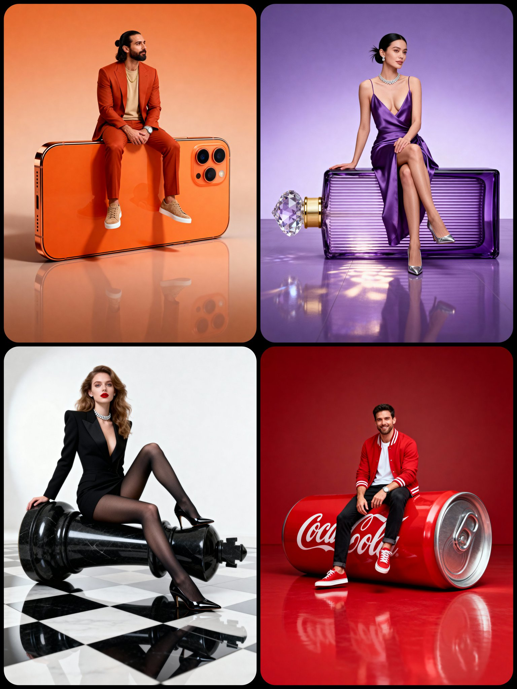
</div>

**提示词：**
```
A full-body hyper-realistic studio portrait of [CHARACTER DESCRIPTION] in a [POSE TYPE] pose, sitting gracefully on a large [OBJECT] positioned [ORIENTATION: horizontal / vertical] on a smooth [BACKGROUND COLOR] floor. The object appears oversized and realistic, perfectly integrated with the subject — not floating. Its surface shows accurate texture, reflections, and material depth. The pose defines the subject’s attitude and interaction with the object — natural, stylish, and expressive. The character is balanced and confident, matching the object’s tone and style. Background is seamless, same color for wall and floor, slightly lighter below with soft reflections. Lighting: clean professional studio setup — diffused key from front-left, mild fill from right, subtle rim for separation, evenly balanced exposure. Mood: cinematic luxury editorial with minimal composition and photorealistic realism.
```

**中文提示词：**
```
一张全身超写实摄影棚肖像照，[人物描述] 以[姿势类型]的姿态优雅地坐在一个大型[物体]上，该物体[方向：水平/垂直]放置在光滑的[背景颜色]地板上。物体显得尺寸较大且逼真，与人物完美融合，而非悬浮。物体表面展现出精准的纹理、反射和材质深度。姿势展现了人物与物体之间的互动——自然、时尚且富有表现力。人物姿态平衡自信，与物体的色调和风格相得益彰。背景无缝衔接，墙面和地板颜色相同，下方略浅并带有柔和的反射。灯光：干净专业的摄影棚布光——左前方柔和的主光，右侧轻柔的补光，以及用于分离主体的微妙边缘光，曝光均衡。氛围：电影般的奢华时尚大片风格，构图极简，追求照片级的真实感。
```

<a id="prompt-397"></a>
## 案例 397：一张抓拍的年轻女子照片 (来源 [@MANISH1027512](https://x.com/MANISH1027512/status/1984456357752250749))

<div style="display: flex; justify-content: space-between;">
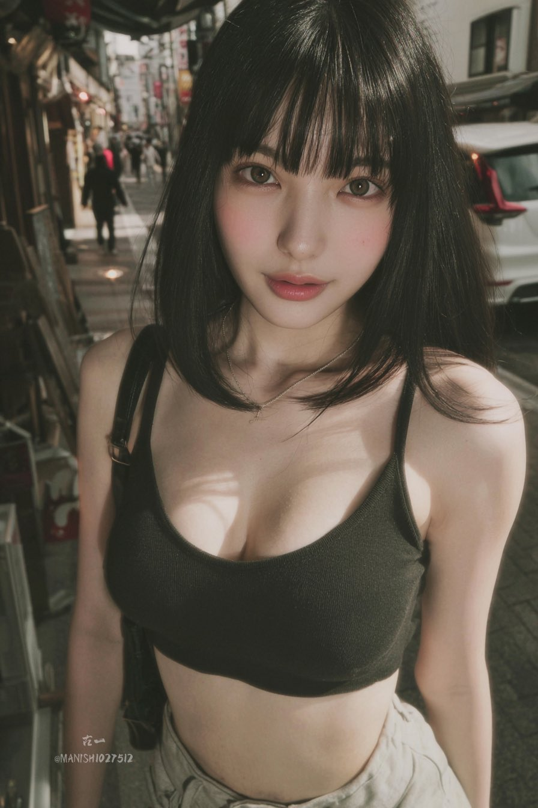
</div>

**提示词：**
```
A candid snapshot of a young woman with straight black hair, blunt bangs, large expressive eyes, and fair skin, standing casually in a bustling Tokyo street, wearing a low-cut crop top and high-waisted shorts, slight motion blur on the edges, natural daylight filtering through buildings, captured as if from a hidden angle with a smartphone camera.
```

**中文提示词：**
```
一张抓拍的年轻女子照片，她有着乌黑的直发、齐刘海、明亮的大眼睛和白皙的皮肤，随意地站在熙熙攘攘的东京街头，身穿低胸露脐上衣和高腰短裤，边缘略带动态模糊，自然光透过建筑物洒下，仿佛是用智能手机从隐蔽角度拍摄的。
```

<a id="prompt-396"></a>
## 案例 396：创建3D推特个人资料卡片 (来源 [@shiri_shh](https://x.com/shiri_shh/status/1984196161784422790))

<div style="display: flex; justify-content: space-between;">
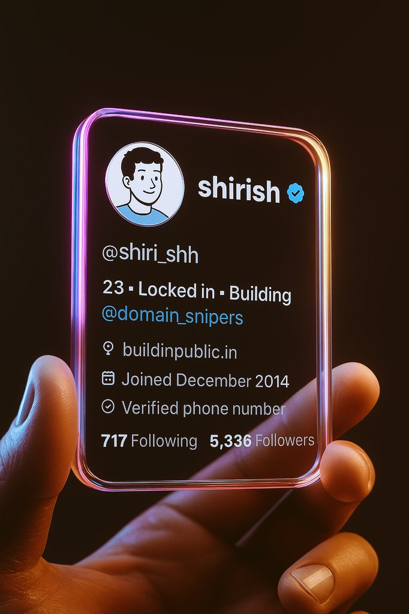
</div>

**提示词：**
```
Step 1: Take a screenshot of your Twitter profile.
Step 2: Open ChatGPT
Step 3: Paste your screenshot and this prompt below

Create a hyper-realistic 3D render of a transparent twitter profile card, designed like a futuristic glass ID badge held gently between two fingers. The card should be rectangular with rounded corners, made of clear glossy glass or acrylic, with glowing neon edges in pink, purple, and orange gradient inspired by the twitter color palette. Display the following profile information on the card using modern, minimal sans-serif typography.
```

**中文提示词：**
```
第1步：截取您的 Twitter 个人资料屏幕截图。
第2步：打开 ChatGPT
第3步：粘贴您的屏幕截图和以下提示

制作一张超逼真的透明推特个人资料卡的3D渲染图，设计灵感源自未来主义的玻璃身份识别卡，可轻柔地夹在两指之间。卡片应为圆角矩形，材质为透明光面玻璃或亚克力，边缘带有粉色、紫色和橙色渐变的霓虹灯效果，灵感来自推特的配色方案。使用现代简约的无衬线字体在卡片上展示以下个人资料信息。
```

<a id="prompt-395"></a>
## 案例 395：赛博美学未来社交软件界面照片 (来源 [@dotey](https://x.com/dotey/status/1983941652730278148))

<div style="display: flex; justify-content: space-between;">
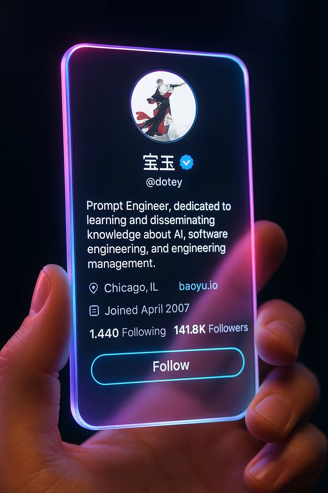
</div>

**中文提示词：**
```
一张 9:16 竖版逼真的赛博美学未来社交软件界面照片：一只手拿着一张竖直半透明的亚克力卡片，占据了大部分画面。上面显示着一个社交媒体个人资料界面，但没有任何横幅或背景图片。卡片有平滑的圆润边缘，闪烁着柔和的霓虹灯光，呈现出粉色、紫色和蓝色的渐变。背景黑暗而模糊，以突出发光的边缘。卡片表面如水晶般清澈，个人资料的细节仿佛雕刻，只显示参考图中的信息，按照顺序依次显示：
- 头像（居中）
- 用户名、顶部的认证徽章
- 个人介绍
- 地理位置、网站
- 加入日期
- 关注数和被关注数
- 关注按钮
手指上的灯光反射看起来富有电影感和氛围感，营造出一种高科技的全息氛围。
```

<a id="prompt-394"></a>
## 案例 394：和索尼克马里奥在一起合照 (来源 [@ecommartinez](https://x.com/ecommartinez/status/1983892304621662607))

<div style="display: flex; justify-content: space-between;">
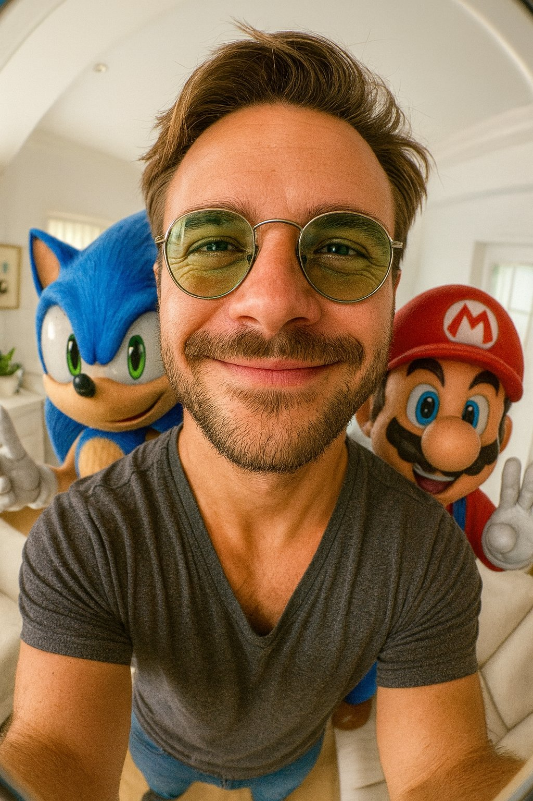
</div>

**提示词：**
```
Selfie ultra-realista en formato vertical 9:16 con lente ojo de pez de mí junto a (Sonic y Mario). Ambientado en una sala de estar pequeña y luminosa con tonos blancos. Ángulo de cámara alto. Distorsión extrema de ojo de pez. Iluminación realista y cinematográfica. Personajes de anime integrados con realismo estilizado.
```

**中文提示词：**
```
一张超逼真的9:16竖屏自拍，使用鱼眼镜头拍摄，照片中我和索尼克、马里奥在一起。场景设定在一个明亮的小客厅，以白色为主色调。高角度拍摄。极致的鱼眼畸变。逼真的电影级光影效果。动漫人物与风格化的写实主义完美融合。
```

<a id="prompt-393"></a>
## 案例 393：全身写实时尚肖像照 (来源 [@IamEmily2050](https://x.com/IamEmily2050/status/1983742027058835543))

<div style="display: flex; justify-content: space-between;">
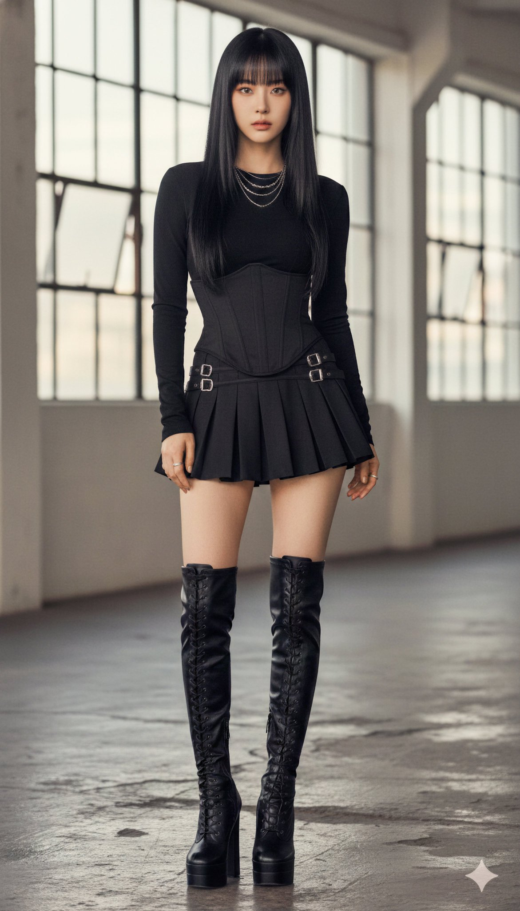
</div>

**提示词：**
```
{
  "instruction": "Generate a full-body, photorealistic fashion portrait of a modern East Asian idol in all-black styling. The result must look like a professional test shot, not anime, not cosplay, not fantasy.",

 "subject": {
    "identity": "East Asian female idol, early 20s look, pale smooth skin, symmetrical features, refined jawline, large natural eyes, soft neutral lips.",
    "hair": {
      "color": "jet-black",
      "style": "straight with blunt bangs framing the eyes",
      "length": "long, falling past the chest",
      "optional_variants": [
        "clean straight hair down",
        "twin high ponytails with bangs and loose face-framing strands"
      ]
    },
    "body": {
      "build": "slender, long-legged, elegant proportions, model-like lines",
      "posture": "calm, confident, controlled posture, standing tall",
      "pose": "full-body standing pose, relaxed arms at sides or slight hip angle, natural stance, no exaggerated arching"
    }
  },

  "wardrobe": {
    "palette": "all black, monochrome styling",
    "look_variants": [
      {
        "description": "long-sleeve fitted black top with structured waist (corset-like shaping), short pleated mini skirt with belt hardware, over-the-knee black lace-up boots with platform heel, subtle layered silver jewelry"
      },
      {
        "description": "black cropped top, exposed midriff, slim black jeans, fitted choker stack and pendant necklace, matte black boots"
      }
    ],
    "note": "Outfit must read as high-fashion / street idol aesthetic, not fantasy costume, not sci-fi armor, not latex fetishwear."
  },

  "camera": {
    "framing": "full-body portrait from head to shoes, vertical composition, subject centered and filling most of the frame",
    "angle": "slightly low to mid-torso camera height for subtle leg lengthening OR neutral eye-level framing against a doorway",
    "lens_behavior": "clean realistic perspective, no wide distortion, no fisheye",
    "focus": "sharp focus across the subject from face to boots, depth of field appropriate for fashion photography"
  },

  "environment": {
    "style_options": [
      "industrial interior with worn tile floor and large window frame / metal framing in the background, muted gray tones",
      "neutral architectural doorway outdoors, pale stone or painted door, soft natural light"
    ],
    "lighting": "soft, diffused, natural-feeling light with gentle directional falloff. Skin should look smooth and real, not plastic. No neon rim light, no colored gels."
  },

  "aesthetic": {
    "tone": "clean Korean idol / street editorial test shot",
    "color_grade": "subtle cool neutrals in the background, deep matte blacks in wardrobe, natural skin tones",
    "finish": "high-end fashion photography, not fantasy art, not anime render, not glossy VR avatar"
  },

  "technical_rendering": {
    "intent": "photorealistic human subject",
    "keywords": [
      "cinematic portrait photography",
      "studio-quality fashion still",
      "PBR material realism on fabric texture (matte black cloth, leather belt, lace-up boots)",
      "no exaggerated body morph",
      "no plastic skin",
      "no cel-shaded look"
    ]
  },

  "negative": {
    "forbidden_styles": [
      "anime style",
      "cartoon style",
      "3D game character",
      "virtual idol hologram look",
      "cyberpunk fantasy costume",
      "latex catsuit aesthetic",
      "sci-fi armor",
      "bright colored hair",
      "oversized eyes / doll face",
      "hyper-airbrushed Barbie texture",
      "warped body proportions",
      "fish-eye distortion",
      "text overlays or watermarks"
    ],
    "forbidden_words": [
      "NSFW pose",
      "explicit lingerie framing",
      "cutesy cosplay expression",
      "aggressive pin-up arching"
    ]
}
```

**中文提示词：**
```
{
“说明”：“请创作一张现代东亚偶像全身写实时尚肖像照，造型为全黑。作品必须看起来像专业试镜照，而非动漫、角色扮演或奇幻风格。”

“主题”： {
“身份”：“东亚女偶像，二十出头的外貌，白皙光滑的皮肤，五官对称，下颌线条精致，大而自然的眼睛，柔和的裸色嘴唇。”
“头发”： {
颜色： 纯黑色，
“发型”：“齐刘海修饰眼睛的直发”，
长度：很长，垂过胸部，
"optional_variants": [
“干净利落的直发向下”，
“双高马尾辫，配刘海和垂在脸颊两侧的碎发”
]
}，
“身体”： {
“体型”：“纤细、修长、比例优雅、线条优美”，
“姿势”：“冷静、自信、控制的姿势，挺拔的站姿”
“姿势”：“全身站立姿势，双臂放松地放在身体两侧或髋部略微弯曲，站姿自然，不要过度拱背”
}
}，

“衣柜”： {
“调色板”：“全黑单色风格”，
"look_variants": [
{
“描述”：黑色长袖修身上衣，腰部收紧（类似束身衣的塑形效果），短款百褶迷你裙，配有腰带，黑色过膝系带厚底靴，精致的叠戴银色首饰。
}，
{
描述：黑色露脐上衣，露出小蛮腰，黑色修身牛仔裤，贴身颈链叠戴吊坠项链，哑光黑色靴子
}
]，
“注意”：“服装必须体现高级时装/街头偶像美学，而不是奇幻服装、科幻盔甲或乳胶恋物癖服装。”
}，

“相机”： {
“构图”：“从头到脚的全身像，竖构图，主体居中并占据画面的大部分”，
“角度”：“略低于躯干中部的相机高度，以微妙地拉长腿部，或者以中性的视线高度靠在门口构图”，
"lens_behavior": "清晰逼真的透视效果，无严重畸变，无鱼眼效果"
“焦点”： “从脸部到靴子，主体清晰对焦，景深适合时尚摄影”
}，

“环境”： {
"style_options": [
“工业风格的室内装潢，地面铺着磨损的瓷砖，背景是大型窗框/金属框架，整体色调为柔和的灰色。”
“中性色调的建筑风格户外入口，浅色石材或油漆门，柔和的自然光线”
]，
“照明”：“柔和、漫射、感觉自然的光线，光线方向性衰减要柔和。皮肤应该看起来光滑真实，而不是塑料感。不要使用霓虹灯轮廓光，也不要使用彩色滤光片。”
}，

“审美的”： {
"色调": "干净的韩国偶像/街头时尚大片试拍",
"color_grade": "背景采用柔和的冷色调中性色，服装采用深哑光黑色，肤色自然",
“成品”：高端时尚摄影，而非奇幻艺术、动漫渲染或华丽的VR虚拟形象。
}，

“technical_rendering”：{
“意图”: “逼真的人物主体”，
“关键词”：[
“电影式人像摄影”，
“摄影棚品质的时尚剧照”，
“织物纹理上的 PBR 材质真实感（哑光黑布、皮带、系带靴）”
“没有夸张的体型变化”，
“没有塑料皮肤”，
“没有卡通渲染风格”
]
}，

“消极的”： {
"forbidden_​​styles": [
“动漫风格”，
“卡通风格”，
“3D游戏角色”，
“虚拟偶像全息影像”
“赛博朋克奇幻服装”，
“乳胶紧身衣美学”，
“科幻盔甲”，
“色彩鲜艳的头发”，
“大眼睛/娃娃脸”，
“过度修饰的芭比娃娃质感”，
“扭曲的体型比例”，
“鱼眼畸变”，
“文字叠加或水印”
]，
"forbidden_​​words": [
“NSFW姿势”，
“露骨的内衣镜头”，
“可爱的角色扮演表情”，
“激进的性感拱背”
]
}
```

<a id="prompt-392"></a>
## 案例 392：正在更衣的女生 (来源 [@songguoxiansen](https://x.com/songguoxiansen/status/1981178658397229294))

<div style="display: flex; justify-content: space-between;">
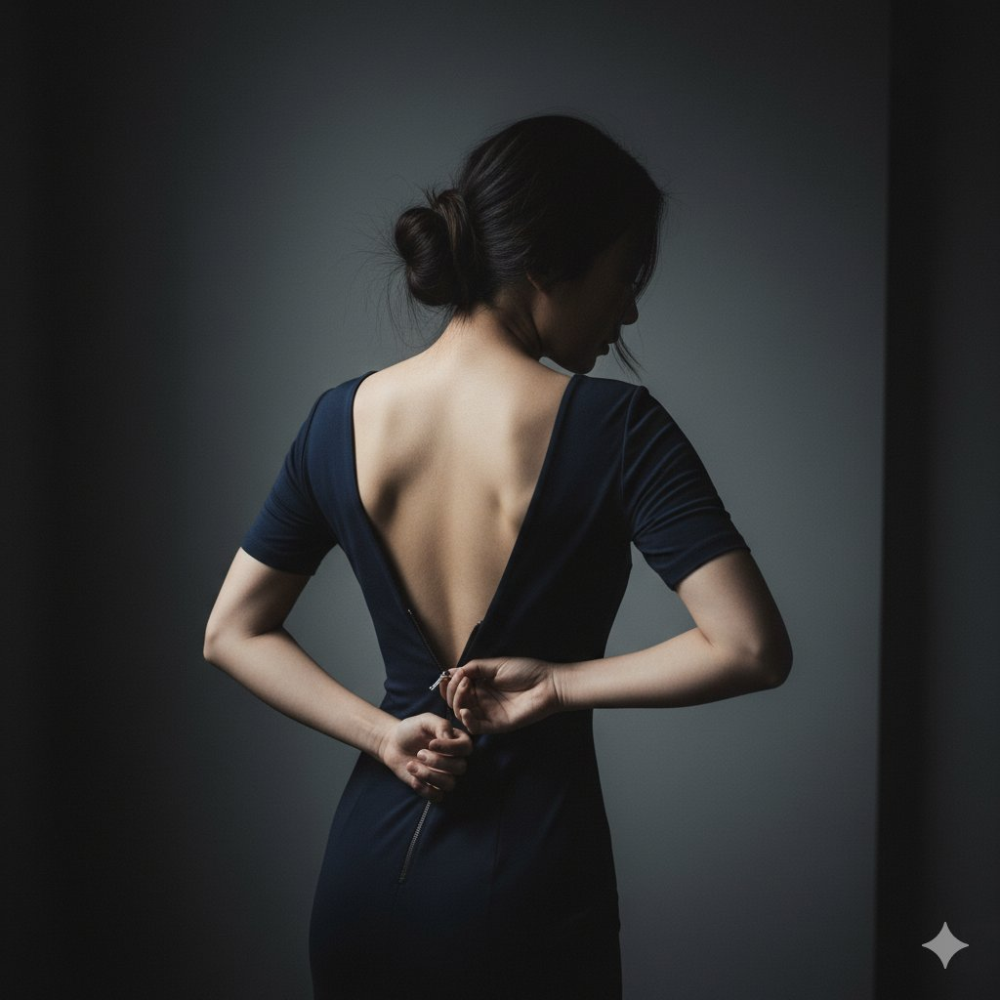
</div>

**提示词：**
```
{
  "scene": {
    "location": "A minimalist, dark bedroom or dressing room",
    "background": "A simple, dark grey wall, out of focus"
  },
  "subject": {
    "age": "adult",
    "description": "East Asian woman, elegant, hair in a loose bun with stray strands",
    "wardrobe": "A simple, dark-colored (e.g., black, navy) form-fitting dress",
    "accessories": "None",
    "pose": "Shot from behind, three-quarter view. Her own hand is reaching back, pulling the zipper down (e.g., to the middle of her back).",
    "expression": "(Face mostly obscured or in profile) Subtle, mysterious, ambiguous",
    "gaze": "Looking down at her hand or away from camera",
    "body_notes": "Photorealistic, realistic adult proportions; realistic hand and skin texture on back"
  },
  "camera": {
    "sensor": "full_frame",
    "focal_length_mm": 100,
    "aperture_f": 2.8,
    "shutter_s": 0.01,
    "iso": 400,
    "white_balance_k": 4500,
    "distance_m": 2.0,
    "camera_height_m": 1.6,
    "framing": "Tight medium shot (head to waist), focusing on the hand, zipper, and back",
    "focus": "Manual focus on the hand and zipper"
  },
  "lighting": {
    "key": "Dramatic side light (gridded strip light) to highlight the hand and spine",
    "fill": "Deep shadows, very low fill",
    "hair": "Subtle rim light",
    "notes": "Low-key, high-contrast, "storytelling" image"
  },
  "color_grade": {
    "style": "Cinematic, moody, ambiguous",
    "palette": "Desaturated, cool tones, blacks, skin tones",
    "contrast": "High, "chiaroscuro"",
    "saturation": "Low"
  },
  "makeup": {
    "eyes": "(Not visible)",
    "cheeks": "(Not visible)",
    "lips": "(Not visible)"
  },
  "postprocess": {
    "retouch": "Maintain natural skin texture, add film grain",
    "clarity": "High clarity on the zipper and hand",
    "dodge_burn": "Dodge on the spine, hand, and zipper pull",
    "vignette": "Strong dark vignette"
  },
  "art_direction": {
    "mood": "Sensual, ambiguous, mysterious, intimate, quiet",
    "keywords": ["photorealistic", "sensual", "ambiguous", "zipper", "low-key", "cinematic", "intimate"]
  },
  "negative_prompts": [
    "nsfw",
    "underage look",
    "text or logos",
    "plastic doll skin",
    "cg",
    "3d render",
    "anime",
    "warped hands",
    "extra fingers",
    "deformed limbs"
  ]
}
```

**中文提示词：**
```
{
“场景”： {
"location": "简约、黑暗的卧室或更衣室",
“背景”：“简单的深灰色墙壁，失焦”
}，
“主题”： {
"年龄": "成人",
"description": "东亚女性，优雅，头发松散，发髻散落，
"wardrobe": "一件简单的深色（例如黑色、海军蓝）合身连衣裙",
"accessories": "无",
"pose": "从后面拍摄，四分之三视角。她自己的手伸到后面，拉下拉链（例如，拉到她背部中间）。",
"expression": "（脸部大部分被遮挡或侧面）微妙、神秘、暧昧",
"gaze": "低头看着她的手或远离相机",
"body_notes": "照片般逼真的成人比例；背部的手部和皮肤纹理逼真"
}，
“相机”： {
“传感器”：“全帧”，
"焦距毫米": 100,
“aperture_f”：2.8，
“shutter_s”：0.01，
“iso”：400，
"白平衡k": 4500,
“距离_米”：2.0，
"相机高度米": 1.6,
"framing": "近距离中景拍摄（从头到腰），重点关注手、拉链和背部",
"focus": "手动对焦手和拉链"
}，
“灯光”： {
"key": "戏剧性的侧光（网格条灯）突出手部和脊柱",
"fill": "深阴影，非常低的填充",
"hair": "微妙的边缘光",
"notes": "低调、高对比度、“讲故事”的图像"
}，
“颜色等级”：{
"style": "电影化、喜怒无常、模棱两可",
"palette": "去饱和、冷色调、黑色、肤色",
"contrast": "高, "明暗对比"",
“饱和度”：“低”
}，
“化妆品”： {
"eyes": "(不可见)",
"cheeks": "(不可见)",
"lips": "(不可见)"
}，
“后处理”：{
"retouch": "保持自然的皮肤纹理，添加胶片颗粒感",
"clarity": "拉链和手部清晰度高",
"dodge_burn": "躲避脊柱、手和拉链头",
"vignette": "强烈的暗色调晕影"
}，
“艺术指导”：{
"mood": "感性、暧昧、神秘、亲密、安静",
“关键词”：[“照片写实”、“感性”、“模棱两可”、“拉链”、“低调”、“电影”、“亲密”]
}，
"negative_prompts": [
“nsfw”，
“未成年的样子”，
“文字或徽标”，
“塑料娃娃皮肤”，
“cg”，
“3D渲染”，
“日本动画片”，
“扭曲的手”，
“额外的手指”，
“肢体畸形”
]
}
```

<a id="prompt-391"></a>
## 案例 391：咖啡厅室内女生 (来源 [@songguoxiansen](https://x.com/songguoxiansen/status/1981178596581658768))

<div style="display: flex; justify-content: space-between;">

</div>

**提示词：**
```
{
  "scene": {
    "location": "A bright, aesthetic cafe interior",
    "background": "Pastel-colored wall, a small potted plant on the table, window light"
  },
  "subject": {
    "age": "adult",
    "description": "East Asian woman, soft, wavy hair with air bangs",
    "wardrobe": "Cute pastel-colored blouse or off-the-shoulder top",
    "accessories": "Delicate layered necklaces, holding a latte or colorful drink",
    "pose": "Sitting at the table, leaning forward slightly, hands around the cup, as if listening intently",
    "expression": "Sweet, "first date" smile, slight head tilt, 'eye-smile'",
    "gaze": "Direct to camera (as if the viewer is her date)",
    "body_notes": "Photorealistic, realistic adult proportions; natural skin texture"
  },
  "camera": {
    "sensor": "full_frame",
    "focal_length_mm": 50,
    "aperture_f": 2.0,
    "shutter_s": 0.008,
    "iso": 250,
    "white_balance_k": 5600,
    "distance_m": 1.8,
    "camera_height_m": 1.4,
    "framing": "Medium close-up (chest-up), 'point-of-view' (POV) shot",
    "focus": "eye_detect_AF on nearest eye"
  },
  "lighting": {
    "key": "Large, soft window light from the front-side",
    "fill": "White bounce card or natural bounce from the table",
    "hair": "Gentle rim light",
    "catchlights": "Large, soft window catchlights",
    "notes": "Bright, airy, clean aesthetic"
  },
  "color_grade": {
    "style": "Ulzzang / 'Clean' aesthetic",
    "palette": "Pastels, white, skin tones; clear, luminous skin",
    "contrast": "Medium-low, clean shadows",
    "saturation": "Moderate, fresh"
  },
  "makeup": {
    "eyes": "Natural winged eyeliner ('puppy dog' style), highlighted aegyo-sal",
    "cheeks": "Peach gradient blush",
    "lips": "Glossy pink gradient lips"
  },
  "postprocess": {
    "retouch": "Professional 'glass skin' retouch (light, maintain pores)",
    "clarity": "Selective clarity on eyes, lips, and drink",
    "vignette": "Very subtle bright vignette"
  },
  "art_direction": {
    "mood": "Sweet, approachable, trendy, 'date' vibe",
    "keywords": ["photorealistic", "sweet girl", "cafe", "date", "Ulzzang", "eye-smile", "POV"]
  },
  "negative_prompts": [
    "nsfw",
    "underage look",
    "text or logos",
    "plastic doll skin",
    "cg",
    "3d render",
    "anime",
    "dark lighting",
    "sad expression"
  ]
}
```

**中文提示词：**
```
{
“场景”： {
“地点”：“明亮、美观的咖啡馆内部”，
“背景”：粉彩色的墙壁，桌上的一盆小植物，窗外的光线
}，
“主题”： {
“年龄”: “成人”
描述：东亚女性，头发柔软，微卷，留着蓬松的刘海。
“衣橱”： “可爱的粉彩色衬衫或露肩上衣”，
“配饰”：“精致的多层项链，配上一杯拿铁或色彩缤纷的饮品”，
“姿势”：“坐在桌旁，身体微微前倾，双手捧着杯子，仿佛在认真倾听”，
“表情”：“甜美的、‘初次约会’式的微笑，微微歪头，‘笑眼’”，
“凝视”：“直视镜头（仿佛观众是她的约会对象）”，
"body_notes": "逼真的成人比例；自然的皮肤纹理"
}，
“相机”： {
"传感器": "全帧",
"focal_length_mm": 50,
"aperture_f": 2.0,
"shutter_s": ​​0.008,
“iso”：250，
"white_balance_k": 5600,
"distance_m": 1.8,
"camera_height_m": 1.4,
“构图”：“中近景（胸部以上），‘主观’（POV）镜头”，
"focus": "eye_detect_AF on nearest eye"
}，
“灯光”： {
“关键”：“来自正面的大而柔和的窗户光线”，
“填充物”: “白色弹跳卡或桌面上的自然弹跳”，
“头发”：“柔和的边缘光”，
“眼神光”：“大而柔和的窗户眼神光”，
备注：明亮、通风、干净的美学风格
}，
"color_grade": {
"风格": "Ulzzang / 'Clean' 美学",
“调色板”：“柔和的粉彩色调、白色、肤色；清透、透亮的肌肤”，
“对比度”：“中低，干净的阴影”，
“饱和度”：“适中，清新”
}，
“化妆品”： {
“眼睛”：“自然上扬眼线（小狗眼线风格），高光卧蚕眼妆”，
“脸颊”: “蜜桃渐变腮红”
“嘴唇”： “亮粉色渐变唇妆”
}，
"后处理": {
“修图”：“专业‘玻璃肌’修图（轻微，保留毛孔）”
“清晰度”： “选择性地提高眼睛、嘴唇和饮料的清晰度”
“小景”： “非常微妙的明亮小景”
}，
“艺术指导”：{
“氛围”：“甜蜜、平易近人、时尚、‘约会’氛围”，
关键词：["写实", "甜美女孩", "咖啡馆", "约会", "韩系美女", "笑眼", "第一人称视角"]
}，
"negative_prompts": [
"nsfw",
“未成年样貌”，
“文字或标志”，
“塑料娃娃皮肤”，
“cg”，
“3D渲染”，
“日本动画片”，
“昏暗的照明”，
“悲伤的表情”
]
}
```

<a id="prompt-390"></a>
## 案例 390：彩虹色发型女生 (来源 [@songguoxiansen](https://x.com/songguoxiansen/status/1981178522988343619))

<div style="display: flex; justify-content: space-between;">
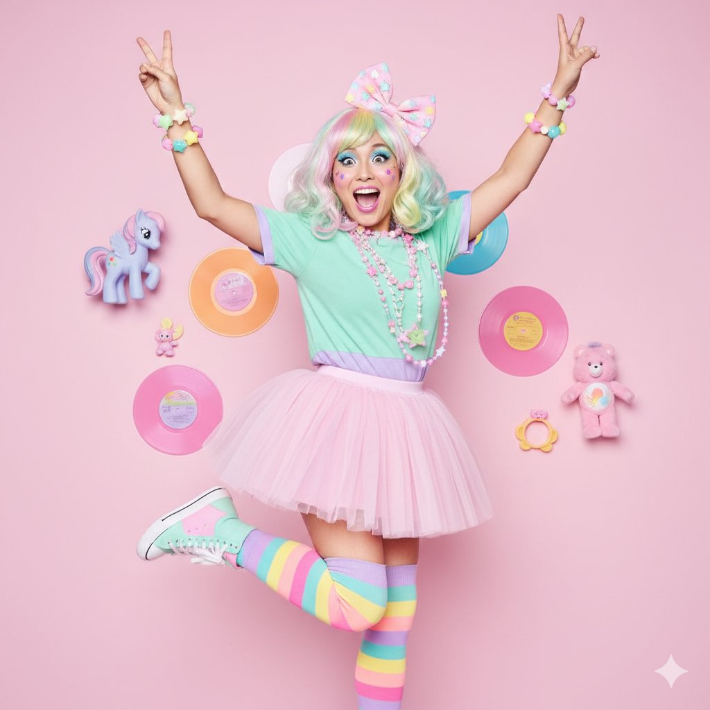
</div>

**提示词：**
```
{
  "scene": {
    "location": "Hyper-colorful studio",
    "background": "Pastel pink wall, decorated with 80s/90s retro toys (e.g., My Little Pony, Care Bears), vinyl records"
  },
  "subject": {
    "age": "adult",
    "description": "East Asian woman, rainbow pastel hair (wig), large, excited eyes",
    "wardrobe": "Layered pastel t-shirts (e.g., mint green over lavender), a pink tutu skirt, colorful striped leg warmers, pastel high-top sneakers",
    "accessories": "Excessive plastic jewelry: beaded necklaces, star bracelets, large bow in hair",
    "pose": "High-energy, mid-jump or one leg popped high, arms up in excitement, peace signs",
    "expression": "Hyper, excited, huge open-mouthed smile, 'genki'",
    "gaze": "Direct to camera, full of energy",
    "body_notes": "realistic adult proportions; natural skin texture"
  },
  "camera": {
    "sensor": "full_frame",
    "focal_length_mm": 35,
    "aperture_f": 4.0,
    "shutter_s": 0.008,
    "iso": 200,
    "white_balance_k": 5000,
    "distance_m": 3.0,
    "camera_height_m": 1.0,
    "framing": "Full body, capturing the dynamic pose",
    "focus": "eye_detect_AF on nearest eye"
  },
  "lighting": {
    "key": "Bright, even, "pop" lighting (on-axis beauty dish or ring flash)",
    "fill": "Two large softboxes on sides, eliminating shadows",
    "hair": "Simple top light",
    "catchlights": "Distinctive ring light catchlight",
    "notes": "High-key, flat, "magazine pop" style"
  },
  "color_grade": {
    "style": "Fairy Kei, 80s pastel-pop",
    "palette": "All pastels: pink, lavender, mint, yellow; bright, clear skin",
    "contrast": "Medium, very clean",
    "saturation": "High saturation on all pastels"
  },
  "makeup": {
    "eyes": "Bright pastel eyeshadow (e.g., blue), winged liner, glitter",
    "cheeks": "Bright pink blush, maybe small face stickers (e.g., stars)",
    "lips": "Bubblegum pink glossy lips"
  },
  "postprocess": {
    "retouch": "Clean skin",
    "clarity": "High clarity on all accessories and clothing layers",
    "dodge_burn": "Minimal, keep lighting flat and bright",
    "vignette": "None"
  },
  "art_direction": {
    "mood": "Hyper, energetic, nostalgic, colorful, bubbly",
    "keywords": ["Fairy Kei", "Harajuku", "pastel", "80s", "retro toys", "colorful", "bubbly"]
  },
  "negative_prompts": [
    "nsfw",
    "underage look",
    "text or logos",
    "plastic doll skin",
    "warped hands or extra fingers",
    "deformed limbs",
    "dark colors",
    "Goth",
    "sad expression"
  ]
}
```

**中文提示词：**
```
{
“场景”： {
“地点”：“色彩缤纷的工作室”，
“背景”：“粉色墙面，装饰着 80 年代/90 年代的复古玩具（例如，小马宝莉、爱心熊）、黑胶唱片”
}，
“主题”： {
“年龄”: “成人”
描述：东亚女性，彩虹色假发，大而兴奋的眼睛。
“衣橱”： “层叠的粉彩色T恤（例如，薄荷绿叠穿薰衣草色），粉色芭蕾舞裙，彩色条纹腿套，粉彩色高帮运动鞋”，
“配饰”：“过多的塑料首饰：串珠项链、星星手镯、头发上的大蝴蝶结”，
“姿势”：“充满活力，跳跃或单腿高高抬起，兴奋地举起双臂，比出和平手势”，
“表情”：“亢奋、兴奋、咧嘴大笑，‘元气’”，
“凝视”：“直视镜头，充满活力”，
"body_notes": "逼真的成人比例；自然的皮肤纹理"
}，
“相机”： {
"传感器": "全帧",
"focal_length_mm": 35,
"aperture_f": 4.0,
"shutter_s": ​​0.008,
“iso”：200，
"white_balance_k": 5000,
"distance_m": 3.0,
"camera_height_m": 1.0,
“构图”：“全身照，捕捉动态姿态”，
"focus": "eye_detect_AF on nearest eye"
}，
“灯光”： {
“关键”： “明亮、均匀、‘突出’的照明（轴向柔光罩或环形闪光灯）”，
“填充”：“两侧各有一个大型柔光箱，消除阴影”，
“头发”：“简单的顶光”，
“眼神光”： “独特的环形灯光眼神光”，
备注：高调、平淡、杂志流行风格
}，
"color_grade": {
“风格”：“仙女系，80年代粉彩流行”
“调色板”：“所有柔和的粉彩色调：粉色、薰衣草色、薄荷色、黄色；明亮、清透的肌肤”，
“对比度”：“中等，非常干净”，
“饱和度”：所有粉彩色调都具有高饱和度
}，
“化妆品”： {
“眼睛”：“明亮的粉彩色眼影（例如蓝色），上扬的眼线，闪粉”，
“脸颊”：“亮粉色腮红，也许可以贴一些小贴纸（例如星星）”，
“嘴唇”： “泡泡糖粉色亮泽嘴唇”
}，
"后处理": {
“修饰”: “干净的皮肤”，
“清晰度”：“所有配饰和服装层都具有高清晰度”，
"dodge_burn": "极简，保持光线平整明亮"
“小插曲”： “无”
}，
“艺术指导”：{
“情绪”： “亢奋、精力充沛、怀旧、色彩缤纷、活泼”
关键词：[“仙女系”、“原宿”、“粉彩”、“80年代”、“复古玩具”、“色彩缤纷”、“活泼”]
}，
"negative_prompts": [
"nsfw",
“未成年样貌”，
“文字或标志”，
“塑料娃娃皮肤”，
“畸形手或多余手指”，
“肢体畸形”，
“暗色”，
“哥特式”
“悲伤的表情”
]
}
```

<a id="prompt-389"></a>
## 案例 389：双马尾比心女生 (来源 [@songguoxiansen](https://x.com/songguoxiansen/status/1981178453216137391))

<div style="display: flex; justify-content: space-between;">
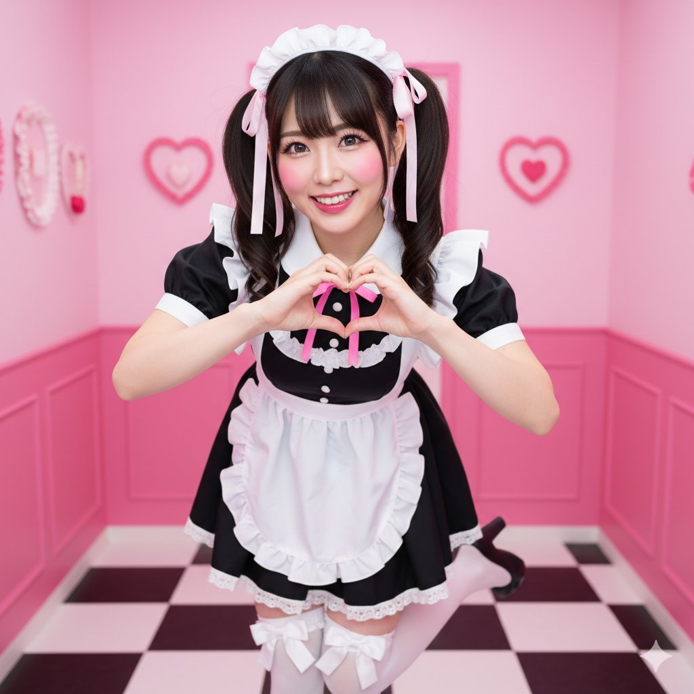
</div>

**提示词：**
```
{
  "scene": {
    "location": "Themed 'Maid Cafe' interior, focused and clean",
    "background": "Bright pink walls, checkered floor, subtle hearts and ruffle decorations (soft focus, no distracting elements)"
  },
  "subject": {
    "age": "adult",
    "description": "Realistic East Asian woman, dark hair in high twin-tails with ribbons, sparkling, energetic eyes",
    "wardrobe": "Classic black maid dress with a short skirt, pristine white frilly apron, knee-high white socks with bows",
    "accessories": "Frilly maid headband, ribbons in hair",
    "pose": "Full body, dynamic 'moe moe kyun' pose; both hands making a heart gesture, one foot popped, slight bow",
    "expression": "Extremely energetic, wide-eyed 'kawaii' smile, 'genki' (energetic) personality",
    "gaze": "Direct to camera, engaging and cheerful",
    "body_notes": "realistic adult proportions; natural skin texture"
  },
  "camera": {
    "sensor": "full_frame",
    "focal_length_mm": 35,
    "aperture_f": 2.8,
    "shutter_s": 0.008,
    "iso": 400,
    "white_balance_k": 5000,
    "distance_m": 3.0,
    "camera_height_m": 1.0,
    "framing": "Full body shot, slightly low angle to enhance cuteness and energy",
    "focus": "eye_detect_AF on nearest eye"
  },
  "lighting": {
    "key": "Bright, even, slightly flat studio lighting (simulating cafe interior)",
    "fill": "Large softboxes from both sides to eliminate shadows",
    "hair": "Top-down rim light to separate hair",
    "catchlights": "Multiple, large, bright catchlights",
    "notes": "Very bright, 'pop' lighting, high-key"
  },
  "color_grade": {
    "style": "Akihabara-pop, vibrant",
    "palette": "Bright pink, black, white; clear, bright skin",
    "contrast": "Medium, very clean and crisp",
    "saturation": "High saturation"
  },
  "makeup": {
    "eyes": "Emphasized 'anime' eyes, prominent aegyo-sal, long upper and lower lashes",
    "cheeks": "Bright pink, circular blush",
    "lips": "High-gloss pink or red lip tint"
  },
  "postprocess": {
    "retouch": "Clean skin retouching, "idol" level",
    "clarity": "High clarity on eyes, apron ruffles, and hair",
    "dodge_burn": "Dodge on eyes to make them sparkle",
    "vignette": "None"
  },
  "art_direction": {
    "mood": "Energetic, cheerful, adorable, welcoming",
    "keywords": ["maid cafe", "moe", "kawaii", "twin-tails", "heart gesture", "Akihabara"]
  },
  "negative_prompts": [
    "nsfw",
    "underage look",
    "text or logos",
    "plastic doll skin",
    "warped hands or extra fingers",
    "deformed limbs",
    "dark or moody",
    "French maid (Victorian)",
    "sad expression",
    "cluttered background",
    "photography equipment",
    "lighting equipment"
  ]
}
```

**中文提示词：**
```
{
“场景”： {
“地点”：“以女仆咖啡厅为主题的室内设计，简洁明了”，
“背景”：“亮粉色的墙壁，格子地板，精致的心形和褶皱装饰（柔焦，无分散注意力的元素）”
}，
“主题”： {
“年龄”: “成人”
“描述”：“一位写实的东亚女性，深色头发扎成高高的双马尾，用丝带系着，眼睛闪亮而充满活力。”
“服装”：“经典的黑色女仆装，短裙，洁白的褶边围裙，带蝴蝶结的白色过膝袜”，
“配饰”：“褶边女仆头带，头发上的丝带”，
“姿势”：“全身动态‘萌萌哒’姿势；双手比心，一只脚翘起，微微鞠躬”
“表情”：“活力四射，睁大眼睛露出‘可爱’的笑容，‘元气’（精力充沛）的性格”，
“眼神”：“直视镜头，专注而快乐”，
"body_notes": "逼真的成人比例；自然的皮肤纹理"
}，
“相机”： {
"传感器": "全帧",
"focal_length_mm": 35,
"aperture_f": 2.8,
"shutter_s": ​​0.008,
“iso”：400，
"white_balance_k": 5000,
"distance_m": 3.0,
"camera_height_m": 1.0,
“构图”：“全身照，略微低角度拍摄，以增强可爱和活力”，
"focus": "eye_detect_AF on nearest eye"
}，
“灯光”： {
“关键”： “明亮、均匀、略微平淡的影棚照明（模拟咖啡馆内部）”
“填充”：“从两侧使用大型柔光箱以消除阴影”，
“头发”： “自上而下的边缘光，用于分离头发”，
“眼神光”： “多个、大、明亮的眼神光”，
备注：非常明亮、流行风格的灯光，高调
}，
"color_grade": {
风格： “秋叶原流行，充满活力”
“调色板”：“亮粉色、黑色、白色；清透、明亮的肌肤”
“对比度”：“中等，非常干净清晰”，
“饱和度”: “高饱和度”
}，
“化妆品”： {
“眼睛”： “强调‘动漫’眼睛，突出卧蚕，上下睫毛长”，
“脸颊”：“亮粉色，圆形腮红”，
“唇部”： “高光泽粉色或红色唇彩”
}，
"后处理": {
“修图”：“干净的皮肤修图，‘偶像’级别”，
“清晰度”：“眼睛、围裙褶边和头发的清晰度很高”，
"dodge_burn": "在眼睛上加闪，使它们闪闪发光",
“小插曲”： “无”
}，
“艺术指导”：{
“情绪”：“充满活力、开朗、可爱、热情好客”
关键词：["女仆咖啡厅", "萌", "可爱", "双马尾", "爱心手势", "秋叶原"]
}，
"negative_prompts": [
"nsfw",
“未成年样貌”，
“文字或标志”，
“塑料娃娃皮肤”，
“畸形手或多余手指”，
“肢体畸形”，
“阴郁或忧郁的”，
“法国女仆（维多利亚时代）”
“悲伤的表情”，
“杂乱的背景”，
“摄影器材”，
“照明设备”
]
}
```

<a id="prompt-388"></a>
## 案例 388：白色枕头上的睡眼惺忪女孩 (来源 [@songguoxiansen](https://x.com/songguoxiansen/status/1981178369262964886))
<div style="display: flex; justify-content: space-between;">
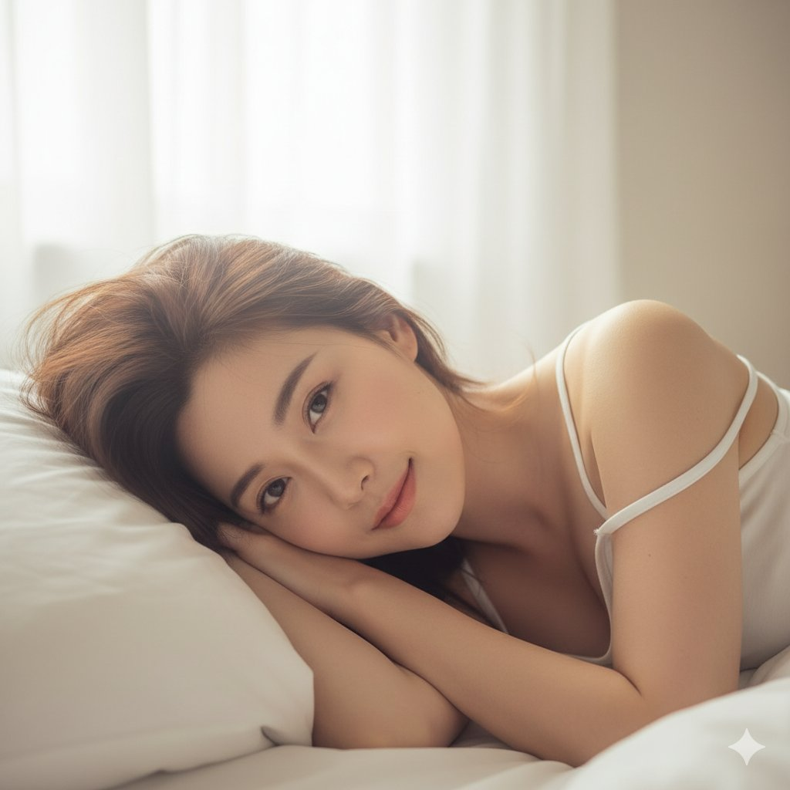
</div>

**提示词：**
```
{
  "scene": {
    "location": "Bedroom, in bed",
    "background": "White pillows and soft, rumpled bedsheets, soft morning light"
  },
  "subject": {
    "age": "adult",
    "description": "East Asian woman, beautiful 'just woke up' messy hair, sleepy eyes",
    "wardrobe": "Simple, thin-strap camisole (e.g., silk or cotton), strap slightly falling off one shoulder",
    "accessories": "None",
    "pose": "Lying on her stomach in bed, propped up on her elbows, looking at the camera",
    "expression": "Soft, sleepy smile, intimate, 'good morning' look",
    "gaze": "Direct to camera, soft and alluring",
    "body_notes": "Photorealistic, realistic adult proportions; natural skin texture, visible collarbones, 'sleepy' flush"
  },
  "camera": {
    "sensor": "full_frame",
    "focal_length_mm": 50,
    "aperture_f": 1.8,
    "shutter_s": 0.01,
    "iso": 400,
    "white_balance_k": 5500,
    "distance_m": 1.5,
    "camera_height_m": 0.8,
    "framing": "Close-up (chest-up), at eye level with her",
    "focus": "eye_detect_AF on nearest eye"
  },
  "lighting": {
    "key": "Large, diffused window light from the side, creating very soft shadows",
    "fill": "Bounced light from the white sheets",
    "hair": "Soft halo from the window",
    "catchlights": "Large, soft window catchlights",
    "notes": "Very soft, high-key, intimate"
  },
  "color_grade": {
    "style": "Intimate, soft, 'morning' aesthetic",
    "palette": "Whites, skin tones, pastels; soft, luminous skin",
    "contrast": "Very low, dreamy",
    "saturation": "Moderate, soft"
  },
  "makeup": {
    "eyes": "None, 'bare face' look",
    "cheeks": "Natural, sleepy flush",
    "lips": "Natural, hydrated"
  },
  "postprocess": {
    "retouch": "Professional retouching, maintain "real skin" look",
    "clarity": "Selective clarity on eyes and lashes",
    "dodge_burn": "Subtle dodge on eyes and collarbone",
    "vignette": "Subtle, bright vignette"
  },
  "art_direction": {
    "mood": "Flirty, intimate, ambiguous, soft, sleepy, alluring",
    "keywords": ["photorealistic", "flirty", "morning", "in bed", "ambiguous", "natural beauty", "sleepy"]
  },
  "negative_prompts": [
    "nsfw",
    "underage look",
    "text or logos",
    "plastic doll skin",
    "cg",
    "3d render",
    "anime",
    "heavy makeup",
    "warped hands"
  ]
}
```

**中文提示词：**
```
{
“场景”： {
"location": "卧室，在床上",
"background": "白色枕头、柔软、皱巴巴的床单、柔和的晨光"
}，
“主题”： {
"年龄": "成人",
"description": "东亚女子，美丽的‘刚睡醒’凌乱的头发，睡眼惺忪的眼睛",
"wardrobe": "简单的细肩带吊带背心（例如丝绸或棉质），肩带略微从一侧肩膀垂下",
"accessories": "无",
"pose": "趴在床上，用手肘支撑身体，看着镜头",
"expression": "温柔、困倦的微笑、亲密的‘早上好’表情",
"gaze": "直视镜头，柔和而诱人",
"body_notes": "照片般逼真的成人比例；自然的皮肤纹理，清晰可见的锁骨，‘困倦’的红晕"
}，
“相机”： {
“传感器”：“全帧”，
"焦距毫米": 50,
“aperture_f”：1.8，
“shutter_s”：0.01，
“iso”：400，
"白平衡k": 5500,
“距离米”：1.5，
“相机高度”：0.8，
"framing": "特写（胸部以上），与她视线齐平",
“focus”：“eye_detect_AF 在最近的眼睛上”
}，
“灯光”： {
"key": "从侧面射入的大型漫射窗光，形成非常柔和的阴影",
"fill": "从白色床单反射的光线",
"hair": "窗户透出的柔和光晕",
"catchlights": "大而柔和的窗户聚光灯",
"notes": "非常柔软，高调，亲密"
}，
“颜色等级”：{
"style": "亲密、柔和、‘早晨’美学",
"palette": "白色、肤色、粉彩色；柔软、明亮的皮肤",
"contrast": "非常低，梦幻",
"saturation": "中等，柔和"
}，
“化妆品”： {
"eyes": "无，‘素颜’样子",
"cheeks": "自然、困倦的红晕",
"lips": "自然、水润"
}，
“后处理”：{
"retouch": "专业修图，保持“真实肌肤”外观",
"clarity": "选择性地清晰眼睛和睫毛",
"dodge_burn": "眼睛和锁骨处细微减淡",
"vignette": "微妙、明亮的小插图"
}，
“艺术指导”：{
"mood": "轻浮、亲密、暧昧、柔和、困倦、诱人",
"keywords": ["照片写实", "调情", "早晨", "在床上", "模棱两可", "自然美", "困倦"]
}，
"negative_prompts": [
“nsfw”，
“未成年的样子”，
“文字或徽标”，
“塑料娃娃皮肤”，
“cg”，
“3D渲染”，
“日本动画片”，
“浓妆艳抹”，
“扭曲的手”
]
}
```

<a id="prompt-387"></a>
## 案例 387：握着复古银色麦克风女生 (来源 [@songguoxiansen](https://x.com/songguoxiansen/status/1981178292276527584))

<div style="display: flex; justify-content: space-between;">
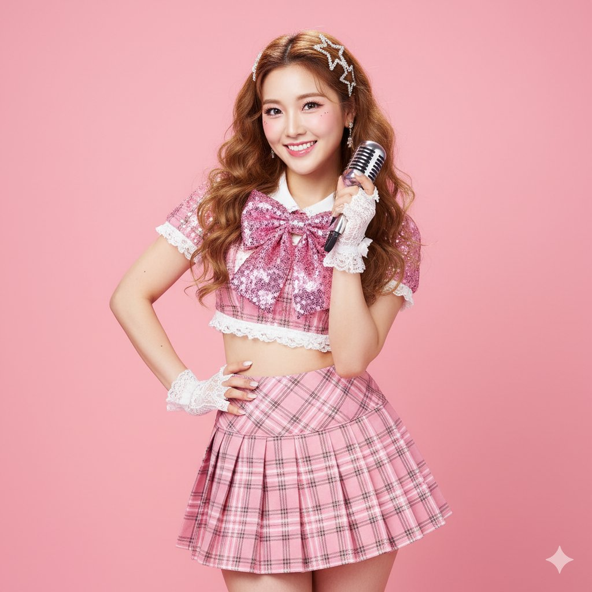
</div>

**提示词：**
```
{
"scene": {
    "location": "Bright photo studio",
    "background": "Solid, high-saturation macaroon pink seamless background"
  },
  "subject": {
    "age": "adult",
    "description": "East Asian woman, long curly caramel-colored hair with sparkling gold highlights, confident 'idol' gaze",
    "wardrobe": "Sparkly 'idol' stage outfit: pink plaid pleated skirt, cropped top with white lace trim, large bow on chest, sequin details",
    "accessories": "White lace wrist gloves, sparkly star-shaped hair clips, one hand holding a retro silver microphone (as a prop)",
    "pose": "Full body, classic idol pose: one hand on hip, other hand making a heart gesture near cheek, S-curve posture, confident",
    "expression": "Perfect, bright 'professional' smile, sparkling eyes, full of charm",
    "gaze": "Direct to camera (engaging with fans)",
    "body_notes": "realistic adult proportions; natural skin texture"
  },
  "camera": {
    "sensor": "full_frame",
    "focal_length_mm": 70,
    "aperture_f": 3.2,
    "shutter_s": 0.008,
    "iso": 100,
    "white_balance_k": 5200,
    "distance_m": 4.0,
    "camera_height_m": 1.1,
    "framing": "Full body shot, with enough space to show the pose",
    "focus": "eye_detect_AF on nearest eye"
  },
  "lighting": {
    "key": "Large ring flash, creating the iconic ring catchlight",
    "fill": "Two large softboxes on the sides, providing even, high-key 'K-pop' lighting",
    "hair": "Hard light from high-behind to create shiny hair highlights",
    "catchlights": "Clear ring-shaped catchlights",
    "notes": "High-key, bright, no shadows, emphasize sparkly texture of outfit"
  },
  "color_grade": {
    "style": "K-Pop / J-Pop Idol, high-key kawaii",
    "palette": "Bright pink, white, caramel; flawless 'glass skin'",
    "contrast": "Medium, very clean",
    "saturation": "High saturation, vibrant"
  },
  "makeup": {
    "eyes": "Stage makeup: thick false lashes, sparkly liquid eyeshadow, highlighted aegyo-sal",
    "cheeks": "Bright strawberry-pink blush",
    "lips": "High-gloss gradient 'juicy lips'"
  },
  "postprocess": {
    "retouch": "Highly refined skin retouching, but maintain pore texture (not plastic)",
    "clarity": "Enhance clarity on sequins, eyes, lips, and hair highlights",
    "dodge_burn": "Micro dodge on aegyo-sal, nose bridge, and collarbones",
    "vignette": "None, keep background clean"
  },
  "art_direction": {
    "mood": "Sparkly, confident, energetic, sweet idol",
    "keywords": ["idol", "K-Pop", "J-Pop", "stage outfit", "heart gesture", "sparkly"]
  },
  "negative_prompts": [
    "nsfw",
    "underage look",
    "text or logos",
    "plastic doll skin",
    "warped hands or extra fingers",
    "deformed limbs",
    "dark or moody lighting",
    "plain clothing",
    "sad expression"
  ]
}
```

**中文提示词：**
```
{
“场景”： {
"location": "明亮摄影工作室",
"background": "纯色、高饱和度的马卡龙粉色无缝背景"
}，
“主题”： {
"年龄": "成人",
"description": "东亚女性，长长的卷曲焦糖色头发，带有闪亮的金色亮点，自信的“偶像”目光",
"wardrobe": "闪亮的‘偶像’舞台装：粉色格子百褶裙，白色蕾丝边短款上衣，胸前大蝴蝶结，亮片细节",
"accessories": "白色蕾丝腕手套，闪亮的星形发夹，一只手拿着复古的银色麦克风（作为道具）",
"pose": "全身，经典偶像姿势：一只手叉腰，另一只手在脸颊附近做爱心手势，S 形曲线，自信",
"expression": "完美、灿烂的‘专业’笑容，闪亮的眼睛，充满魅力",
"gaze": "直视镜头（与粉丝互动）",
"body_notes": "逼真的成人比例；自然的皮肤纹理"
}，
“相机”： {
“传感器”：“全帧”，
"焦距毫米": 70,
"aperture_f": 3.2,
“shutter_s”：0.008，
"iso": 100,
"白平衡k": 5200,
“距离米”：4.0，
"camera_height_m": 1.1,
"framing": "全身照，留出足够的空间来展示姿势",
“focus”：“eye_detect_AF 在最近的眼睛上”
}，
“灯光”： {
"key": "大型环形闪光灯，营造标志性的环形眼神光",
"fill": "两侧有两个大型柔光箱，提供均匀、高调的“K-pop”照明",
"hair": "从高处照射强光，打造闪亮的头发亮点",
"catchlights": "透明环形眼神光",
"notes": "高调、明亮、无阴影，强调服装的闪亮质感"
}，
“颜色等级”：{
"style": "K-Pop / J-Pop 偶像，高调可爱",
"palette": "亮粉色、白色、焦糖色；完美无瑕的‘玻璃肌肤’",
"contrast": "中等，非常干净",
"saturation": "高饱和度，鲜艳"
}，
“化妆品”： {
"eyes": "舞台妆：浓密的假睫毛、闪亮的液体眼影、高光的撒娇眼影",
"cheeks": "明亮的草莓粉色腮红",
"lips": "高光渐变‘水润双唇’"
}，
“后处理”：{
"retouch": "高度精致的皮肤修饰，但保持毛孔纹理（不是塑料）",
"clarity": "增强亮片、眼睛、嘴唇和头发亮点的清晰度",
"dodge_burn": "对撒娇、鼻梁和锁骨进行微减淡",
"vignette": "无，保持背景干净"
}，
“艺术指导”：{
"mood": "闪亮、自信、活力、甜美的偶像",
"keywords": ["偶像", "K-Pop", "J-Pop", "舞台服装", "心形手势", "闪亮"]
}，
"negative_prompts": [
“nsfw”，
“未成年的样子”，
“文字或徽标”，
“塑料娃娃皮肤”，
“弯曲的手或多余的手指”，
“畸形肢体”，
“昏暗或阴郁的灯光”，
“便衣”，
“悲伤的表情”
]
}
```

<a id="prompt-386"></a>
## 案例 386：淡桃粉色宽松毛绒睡衣女孩 (来源 [@songguoxiansen](https://x.com/songguoxiansen/status/1982984662747373744))

<div style="display: flex; justify-content: space-between;">
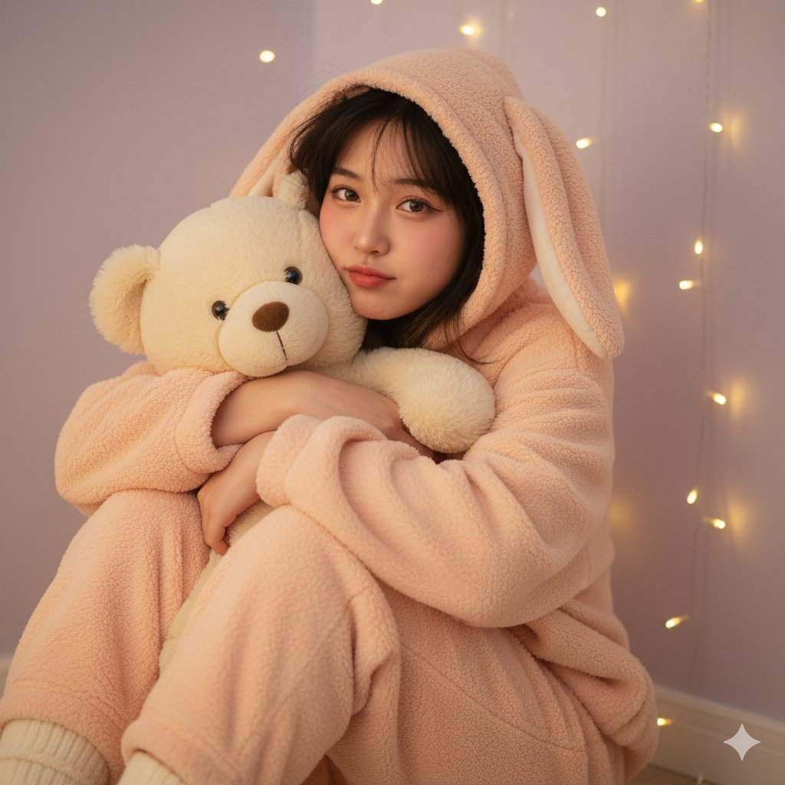
</div>

**提示词：**
```
{
  "scene": {
    "location": "cozy bedroom corner",
    "background": "soft-focus string of fairy lights against a pastel lavender wall"
  },
  "subject": {
    "age": "adult",
    "description": "East Asian women, messy shoulder-length dark hair, sleepy-looking soft brown eyes",
    "wardrobe": "oversized, fluffy fleece pajama set (onesie or two-piece) in pastel peach, with a hood featuring animal ears (e.g., bunny)",
    "accessories": "holding a large, cute teddy bear plush toy, wearing fuzzy socks",
    "pose": "sitting on the floor, knees pulled up to chest, hugging the teddy bear, hood with ears is up",
    "expression": "soft, sleepy pout, 'puffy' cheeks, half-smile, radiating comfort",
    "gaze": "direct to camera, soft and inviting",
    "body_notes": "realistic adult proportions; natural skin texture, relaxed posture"
  },
  "camera": {
    "sensor": "full_frame",
    "focal_length_mm": 50,
    "aperture_f": 1.8,
    "shutter_s": 0.0125,
    "iso": 640,
    "white_balance_k": 4800,
    "distance_m": 2.5,
    "camera_height_m": 0.8,
    "framing": "medium shot, from head to knees, emphasizing the plush toy and pajamas",
    "focus": "eye_detect_AF on nearest eye"
  },
  "lighting": {
    "key": "soft, warm light from a nearby lamp (out of frame), simulating evening",
    "fill": "ambient light from the fairy lights, creating small bokeh highlights",
    "hair": "subtle glow on hair from fairy lights",
    "catchlights": "multiple small, warm catchlights from fairy lights",
    "notes": "warm, intimate, very soft, 'golden hour' indoor feel"
  },
  "color_grade": {
    "style": "cozy & cute, soft-glam",
    "palette": "pastel peach, lavender, warm creams; glowing skin",
    "contrast": "low, dreamy, slightly hazy",
    "saturation": "moderate"
  },
  "makeup": {
    "eyes": "minimal, 'no-makeup' makeup, slightly smudged soft brown liner",
    "cheeks": "flushed pink blush, as if warm",
    "lips": "hydrated, natural pink lip tint"
  },
  "postprocess": {
    "retouch": "very light skin softening, maintain pores",
    "clarity": "selective clarity on eyes and plush toy texture",
    "dodge_burn": "gentle dodge on cheeks and nose bridge",
    "vignette": "soft, warm vignette to draw focus"
  },
  "art_direction": {
    "mood": "cozy, sleepy, adorable, intimate",
    "keywords": ["pajama", "plush toy", "fairy lights", "cozy", "animal ears"]
  },
  "negative_prompts": [
    "nsfw",
    "underage look",
    "text or logos",
    "plastic doll skin",
    "warped hands or extra fingers",
    "deformed limbs",
    "bright daylight",
    "sharp shadows",
    "cluttered room"
  ]
}
```

**中文提示词：**
```
{
“场景”： {
"location": "舒适的卧室角落",
“背景”：“柔和焦点的仙女灯串映衬着淡紫色的墙壁”
}，
“主题”： {
"年龄": "成人",
"description": "东亚女性，凌乱的齐肩黑发，睡眼惺忪的柔和棕色眼睛",
"wardrobe": "超大蓬松羊毛睡衣套装（连体衣或两件套），淡桃色，带动物耳朵图案（例如兔子）的兜帽",
"accessories": "抱着一只大大的、可爱的泰迪熊毛绒玩具，穿着毛茸茸的袜子",
"pose": "坐在地板上，膝盖拉到胸前，抱着泰迪熊，带耳朵的帽子向上",
"expression": "柔软、困倦的嘟嘴、‘浮肿’的脸颊、半微笑、散发着舒适感",
"gaze": "直视镜头，柔和而诱人",
"body_notes": "逼真的成人比例；自然的皮肤纹理，放松的姿势"
}，
“相机”： {
“传感器”：“全帧”，
"焦距毫米": 50,
“aperture_f”：1.8，
“shutter_s”：0.0125，
"iso": 640,
"白平衡k": 4800,
“距离米”：2.5，
“相机高度”：0.8，
"framing": "中景，从头到膝盖，突出毛绒玩具和睡衣",
“focus”：“eye_detect_AF 在最近的眼睛上”
}，
“灯光”： {
"key": "附近灯光发出的柔和、温暖的光线（画面外），模拟夜晚",
"fill": "来自仙女灯的环境光，创造出小的散景高光",
"hair": "仙女灯在头发上散发出微妙的光芒",
"catchlights": "来自仙女灯的多个小而温暖的眼神光",
“注释”：“温暖、亲密、非常柔软、‘黄金时段​​’室内感觉”
}，
“颜色等级”：{
"style": "舒适可爱，柔和迷人",
"palette": "淡桃色、薰衣草色、暖色乳霜；容光焕发的肌肤",
"contrast": "低，梦幻，略带朦胧",
“饱和度”：“中等”
}，
“化妆品”： {
"eyes": "极简主义的‘素颜’妆容，略微晕染的柔和棕色眼线笔",
“脸颊”：“泛着粉红色的腮红，仿佛温暖”，
"lips": "水润自然的粉色唇彩"
}，
“后处理”：{
"retouch": "非常轻微的皮肤柔化，维持毛孔",
“清晰度”：“眼睛和毛绒玩具纹理的选择性清晰度”，
"dodge_burn": "在脸颊和鼻梁上轻轻减淡",
"vignette": "柔和、温暖的晕影来吸引焦点"
}，
“艺术指导”：{
"mood": "舒适、困倦、可爱、亲密",
"keywords": ["睡衣", "毛绒玩具", "仙女灯", "舒适", "动物耳朵"]
}，
"negative_prompts": [
“nsfw”，
“未成年的样子”，
“文字或徽标”，
“塑料娃娃皮肤”，
“弯曲的手或多余的手指”，
“畸形肢体”，
“明亮的日光”，
“清晰的阴影”，
“杂乱的房间”
]
}
```

<a id="prompt-385"></a>
## 案例 385：一张极具戏剧张力的黑白特写肖像 (来源 [@songguoxiansen](https://x.com/songguoxiansen/status/1983347050306523506))

<div style="display: flex; justify-content: space-between;">
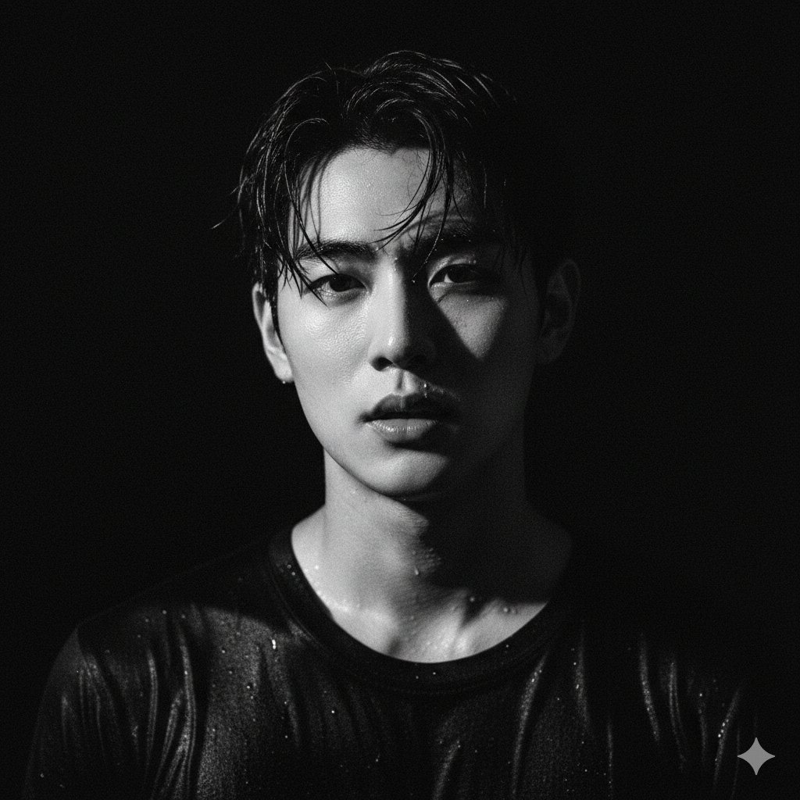
</div>

**中文提示词：**
```
一张极具戏剧张力的黑白特写肖像，展现了一位英俊的年轻东亚男性。他的头发微湿，凌乱地贴在额头和脸颊上，脸颊上挂着几颗水珠。他眼神迷离，嘴唇微张，表情中带着一丝脆弱和诱惑。他穿着一件被水浸湿的黑色T恤，贴合在肩膀上。强烈的侧光照亮了他脸上的水珠和湿润的皮肤，形成鲜明的高光，与深邃的阴影形成强烈对比。极简的深色背景，照片极具电影氛围，高细节，胶片颗粒感重，传达出一种神秘而充满张力的情绪。
```

<a id="prompt-384"></a>
## 案例 384：人和汽车的三视图 (来源 [@songguoxiansen](https://x.com/songguoxiansen/status/1983425570596892858))

<div style="display: flex; justify-content: space-between;">
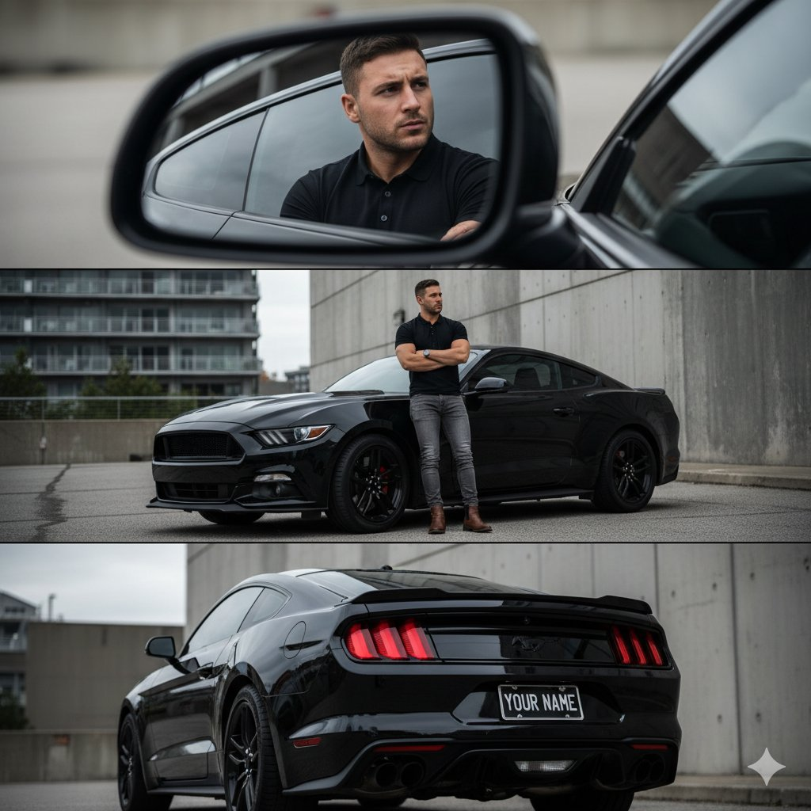
</div>

**提示词：**
```
A cinematic automotive photoshoot of me, keeping my real face unchanged. The scene is composed of three perspectives as a :

1. Top Panel: Interior close-up: I am seated inside the car, wearing a fitted black polo shirt, shown in the side mirror reflection. My face is serious and focused, my gaze directed forward with determination. The angle captures only side view part of my profile, framed cleanly within the mirror, emphasizing intensity and precision.

2.Middle Panel: I am standing confidently next to a sleek black Ford Mustang. My posture is relaxed but strong: both arms are crossed over my chest in a confident manner, while my left leg is straight and my right leg bent slightly at the knee, with the foot leaning casually against the car. My gaze is directed slightly off-camera, with a calm and assertive expression. I am wearing a fitted black polo shirt with subtle detailing, slim grey jeans with a clean cut, and brown leather boots. My outfit is minimal yet stylish, emphasizing a modern masculine vibe. Pose like a pro, same face as the uploaded photo.

3. Bottom Panel: Rear car shot: The camera captures the back of the Mustang, showcasing the "YOUR NAME" license plate and muscular lines of the car. The photo emphasizes the glossy texture of the vehicle and its aggressive, cinematic presence. The setting is an urban environment with modern architecture and concrete walls, giving a gritty, cinematic atmosphere. The lighting is natural but slightly diffused, highlighting both me and the polished surface of the car.

The perspectives vary:

- The mirror reflection close-up is shot tight with a portrait focal length (~85mm).

- The exterior full-body shot is taken at eye-level with a slightly wide lens to capture both me and the car in full view.

- The rear car angle uses a low perspective to emphasize power and presence.

Style: Cinematic automotive editorial, urban setting, moody and stylish, professional fashion-meets- car photography, same face.
```

<a id="prompt-383"></a>
## 案例 383：一张超现实的微距照片 (来源 [@Samann_ai](https://x.com/Samann_ai/status/1982774584198991988))

<div style="display: flex; justify-content: space-between;">
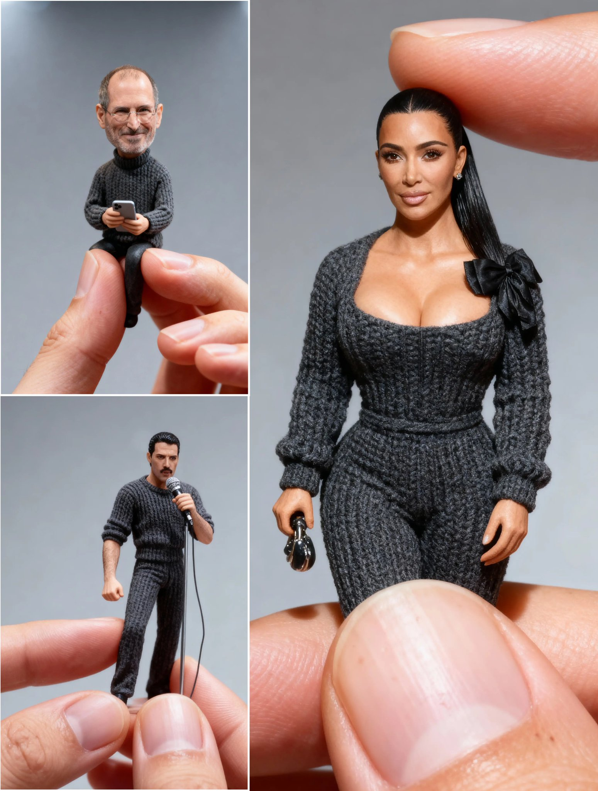
</div>

**提示词：**
```
Create a hyper-real macro photograph of a tiny (CHARACTER) about 10–12 cm tall, gently held between a real human thumb and index finger or sitting on the fingertip. The character naturally touches the thumb for scale and holds (ACCESSORY). Studio setting with a soft grey gradient background, subtle bokeh. Skin, fabric and hair show micro-texture; add accurate contact shadows where fingers meet the character. Lighting: softbox at 45°, faint rim light on the far side; no harsh glare. Camera look: 100mm macro • f/2.8 • ISO 100 • 1/160s (shallow depth of field; eyes perfectly in focus). Hands look clean, natural anatomy, 5 fingers, realistic nails and pores. The character’s outfit is simple textured knit (dark grey) unless the identity demands otherwise; proportions and perspective must read real, not toy. Treat (CHARACTER) respectfully and keep likeness faithful if based on a real person. Composition: subject centered, from mid-torso up, with the thumb and index framing the character;
```

**中文提示词：**
```
创建一张超现实的微距照片，照片中一个约 10-12 厘米高的微小（角色），轻轻地放在真人的拇指和食指之间或放在指尖上。角色自然地触摸拇指以进行缩放并握住（配件）。工作室设置具有柔和的灰色渐变背景，微妙的散景。皮肤、织物和头发显示微观纹理；在手指与角色接触的地方添加准确的接触阴影。照明：45° 柔光箱，远端微弱的边缘光；无刺眼眩光。相机外观：100mm 微距 • f/2.8 • ISO 100 • 1/160s（浅景深；眼睛完美对焦）。手看起来干净，解剖自然，5 个手指，逼真的指甲和毛孔。除非身份另有要求，否则角色的服装是简单的纹理针织（深灰色）；比例和透视必须是真实的，而不是玩具。尊重地对待（角色），如果基于真人，则保持相似性。构图：以主体为中心，从躯干中部向上，用拇指和食指框住人物；
```

<a id="prompt-382"></a>
## 案例 382：3D chibi风格乙烯基收藏品 (来源 [@Arminn_Ai](https://x.com/Arminn_Ai/status/1982860799879114903))

<div style="display: flex; justify-content: space-between;">

</div>

**提示词：**
```
A 3D chibi-style vinyl collectible figure of [CHARACTER NAME] Big head, small body, cartoon proportion, Standing inside a Youtooz-style
packaging box with: Transparent front window
"YOUTOOZ COLLECTIBLES" logo on the top
Number label ([#XXX]) on the top-left
Bottom front text: “[CHARACTER NAME]” and lower with smaller font “VINYL FIGURE”
Cartoon 2D illustration of [CHARACTER NAME] on the side of the box ([ILLUSTRATION DESCRIPTION])

Background/theme:
[BOX COLORS + TEXTURES + ICONIC MOTIFS RELATED TO CHARACTER] 
[Figure POSE OR GESTURE] 
[Outfit DESCRIPTION + SIGNATURE ITEMS]

Face details: The facial features (mouth/eyes/details) must be fully 3D sculpted, not flat or printed.
Lighting: clean product photography look, minimal soft shadows
Style: vinyl-toy aesthetic with a mix of matte + glossy accents depending on costume, Composition: 3/4 product shot view, full box visible. The entire packaging box must be fully visible inside the frame with a clean margin around all edges.
```

**中文提示词：**
```
3D chibi 风格乙烯基收藏品 [CHARACTER NAME] 大头，小身体，卡通比例，站在 Youtooz 风格的
包装盒带有：透明前窗
顶部有“YOUTOOZ COLLECTIBLES”标志
左上角的数字标签（[#XXX]）
底部文字：“[CHARACTER NAME]” 下方用较小的字体写着“VINYL FIGURE”
盒子侧面的 [角色名称] 卡通 2D 插图（[插图描述]）

背景/主题：
[盒子颜色 + 纹理 + 与角色相关的标志性图案]
[人物姿势或手势]
[服装描述 + 标志性物品]

面部细节：面部特征（嘴巴/眼睛/细节）必须完全 3D 雕刻，而不是平面或印刷的。
灯光：干净的产品摄影外观，最小的柔和阴影
风格：搪胶玩具美学，根据服装搭配哑光和亮光元素。构图：3/4 产品视角，完整包装盒清晰可见。整个包装盒必须在框架内完全可见，所有边缘均留有清晰的空白。
```

<a id="prompt-381"></a>
## 案例 381：一幅奢华的高级时尚肖像 (来源 [@wanerfu](https://x.com/wanerfu/status/1983353100066009387))

<div style="display: flex; justify-content: space-between;">
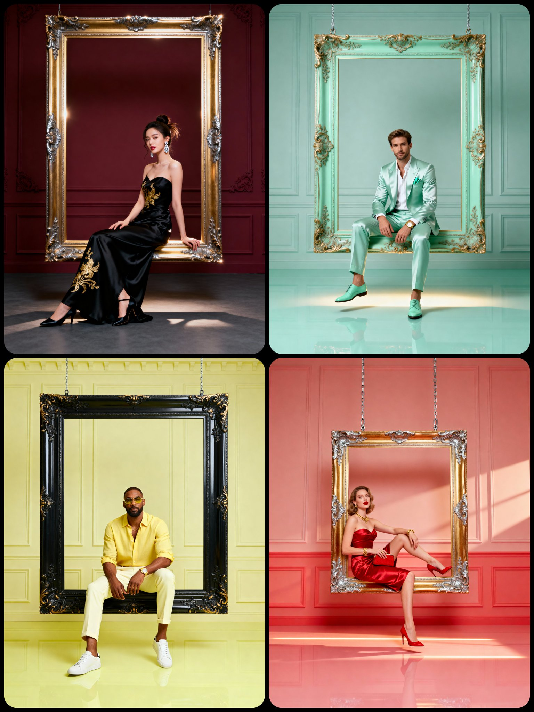
</div>

**中文提示词：**
```
一幅奢华的高级时尚肖像，[角色描述]优雅地坐在装饰华丽的大型长方形画框下边缘

画框细节：
• 巴洛克/洛可可风格长方形画框
• 用[画框颜色和质地]绘制，与整体色调和谐

环境：
• 背景：优雅的工作室墙面，经典镶板[颜色]
• 地板：略有反光，[地板颜色]

灯光：
• 电影式高调时尚光线
• 主体柔和柔散光
• 轻微轮廓分离

相机：
• 对称居中全身肖像
• 干净的编辑时尚构图
• 8K超清高端大片品质

风格标签：单色 | 悬浮画框 | 电影工作室时尚 | 奢华编辑美学
```

<a id="prompt-380"></a>
## 案例 380：卡通插图 (来源 [@Arminn_Ai](https://x.com/Arminn_Ai/status/1978164256240501226))

<div style="display: flex; justify-content: space-between;">
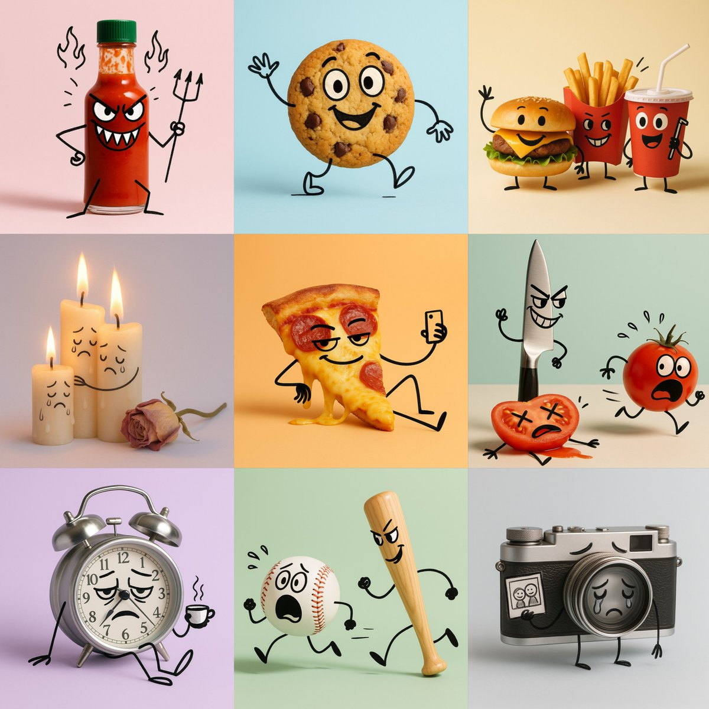
</div>

**提示词：**
```
A cartoon illustration of [OBJECT],
photographed in a clean minimal studio setup. All objects remain realistic and three-dimensional, but have been transformed into expressive cartoon characters:
• [DESCRIPTION & EMOTION]  
  (describe facial features, expressions, and emotional tone for each object)
• [ACTION]  
• doodle lines are black, slightly uneven, and hand-drawn —  like quick expressive sketchbook strokes drawn directly on the objects.
Style: hybrid mix of real product photography and cartoon doodle overlay.  
Background: solid pastel [COLOR], clean and minimal.
Lighting: soft, even, studio-style — subtle highlights and gentle shadows; no harsh light.
Mood: [MOOD / THEME — e.g. playful, melancholic, poetic, humorous].  
Keywords: hybrid photo-doodle, product cartoon, expressive characters, minimal pastel background. Aspect ratio: 1:1
```

**中文提示词：**
```
[OBJECT]的卡通插图，
在简洁干净的工作室环境中拍摄。所有物体都保持了真实感和三维立体感，但又被转化成了富有表现力的卡通人物：
• [描述和情感]
（描述每个物体的面部特征、表情和情绪基调）
• [行动]
• 涂鸦线条是黑色的，略微不均匀，并且是手绘的——就像直接在物体上绘制的快速富有表现力的素描本笔触一样。
风格：真实产品摄影和卡通涂鸦叠加的混合。
背景：纯色粉彩[颜色]，干净、简约。
灯光：柔和、均匀、工作室风格——微妙的高光和柔和的阴影；没有刺眼的光线。
心情：[心情/主题 — 例如好玩、忧郁、诗意、幽默]。
关键词：混合照片涂鸦、产品卡通、富有表现力的人物、极简柔和背景。长宽比：1:1
```

<a id="prompt-379"></a>
## 案例 379：戴着报童帽身穿黑色马甲 (来源 [@eyishazyer](https://x.com/eyishazyer/status/1982402164212597061))

<div style="display: flex; justify-content: space-between;">
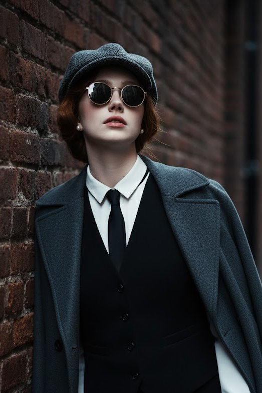
</div>

**提示词：**
```
Use 100% face above uploaded photo.
A hyper-realistic, cinematic medium shot of a handsome man in his late 20s with black hair and black beard like uploaded photo, styled in the fashion of the 1920s. He wears a grey tweed newsboy cap, a black waistcoat over a crisp white shirt, a slim black tie, and black leather gloves. A heavy wool overcoat is draped over his shoulder.
He leans against a weathered brick wall in a narrow, atmospheric alleyway, looking upwards with a cool, contemplative expression through his round sunglasses. The lighting is moody and dramatic, with cool tones and soft shadows creating a sense of depth and mystery. The photograph is ultra-detailed with sharp focus and a shallow depth of field.
```

**中文提示词：**
```
使用上传的 100% 面部照片。
这张超现实主义的电影中景镜头展现了一位英俊的二十多岁男子，他有着上传照片般的黑发和黑胡须，一身20世纪20年代的时尚风格。他头戴灰色粗花呢报童帽，身穿黑色马甲，内搭清爽的白衬衫，系着一条纤细的黑色领带，戴着黑色皮手套。肩上披着一件厚重的羊毛大衣。
他倚靠在一条狭窄而充满情调的小巷里，倚靠着一堵饱经风霜的砖墙，透过圆形墨镜，目光冷峻而沉思。灯光充满情调，充满戏剧性，冷色调和柔和的阴影营造出一种纵深感和神秘感。这张照片细节丰富，对焦清晰，景深浅。
```

<a id="prompt-378"></a>
## 案例 378：优雅姿势的最高分辨率照片 (来源 [@eyishazyer](https://x.com/eyishazyer/status/1982402158176972945))

<div style="display: flex; justify-content: space-between;">
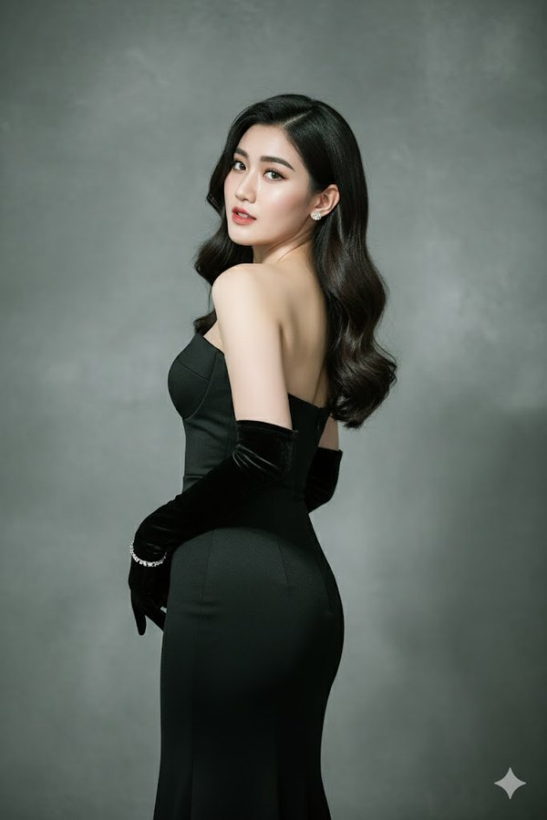
</div>

**提示词：**
```
Create the highest-resolution picture of me posing elegantly with my back slightly turned and my head looking over the shoulder towards the camera. I am wearing a sleek, form-fitting strapless black evening gown, paired with long, elegant black velvet opera gloves. My hair is styled in loose, glossy waves cascading naturally over my shoulder.
I wear small, subtle earrings and a delicate bracelet on one wrist. My expression is confident, graceful, and alluring. The background is a plain stucco gray with soft gradient lighting, giving it a high-fashion photography look. The lighting is dramatic but soft, highlighting the contours of my body and face with realistic shadows and textures.
The image should look like a high-quality, ultra-realistic fashion magazine photo, keeping my real face exactly as shown in the reference photo.
```

**中文提示词：**
```
请拍一张我优雅姿势的最高分辨率照片，我的背影微微转过，头越过肩膀，望向镜头。我身着一件光滑修身的黑色露肩晚礼服，搭配一副优雅的黑色天鹅绒长款歌剧手套。我的头发是蓬松的、光泽的波浪，自然地披散在肩上。”
我戴着小巧精致的耳环，一只手腕上戴着精致的手镯。我的表情自信、优雅、迷人。背景是朴素的灰泥灰，柔和的渐变灯光营造出高级时尚的摄影效果。灯光既戏剧化又柔和，用逼真的阴影和纹理凸显了我的身体和面部轮廓。
该图像应该看起来像一张高质量、超逼真的时尚杂志照片，保留我的真实面容，与参考照片中显示的完全一样。
```

<a id="prompt-377"></a>
## 案例 377：坐在现代地铁长椅上 (来源 [@eyishazyer](https://x.com/eyishazyer/status/1982402145535373486))

<div style="display: flex; justify-content: space-between;">
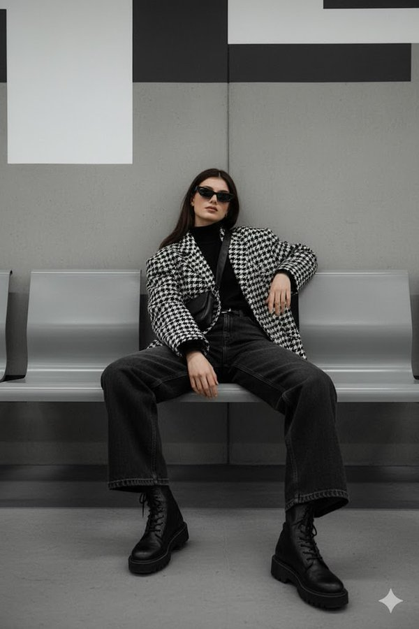
</div>

**提示词：**
```
Reference image: uploaded photo
Face: keep the same face from the reference photo, calm and composed expression, eyes slightly hidden behind dark sunglasses. Preserve realistic proportions and lighting.
Pose: seated pose on a modern subway bench, one arm resting on the leg, the other hanging down loosely. The body leans slightly forward with casual confidence, one shoulder lowered. Clothes: oversized houndstooth-patterned jacket over black turtleneck, wide dark jeans, chunky lace-up boots. Accessories: narrow black sunglasses, subtle rings, crossbody strap barely visible.
Background: minimalistic urban metro interior with grey concrete walls, metallic accents, and modern geometric design. Lighting: diffused artificial indoor light, soft shadows, neutral color balance emphasizing grayscale tones. Atmosphere: moody street editorial — quiet confidence, understated power, cinematic stillness.
Format: 2:3 Do not replace face; keep the same person with realistic proportions and lighting accuracy.
```

**中文提示词：**
```
参考图片：上传的照片
脸部：保持参考照片中的脸部，表情沉稳冷静，眼睛略微隐藏在墨镜后。保持真实的比例和光线。
姿势：坐在现代地铁长椅上，一只手臂搭在腿上，另一只手臂自然垂下。身体略微前倾，自信而随意，一侧肩膀下垂。服装：超大千鸟格纹夹克，内搭黑色高领毛衣，深色宽腿牛仔裤，系带厚底靴。配饰：黑色窄款墨镜，精致戒指，斜挎包带若隐若现。
背景：极简主义的都市地铁内部，灰色混凝土墙面，金属元素点缀，以及现代几何设计。灯光：漫射的室内人造光，柔和的阴影，强调灰阶色调的中性色彩平衡。氛围：忧郁的街头风格——沉静自信，低调的力量，电影般的静谧。
格式：2：3 不要替换面部；保持同一个人具有真实的比例和灯光准确性。
```

<a id="prompt-376"></a>
## 案例 376：坐在巨大光滑的白色岩层上 (来源 [@eyishazyer](https://x.com/eyishazyer/status/1982402132834767195))

<div style="display: flex; justify-content: space-between;">
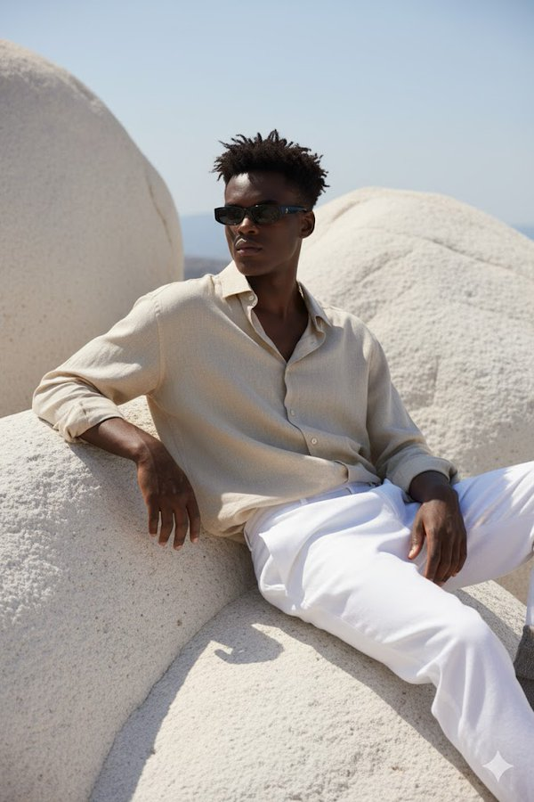
</div>

**提示词：**
```
A hyper-realistic portrait of a young man sitting on large, smooth white rocky formations under natural sunlight. He is wearing a loose, slightly crumpled beige linen shirt with the top buttons open, paired with white trousers. His outfit gives a relaxed, Mediterranean vibe.
He is leaning back, one arm resting on the rock, and the other hand on his knee, looking slightly to the side. He wears slim black rectangular sunglasses. His hairstyle is short, slightly messy, and the sunlight casts soft shadows across his outfit and the textured rocks.
The overall atmosphere is calm, stylish, and Mediterranean-inspired. The face should match exactly with the reference photo.
```

**中文提示词：**
```
这幅超现实主义肖像画描绘了一位年轻男子坐在巨大光滑的白色岩层上，沐浴在自然阳光下。他身穿宽松略带褶皱的米色亚麻衬衫，最上面的纽扣敞开着，搭配白色长裤。他的装扮散发着轻松的地中海风情。
他向后仰着身子，一只手扶着岩石，另一只手放在膝盖上，目光略微侧向一侧。他戴着一副细长的黑色矩形墨镜。他的发型短而略显凌乱，阳光在他的衣服和纹理分明的岩石上投下柔和的阴影。
整体氛围平静、时尚，充满地中海风情。脸部应该与参考照片完全匹配。
```

<a id="prompt-375"></a>
## 案例 375：一枚精致的人物金属硬币 (来源 [@eyishazyer](https://x.com/eyishazyer/status/1982402126845247707))

<div style="display: flex; justify-content: space-between;">
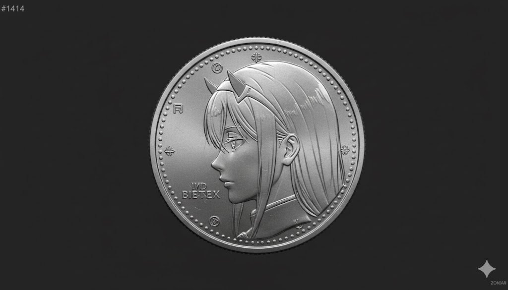
</div>

**提示词：**
```
A detailed metallic coin featuring
Person's face attached in the image ( Do not change facial features of the person from the uploaded photo. Keep face of person 100% accurate from the reference image. Keep the original face of the attached person unchanged and realistic)  embossed in profile, crafted with realistic engraved textures and fine relief detailing. The coin surface shows light reflections, scratches, and metallic sheen. Include subtle inscriptions or symbols around the border to resemble authentic minting. Centered on a dark, minimal background to emphasize the coin’s texture and realism
```

**中文提示词：**
```
一枚精致的金属硬币，图像中人物的面部特征（请勿更改上传照片中人物的面部特征。保持人物面部与参考图像 100% 准确。保持附加人物的原始面部特征不变且逼真）采用侧面浮雕，并采用逼真的雕刻纹理和精细的浮雕细节。硬币表面呈现光反射、划痕和金属光泽。在边缘处添加细微的铭文或符号，以模拟真实的铸币。硬币以深色、极简的背景为中心，以突出硬币的纹理和真实感
```

<a id="prompt-374"></a>
## 案例 374：坐在一个毛茸茸的巨型可爱卡通怪物旁 (来源 [@eyishazyer](https://x.com/eyishazyer/status/1982402120658948406))

<div style="display: flex; justify-content: space-between;">
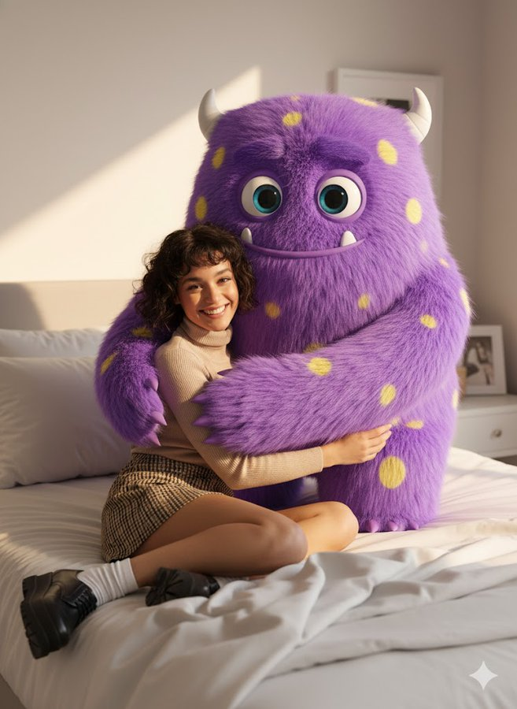
</div>

**提示词：**
```
make me sit next to a giant fluffy cute cartoon monster. I am real realistic but monster is 3d cartoon. It’s hugging me and cute. Big eyes  we are in house on bed
```

**中文提示词：**
```
让我坐在一个毛茸茸的巨型可爱卡通怪物旁边。我真的很逼真，但怪物是3D卡通的。它抱着我，很可爱。大眼睛，我们在屋里的床上。
```

<a id="prompt-373"></a>
## 案例 373：身穿一件宽松的白色衬衫肖像照 (来源 [@eyishazyer](https://x.com/eyishazyer/status/1982402114413596850))

<div style="display: flex; justify-content: space-between;">
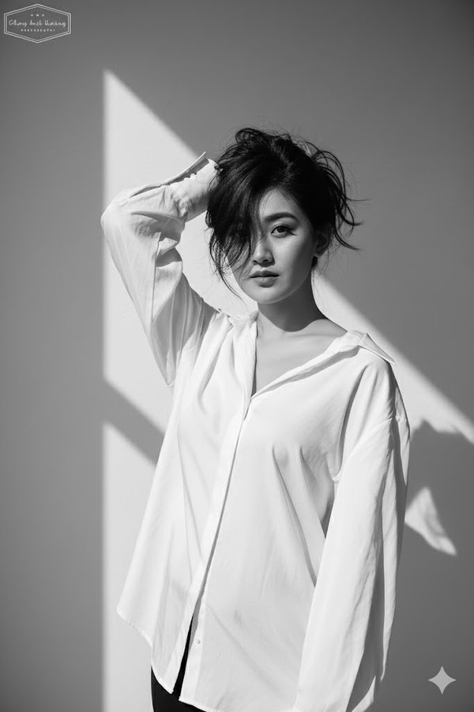
</div>

**提示词：**
```
Create a black and white high-fashion editorial portrait of me, keeping my real face exactly as in the reference photo (no edits, same features, no retouching). I am wearing a loose white blouse. My pose is bold and expressive, with one arm raised to hold my hair up, partially covering my face. My gaze is intense and directed at the camera, creating a strong and enigmatic aura. The background is a plain minimalist wall with sharp natural daylight casting defined shadows, adding depth and contrast.
Lighting is harsh and high-contrast, highlighting my facial contours, sharp cheekbones, and the texture of the hair and fabric. The style should feel raw, dramatic, and artistic.
The overall image is high-fashion editorial in monochrome, cinematic, and striking.
```

**中文提示词：**
```
为我创作一幅黑白高级时尚编辑肖像，保留我的真实面容，与参考照片完全一致（未进行任何编辑，五官相同，未进行任何修饰）。我身穿一件宽松的白色衬衫。我的姿势大胆而富有表现力，一只手抬起，将头发拢起，遮住了部分脸部。我的目光专注地直视镜头，营造出一种强烈而神秘的氛围。背景是一面简洁的墙面，明亮的自然光投射出清晰的阴影，增添了画面的深度和对比度。
光线强烈，对比度高，凸显了我的面部轮廓、棱角分明的颧骨，以及头发和布料的质感。风格应该给人一种原始、戏剧化、艺术感十足的感觉。
整体形象是单色的、电影化的、引人注目的高级时尚社论。
```

<a id="prompt-372"></a>
## 案例 372：90年代风格照片 (来源 [@ZaraIrahh](https://x.com/ZaraIrahh/status/1982268011416592593))

<div style="display: flex; justify-content: space-between;">
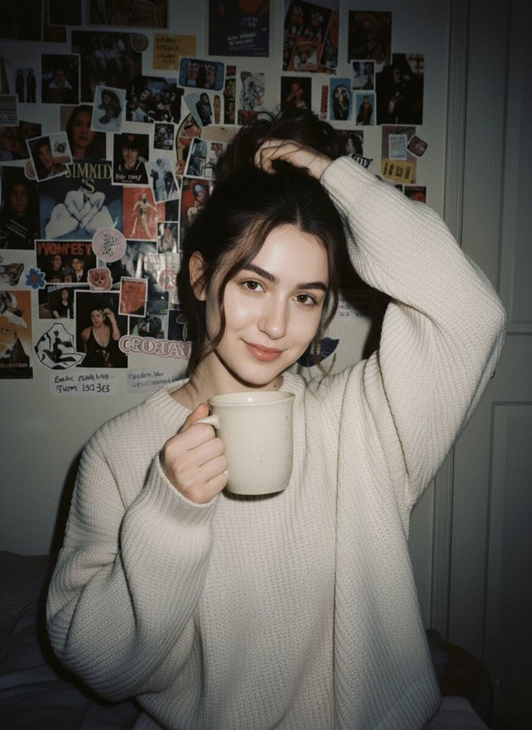
</div>

**提示词：**
```
Without changing her original face, create a portrait of a beautiful young woman with porcelain-white skin, captured with a 1990s-style camera using a direct front flash. Her messy dark brown hair is tied up, posing with a calm yet playful smile. She wears a modern oversized cream sweater. The background is a dark white wall covered with aesthetic magazine posters and stickers, evoking a cozy bedroom or personal room atmosphere under dim lighting.
```

**中文提示词：**
```
不改变她原本的面容，用一台90年代风格的相机，搭配前置闪光灯，为一位拥有瓷白肌肤的年轻女子创作一幅肖像。她凌乱的深棕色头发扎起，脸上挂着平静而俏皮的微笑。她身穿一件现代感十足的奶油色宽松毛衣。背景是一面深白色的墙，墙上贴满了美学杂志的海报和贴纸，在昏暗的灯光下，营造出舒适的卧室或私人房间氛围。
```

<a id="prompt-371"></a>
## 案例 371：人物作为动物的高度详细肖像 (来源 [@LinusEkenstam](https://x.com/LinusEkenstam/status/1982790174418632891))

<div style="display: flex; justify-content: space-between;">
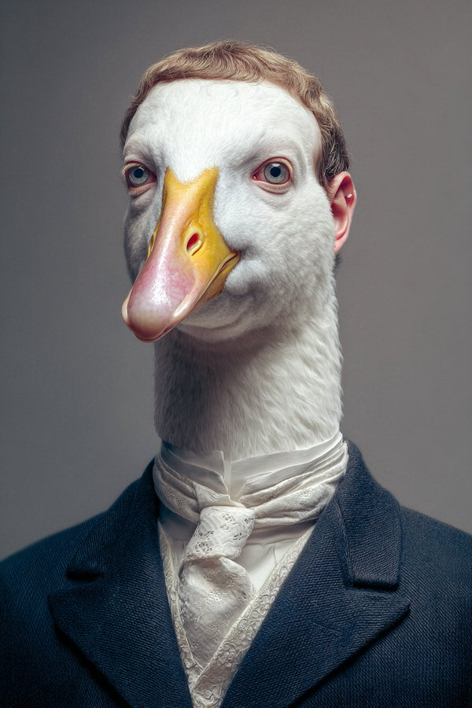
</div>

**提示词：**
```
[Person] as an [Animal] highly detailed portrait
```

**中文提示词：**
```
[人物] 作为 [动物] 的高度详细肖像
```

<a id="prompt-370"></a>
## 案例 370：超现实主义哥特式兔子工作室肖像 (来源 [@IqraSaifiii](https://x.com/IqraSaifiii/status/1982469385156489563))

<div style="display: flex; justify-content: space-between;">
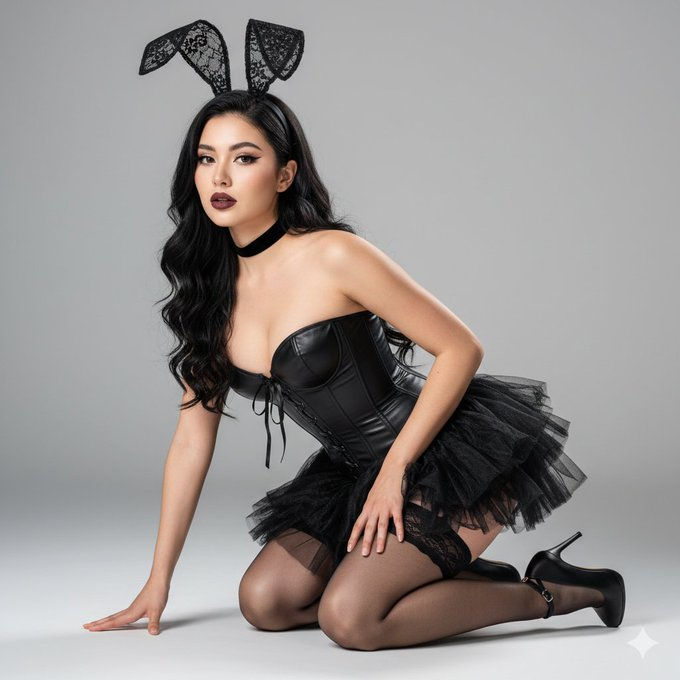
</div>

**提示词：**
```
{
"prompt_title": "Hyperrealistic Gothic Bunny Studio Portrait",
"image_description": "An ultra-photorealistic, high-resolution studio portrait of a female subject in a gothic-inspired bunny costume, featuring intricate lace ears, a structured corset, and delicate hosiery. The subject is posed on the floor, exuding an alluring and sophisticated aura under precise studio lighting.",
"subject": {
"gender": "female",
"appearance": "Young adult with a flawless, luminous complexion. **Extreme micro-detail rendering on skin, showing subtle pores, fine vellus hairs, accurate light interaction (sub-surface scattering), and realistic skin texture.**",
"facial_features": "Smooth, clear skin. Her eyes are large, dark, and captivating, looking directly into the camera with a **confident and slightly seductive expression**. Lips are full, with a matte red or deep berry lipstick that shows micro-creases. Defined eyebrows and subtle contouring.",
"hair_style": "Long, flowing, wavy black hair, cascading over her shoulders and back. **Hair must show individual strands, realistic volume, high-gloss reflections, and subtle flyaways.**",
"makeup": "Dramatic and precise. Sharp, winged black eyeliner, full, dark eyelashes (possibly individual lash extensions), subtle glitter or shimmer on eyelids. Contoured cheeks. Flawless foundation and blush.",
"attire": {
"headwear": "Intricate **black lace bunny ears headband**. The lace should have visible patterns, delicate wire structure, and possibly small faux floral or ribbon accents. Realistic light interaction with the lace.",
"neck_accessories": "A simple, fitted black velvet or leather choker necklace.",
"main_outfit": "A highly detailed **black strapless corset dress or top and skirt ensemble**. The corset should be structured, showing **visible boning and lacing details** (possibly satin or leather laces). Fabric should be a mix of matte black leather/faux leather and textured, ruffled black tulle or chiffon for the skirt. **Emphasis on realistic fabric folds, textures, and subtle sheen.**",
"hosiery": "Sheer black thigh-high stockings with a delicate lace top band, clearly visible on her upper thigh. **Stockings must show realistic transparency and fabric stretch over skin.**",
"footwear": "Black pointed-toe high heels with ankle straps. The material should be a realistic matte or patent leather, showing accurate reflections and shoe construction."
}
},
"pose": {
"description": "The subject is kneeling on a flat, light-colored studio floor, leaning slightly forward. Her left hand is placed on the floor beside her left knee, fingers slightly spread. Her right arm is gently resting on her right thigh. Her body is slightly twisted, creating an alluring silhouette. **Exact replication of the confident and poised pose.**",
"camera_angle": "Medium shot, eye-level angle, slightly looking down at the subject. The camera is positioned to capture her full body from the mid-thigh up, with enough space around her to establish the studio environment.",
"composition": "Centered composition, vertical orientation. The subject fills approximately 70-80% of the frame, with subtle negative space around her. **Sharp focus on the subject, with a very shallow depth of field creating a soft bokeh in the background.**"
},
"setting": {
"location": "Professional indoor photo studio.",
"background_elements": "Seamless, plain light gray or off-white backdrop, extending from the floor to the wall, creating a clean, infinite background. **Subtle, soft gradient in the background due to lighting falloff.**"
},
"lighting_and_atmosphere": {
"key_light_source": "Softbox or parabolic diffuser from the front-left, creating soft, even illumination with subtle directional shadows to define contours.",
"fill_light": "Subtle fill light from the front-right to reduce harsh shadows on the right side of her face and body.",
"back_light": "A subtle hair light or rim light from the rear-right to create separation from the background and add definition to her hair and shoulders.",
"highlights_shadows": "Soft, creamy highlights on skin, hair, and corset material. Deep but soft shadows defining facial structure and body contours. **Accurate light falloff and realistic specular reflections on materials.**",
"photographic_realism": "Extreme micro-detail, sub-surface scattering on skin, realistic fabric textures (lace, leather, tulle), **cinematic studio lighting**, crisp focus on eyes, perfect white balance, neutral color grading, **ultra-realistic material rendering (PBR - Physically Based Rendering).**"
},
"style_and_camera": {
"photographic_style": "High-fashion portraiture, hyperrealistic studio photography, fine art glamour.",
"camera_type": "High-end full-frame mirrorless camera (e.g., Sony A1, Canon R5) with a fast prime lens (e.g., 50mm f/1.2 or 85mm f/1.4).",
"camera_values": "ISO 100, f/1.8, 1/160 sec. **These values contribute to shallow depth of field, sharp detail, and clean image quality.**",
"resolution_quality": "8K resolution, ultra-photorealistic, extreme detail on all elements. **Masterpiece quality render, production quality image.**"
},
"negative_prompt_suggestions": [
"blurry", "low resolution", "deformed", "harsh lighting", "flat background", "bad anatomy",
"cartoon", "illustration", "painting", "text", "watermark", "oversaturated", "poor composition",
"unrealistic skin", "plastic texture", "missing details"
]
}
```

**中文提示词：**
```
{
"prompt_title": "超现实主义哥特式兔子工作室肖像",
"image_description": "这幅超逼真、高分辨率的工作室肖像画描绘了一位身着哥特式兔子服装的女性，服装配有精致的蕾丝耳朵、结构化的紧身胸衣和精致的袜子。模特躺在地板上，在精准的工作室灯光下散发着迷人而精致的气息。",
“主题”： {
"性别": "女",
"appearance": "拥有完美无瑕、明亮肤色的年轻人。 **皮肤上极其细微的细节渲染，展现出细微的毛孔、细小的毳毛、准确的光线相互作用（次表面散射）和逼真的皮肤纹理。 ** ",
"facial_features": "光滑、洁净的皮肤。她的眼睛又大又黑，魅力十足，直视镜头，眼神自信而略带诱惑** 。 **.嘴唇丰满，涂着哑光红色或深莓色唇膏，露出细微的皱纹。眉毛清晰，轮廓细腻。",
"hair_style": "飘逸的黑色长发，波浪状披散在肩部和背部。 **头发必须展现出独立的发丝、真实的蓬松度、高光泽的反光和微妙的飞散。 ** ",
"makeup": "妆容精致而又充满戏剧感。锐利的黑色眼线，浓密的深色睫毛（可能是单独嫁接的），眼睑上点缀着淡淡的闪粉或珠光。轮廓分明的脸颊。完美的粉底和腮红。",
“服装”：{
"headwear": "精致的**黑色蕾丝兔耳头带**.蕾丝应具有明显的图案、精致的金属丝结构，以及可能的小型仿花或丝带装饰。与蕾丝的逼真灯光互动。",
"neck_accessories": "一条简单、合身的黑色天鹅绒或皮革颈链。",
"main_outfit": "一件细节丰富的**黑色露肩紧身连衣裙或上衣和裙子套装**.紧身胸衣应结构清晰，露出**明显的骨和系带细节** (可能需要缎子或皮革鞋带。裙子面料应为哑光黑色皮革/人造皮革和纹理荷叶边黑色薄纱或雪纺的混合面料。 **强调逼真的面料褶皱、纹理和微妙的光泽。 ** ",
"hosiery": "透明黑色过膝长袜，带有精致的蕾丝边，在大腿上清晰可见。 **长袜必须具有逼真的透明度，并且织物在皮肤上具有弹性。 ** ",
“footwear”：“黑色尖头高跟鞋，带踝带。材质应为逼真的哑光皮革或漆皮，展现准确的反射和鞋子结构。”
}
}，
“姿势”：{
"description": "拍摄对象跪在工作室平坦的浅色地板上，身体微微前倾。她的左手放在左膝旁的地板上，手指微微张开。她的右臂轻轻地放在右大腿上。她的身体微微扭动，勾勒出迷人的轮廓。 **精准地复制了她自信而泰然的姿势。 ** ",
"camera_angle": "中景镜头，视线水平角度，略微向下看拍摄对象。摄像机的位置可以捕捉到她从大腿中部以上的全身，周围有足够的空间来营造工作室氛围。",
"composition": "居中构图，垂直方向。主体占据了画面的大约 70-80%，周围留有微妙的负空间。 **主体清晰对焦，景深很浅，在背景中营造出柔和的散景效果。 ** "
}，
“环境”： {
"location": "专业室内摄影工作室。",
"background_elements": "无缝、纯浅灰色或灰白色背景，从地板延伸到墙壁，营造出干净、无限的背景。 **由于光线衰减，背景中出现微妙、柔和的渐变。 ** "
}，
“照明和氛围”：{
"key_light_source": "从左前方放置柔光箱或抛物面漫射器，创造柔和、均匀的照明，并带有微妙的定向阴影来定义轮廓。",
"fill_light": "来自右前方的微妙补光，以减少她脸部和身体右侧的刺眼阴影。",
"back_light": "从右后方照射的微妙的头发光或边缘光，与背景分离，并突出她的头发和肩膀。",
"highlights_shadows": "皮肤、头发和紧身胸衣材质上呈现柔和、奶油般的高光。深邃而柔和的阴影勾勒出面部结构和身体轮廓。 **材质上呈现精准的光线衰减和逼真的镜面反射。 ** ",
"photographic_realism": "极其精细的微细节、皮肤表面次表面散射、逼真的织物纹理（蕾丝、皮革、薄纱）、 **电影工作室灯光** 、清晰的眼睛聚焦、完美的白平衡、中性色彩分级、 **超逼真的材质渲染（PBR - 基于物理的渲染）。 ** "
}，
“style_and_camera”：{
"photographic_style": "高级时尚肖像画、超现实主义工作室摄影、艺术魅力。",
"camera_type": "高端全画幅无反光镜相机（例如索尼 A1、佳能 R5）搭配快速定焦镜头（例如 50mm f/1.2 或 85mm f/1.4）。",
"camera_values": "ISO 100、f/1.8、1/160 秒。 **这些值有助于获得浅景深、清晰的细节和干净的图像质量。 ** ",
"resolution_quality": "8K 分辨率，超逼真，所有元素细节丰富。 **杰作品质渲染，产品品质图像。 ** "
}，
"negative_prompt_suggestions": [
“模糊”、“分辨率低”、“变形”、“光线刺眼”、“背景平坦”、“结构不良”
“卡通”、“插图”、“绘画”、“文字”、“水印”、“过饱和”、“构图不佳”
“皮肤不真实”、“塑料质感”、“缺少细节”
]
}
```

<a id="prompt-369"></a>
## 案例 369：通过镜子捕捉时尚的卫生间更衣区 (来源 [@IamEmily2050](https://x.com/IamEmily2050/status/1982643287745032379))

<div style="display: flex; justify-content: space-between;">
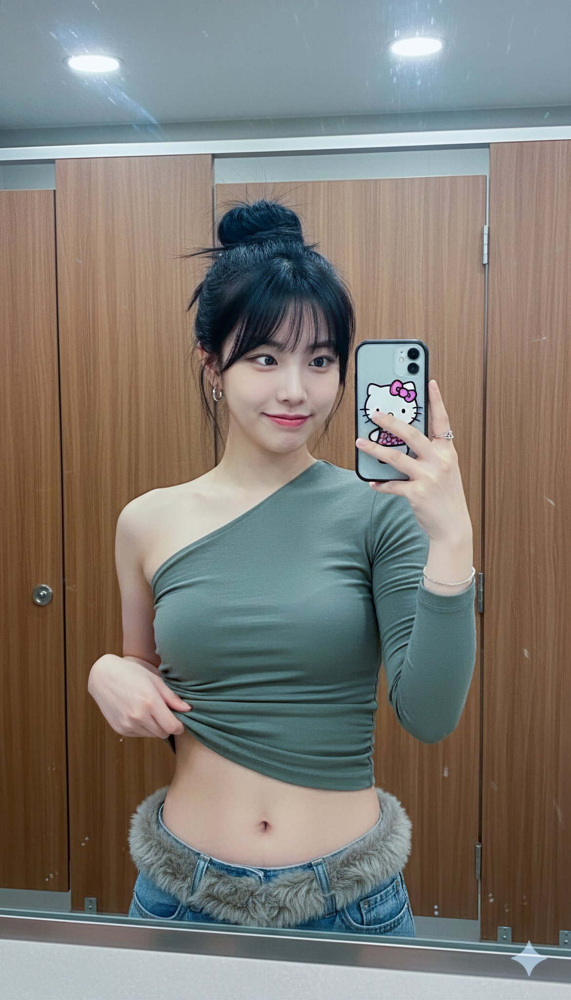
</div>

**提示词：**
```
{
  "scene": {
    "description": "Stylish restroom dressing area captured via mirror.",
    "environment": "Warm wood-laminate stall doors and soft countertop reflections.",
    "mood": "Shy-playful confidence; cozy 'Gamseong' (감성) aesthetic."
  },
  "aesthetic": {
    "style": "Authentic smartphone mirror selfie.",
    "look": "Warm interior color, gentle roll-off; minimal grain; filmic soft contrast."
  },
  "lighting": {
    "description": "Ceiling LEDs providing warm ambience; add subtle front fill from mirror to open eye sockets; maintain realistic specular highlights."
  },
  "subject": {
    "demographics": {
      "ethnicity": "East Asian (Korean)",
      "age": "adult",
      "build": "Very slender, petite with defined waist."
    },
    "appearance": {
      "hair": "Messy top-bun with full fringe; a few loose side strands.",
      "skin": "Natural, dewy finish with preserved skin texture."
    },
    "pose": {
      "type": "Mirror selfie, standing.",
      "action": "Gentle smile with lips slightly pressed; left hand lightly lifting ruched hem; right hand holding phone.",
      "framing": "Waist-up 3:4 vertical; slight downward camera angle; midriff visible."
    },
    "wardrobe": {
      "top": "Asymmetrical olive-gray ruched one-shoulder top.",
      "bottom": "Low-rise jeans with faux-fur waistband trim."
    },
    "accessories": {
      "jewelry": "Thin bracelets, rings, and delicate hoop earrings.",
      "phone": "Smartphone with black cat case featuring a pink bow (Hello-Kitty style)."
    }
  },
  "props_in_scene": {
    "background": "Wood-grain stall doors with verticals kept true; metal hinges subtly visible.",
    "counter": "Keep any edge reflections soft and realistic."
  },
  "camera_technical": {
    "requirements": "Correct mirror reversal; maintain natural body proportions; no duplicated phones/hands.",
    "capture": "Smartphone wide lens ~24–26mm equiv, f/1.8 look, ISO ~250, 1/125s, WB 4200–4400K.",
    "composition": "Subject centered with slight lean; keep fur texture readable; ensure phone and hand pose feel natural.",
    "retouching": "Clean minor blemishes only; preserve fabric micro-wrinkles and fur fibers; avoid haloing.",
    "avoid": "Warped doors, heavy vignettes, oversharpening, cartoon smoothing, text/watermarks."
  }
}
```

**中文提示词：**
```
{
“场景”： {
"description": "通过镜子捕捉时尚的卫生间更衣区。",
"environment": "温暖的木质层压隔间门和柔和的台面反射。",
"mood": "害羞而又充满自信；舒适的‘Gamseong’（감성）美学。"
}，
“审美的”： {
"style": "正宗的智能手机镜面自拍。",
“外观”：“温暖的内部色彩，柔和的滚动；最小的颗粒感；胶片般的柔和对比。”
}，
“灯光”： {
“description”：“天花板 LED 营造温暖的氛围；从镜子添加微妙的前部补光以打开眼窝；保持逼真​​的镜面高光。”
}，
“主题”： {
“人口统计”：{
"ethnicity": "东亚（韩国）",
"年龄": "成人",
“身材”：“非常苗条，娇小，腰部清晰。”
}，
“外貌”： {
"hair": "凌乱的发髻，刘海丰满；侧边有几缕散落的头发。",
"skin": "自然、水润的妆容，保留肌肤纹理。"
}，
“姿势”：{
"type": "镜子自拍，站立。",
"action": "温柔一笑，嘴唇微闭；左手轻轻提起褶边；右手握住手机。",
"framing": "腰部以上 3:4 垂直；略微向下的摄像机角度；可见腹部。"
}，
“衣柜”： {
"top": "不对称橄榄灰色褶饰单肩上衣。",
"bottom": "低腰牛仔裤，腰带饰有人造毛皮。"
}，
“配件”： {
"jewelry": "细手镯、戒指和精致的环形耳环。",
"phone": "带有黑色猫咪外壳和粉色蝴蝶结的智能手机（Hello-Kitty 风格）。"
}
}，
“场景中的道具”：{
"background": "木纹隔间门保持垂直；金属铰链隐约可见。",
"counter": "保持任何边缘反射柔和而逼真。"
}，
“相机技术”：{
"requirements": "正确的镜像反转；保持自然的身体比例；没有重复的手机/手。",
"capture": "智能手机广角镜头~24–26mm 等效，f/1.8 外观，ISO ~250, 1/125s，白平衡 4200–4400K。",
"composition": "主体居中，略微倾斜；保持毛发纹理清晰可读；确保手机和手部姿势自然。",
"retouching": "仅清洁轻微瑕疵；保留织物微褶和毛皮纤维；避免晕染。",
"avoid": "扭曲的门、沉重的晕影、过度锐化、卡通平滑、文字/水印。"
}
}
```

<a id="prompt-368"></a>
## 案例 368：影楼拍摄女性坐在椅子上肖像照 (来源 [@hellokaton](https://x.com/hellokaton/status/1980121888853819768))

<div style="display: flex; justify-content: space-between;">
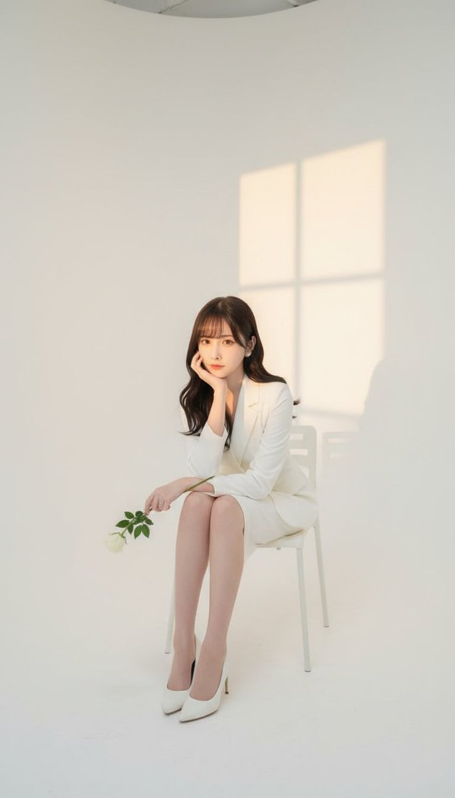
</div>

**中文提示词：**
```
请在影楼里拍摄一张照片，照片中使用所附照片中的女性面孔。
拍摄角度为正面，白色影楼背景，女性坐在椅子上。
她身穿全套白色服装：白色西装外套、白色裙子和白色高跟鞋。
姿势优雅，手托下巴，手里拿着一小枝白色玫瑰。
影楼墙壁上投射着柔和的夕阳窗户光线。
```

<a id="prompt-367"></a>
## 案例 367：一位年轻女性的时尚电影肖像 (来源 [@hellokaton](https://x.com/hellokaton/status/1980121876996465085))

<div style="display: flex; justify-content: space-between;">
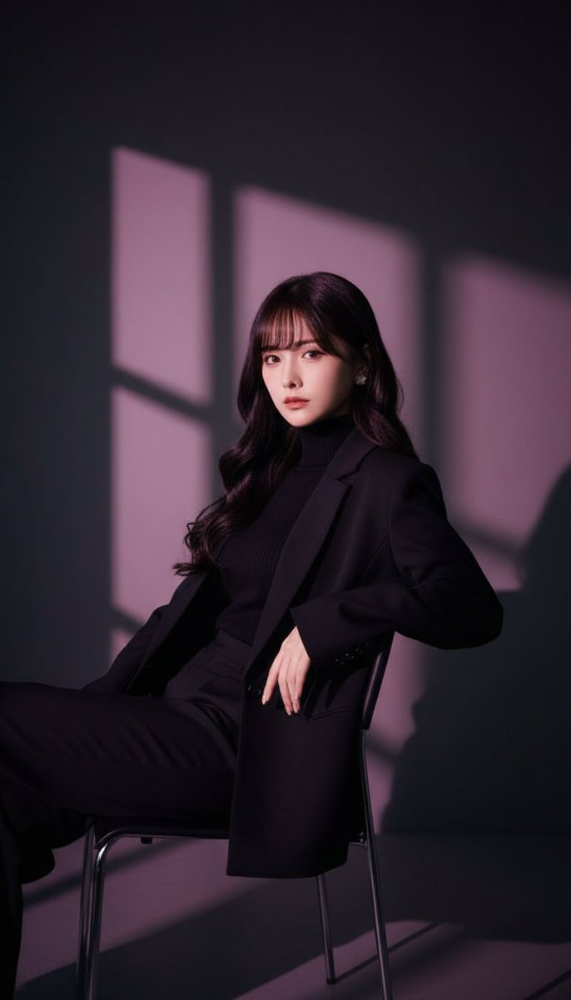
</div>

**中文提示词：**
```
一位年轻女性的时尚、电影肖像，她坐在一张现代椅子上，在室内。她以 3/4 视角构图，身体微微向后倾斜，一只手臂随意地搭在椅子上，散发出平静而自信的氛围。这位女士拥有一张瓜子脸，线条分明的下颌，发型与参考图片完全一致。她穿着一套时尚的全黑服装，包括深色高领毛衣和结构感强的西装外套，展现出高端时尚的编辑造型。
背景是一堵光滑的深色墙壁，窗户投射出引人注目的几何光影图案，散发出柔和的粉紫色光芒，与阴影形成鲜明对比。彩色的光线落在墙壁上，并 subtly 照亮她的头发和肩膀边缘，增强了戏剧性的氛围。整体照明 moody 而艺术，具有柔和的阴影和电影般的对比度。色彩分级强调深黑色、柔和的肤色和鲜艳的粉色高光，营造出杂志封面般的审美效果。
主体略微偏离中心。最终图像中不应出现任何文字、徽标或水印。
```

<a id="prompt-366"></a>
## 案例 366：一张富有电影感的年轻女子侧脸肖像 (来源 [@hellokaton](https://x.com/hellokaton/status/1980121865248297389))

<div style="display: flex; justify-content: space-between;">
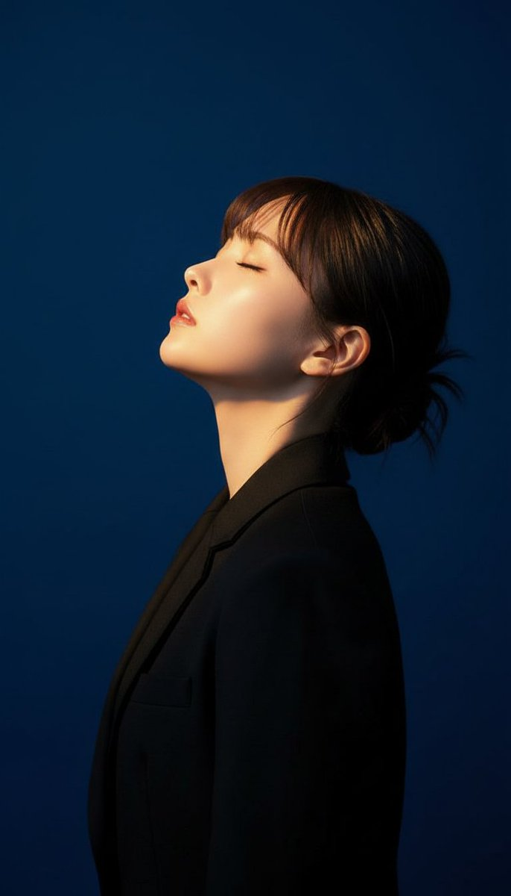
</div>

**中文提示词：**
```
一张富有电影感的年轻女子侧脸肖像，她仰着头，闭着眼睛，沐浴在戏剧性的光线中。
她站在深蓝色的背景前，穿着一件黑色西装外套。一束暖色聚光灯从右上角照下，在她的脸部和颈部投下橙色的光晕，在冷蓝色的阴影和温暖的高光之间形成了强烈的对比。
整个构图强调情绪和氛围，拥有干净的影棚灯光、柔和的渐变和极简主义的氛围。图像应具有艺术感、现代感和强烈的视觉冲击力，类似于高端杂志的编辑摄影风格。
相机角度： 侧面拍摄，微仰角
光线： 戏剧性的影棚布光，强对比度，蓝色背光 + 暖色聚光灯
镜头： 85毫米人像镜头，浅景深
氛围： 情绪化，电影感，极简主义
```

<a id="prompt-365"></a>
## 案例 365：一张戏剧性的黑白工作室肖像照 (来源 [@hellokaton](https://x.com/hellokaton/status/1980121853474791580))

<div style="display: flex; justify-content: space-between;">
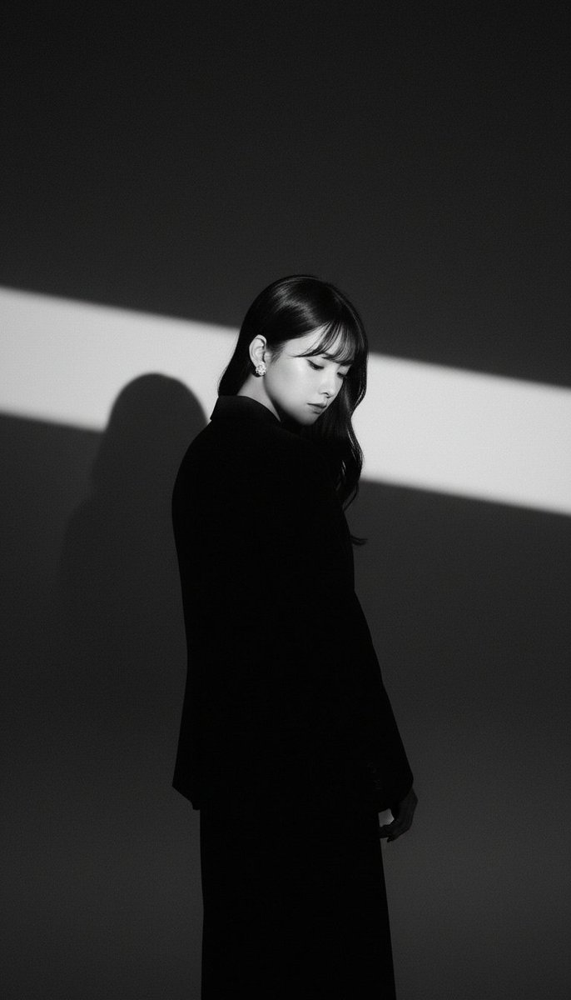
</div>

**中文提示词：**
```
一张戏剧性的黑白工作室肖像照。主体背对镜头站立，上半身轻微转向侧面，头微微低下，脸部侧面轮廓部分可见。表情平静而内省，营造出一种安静、神秘的氛围。

灯光：一盏强烈的侧光，投下鲜明的对比。一束干净的水平光束横切过背景墙。画面大部分处于阴影之中，着重强调剪影和轮廓。
氛围：极简主义，情绪化，电影感，唤起优雅与孤独感。主体身穿深色夹克，与阴影融为一体，呈现出流畅利落的时尚杂志风格。
构图：使用全画幅相机拍摄，85mm镜头，f/1.8大光圈营造浅景深效果，ISO 200，快门速度1/125秒。中景构图（从腰部到头部），突出剪影、侧脸和姿态。
后期：高对比度的黑白效果，柔和的色调渐变，深邃的阴影，添加轻微的胶片颗粒以增加质感，最终呈现精致的艺术杂志风格。
```

<a id="prompt-364"></a>
## 案例 364：粉色吊带背心女生比心 (来源 [@IamEmily2050](https://x.com/IamEmily2050/status/1980462057272275105))

<div style="display: flex; justify-content: space-between;">

</div>

**提示词：**
```
{
  "scene": {
    "location": "clean studio corner",
    "background": "soft pastel sage seamless, subtle falloff, no clutter"
  },

  "subject": {
    "age": "adult",
    "description": "woman with fair skin, long wavy brown hair with straight bangs, vivid blue eyes",
    "wardrobe": "pink strappy cami with black lace trim, blue plaid skirt",
    "accessories": "delicate necklace, symmetrical pastel hair clips",
    "pose": "full body; gentle S-curve; hip slightly popped; front knee inward; toes pointed; hands frame face in small heart gesture near chin",
    "expression": "kawaii allure: bright eyes with micro-smile and soft pout; slight 8° head tilt toward camera",
    "gaze": "direct to camera",
    "body_notes": "realistic adult proportions; natural skin texture"
  },

  "camera": {
    "sensor": "full_frame",
    "focal_length_mm": 70,
    "aperture_f": 2.2,
    "shutter_s": 0.00625,
    "iso": 200,
    "white_balance_k": 5200,
    "distance_m": 4.0,
    "camera_height_m": 1.05,
    "framing": "entire figure visible with 5% headroom and shoes in frame",
    "focus": "eye_detect_AF on nearest eye"
  },

  "lighting": {
    "key": "large diffused softbox front-left at 45°, close to subject, high-key beauty",
    "fill": "white bounce on camera-right one stop under key",
    "hair": "soft rim from behind to lift hair texture",
    "catchlights": "two circular catchlights at 10 and 2 o'clock",
    "notes": "flicker-free LEDs; even skin luminance; avoid harsh speculars"
  },

  "color_grade": {
    "style": "Ulzzang / kawaii soft-glam",
    "palette": "pastel pinks and sage; neutral skin with peach blush",
    "contrast": "medium-low with crisp micro-contrast on eyes and lips",
    "saturation": "moderate"
  },

  "makeup": {
    "eyes": "subtle winged liner, long lashes, soft brown shadow, gentle aegyo-sal highlight",
    "cheeks": "peach gradient blush",
    "lips": "pink gradient tint with light gloss"
  },

  "postprocess": {
    "retouch": "light frequency separation; maintain pores and flyaway hair",
    "clarity": "selective clarity on irises, lashes, lips",
    "dodge_burn": "micro dodge on eyes and cupid's bow; mild burn on hair shadows",
    "vignette": "very subtle"
  },

  "art_direction": {
    "mood": "cute, playful, alluring yet tasteful",
    "keywords": ["kawaii", "S-curve", "face-framing gesture", "soft glow", "clean studio"]
  },

  "negative_prompts": [
    "nsfw",
    "underage look",
    "text or logos",
    "plastic doll skin",
    "warped hands or extra fingers",
    "deformed limbs",
    "flat lighting",
    "oversharpening halos",
    "cluttered background"
  ]
}
```

**中文提示词：**
```
{
“场景”： {
"location": "干净的工作室角落",
“背景”：“柔和的淡紫色无缝，微妙的衰减，没有混乱”
}，

“主题”： {
"年龄": "成人",
"description": "皮肤白皙，长长的棕色波浪发，直刘海，鲜艳的蓝眼睛，
"wardrobe": "粉色吊带背心，黑色蕾丝边，蓝色格子裙",
"accessories": "精致的项链，对称的淡色发夹",
"pose": "全身；柔和的 S 形曲线；臀部微微外展；前膝向内；脚趾绷直；双手在下巴附近做出小心心的手势，
"expression": "卡哇伊魅力：明亮的眼睛，微微微笑，轻轻噘嘴；头部略微向镜头倾斜 8°"
"gaze": "直视相机",
"body_notes": "逼真的成人比例；自然的皮肤纹理"
}，

“相机”： {
“传感器”：“全帧”，
"焦距毫米": 70,
"aperture_f": 2.2,
“shutter_s”：0.00625，
“iso”：200，
"白平衡k": 5200,
“距离米”：4.0，
"相机高度米": 1.05,
"framing": "整个人物可见，5% 的头部空间和鞋子在框架内",
“focus”：“eye_detect_AF 在最近的眼睛上”
}，

“灯光”： {
"key": "大型漫射柔光箱位于左前方 45° 处，靠近拍摄对象，呈现高调美感",
"fill": "白色在相机上弹跳-右键下停一站",
"hair": "从后面添加柔软边缘，提升头发质感",
"catchlights": "两个圆形的眼神光分别位于 10 点和 2 点位置",
“注释”：“无闪烁 LED；均匀的皮肤亮度；避免刺眼的镜面反射”
}，

“颜色等级”：{
"style": "Ulzzang / 可爱柔和魅力",
"palette": "淡粉色和鼠尾草色；中性肤色，搭配桃色腮红",
“对比度”：“中低，眼睛和嘴唇有清晰的微对比度”，
“饱和度”：“中等”
}，

“化妆品”： {
"eyes": "细腻的翼状眼线，纤长的睫毛，柔和的棕色眼影，柔和的撒娇高光",
"cheeks": "桃色渐变腮红",
“嘴唇”：“粉色渐变色调，带有淡淡的光泽”
}，

“后处理”：{
"retouch": "光频分离；维持毛孔和飞散的头发",
"clarity": "虹膜、睫毛、嘴唇的选择性清晰度",
"dodge_burn": "对眼睛和丘比特之弓进行微减淡；对头发阴影进行轻度加深",
“vignette”：“非常微妙”
}，

“艺术指导”：{
"mood": "可爱、俏皮、迷人又有品位",
"keywords": ["kawaii", "S-curve", "face-framement gesture", "soft glow", "clean studio"]
}，

"negative_prompts": [
“nsfw”，
“未成年的样子”，
“文字或徽标”，
“塑料娃娃皮肤”，
“弯曲的手或多余的手指”，
“畸形肢体”，
“平面照明”，
“过度锐化光晕”，
“杂乱的背景”
]
}
```

<a id="prompt-363"></a>
## 案例 363：品牌创意3D广告 (来源 [@aziz4ai](https://x.com/aziz4ai/status/1979813700883366110))

<div style="display: flex; justify-content: space-between;">

</div>

**提示词：**
```
Creative 3D ad for [Brand Name], with surreal object made from it, matching background color, real slogan below, logo on top, miniature person interacting, minimal and clever concept
```

**中文提示词：**
```
为 [品牌名称] 制作的创意 3D 广告，由超现实的物体制成，背景颜色匹配，下面是真实的口号，上面是徽标，微型人物互动，简约而巧妙的概念
```

<a id="prompt-362"></a>
## 案例 362：自信优雅的黑色西装女士 (来源 [@saniaspeaks_](https://x.com/saniaspeaks_/status/1980821497284554960))

<div style="display: flex; justify-content: space-between;">

</div>

**提示词：**
```
A beautiful, confident woman wearing a black suit sits elegantly on a luxurious white chair that highlights her slim, graceful figure. Her right hand rests gently beneath her chin, with her chin slightly raised in a pose of self-assurance. Her head tilts subtly to the right, eyes steady and looking forward with confidence. Her facial features glow under high-quality cinematic lighting, enhancing her natural beauty. The background is pure white, featuring a rare art painting and soft, cinematic illumination. Beside the chair stands a unique white table topped with a black coffee cup and a stylish lamp decor, creating a refined and elegant atmosphere.
```

**中文提示词：**
```
一位美丽自信的女士身着黑色西装，优雅地坐在奢华的白色椅子上，衬托出她窈窕的身姿。她的右手轻抚下巴，下巴微微上扬，展现出自信的姿态。她的头微微向右倾斜，目光坚定，充满自信地向前看去。在高品质的电影级灯光下，她的五官更加光彩夺目，更显自然之美。纯白的背景，点缀着一幅罕见的艺术画作，柔和的电影级灯光营造出一种别致的氛围。椅子旁边摆放着一张独特的白色桌子，桌上摆放着黑色咖啡杯和时尚的灯饰，营造出精致优雅的氛围。
```

<a id="prompt-361"></a>
## 案例 361：毛绒世界 (来源 [@azed_ai](https://x.com/azed_ai/status/1980664924918727038))

<div style="display: flex; justify-content: space-between;">


</div>

**提示词：**
```
A soft and plush 3D model of a [subject] with a [key detail], rendered in a cute, stylized aesthetic. The texture appears velvety, squeezable, and toy-like, emphasizing the charm of animated [object type] designs. Clean background, centered composition, soft ambient lighting, pastel tones, subtle shadows, high-resolution render, front-facing view.
```

**中文提示词：**
```
一个柔软毛绒绒的3D模型，带有一个[关键细节]，以可爱、风格化的美感呈现。纹理柔软，可挤压，像玩具一样，凸显了动画[物体类型]设计的魅力。干净的背景，居中的构图，柔和的环境光，柔和的色调，微妙的阴影，高分辨率渲染，正面视图。
```

<a id="prompt-360"></a>
## 案例 360：时尚女性与熊合影 (来源 [@SimplyAnnisa](https://x.com/SimplyAnnisa/status/1980804390694056368))

<div style="display: flex; justify-content: space-between;">

</div>

**提示词：**
```
Ultra-cinematic shot of a confident, stylish woman in a sleek, dark suit blazer and combat boots, standing with a massive brown bear slightly behind her, with her hand resting on the bear. It's clear that the bear is her protector and loyal, trained companion. Ultra-detailed photo in Russian style. Dramatic, directed lighting, minimal environmental immersion, solid red background. The image exudes boldness, strength, and a feeling of high tension.
```

**中文提示词：**
```
这张极具电影感的照片展现了一位自信时尚的女子，身着时尚的深色西装外套和军靴，站在她身后一头巨大的棕熊旁，她的手放在熊身上。显然，这头熊是她的守护者，也是她训练有素的忠诚伙伴。这张细节丰富的照片展现了俄罗斯风格。戏剧性的定向灯光，极简的环境沉浸感，以及纯红色的背景。这张照片展现了大胆、力量和高度紧张的氛围。
```

<a id="prompt-359"></a>
## 案例 359：红色晚礼服女子 (来源 [@ReemKhan_07](https://x.com/ReemKhan_07/status/1979887420930974163))

<div style="display: flex; justify-content: space-between;">

</div>

**提示词：**
```
​A full-body studio portrait of a beautiful young woman with long, wavy brown hair and the exact facial features as the second image provided, wearing an elegant, sleeveless, floor-length red evening gown. She is wearing a silver pendant necklace and matching silver earrings. The dress is a smooth, form-fitting fabric and she is wearing silver high, slim-heeled pumps. She is standing in a luxurious, modern penthouse setting with a dark wood floor and large floor-to-ceiling windows overlooking a city skyline at twilight. Her pose is poised and confident, with her hands clasped lightly in front of her. The lighting is soft and dramatic.
```

**中文提示词：**
```
这是一张工作室拍摄的全身肖像，描绘的是一位美丽的年轻女子，她有着一头长长的棕色波浪卷发，五官与第二张照片一模一样，身着优雅的无袖及地红色晚礼服。她佩戴着一条银色吊坠项链和与之相配的银色耳环。裙子面料光滑贴身，脚穿银色细高跟鞋。她站在一间奢华现代的顶层公寓里，深色木地板和宽大的落地窗俯瞰着暮色中的城市天际线。她姿态泰然自若，充满自信，双手轻轻握在身前。灯光柔和而富有戏剧性。
```

<a id="prompt-358"></a>
## 案例 358：卧室镜子自拍 (来源 [@IamEmily2050](https://x.com/IamEmily2050/status/1981124366411895079))

<div style="display: flex; justify-content: space-between;">

</div>

**提示词：**
```
{
  "scene": {
    "description": "Indoor mirror selfie in a contemporary bedroom or dressing area.",
    "lighting": "Soft, warm ambient interior lighting, flattering and even.",
    "environment": "Neutral background, slightly blurred, suggesting closet doors or plain walls."
  },
  "subject": {
    "demographics": {
      "ethnicity": "Korean (East Asian)",
      "apparent_age": "20-23",
      "build": "Very slender, 'S-line' figure with a notably tiny waist ('ant waist') and defined, toned abs."
    },
    "facial_aesthetics": {
      "style_keywords": ["Ulzzang (얼짱) aesthetic", "Casual beauty", "Doll-like features", "Youthful and confident"],
      "face_shape": "Small face with a coveted V-line jaw.",
      "eyes": "Large, bright 'Doe eyes'. Prominent Aegyo-sal. Soft, natural eyeliner.",
      "skin": "Flawless 'Glass skin', pale complexion, dewy finish.",
      "lips": "Plump cherry lips, soft pink gradient tint.",
      "hair": {
        "color": "Warm medium brown",
        "style": "Long, gentle waves",
        "bangs": "Airy, 'see-through' bangs (Korean style) framing the forehead."
      }
    },
    "pose": {
      "type": "Standing mirror selfie.",
      "action": "Subject is confidently lifting the hem of her sweater with both hands to expose her toned midriff.",
      "expression": "Soft, pleasant expression, subtle smile, eyes focused on the phone screen.",
      "framing": "Medium shot (hips to head)."
    },
    "wardrobe": {
      "top": {
        "garment": "Cropped cable-knit sweater",
        "color": "Cream / Ivory white",
        "details": "Distinctive hybrid design with sheer, voluminous organza ruffles on the sleeves and cuffs."
      },
      "bottom": {
        "garment": "Blue jeans",
        "fit": "Low-rise, relaxed fit.",
        "details": "Light-to-medium wash denim, worn unbuttoned and slightly pulled down at the hips."
      }
    },
    "accessories": {
      "phone": "Dark gray smartphone held in the hand, rear camera visible in the mirror."
    }
  },
  "camera_technical": {
    "device": "Smartphone rear camera via mirror",
    "look": "Clean, high-quality mobile photography, vertical orientation (3:4).",
    "focus": "Sharp focus on the subject's face and torso."
  }
}
```

**中文提示词：**
```
{
“场景”： {
"description": "在现代卧室或更衣区进行室内镜子自拍。",
"lighting": "柔和、温暖的室内环境照明，令人赏心悦目且均匀。",
"environment": "中性背景，略微模糊，类似于壁橱门或普通墙壁。"
}，
“主题”： {
“人口统计”：{
"ethnicity": "韩国人（东亚）",
"apparent_age": "20-23",
“身材”：非常苗条，‘S 型’身材，腰部明显纤细（“蚂蚁腰”），腹肌清晰紧实。
}，
“面部美学”：{
"style_keywords": ["Ulzzang (얼짱) 审美", "休闲美", "洋娃娃般的五官", "年轻自信"],
"face_shape": "小脸，拥有令人垂涎的 V 型下巴。",
"eyes": "大而明亮的“小鹿眼”。突出的斜眼妆。柔和自然的眼线。",
"skin": "完美无瑕的‘玻璃肌肤’，白皙的肤色，水润的妆容。",
"lips": "丰满的樱桃唇，柔和的粉色渐变色调。",
“头发”： {
"color": "暖中棕色",
"style": "长而柔和的波浪",
"bangs": "飘逸的‘透视’刘海（韩式）修饰额头。"
}
}，
“姿势”：{
"type": "站立镜子自拍。",
"action": "对象自信地用双手撩起毛衣下摆，露出紧致的腹部。",
"expression": "柔和、愉快的表情，淡淡的微笑，眼睛专注于手机屏幕。",
"framing": "中景（臀部到头部）。"
}，
“衣柜”： {
“顶部”： {
"garment": "短款绞花针织毛衣",
"color": "奶油色/象牙白色",
“详细信息”：“独特的混合设计，袖子和袖口上有透明、蓬松的欧根纱褶边。”
}，
“底部”： {
"garment": "蓝色牛仔裤",
"fit": "低腰，宽松版型。",
“details”：“轻度至中度水洗牛仔布，未扣纽扣，臀部略微拉低。”
}
}，
“配件”： {
“手机”：“手中拿着深灰色的智能手机，镜子中可以看到后置摄像头。”
}
}，
“相机技术”：{
"device": "通过镜子的智能手机后置摄像头",
"look": "清晰、高品质的手机摄影，垂直方向（3:4）。",
"focus": "清晰地聚焦拍摄对象的脸部和躯干。"
}
}
```

<a id="prompt-357"></a>
## 案例 357：黑白风格肖像照 (来源 [@MANISH1027512](https://x.com/MANISH1027512/status/1980278681927877032))

<div style="display: flex; justify-content: space-between;">

</div>

**提示词：**
```
A captivating black and white close-up portrait of a beautiful young Asian woman with flawless skin, short bob haircut featuring straight blunt bangs framing her forehead, eyes gently closed with long lashes, subtle pouty lips, serene and introspective expression, wearing a form-fitting deep V-neck black ribbed sweater that accentuates her, a delicate thin necklace with a small pendant, dramatic side lighting from the left creating strong shadows and highlights on her face, neck, and shoulders, high contrast chiaroscuro style, minimalist studio background with soft gradient from light to dark, photorealistic, vintage film grain effect, high detail, emotional and mysterious atmosphere.
```

**中文提示词：**
```
一张引人入胜的黑白特写肖像，展现一位美丽的年轻亚洲女性，拥有无瑕的肌肤和齐颈短发，直刘海整齐地框住前额。她双眼轻闭，睫毛纤长，嘴唇微噘，表情宁静而内省。她身穿一件凸显身材的深V领黑色罗纹毛衣，佩戴一条带有小吊坠的精致细项链。戏剧性的侧光从左侧打来，在她脸部、颈部和肩部营造出强烈的阴影与高光，呈现出高对比度的明暗对照画风。背景是简约的摄影棚，带有从明到暗的柔和渐变。画面具有照片级的真实感和复古胶片颗粒效果，细节丰富，营造出一种感性而神秘的氛围。
```

<a id="prompt-356"></a>
## 案例 356：黑白风格肖像照 (来源 [@MANISH1027512](https://x.com/MANISH1027512/status/1980858137788797269))

<div style="display: flex; justify-content: space-between;">

</div>

**提示词：**
```
a woman standing confidently in a minimalist studio, shot from a slightly low angle, half-body portrait, her head tilted slightly down with a calm and enigmatic expression, middle-parted braided pigtails with a few loose strands falling over her face, subtle wet hair texture, wearing a tight black sleeveless dress and black leather gloves, holding a leather belt loosely in front of her body — dramatic single key light from upper right, high contrast, black and white tones, strong rim light accentuating her curves, plain textured wall background, cinematic noir atmosphere, fine art fashion photography, inspired by Helmut Newton and Peter Coulson, shallow depth of field, smooth gradients, elegant and powerful mood
```

**中文提示词：**
```
一位女士自信地站立在极简主义的摄影棚中，从略低的视角拍摄，半身肖像。她的头微微向下倾斜，表情平静而神秘。中分编织的双马尾辫，几缕发丝随意地落在脸庞上，头发带有微妙的湿润质感。她穿着紧身的黑色无袖连衣裙和黑色皮手套，双手松散地在身体前方握着一条皮带。画面采用戏剧性的单一主光源从右上角打下，高对比度，黑白影调，强烈的轮廓光勾勒出她的身体曲线。背景是纯色的纹理墙壁，营造出电影般的黑色电影氛围，如同艺术时尚摄影作品。灵感来源于赫尔穆特·牛顿和彼得·库尔森，景深较浅，光影过渡平滑，整体情绪优雅而充满力量。
```

<a id="prompt-355"></a>
## 案例 355：和漫威角色集体自拍 (来源 [@xmliisu](https://x.com/xmliisu/status/1980161909828526514))

<div style="display: flex; justify-content: space-between;">

</div>

**提示词：**
```
A ultra realistic group selfie, center is the person from the attached image (uploaded image facial details), wearing a fitted black shirt and ripped jeans, holding an iPhone for the selfie. Around are Chris Hemsworth as Thor, Gal Gadot as Wonder Woman, Scarlett Johansson as Black Widow, Mark Ruffalo as Hulk, Henry Cavill as Superman, RDJ in full armor all hugging, smiling, posing casually like close friends. Fun, joyful mood, bright daylight, cinematic quality, natural look, high detail.
```

**中文提示词：**
```
一张超逼真的集体自拍，中间是附件图片中的人物（上传图片的面部细节），他身穿合身的黑色衬衫和破洞牛仔裤，手持 iPhone 自拍。周围是克里斯·海姆斯沃斯饰演的雷神、盖尔·加朵饰演的神奇女侠、斯嘉丽·约翰逊饰演的黑寡妇、马克·鲁法洛饰演的绿巨人、亨利·卡维尔饰演的超人，以及全副武装的 RDJ，他们拥抱在一起，面带微笑，像亲密朋友一样随意摆姿势。充满乐趣、愉悦的心情，明亮的日光，电影级画质，自然的画面，细节丰富
```

<a id="prompt-354"></a>
## 案例 354：超精细逼真的美丽女人肖像 (来源 [@cnyzgkc](https://x.com/cnyzgkc/status/1980469269134733415))

<div style="display: flex; justify-content: space-between;">

</div>

**提示词：**
```
Ultra-detailed, photorealistic portrait of a beautiful woman, high fashion editorial, deep white plunging V-neck lace sequined evening gown, elegant low bun updo, soft studio lighting, light grey background, dramatic shadowplay, hyperrealistic, 8K
```

**中文提示词：**
```
超精细、逼真的美丽女人肖像，高级时装社论，深白色 V 领蕾丝亮片晚礼服，优雅的低发髻，柔和的工作室灯光，浅灰色背景，戏剧性的光影，超现实主义，8K
```

<a id="prompt-353"></a>
## 案例 353：电影感的超现实主义肖像画 (来源 [@SimplyAnnisa](https://x.com/SimplyAnnisa/status/1980503919492272216))

<div style="display: flex; justify-content: space-between;">

</div>

**提示词：**
```
A cinematic, hyper-realistic portrait of 
@simplyannisa
, keeping her real facial features completely unchanged. The woman sits at a wooden table, leaning slightly forward, with her right forearm resting naturally on the surface. Her right hand gently holds a dark ceramic mug with the word “
@simplyannisa
” written on it. Her fingers are slender, relaxed, and slightly curved. Her left arm is bent at the elbow, resting casually on the table. She wears a dark gray, slightly loose long-sleeve Henley top with the top buttons undone, subtly revealing a delicate neckline. Her hair falls naturally around her shoulders, soft waves catching the light. Her gaze is directed to the side, away from the camera, carrying a thoughtful and mysterious expression. The lighting is soft and moody, emphasizing the texture of her hair and face while adding cinematic contrast and emotional depth. The portrait is shot at eye level with an 85mm lens effect and a shallow depth of field, keeping her face and upper body in sharp focus while the background softly blurs. The overall color grading is muted and cinematic, with cool tones, soft shadows, and a minimalist dark background.
```

**中文提示词：**
```
这幅充满电影感的超现实主义肖像画，保留了@simplyannisa的真实面部特征。画中女子坐在木桌旁，身形微微前倾，右臂自然地搭在桌面上。她的右手轻轻地捧着一个深色陶瓷杯，杯上写着“ @simplyannisa ”三个字。她的手指纤细、放松，略带弧度。左臂肘部弯曲，随意地搭在桌上。她身穿一件略显宽松的深灰色长袖亨利衫，最上面的纽扣敞开，隐约露出精致的领口。她的头发自然地披散在肩上，柔和的波浪在光线下闪闪发光。她的目光转向侧面，远离镜头，带着一种若有所思、神秘莫测的表情。柔和的光线营造出一种忧郁的氛围，突出了她头发和面部的质感，同时增添了电影般的对比度和情感深度。这幅肖像画采用85毫米镜头，在视线高度处以浅景深拍摄，使她的脸部和上半身保持清晰对焦，而背景则略微模糊。整体色彩分级柔和且具有电影感，具有冷色调、柔和阴影和简约的深色背景。
```

<a id="prompt-352"></a>
## 案例 352：女人3D数字插画 (来源 [@SimplyAnnisa](https://x.com/SimplyAnnisa/status/1980553716131414281))

<div style="display: flex; justify-content: space-between;">

</div>

**提示词：**
```
A hyper-realistic 3D digital illustration of a woman with her natural facial features, hairstyle, and skin tone unchanged, styled in a Pixar-inspired cinematic look. She is smiling warmly while leaning through a glowing orange rectangular frame, both hands gently holding the edge of the frame. She wears a denim jacket layered over a black top, subtle jewelry, and a smartwatch on her wrist. The lighting is soft yet vibrant, highlighting facial depth, realistic fabric texture, and warm glow reflections on her face and hands. The background is softly blurred, creating a cinematic atmosphere with a perfect blend of realism, warmth, and Pixar-style charm.
```

**中文提示词：**
```
这幅超写实的3D数字插画描绘了一位女性，其自然的五官、发型和肤色均未改变，并采用了皮克斯风格的电影风格。她面带温暖的微笑，身影透过发光的橙色矩形画框倾身而立，双手轻轻握住画框边缘。她身穿牛仔夹克，内搭黑色上衣，佩戴着精致的珠宝，手腕上戴着智能手表。灯光柔和而明亮，凸显了面部深度、逼真的织物纹理以及她脸部和双手上温暖的光芒。背景轻柔地模糊处理，营造出一种电影般的氛围，完美融合了现实主义、温暖感和皮克斯风格的魅力。
```

<a id="prompt-351"></a>
## 案例 351：身穿古代服饰的派大星和海绵宝宝 (来源 [@op7418](https://x.com/op7418/status/1980296606382780794))

<div style="display: flex; justify-content: space-between;">

</div>

**中文提示词：**
```
身上穿着唐朝服饰的一只派大星，自然逼真，北宋时期风格油画暗棕褐色旧版图高清，精细工笔，精细流畅、柔韧有力、充满韵律感。衣纹的勾勒，疏密有致。用色典雅，善于运用对比色，丰富和谐，头戴唐朝帽子
```

<a id="prompt-350"></a>
## 案例 350：中国红自拍照片 (来源 [@xxx](xxxxxx))

<div style="display: flex; justify-content: space-between;">

</div>

**中文提示词：**
```
图片中人物头发两侧别着黄色花朵，右脸颊有红色五角星图案，佩戴金色耳饰与细项链，身着印有白色 “China” 文字的红色 T 恤，红色纯色背景，妆容精致（红唇、自然眼妆），整体风格充满爱国情怀、清新明亮，高清细节。
```

<a id="prompt-349"></a>
## 案例 349：复古小报童 (来源 [@songguoxiansen](https://x.com/songguoxiansen/status/1972570539006013947))

<div style="display: flex; justify-content: space-between;">

</div>

**中文提示词：**
```
保持人物面部五官和姿势不变，生成清新写真：人物穿米色短袖衬衫，下身搭配绿色背带裤，头戴绿色复古报童帽。佩戴红色小领巾，斜挎绿色小挎包，穿白色袜子。背景改为正红色，画面右上方书法英文“Happy Day”，文字融入人物周围，光线柔和均匀。
```


<a id="prompt-348"></a>
## 案例 348：超级马里奥风格照片 (来源 [@songguoxiansen](https://x.com/songguoxiansen/status/1971764229070884990))

<div style="display: flex; justify-content: space-between;">

</div>

**中文提示词：**
```
生成一张图片，人物头戴红色帽子，帽上有白色圆圈加红色 “M” 标志；上身是红色短袖，下身搭配蓝色背带裤，裤上有黄色圆形装饰扣，穿着红色的袜子还原度高，道具丰富多样。
```

<a id="prompt-347"></a>
## 案例 347：人物和宝可梦 (来源 [@songguoxiansen](https://x.com/songguoxiansen/status/1972311003049415030))

<div style="display: flex; justify-content: space-between;">

</div>

**提示词：**
```
Create a hyper-realistic editorial portrait of a person, generated from the provided image (same face 100%, same hairstyle, expression preserved). The subject stands confidently on a reflective glossy floor wearing a coordinated bright yellow and crimson outfit (hooded jacket or sweatshirt and tailored joggers) with lightning bolt-inspired linework and subtle embroidered electric motifs running along sleeves, chest and pant seams. Matching crimson and yellow sneakers complete the look. Beside the subject stands a large Pikachu-like creature, scaled to be equal to or taller than the person, with realistic textured fur and a vibrant palette of electric yellows and deep crimson accents that echo the clothing. Background is a moody electric yellow to deep crimson gradient that enhances the vibrant palette; both subject and creature are clearly reflected on the floor. Lighting uses dramatic warm key light and sculpting rim light to emphasize skin, fur and fabric detail, cinematic shallow depth of field, slight film grain for editorial grit, photoreal creature integration, ultra-detailed 8K quality.
```

**中文提示词：**
```
创造一张超现实的编辑肖像，人物形象基于提供的图像（面部100%相同，发型和表情保持不变）。主体自信地站立在反光的亮面地板上，身穿一套协调的亮黄色和深红色服装（连帽夹克或运动衫和修身慢跑裤），服装上饰有闪电状的线条设计和沿袖子、胸部和裤缝延伸的精致刺绣电气图案。搭配的深红色和黄色运动鞋完善了整体造型。主体旁边站立着一只大型皮卡丘状生物，其大小与人物相等或更高，拥有逼真的毛发纹理和鲜艳的电黄色及深红色点缀，与服装相呼应。背景是 moody 的电黄色到深红色的渐变，以增强鲜明的调色。主体和生物都清晰地反映在地面上。灯光采用戏剧性的暖色主光和造型轮廓光，以突出皮肤、毛发和织物的细节，电影般的浅景深，略带胶片颗粒以增加编辑质感，逼真的生物融合，超细节的8K画质。
```

<a id="prompt-346"></a>
## 案例 346：人物和大型耿鬼 (来源 [@songguoxiansen](https://x.com/songguoxiansen/status/1972307026714972370))

<div style="display: flex; justify-content: space-between;">

</div>

**提示词：**
```
Hyper-realistic editorial portrait of a person, generated from the provided image (same face 100%, same hairstyle, expression preserved). The subject stands confidently on a reflective glossy floor wearing a coordinated deep purple and shadowy black outfit (hooded jacket or sweatshirt and tailored joggers) with ghostly wisp-inspired linework and subtle embroidered mischievous smile motifs running along sleeves, chest and pant seams. Matching crimson red and deep purple sneakers complete the look. Beside the subject stands a large Gengar, scaled to be equal to or taller than the person, with a realistic smooth, almost ethereal texture, and a vibrant palette of deep purples with glowing crimson red eyes that echo the clothing. Background is a moody deep purple to shadowy black gradient that enhances the vibrant palette; both subject and creature are clearly reflected on the floor. Lighting uses dramatic cool key light and sculpting rim light to emphasize skin, form and fabric detail, cinematic shallow depth of field, slight film grain for editorial grit, photoreal creature integration, ultra-detailed 8K quality.
```

**中文提示词：**
```
根据提供的图像生成的超现实主义人物肖像（100% 相同脸型、相同发型、保留表情）。人物自信地站在反光的光滑地板上，身着协调的深紫色和暗黑色服装（连帽夹克或运动衫和定制慢跑裤），带有幽灵般的缕缕线条，袖子、胸部和裤缝处绣有精致的顽皮笑脸图案。搭配的深红色和深紫色运动鞋使整个造型更加完美。人物旁边站着一只大型耿鬼，其比例与人物相等或更高，具有逼真的光滑、近乎空灵的纹理，以及鲜艳的深紫色调，闪闪发光的深红色眼睛与衣服相呼应。背景是从深紫色到暗黑色的渐变色，增强了鲜艳的色调；人物和生物都清晰地倒映在地板上。灯光采用戏剧性的冷色调主光和雕刻轮廓光来强调皮肤、形态和织物细节、电影浅景深、轻微的胶片颗粒感以增强编辑质感、逼真的生物融合以及超精细的 8K 质量。
```


<a id="prompt-345"></a>
## 案例 345：你抱着幼年版自己的复古风自拍 (来源 [@songguoxiansen](https://x.com/songguoxiansen/status/1971394542298440073))

<div style="display: flex; justify-content: space-between;">

</div>

**提示词：**
```
retro selfies of you holding a baby version of you
```

**中文提示词：**
```
你抱着幼年版自己的复古风自拍
```


<a id="prompt-344"></a>
## 案例 344：中秋月下秋千照片 (来源 [@songguoxiansen](https://x.com/songguoxiansen/status/1975198365932769599))

<div style="display: flex; justify-content: space-between;">

</div>

**中文提示词：**
```
中秋月下秋千照片
```

<a id="prompt-343"></a>
## 案例 343：超写实影棚肖像照 (来源 [@cheerselflin](https://x.com/cheerselflin/status/1979569018928603432))

<div style="display: flex; justify-content: space-between;">

</div>

**中文提示词：**
```
超写实影棚肖像，一位男性优雅地斜倚在椅子靠背上，身着时尚的深色服装。以微妙的低角度拍摄，以突出他的面部特征和自信的表情。电影般的黑白调色，肤色自然精致。纯黑色背景，8K 锐利细节，突出服装、头发和眼睛的纹理，营造出戏剧性、栩栩如生的效果。
```

<a id="prompt-342"></a>
## 案例 342：一位坐地铁的女性 (来源 [@cheerselflin](https://x.com/cheerselflin/status/1979203307873931360))

<div style="display: flex; justify-content: space-between;">

</div>

**提示词：**
```
a young beautiful Japanese woman with porcelain skin, soft makeup and bright red lips, straight chestnut-brown hair neatly tied in a ponytail with straight bangs framing her face, wearing a fitted light-blue police uniform shirt with gold buttons and badge, a dark green flat ribbon tie knotted at the collar with two short tails hanging down like a gift bow, navy skirt, dark belt with brass buckle, white gloves, black shoes, sitting with her knees together and hands gently folded over a glass, calm and elegant posture, oxygen-fresh natural makeup look with translucent dewy base, barely-there eyeliner, soft straight brows, faint rosy blush on the cheeks, subtle inner-corner highlight that makes her eyes look bright and airy, lips a clean vivid red yet not glossy, her pose delicate and composed: seated on a narrow wooden bench in a cramped booth, ankles tucked slightly back, torso subtly leaning forward from the hips, forearms relaxed, gloved hands overlapping lightly above the small tumbler placed between her knees, chin slightly lowered while gazing directly at the camera, flanked by two older Japanese policemen in uniform on each side, the man on the left leaning inward from the doorway, cap slightly tilted, short-sleeve standard police shirt, one elbow resting on his knee with the hand hanging loosely, attentive and calm expression; the man on the right wearing a striped short-sleeve shirt with a dark tie and badge, cap set square with a gold band, arms firmly crossed over his chest, body angled toward the woman, a reserved, thoughtful look, inside a small dimly-lit bar filled with vintage Japanese posters, old bottles, narrow wooden walls, cluttered shelves, detailed physical environment: shot from the doorway so the worn wooden jambs create a frame-within-frame; scuffed varnished beams, handwritten Japanese slips and price tags pinned among utensils, cords and trinkets hanging overhead, glassware and liquor bottles stacked tight on shallow shelves, a tiny aisle underfoot, faint reflections on lacquered wood, humid air; one or two bare incandescent bulbs casting a localized amber pool of light that fades rapidly into darkness, camera perspective and ratio: intimate eye-level viewpoint at close conversational distance (about 1-1.5 m), classic 35mm focal feel, vertical portrait framing with a 3:4 aspect, slight center-weighted composition emphasizing the trio in a tight booth, warm incandescent lighting with nostalgic amber tone, low saturation colors, fine 35mm film grain texture, slightly overexposed highlights, retro 1980s analog snapshot aesthetic, candid composition, shallow depth of field, cinematic color grading, in the style of Nobuyoshi Araki and Daido Moriyama street photography
```

**中文提示词：**
```
一位年轻美丽的日本女性，有着瓷器般的肌肤、柔和的妆容和鲜红的嘴唇，栗色的直发扎成马尾辫，齐刘海修饰着她的脸型，身穿一件合身的浅蓝色警服衬衫，上面有金色的纽扣和徽章，一条深绿色的扁平丝带领带在领口处打结，两条短尾巴像礼物蝴蝶结一样垂下来，海军蓝裙子，深色腰带配黄铜扣，白手套，黑色鞋子，双膝并拢坐着，双手轻轻地交叉放在玻璃杯上，姿态平静而优雅，氧气清新的自然妆容搭配半透明的露珠底妆，几乎看不见的眼线，柔软的直眉，脸颊上淡淡的玫瑰色腮红，微妙的内眼角高光使她的眼睛看起来明亮而通透，嘴唇是干净的鲜红色，但不油腻，她的姿势精致而沉稳：坐在狭窄的卡座中的一张狭窄的木凳上，脚踝略微向后弯曲，躯干从臀部微微向前倾斜，前臂放松，戴着手套的双手轻轻地重叠在小玻璃杯放在两膝之间，下巴微微低垂，直视镜头，两侧各站着两名年纪稍长的穿制服的日本警察，左边的男子从门口探出身子，帽子微微倾斜，穿着短袖制式警服，一肘撑在膝盖上，手随意地垂着，表情专注而平静；右边的男子穿着条纹短袖衬衫，系着深色领带和警徽，帽子镶着金边，双臂紧紧地交叉在胸前，身体朝着女人倾斜，一副矜持、若有所思的样子，身处一间灯光昏暗的小酒吧里，里面摆满了老式的日本海报、旧酒瓶、狭窄的木墙、杂乱的架子，细致的物理环境：从门口拍摄，磨损的木门框形成了框中框；磨损的漆面横梁，手写的日文单据和价格标签夹在餐具之间，电线和小饰品悬挂在头顶，玻璃器皿和酒瓶紧紧地堆放在浅浅的架子上，脚下是一条小过道，漆木上反射着微弱的光线，空气潮湿；一两个裸露的白炽灯泡投射出局部琥珀色的光晕，迅速消失在黑暗中，相机视角和比例：近距离交谈（约 1-1.5 米）的亲密视线视角，经典的 35 毫米焦距感，3：4 宽高的垂直人像取景，轻微的中央重点构图强调了紧凑展位中的三人组，温暖的白炽灯光带有怀旧的琥珀色调，低饱和度色彩，细腻的 35 毫米胶片颗粒纹理，略微过度曝光的高光，复古的 1980 年代模拟快照美学，坦率的构图，浅景深，电影调色，荒木经惟和森山大道的街头摄影风格
```

<a id="prompt-341"></a>
## 案例 341：东京地铁楼梯间美女照 (来源 [@cheerselflin](https://x.com/cheerselflin/status/1979203277553307820))

<div style="display: flex; justify-content: space-between;">

</div>

**提示词：**
```
A blurry, high-grain snapshot taken in a Tokyo subway stairwell, charged with motion, humidity, and raw urban energy. The air feels thick and fluorescent, lit by overhead tube lights that cast a cold green-blue tint across the frame. The film grain, chromatic aberration, and lens distortion add a tactile sense of chaos — a fleeting instant suspended mid-run.

At the center, a young woman in a tied white shirt and short plaid skirt is caught mid-step, descending the stairs. Her movement blurs, skirt flaring slightly, hair swept by motion. The focus drifts between her and the background, giving the shot a dreamlike disorientation, as if seen through memory or adrenaline.

Her expression holds the entire frame together — eyes open, lips slightly parted, cheeks flushed, as if between alertness and vulnerability. There’s no posed awareness, only instinct — a moment stolen from time.

Around her, commuters blur into silhouettes, the hallway tight and echoing, the walls reflecting harsh fluorescent glare. The composition feels accidental yet perfect: tilted, urgent, intimate.

The atmosphere is electric and nostalgic, a mix of youth, motion, and fleeting emotion, like a fragment from a fever dream or an afterimage burned into film — not cinematic, but hyper-real, the kind of moment only disposable-camera photography captures: alive, imperfect, and painfully real.
```

**中文提示词：**
```
这是一张模糊的高颗粒快照，拍摄于东京地铁楼梯间，充满了运动、潮湿和原始的城市能量。空气感觉浓重而荧光，头顶的筒灯在画面上投射出冰冷的蓝绿色调。胶片颗粒、色差和镜头畸变增添了一种触觉上的混乱感——仿佛瞬间静止在运行中。
照片中央，一位身着系带白衬衫和格子短裙的年轻女子正迈着轻快的步伐走下楼梯。她的动作模糊不清，裙摆微微扬起，头发随风飘动。焦点在她和背景之间游移，让这张照片呈现出一种如梦似幻的迷离感，仿佛透过记忆或肾上腺素的刺激而呈现。
她的表情与整个画面融为一体——双眼睁开，嘴唇微张，脸颊泛红，仿佛介于警觉与脆弱之间。没有故作姿态的警觉，只有本能——一个从时间中偷来的瞬间。
在她周围，通勤者的身影模糊不清，走廊狭窄而回声不断，墙壁反射着刺眼的荧光灯。这构图看似偶然，却又完美：倾斜、急促、亲密。
氛围充满活力和怀旧，混合着青春、运动和转瞬即逝的情感，就像发烧梦境中的片段或刻在胶片上的残像——不是电影般的，而是超现实的，只有一次性相机摄影才能捕捉到的那种瞬间：鲜活、不完美、痛苦的真实。
```
<a id="prompt-340"></a>
## 案例 340：居酒屋里用闪光灯拍摄的美女照片 (来源 [@cheerselflin](https://x.com/cheerselflin/status/1979203220061982872))

<div style="display: flex; justify-content: space-between;">

</div>

**提示词：**
```
A flash snapshot taken in a small, crowded Japanese izakaya, filled with handwritten menus, old posters, and wooden textures. The lighting is from a direct on-camera flash, producing bright highlights, harsh shadows, and a slightly grainy texture that enhances the candid feeling.

The main subject is a young woman sitting on a wooden bar stool, turning her body slightly and looking back over her shoulder toward the camera. She wears a white button-up shirt and a short high-waisted checkered skirt, revealing her legs and adding to the youthful, casual tone of the scene.

Her face is softly lit by the flash — cheeks vividly blushed, red lips glossy, and eyes meeting the lens with a subtle, playful yet intimate expression. The smile is gentle but suggestive, carrying a slight sense of awareness and warmth. Her posture and gaze create a delicate tension between confidence and softness.

The background is dim and crowded with older patrons in dark clothes, contrasting with her bright presence. The composition is tight and spontaneous, typical of 90s Japanese disposable camera photography — high flash contrast, slight blur, and natural imperfection.

The overall mood is nostalgic, warm, and faintly ambiguous — capturing a moment that feels real, close, and emotionally charged, like a personal memory illuminated by flash rather than a staged portrait.
```

**中文提示词：**
```
这是一张在狭小拥挤的日式居酒屋里用闪光灯拍摄的照片，屋里摆满了手写菜单、老海报和木质纹理。光线来自机顶闪光灯的直射，营造出明亮的高光、刺眼的阴影和略带颗粒感的纹理，增强了照片的自然感。
画面主体是一位年轻女子坐在酒吧木凳上，微微侧身，目光越过肩膀，望向镜头。她身穿白色纽扣衬衫和高腰格纹短裙，露出双腿，为画面增添了一抹青春随意的气息。
闪光灯柔和地照亮了她的脸庞——双颊绯红，红唇闪耀光泽，目光与镜头交汇，眼神微妙、俏皮却又充满亲密感。她的笑容温柔却又充满暗示，透着一丝警觉与温暖。她的姿态和目光在自信与柔和之间营造出一种微妙的张力。
背景昏暗，挤满了身着深色衣服的老年顾客，与她明亮的身影形成鲜明对比。构图紧凑自然，是90年代日本一次性相机摄影的典型特征——高闪光对比度、轻微的模糊和自然的瑕疵。
整体氛围怀旧、温暖，略带一丝暧昧——捕捉真实、亲近、充满情感的瞬间，就像闪光灯照亮的个人记忆，而不是摆拍的肖像。
```

<a id="prompt-339"></a>
## 案例 339：百褶迷你裙美女 (来源 [@cheerselflin](https://x.com/cheerselflin/status/1979203321262149903))

<div style="display: flex; justify-content: space-between;">

</div>

**提示词：**
```
The image features a subject with long, dark hair, dressed in a short-sleeved, cropped white top and a high-waisted, pleated blue mini skirt that ends well above mid-thigh, fitting snugly to accentuate the figure. The subject is captured in a slightly turned pose, leaning forward with one hand resting on a wall covered in a dense collage of overlapping posters, flyers, and advertisements in various colors such as red, yellow, blue, and white, with text in multiple languages, suggesting an urban or vintage environment. The wall appears worn, with visible creases and minor damage, adding to the nostalgic ambiance. The subject's facial expression, partially visible from a side angle, conveys a subtle mix of curiosity and playfulness. The lighting is dim with a warm tone, casting soft shadows that enhance the mood. The composition employs a low-angle perspective, drawing attention to the subject's lower body and the skirt's height, with a sharp focus on the subject against a slightly blurred background. The overall mood is provocative yet nostalgic, blending modern attire with a retro aesthetic. Technically, the image exhibits a deliberate soft-focus effect, contributing to a hazy, dreamlike quality that softens details and edges. Additionally, noticeable grain and noise texture are present, enhancing the vintage aesthetic and adding a tactile, gritty feel to the photograph. The resolution remains moderate, typical of digital photography, with a slightly desaturated color profile featuring a vintage filter effect. The aspect ratio is vertical, approximately 4:5, supporting the focused framing of the subject.
```

**中文提示词：**
```
照片中的人物留着一头乌黑的长发，身穿白色短袖上衣和高腰蓝色百褶迷你裙，裙摆长及大腿中部，贴身剪裁，凸显身材。人物略微侧身，身体前倾，一只手扶在墙上，墙上贴满了红、黄、蓝、白等各种颜色的海报、传单和广告，并配有多种语言的文字，营造出一种都市或复古的氛围。墙壁显得有些破旧，有明显的折痕和轻微的损坏，更增添了怀旧的氛围。从侧面看，人物的面部表情部分可见，流露出好奇与俏皮的微妙交织。昏暗的灯光搭配温暖的色调，投射出柔和的阴影，增强了氛围。构图采用低角度透视，将注意力吸引到人物的下半身和裙子的高度，并在略微模糊的背景上清晰地聚焦于人物。整体氛围既挑逗又怀旧，将现代服饰与复古美学融为一体。从技术角度来看，这张照片展现出一种刻意的柔焦效果，营造出朦胧梦幻的质感，柔化了细节和边缘。此外，明显的颗粒感和噪点纹理增强了复古美感，为照片增添了质感和粗糙感。分辨率保持中等水平，符合数码摄影的典型特征，略微降低的色彩饱和度，呈现出复古滤镜效果。画面纵横比约为4:5，有利于主体的聚焦构图。
```

<a id="prompt-338"></a>
## 案例 338：都市上空巨大的涡旋冲破暴风云层 (来源 [@xxx](https://x.com/IamEmily2050/status/1979571282732777698))

<div style="display: flex; justify-content: space-between;">

</div>

**提示词：**
```
A massive spiral vortex tears through storm clouds above a futuristic illuminated city, revealing blue sky beyond a visual metaphor for artificial general intelligence breaking through the turbulence of current limitations to reach clarity beyond human comprehension. 
```

**中文提示词：**
```
在一座灯火璀璨的未来都市上空，巨大的螺旋状涡旋冲破暴风云层，显露出后方的蓝天 —— 这一视觉隐喻象征着通用人工智能突破当前局限的重重阻碍，抵达人类难以理解的清晰境界。
```

<a id="prompt-337"></a>
## 案例 337：低马尾女孩在日式居酒屋 (来源 [@MANISH1027512](https://x.com/MANISH1027512/status/1978672690740310181))

<div style="display: flex; justify-content: space-between;">

</div>

**提示词：**
```
a young beautiful sweet smiling Asian woman with soft brown hair tied loosely in a low ponytail with gentle face-framing bangs, sitting sideways on a narrow wooden bar stool inside a tiny, crowded Japanese izakaya, turning back toward the camera with a gentle natural smile; wearing a white blouse and gray plaid high-waisted shorts; surrounded by middle-aged and elderly Japanese men in dark suits chatting quietly beside her; the bar interior is narrow and dimly lit, walls covered with old handwritten menus and vintage posters, cluttered shelves of bottles, ceramics, and small trinkets; soft warm tungsten lighting with slight haze, smoke lingering in the air, evoking the scent of grilled food and sake; authentic candid moment, intimate social atmosphere, nostalgic Showa-era Japanese nightlife vibe;cozy ambient tungsten lighting, low contrast, muted color palette with subtle green tint, shallow depth of field, film-like softness, slight haze, nostalgic 35mm analog photo, visible fine film grain, authentic Japanese retro bar atmosphere, candid portrait, in the style of Daido Moriyama, Takashi Homma, and Wong Kar Wai, Kodak Portra 400 film aesthetic --ar 3:4 --v 7
```

**中文提示词：**
```
一位年轻美丽、笑容甜美的亚洲女性，一头柔软的棕色头发扎成低马尾，刘海柔和地修饰着脸型，她侧身坐在一间狭小拥挤的日式居酒屋里，坐在一张狭窄的木质吧台凳上，面带温柔自然的微笑；她身穿白色衬衫和灰色格子高腰短裤；她周围是穿着深色西装的中老年日本男子，他们在她旁边轻声聊天；酒吧内部狭窄而昏暗，墙上贴满了古老的手写菜单和复古海报，架子上杂乱地摆满了瓶子、陶瓷和小饰品；柔和温暖的钨丝灯略带薄雾，烟雾在空气中缭绕，散发着烧烤食物和清酒的香味；真实的坦率时刻，亲密的社交氛围，怀旧的昭和时代日本夜生活氛围；舒适的环境钨丝灯，低对比度，柔和的色调，微妙的绿色色调，浅景深，胶片般的柔软度，轻微的雾霾，怀旧的 35 毫米模拟照片，可见的细胶片颗粒，真实的日本复古酒吧氛围，坦率的肖像，森山大道、本间隆和王家卫的风格，柯达 Portra 400 胶片美学 --ar 3:4 --v 7
```

<a id="prompt-336"></a>
## 案例 336：一幅如梦似幻的私密肖像照 (来源 [@MANISH1027512](https://x.com/MANISH1027512/status/1978041705623343437))

<div style="display: flex; justify-content: space-between;">

</div>

**提示词：**
```
a dreamy intimate portrait of a beautiful realistic asian woman lying under a blanket, soft natural light, cozy warm bedroom, cinematic film grain, 35mm film aesthetic, shallow depth of field, soft focus, delicate skin texture, natural makeup, slightly messy hair, Fujifilm Pro 400H look, pastel warm tones, realistic lighting, subtle haze, gentle atmosphere, by Petra Collins and Ren Hang --ar 3:4 --v7 --style raw
```

**中文提示词：**
```
一幅如梦似幻的私密肖像照：一位容貌精致、形象写实的亚裔女性躺在毛毯下，柔和的自然光线洒落，背景是温馨舒适的卧室。画面带有电影感颗粒质感，呈现 35 毫米胶片的美学风格，采用浅景深与柔焦效果，清晰展现细腻的肌肤纹理。人物妆容自然，头发略带凌乱，整体色调为柔和温暖的马卡龙色系，光线真实自然，还带有淡淡的朦胧感，营造出轻柔舒缓的氛围。（由佩特拉・科林斯与任航风格创作） --ar 3:4 --v7 --style raw
```

<a id="prompt-335"></a>
## 案例 335：美丽的浅蓝色警服日本女子 (来源 [@MANISH1027512](https://x.com/MANISH1027512/status/1979033662294241673))

<div style="display: flex; justify-content: space-between;">

</div>

**提示词：**
```
a young beautiful Japanese woman with porcelain skin, soft makeup and bright red lips, straight chestnut-brown hair neatly tied in a ponytail with straight bangs framing her face, wearing a fitted light-blue police uniform shirt with gold buttons and badge, a dark green flat ribbon tie knotted at the collar with two short tails hanging down like a gift bow, navy skirt, dark belt with brass buckle, white gloves, black shoes, 
sitting with her knees together and hands gently folded over a glass, calm and elegant posture, 
oxygen-fresh natural makeup look with translucent dewy base, barely-there eyeliner, soft straight brows, faint rosy blush on the cheeks, subtle inner-corner highlight that makes her eyes look bright and airy, lips a clean vivid red yet not glossy, 
her pose delicate and composed: seated on a narrow wooden bench in a cramped booth, ankles tucked slightly back, torso subtly leaning forward from the hips, forearms relaxed, gloved hands overlapping lightly above the small tumbler placed between her knees, chin slightly lowered while gazing directly at the camera, 
flanked by two older Japanese policemen in uniform on each side, 
the man on the left leaning inward from the doorway, cap slightly tilted, short-sleeve standard police shirt, one elbow resting on his knee with the hand hanging loosely, attentive and calm expression; 
the man on the right wearing a striped short-sleeve shirt with a dark tie and badge, cap set square with a gold band, arms firmly crossed over his chest, body angled toward the woman, a reserved, thoughtful look, 
inside a small dimly-lit bar filled with vintage Japanese posters, old bottles, narrow wooden walls, cluttered shelves, 
detailed physical environment: shot from the doorway so the worn wooden jambs create a frame-within-frame; scuffed varnished beams, handwritten Japanese slips and price tags pinned among utensils, cords and trinkets hanging overhead, glassware and liquor bottles stacked tight on shallow shelves, a tiny aisle underfoot, faint reflections on lacquered wood, humid air; one or two bare incandescent bulbs casting a localized amber pool of light that fades rapidly into darkness, 
camera perspective and ratio: intimate eye-level viewpoint at close conversational distance (about 1–1.5 m), classic 35mm focal feel, vertical portrait framing with a 3:4 aspect, slight center-weighted composition emphasizing the trio in a tight booth, 
warm incandescent lighting with nostalgic amber tone, low saturation colors, fine 35mm film grain texture, slightly overexposed highlights, retro 1980s analog snapshot aesthetic, candid composition, shallow depth of field, cinematic color grading, in the style of Nobuyoshi Araki and Daido Moriyama street photography --ar 3:4 --v 7
```

**中文提示词：**
```
一位年轻美丽的日本女子，有着瓷器般的肌肤、柔和的妆容和鲜红的嘴唇，栗色的直发扎成马尾辫，齐刘海修饰着她的脸型，身穿合身的浅蓝色警服衬衫，上面有金色的纽扣和徽章，深绿色的扁平丝带领带在领口处打结，两条短尾巴像礼物蝴蝶结一样垂下来，海军蓝裙子，深色腰带配黄铜扣，白手套，黑色鞋子，
她双膝并拢，双手轻轻地放在玻璃杯上，姿势平静而优雅，
氧气清新的自然妆容，透明水润的底妆，几乎看不见的眼线，柔软的直眉，脸颊上淡淡的玫瑰色腮红，微妙的内眼角高光使她的眼睛看起来明亮通风，嘴唇是干净鲜红但不油腻，
她的姿势精致而沉稳：坐在狭小隔间的一张窄木凳上，脚踝微微向后弯曲，躯干从臀部微微向前倾斜，前臂放松，戴着手套的双手轻轻重叠放在放在膝盖之间的小玻璃杯上方，下巴微微放低，直视镜头，
两侧各有两名身穿制服的年长日本警察，
左边的男人从门口探身向内，帽子微微倾斜，穿着短袖制式警服，一肘撑在膝盖上，手随意垂着，表情专注而平静；
右边的男人穿着条纹短袖衬衫，系着深色领带，戴着徽章，帽子是方形的，上面有一条金边，双臂紧紧地交叉在胸前，身体朝着女人倾斜，一副内敛、若有所思的样子，
在一个灯光昏暗的小酒吧里，摆满了复古的日本海报、旧瓶子、狭窄的木墙、杂乱的架子，
详细的物理环境：从门口拍摄，磨损的木质门框形成了一个画框；磨损的涂漆横梁、手写的日文单子​​和价格标签夹在餐具之间，电线和小饰品悬挂在头顶，玻璃器皿和酒瓶紧紧地堆放在浅浅的架子上，脚下是一条小过道，漆木上隐约的反光，潮湿的空气；一两个裸露的白炽灯泡投射出局部琥珀色的光晕，迅速消失在黑暗中，
相机视角和比例：近距离对话距离（约 1-1.5 米）的亲密视线视角，经典的 35 毫米焦距感，3：4 比例的垂直人像取景，轻微的中央重点构图，强调紧凑展位中的三人组，
温暖的白炽灯，怀旧的琥珀色调，低饱和度的色彩，细腻的 35 毫米胶片颗粒纹理，略微过度曝光的高光，复古的 1980 年代模拟快照美学，坦率的构图，浅景深，电影色彩分级，风格类似于荒木经惟和森山大道的街头摄影 -ar 3:4 --v 7
```

<a id="prompt-334"></a>
## 案例 334：全身夜景肖像 (来源 [@IamEmily2050](https://x.com/IamEmily2050/status/1966758558483272144))

<div style="display: flex; justify-content: space-between;">

</div>

**提示词：**
```
{
    "description": "A hyper-realistic, 4K, full-body night-time portrait of a 23-year-old Korean woman with clear pale skin and long straight black hair tucked behind one ear.",
    "subject": {
      "age": 23,
      "ethnicity": "Korean",
      "skin_tone": "pale",
      "hair": {
        "colour": "black",
        "style": "long, straight, tucked behind one ear"
      },
      "pose": "standing at a frost-covered bus stop, arms folded against the cold",
      "expression": "70 % quiet annoyance, 30 % amused resignation, as if re-reading a text she regrets sending"
    },
    "outfit": {
      "top_layers": [
        "black blazer",
        "navy sweatshirt",
        "crisp white dress shirt",
        "thin black tie"
      ],
      "bottom": "ultra-short black pleated skirt",
      "legwear": "brand-new white knee-length pelerine socks",
      "footwear": "polished black shoes"
    },
    "environment": {
      "location": "night-time city bus stop",
      "ground": "icy pavement reflecting distant headlights",
      "fog": "dense, occupying the top third of the frame",
      "bus_shelter": {
        "glass": "steamed-up with one finger-drawn smiley that melts faster than the surrounding condensation"
      },
      "lighting": "cool blue-white, high contrast, cinematic"
    },
    "hidden_detail": "reflection in her left shoe: a blurred red double-decker bus that may or may not be arriving",
    "camera": {
      "angle": "low eye-level, full body in frame",
      "lens_simulation": "Phase-One medium-format realism",
      "depth_of_field": "sharp focus on subject, soft bokeh on distant lights"
    },
    "output": {
      "style": "hyper-realistic, cinematic, cool colour grading"
    }
  }
}
```

**中文提示词：**
```
{
"description": "这是一张超现实主义、4K、全身夜景肖像，照片中的一名 23 岁的韩国女性，皮肤白皙，一头长长的直黑发别在耳后。",
“主题”： {
“年龄”：23岁，
“种族”：“韩国人”，
"skin_tone": "苍白",
“头发”： {
“颜色”：“黑色”，
“style”：“长而直，塞在一只耳朵后面”
}，
"pose": "站在结霜的公交车站，双臂交叉抵御寒冷",
“表达”：“70% 是无声的恼怒，30% 是好笑的顺从，就像在重读一条她后悔发过的短信”
}，
“全套服装”： {
"顶层"：[
“黑色西装外套”，
“海军蓝运动衫”，
“清爽的白色正装衬衫”，
“细黑领带”
]，
"bottom": "超短黑色百褶裙",
"legwear": "全新白色及膝长袜",
“footwear”：“抛光黑鞋”
}，
“环境”： {
"location": "夜间城市公交车站",
“ground”：“结冰的路面反射着远处的车灯”，
"雾"："浓密，占据了画面的上三分之一"
"公交车站"：{
“玻璃”：“用手指画的笑脸被蒸腾起来，融化得比周围的冷凝水还快”
}，
“照明”：“冷蓝白色，高对比度，电影感”
}，
"hidden_​​detail": "她左脚鞋子里的倒影：一辆模糊的红色双层巴士，可能快到了，也可能还没到"
“相机”： {
"角度": "低视线，全身在画面中",
"lens_simulation": "Phase-One 中画幅真实感",
"depth_of_field": "清晰对焦主体，柔和远方灯光的散景"
}，
“输出”： {
“风格”：“超现实、电影、酷炫色彩分级”
}
}
}
```

<a id="prompt-333"></a>
## 案例 333：女生坐沙发上 (来源 [@IamEmily2050](https://x.com/IamEmily2050/status/1975554358495654236))

<div style="display: flex; justify-content: space-between;">

</div>

**提示词：**
```
{
  "style": "High-key studio portrait, direct flash aesthetic, East Asian social media style (e.g., Ulzzang, Douyin), stylized beauty retouching.",
  "output": {
    "color_profile": "sRGB",
    "render_intent": "photo"
  },
  "subject": {
    "category": "human",
    "gender_presentation": "female",
    "ethnicity": "East Asian (e.g., Korean, Chinese)",
    "age_bracket": "young_adult",
    "body": {
      "build": "slim",
      "proportions": "natural human anatomy",
      "posture": "relaxed on sofa, seated casually",
      "pose": "seated, legs crossed and tucked close to body",
      "gesture": "Right hand raised, fingers loosely curled, back of fingers/knuckles gently supporting the chin and lower cheek.",
      "head_tilt_deg": 5
    },
    "face": {
      "expression": "Playful, alluring",
      "gaze": "right eye direct to camera",
      "eye_action": "winking with the left eye",
      "skin_tone": "Very pale porcelain (lightened aesthetic)",
      "makeup": "Stylized K-Beauty/Douyin look: flawless matte base, strong pink blush high on cheeks, pink gradient lips, defined brows, light eyeliner, emphasized Aegyo-sal",
      "features": "small beauty mark/mole under the left eye"
    },
    "hair": {
      "length": "long",
      "style": "messy high updo/bun with loose strands and curtain bangs",
      "color": "dark brown"
    },
    "wardrobe": {
      "top": "white fitted cropped camisole",
      "outerwear": "light gray zip hoodie, worn open and slightly slipping off both shoulders",
      "bottom": "white lounge shorts with drawstring",
      "footwear": "barefoot"
    }
  },
  "environment": {
    "location": "studio or minimalist interior",
    "set": "black leather sofa against a plain white or light gray wall",
    "props": "Silver laptop (Apple MacBook, logo visible) placed on the cushion to the subject's right (camera left)"
  },
  "lighting": {
    "key": {
      "source": "strobe/flash",
      "modifier": "Bare reflector or direct flash (hard source)",
      "position": "Near camera axis, slightly camera-right and above eye line",
      "effect": "Crisp, dark, well-defined cast shadows on the wall directly behind subject; strong specular highlights on skin and sofa leather."
    },
    "fill": {
      "type": "minimal/none"
    },
    "ambient": "suppressed",
    "white_balance_K": 5800
  },
  "camera": {
    "system": "Digital Camera",
    "sensor": "full-frame equivalent",
    "lens": {
      "type": "prime",
      "focal_length_mm": 50
    },
    "exposure": {
      "iso": 100,
      "aperture_f": 4.0,
      "metering": "Bright exposure, high-key aesthetic"
    },
    "focus": {
      "target": "near eye (right eye)",
      "depth_of_field": "moderate"
    },
    "framing": {
      "orientation": "vertical",
      "crop": "mid-thigh to head with room above hair",
      "angle": "eye-level",
      "composition": "subject centrally framed"
    }
  },
  "color_grade": {
    "look": "Bright, clean, slightly cool tone",
    "contrast": "High contrast",
    "saturation": "moderate, emphasized pinks"
  },
  "postprocess": {
    "noise_reduction": "high",
    "texture": "Highly smoothed skin, poreless appearance ('porcelain doll' or 'beauty filter' effect)",
    "sharpen": "selective on eyes/lashes",
    "blemish_control": "Complete removal of all blemishes and texture."
  },
  "quality_targets": [
    "accurate limb lengths and joint angles",
    "correct finger count and articulation",
    "realistic fabric tension and folds",
    "accurate winking expression"
  ],
  "negative_prompt": [
    "no altered or exaggerated body proportions",
    "no extra or fused fingers",
    "no realistic skin texture, pores, or blemishes",
    "no text or watermarks (excluding specified logos)",
    "no extreme wide-angle distortion",
    "no NSFW content",
    "no dark/moody lighting",
    "no warm tones"
  ]
}
```

**中文提示词：**
```
{
"style": "高调影棚人像，闪光灯直击美感，东亚社交媒体风格（例如Ulzzang、抖音），风格化美颜修图。",
“输出”： {
"color_profile": "sRGB",
"render_intent": "照片"
}，
“主题”： {
“类别”：“人类”，
"gender_presentation": "女性",
"ethnicity": "东亚人（例如韩国人、中国人）",
"age_bracket": "young_adult",
“身体”： {
"build": "slim",
"比例": "自然人体解剖学",
"posture": "放松地坐在沙发上，随意地坐着",
"pose": "坐着，双腿交叉，身体紧贴身体",
"gesture": "右手举起，手指松散地卷曲，手指背面/指关节轻轻支撑下巴和下脸颊。",
“头部倾斜度”：5
}，
“脸”： {
"expression": "俏皮、诱人",
"gaze": "右眼直视相机",
"eye_action": "用左眼眨眼",
"skin_tone": "非常苍白的瓷器（明亮的美学）",
"makeup": "风格化的韩妆/抖音妆容：完美哑光底妆，脸颊上浓重的粉色腮红，粉色渐变唇妆，清晰的眉毛，淡淡的眼线，强调的撒娇，
"features": "左眼下方有一颗小美人痣"
}，
“头发”： {
"length": "长",
"style": "凌乱的高髻/发髻，散落的发束和窗帘刘海",
“颜色”：“深棕色”
}，
“衣柜”： {
"top": "白色修身短款吊带背心",
“外套”：“浅灰色拉链连帽衫，敞开穿着，双肩略微滑落”，
"bottom": "白色抽绳休闲短裤",
“鞋类”：“赤脚”
}
}，
“环境”： {
"location": "工作室或简约室内",
"set": "黑色皮沙发搭配纯白色或浅灰色墙壁",
"props": "银色笔记本电脑（Apple MacBook，标志可见）放置在拍摄对象右侧的垫子上（相机左侧）"
}，
“灯光”： {
“钥匙”： {
"source": "频闪/闪光",
"modifier": "裸露的反射器或直接闪光（硬源）",
"position": "靠近相机轴，略微位于相机右侧且高于视线",
"effect": "拍摄对象正后方的墙壁上投射出清晰、暗淡、轮廓分明的阴影；皮肤和沙发皮革上出现强烈的镜面高光。"
}，
“充满”： {
“类型”：“最小/无”
}，
“环境”：“抑制”，
“白平衡K”：5800
}，
“相机”： {
"system": "数码相机",
“传感器”：“全画幅等效”，
“镜片”： {
“类型”：“主要”，
“焦距毫米”：50
}，
“接触”： {
"iso": 100,
"aperture_f": 4.0,
“测光”：“明亮的曝光，高调的美感”
}，
“重点”： {
"target": "近眼（右眼）",
"depth_of_field": "中等"
}，
“框架”：{
“方向”：“垂直”，
"crop": "从大腿中部到头部，头发上方有空间",
"角度": "视线水平",
"composition": "主体居中"
}
}，
“颜色等级”：{
"look": "明亮、干净、略带冷色调",
"contrast": "高对比度",
“饱和度”：“中等，强调粉红色”
}，
“后处理”：{
"noise_reduction": "高",
"texture": "肌肤高度光滑，无毛孔外观（‘瓷娃娃’或‘美颜滤镜’效果）",
“锐化”：“选择性地针对眼睛/睫毛”，
"blemish_control": "彻底去除所有瑕疵和纹理。"
}，
"质量目标": [
“准确的肢体长度和关节角度”，
“正确的手指计数和发音”，
“逼真的织物张力和褶皱”，
“精准的眨眼表情”
]，
"negative_prompt": [
“没有改变或夸大身体比例”，
“没有多余的或融合的手指”，
“没有真实的皮肤纹理、毛孔或瑕疵”，
“无文字或水印（指定徽标除外）”，
“没有极端的广角畸变”，
“禁止 NSFW 内容”，
“没有黑暗/忧郁的灯光”，
“没有暖色调”
]
}
```


<a id="prompt-332"></a>
## 案例 332：女生镜子自拍 (来源 [@dotey](https://x.com/dotey/status/1976485558319722711))

<div style="display: flex; justify-content: space-between;">

</div>

**中文提示词：**
```
### **场景**
镜子自拍，御宅族电脑角落，蓝色调

---

### **主体**
* **性别表现**: 女性
* **年龄段**: 25岁左右
* **种族**: 东亚
* **身材**: 苗条，腰线分明；身材比例自然
* **肤色**: 浅中性色调
* **发型**:
    * **长度**: 及腰长发
    * **样式**: 直发，发尾微卷
    * **颜色**: 中等棕色
* **姿势**:
    * **站姿**: 站立，轻微的对立式平衡站姿（contrapposto）
    * **右手**: 手持手机挡住脸（身份被遮挡）
    * **左臂**: 在躯干旁自然下垂
    * **躯干**: 身体轻微后仰；露出腰腹
* **着装**:
    * **上衣**: 浅蓝色短款针织开衫，扣上前两颗纽扣；隐约可见蓝色法式内衣
    * **下装**: 牛仔超短裤，两侧臀部各有一个蓝色缎带蝴蝶结
    * **袜子**: 蓝白横条纹过膝长袜
    * **配饰**: 蓝色可爱吉祥物手机壳

---

### **环境**
* **描述**: 从挂墙镜中看到的卧室电脑角落
* **陈设**:
    * 白色书桌
    * 单显示器，显示着柔和的蓝色壁纸（没有可读的文字）
    * 机械键盘，白色键帽，放在蓝色桌垫上
    * 鼠标，放在小号蓝色鼠标垫上
    * PC主机在右侧，带有蓝色机箱灯效
    * PC主机上或附近有三个动漫手办
    * 墙上贴着一张佛塔海报
    * 猫形台灯，带有蓝色点缀
    * 一杯透明的玻璃水杯
    * 窗边（镜头左侧）有一株高大的绿叶植物
* **颜色替换**: 将所有原先的粉色元素（衣物和房间）替换为蓝色（婴儿蓝 -> 天空蓝/长春花蓝）。

---

### **灯光**
* **光源**: 来自镜头左侧大窗户的日光，透过薄纱窗帘
* **光线质感**: 柔和的漫射光
* **白平衡 (K)**: 5200

---

### **相机**
* **模式**: 智能手机后置摄像头通过镜子拍摄（无肖像/虚化模式）
* **等效焦距 (mm)**: 26
* **距离 (米)**:
    * 主体到镜子: 0.6
    * 相机到镜子: 0.5
* **曝光**:
    * 光圈 (f): 1.8
    * 感光度 (ISO): 100
    * 快门速度 (秒): 0.01
    * 曝光补偿 (EV): -0.3
* **对焦**: 对焦于镜中影像的躯干和短裤
* **景深**: 自然的智能手机景深（深景深）；背景清晰可辨，无人为模糊
* **构图**:
    * **宽高比**: 1:1
    * **裁剪**: 从头顶到大腿中部；画面包含书桌、显示器、PC主机和植物
    * **角度**: 从镜子的视角轻微俯拍
    * **构图备注**: 保持主体居中；为避免广角边缘拉伸，可以站远一些再进行方形裁剪

---

### **负面提示词**
* 任何地方出现粉色/品红色
* 美颜滤镜/磨皮皮肤；没有毛孔的外观
* 夸张或扭曲的人体结构
* NSFW，透视面料，走光
* 商标，品牌名，可读的用户界面文本
* 虚假的人像模式模糊，CGI/插画感
```


<a id="prompt-331"></a>
## 案例 331：走廊上的女性 (来源 [@IamEmily2050](https://x.com/IamEmily2050/status/1974108838929576299))

<div style="display: flex; justify-content: space-between;">

</div>

**提示词：**
```
{
  "scene": {
    "environment": {
      "location_type": "modern gallery hallway",
      "left_wall": "black-and-white optical swirl mural, matte finish",
      "right_wall": "framed monochrome manga panels with sparse Japanese onomatopoeia",
      "floor": "light gray polished tile with 2x2 m matte gray vinyl sheet under subject to kill reflections",
      "depth": "short corridor depth with subtle falloff",
      "clutter": "none"
    },
    "time": "indoors, artificial light",
    "mood": "cool, composed, slightly mysterious",
    "color_palette": "neutral-cool grays, olive top, desaturated denim blues"
  },
  "subject": {
    "type": "human",
    "gender": "female",
    "approx_age": "early 20s",
    "appearance": {
      "skin_tone": "fair-light with neutral undertone",
      "hair": "jet-black, very long, straight, center part; clean specular sheen",
      "face": "oval face, soft makeup, subtle gloss on lips, light eyeliner and mascara",
      "earrings": "large silver hoop earrings"
    },
    "wardrobe": {
      "top": "fitted olive/khaki ribbed tank with small rhinestone cross motifs (check glue before shoot)",
      "bottom": "high-waisted distressed denim shorts with heavy frayed hem and beige repair patches (tape rear hem flat)",
      "footwear": "out_of_frame"
    },
    "pose": {
      "stance": "leans back and slightly left with head resting against mural wall",
      "torso": "relaxed, angled 10–15° to camera",
      "arms_hands": "right arm behind torso/out_of_frame, left arm relaxed by side",
      "expression": "calm, neutral-to-soft gaze past camera",
      "chin": "slightly down; head tilt toward left shoulder"
    }
  },
  "framing_composition": {
    "shot_type": "mid-thigh portrait (three-quarter length)",
    "orientation": "vertical",
    "framing": "subject placed on left third; right third shows manga panels",
    "leading_lines": "doorframe/panel edges vertical; swirl mural adds texture without overpowering subject",
    "background_separation": "subtle; background softly defocused but still readable"
  },
  "camera": {
    "sensor": "full-frame mirrorless",
    "lens": {
      "focal_length_mm": 50,
      "type": "prime",
      "character": "neutral rendering, low distortion"
    },
    "settings": {
      "aperture": "f/3.2",
      "shutter_speed": "1/250",
      "iso": 400,
      "white_balance": "custom grey-card @ 4600 K",
      "focus": "eye-AF + 3-frame focus bracket (±1 cm)",
      "stabilisation": "IBIS on"
    },
    "perspective": "camera at chest level; minimal keystoning; maintain straight verticals"
  },
  "lighting": {
    "key": "broad, soft overhead/ceiling panel light",
    "fill": "60×60 cm white bounce 30 cm below bust line, ~1.3 stops under key",
    "rim": "narrow 1×2 ft strip-light behind subject camera-right, ½ stop over key",
    "quality": "soft, diffuse; no hard shadows",
    "exposure_target": "skin at ~65 IRE; rhinestones clipped < 90 IRE",
    "specular_control": "micro-specular on hair; avoid plastic skin sheen"
  },
  "rendering_intent": {
    "photorealism": "high",
    "texture": "retain fabric weave, denim fray strands, hair strands",
    "background_text_policy": "allow only existing manga panel text; do not invent extra signage or captions"
  },
  "post_processing": {
    "color_grade": "neutral-cool base with gentle contrast curve; slight cyan in shadows, warm bias on skin",
    "tone_curve": "soft S-curve (lift shadows +3, compress highlights -5)",
    "clarity_texture": "clarity -5 on skin via masked adjustment; texture +5 on denim/frayed hem only (separate mask)",
    "noise_reduction": "luma 10, chroma 15",
    "sharpening": "amount 40, radius 0.7, detail 25, masking 60 (protect background)",
    "vignette": "subtle -0.1 EV centre-weighted",
    "geometry": "verticals upright; crop 4:5 with space above head and right-side manga visible",
  }
```

**中文提示词：**
```
{
“场景”： {
“环境”： {
"location_type": "现代画廊走廊",
"left_wall": "黑白光学漩涡壁画，哑光饰面",
"right_wall": "带有稀疏日语拟声词的单色漫画面板",
“地板”：“浅灰色抛光瓷砖，铺有 2x2 米哑光灰色乙烯基板，以消除反射”，
"depth": "短走廊深度，具有微妙的衰减",
“杂乱”：“无”
}，
"time": "室内，人造光",
"mood": "冷静、沉着、略带神秘",
"color_palette": "中性冷灰色、橄榄色上衣、去饱和牛仔蓝"
}，
“主题”： {
“类型”：“人类”，
"性别": "女",
"approx_age": "20 岁出头",
“外貌”： {
"skin_tone": "白皙，中性底色",
“头发”：“乌黑，很长，直，中分；干净的镜面光泽”，
"face": "椭圆脸，淡妆，唇彩淡淡，眼线和睫毛膏淡淡的",
“耳环”：“大号银环耳环”
}，
“衣柜”： {
"top": "修身橄榄色/卡其色罗纹背心，饰有小水钻十字图案（拍摄前请检查胶水）",
"bottom": "高腰破洞牛仔短裤，下摆磨损严重，配有米色修片（后摆用胶带平整粘贴）",
“footwear”：“out_of_frame”
}，
“姿势”：{
"stance": "身体向后稍微向左倾斜，头靠在壁画上",
“躯干”：“放松，与相机呈 10-15° 角”，
"arms_hands": "右臂在躯干后方/超出框架，左臂在身体侧面放松",
“表情”：“平静、中性到柔和的目光穿过镜头”，
“下巴”：“稍微向下；头向左肩倾斜”
}
}，
“framing_composition”：{
"shot_type": "大腿中部肖像（四分之三长度）",
“方向”：“垂直”，
"framing": "主体放置在左边三分之一处；右边三分之一处显示漫画面板",
"leading_lines": "门框/面板边缘垂直；漩涡壁画增添了纹理，但又不会掩盖主题",
"background_separation": "微妙；背景轻微散焦但仍可读"
}，
“相机”： {
“传感器”：“全画幅无反光镜”，
“镜片”： {
"焦距毫米": 50,
“类型”：“主要”，
“character”：“中性渲染，低失真”
}，
“设置”： {
"光圈": "f/3.2",
"shutter_speed": "1/250",
“iso”：400，
"white_balance": "自定义灰卡 @ 4600 K",
"focus": "眼部自动对焦 + 3 帧对焦框 (±1 cm)",
“稳定”：“IBIS开启”
}，
“视角”：“摄像机位于胸部高度；最小梯形失真；保持垂直线”
}，
“灯光”： {
"key": "宽阔、柔和的顶灯/天花板面板灯",
"fill": "60×60 厘米白色反射镜，位于胸围线以下 30 厘米处，主光圈下方约 1.3 档",
"rim": "1×2 英尺窄条形灯位于拍摄对象相机右侧后方，比主光高出 ½ 档",
“质量”：“柔和，漫反射；无硬阴影”，
"exposure_target": "皮肤 ~65 IRE；水钻修剪 < 90 IRE",
"specular_control": "头发上的微镜面；避免塑料皮肤光泽"
}，
“渲染意图”：{
"照片写实主义": "高",
"texture": "保留织物编织、牛仔布磨损线、发丝",
"background_text_policy": "仅允许现有的漫画面板文本；不要发明额外的标志或标题"
}，
“后处理”：{
"color_grade": "中性冷色调，对比度曲线柔和；阴影中略带青色，皮肤上偏暖色",
"tone_curve": "柔和的 S 曲线（提升阴影 +3，压缩高光 -5）",
"clarity_texture": "通过蒙版调整，皮肤的清晰度为 -5；仅牛仔布/磨损下摆的纹理为 +5（单独蒙版）",
"noise_reduction": "亮度 10，色度 15",
"sharpening": "数量 40，半径 0.7，细节 25，遮罩 60（保护背景）",
"vignette": "微妙的 -0.1 EV 中央重点",
"geometry": "垂直竖直；裁剪比例为 4:5，头部上方有空间，右侧漫画可见",
}
```

<a id="prompt-330"></a>
## 案例 330：照片级真实感室内躺姿人像 (来源 [@IamEmily2050](https://x.com/IamEmily2050/status/1976068430798389550))

<div style="display: flex; justify-content: space-between;">

</div>

**提示词：**
```
{
"photorealistic_indoor_reclining_portrait",
  "style": "Natural editorial portrait; lifelike texture; minimal, tasteful retouching.",
  "output": { "aspect_ratio": "9:16", "resolution_px": [1440, 2560], "color_profile": "sRGB" },

  "subject": {
    "category": "human",
    "gender_presentation": "female",
    "ethnicity": "East Asian",
    "age_bracket": "young_adult",
    "body": {
      "build": "slim with realistic proportions",
      "bust": "fuller bust (natural C–D cup), proportional to frame; gentle natural slope, supportive shaping—no extreme push-up",
      "skin_tone": "light neutral with natural variation"
    },
    "pose": {
      "orientation": "reclining on back, relaxed",
      "right_arm": "raised above head, fingers lightly touching hairline",
      "left_arm": "bent across torso, hand resting on midriff",
      "head": "slightly tilted toward camera left"
    },
    "face": {
      "shape": "oval with mild asymmetry and natural cheek volume",
      "expression": "soft and open",
      "gaze": "direct to camera"
    },
    "eyes": {
      "description": "natural-size, lively but realistic",
      "color": "neutral gray-blue (low saturation)",
      "size_ratio": { "iris_fraction_of_visible_eye": 0.29, "pupil_fraction_of_iris": 0.27 },
      "details": {
        "limbal_ring_strength": 0.08,
        "sclera_brightness_Lstar": 78,
        "sclera_texture": "fine veins and faint tear meniscus on lower lid",
        "catchlights": "two soft rectangular window reflections about 10% of iris width",
        "specular_quality": "satin (no glassy glare)",
        "iris_texture": "visible stromal fibers and subtle color noise"
      }
    },
    "makeup": "sheer base preserving pores; soft peach blush; brown mascara/liner; taupe eyeshadow; hydrated nude lips",
    "hair": { "length": "long", "style": "half-up with bun, slight wave; a few flyaways visible", "color": "natural black" },
    "wardrobe": {
      "outfit": "blue top with Gucci shorts",
      "top": "powder-blue cropped bustier with sweetheart neckline and structured cups; off-shoulder or slim straps; tasteful cleavage; opaque lined fabric; subtle corset seams; cropped length reveals a sliver of midriff",
      "bottom": "Gucci blue GG-monogram denim shorts (small-scale jacquard, navy/indigo on blue; correct 'GG' orientation; no extra text)",
      "accessories": {
        "jewelry": "thin black velvet choker with tiny pendant, small stud earrings, simple rings",
        "wrists": "white fabric scrunchie on right; delicate bracelets on left"
      }
    }
  },
     "environment": {
    "location": "bedroom",
    "set": "plush bed with slightly wrinkled off-white linens and pillows",
    "background_props": "upper right: dark round tray with small white ceramic tea set on textured brown surface"
  },

  "lighting": {
    "scheme": "window key + sheet bounce",
    "source": "large window through sheer curtains (or 120 cm softbox with double diffusion)",
    "quality": "very soft with defined direction",
    "direction": "45° from camera right and slightly top; white bedding as fill about 1.5 stops under key",
    "temperature": "5200K",
    "effect": "gentle modeling with soft nose/lip shadow; crisp but soft eye catchlights; no bloom"
  },

  "camera": {
    "sensor": "full-frame",
    "lens": { "focal_length_mm": 85 },
    "distance_m": 1.8,
    "exposure": {
      "aperture_f": 3.2,
      "iso": 200,
      "shutter_s": 0.005,
      "metering": "spot on cheekbone; ETTR then -0.3 EV to protect highlights on fabric"
    },
    "focus": {
      "target": "near eye",
      "depth_of_field": "moderate (eyes and bust plane in focus; bedding softly blurred)"
    },
    "framing": {
      "orientation": "vertical",
      "angle": "overhead with slight tilt toward face; avoid wide-angle distortion",
      "composition": "9:16 crop framed head to upper hips so bustier and Gucci shorts are visible without foreshortening"
    }
  },

  "color_grade": {
    "look": "true-to-life neutrals with blue accent",
    "contrast": "medium-low",
    "palette": "powder/indigo blues, ivory, soft brown",
    "notes": "retain skin undertones; avoid cyan cast; ensure Gucci blue reads clean without oversaturation"
  },

  "postprocess": {
    "skin": "retain pores and micro-shine; remove only transient blemishes; keep faint under-eye texture",
    "eyes": "no iris enlargement; subtle iris clarity and micro-contrast; limbal ring kept weak",
    "sharpen": "moderate on eyes/brows/hair strands and denim weave/monogram",
    "grain": "fine film grain at 1.5–2%",
    "effects": "disable beauty filters, frequency-separation blur, glow/bloom; no HDR skin"
  },

  "realism_cues": [
    "flyaway hairs around hairline",
    "subtle nasolabial and philtrum depth",
    "natural knuckle/tendon texture on left hand",
    "visible denim weave and aligned monogram on shorts",
    "fabric creases and bedding wrinkles"
  ],

  "negative_prompt": [
    "doll, BJD, porcelain skin, neotenous proportions, plastic/waxy texture",
    "oversized/anime/doe eyes, iris enlargement, glassy eyes",
    "bright cyan/ice-blue contacts, heavy limbal ring, unnaturally white sclera",
    "poreless skin, beauty filter, airbrushed, skin smoothing",
    "bloom/Orton glow, excessive skin luster",
    "CGI, 3D render, illustration, toon shading, LoRA: doll/BJD",
    "wide-angle facial distortion, extreme symmetry filter",
    "random text overlays, misspelled logos, watermarks",
    "see-through fabrics, wardrobe malfunction, underboob/sideboob, explicit NSFW",
    "distorted anatomy, extra fingers"
  ],

}
```

**中文提示词：**
```
{
"照片级真实感室内躺姿人像",
  "风格": "自然杂志风人像；逼真质感；简约且精致的修图（保留真实细节）",
  "输出参数": { "宽高比": "9:16", "分辨率（像素）": [1440, 2560], "色彩配置文件": "sRGB" },

  "拍摄主体": {
    "类别": "人物",
    "性别呈现": "女性",
    "人种": "东亚人",
    "年龄段": "年轻成人",
    "身形": {
      "体型": "纤瘦且比例真实",
      "胸部": "丰满（自然C-D罩杯），与整体身形比例协调；线条自然柔和，有承托感，无过度聚拢效果",
      "肤色": "浅中性色，带有自然肤色差异（非均匀色块）"
    },
    "姿势": {
      "整体姿态": "仰卧，姿态放松",
      "右臂": "举过头顶，手指轻触发际线",
      "左臂": "弯曲横过躯干，手搭在腹部",
      "头部": "略微向镜头左侧倾斜"
    },
    "面部": {
      "脸型": "椭圆形，略带不对称感，脸颊饱满度自然",
      "表情": "柔和、舒展",
      "目光": "直视镜头"
    },
    "眼部": {
      "描述": "大小自然，灵动且真实",
      "颜色": "中性灰蓝色（低饱和度）",
      "大小比例": { "虹膜占可见眼球比例": 0.29, "瞳孔占虹膜比例": 0.27 },
      "细节": {
        "虹膜边缘环清晰度": 0.08（近乎隐形）,
        "眼白亮度（L*值）": 78,
        "眼白质感": "细微血管，下眼睑有淡泪痕",
        "眼神光": "两处柔和的长方形窗户反光，宽度约为虹膜的10%",
        "光泽质感": "丝缎质感（无玻璃般的强光反射）",
        "虹膜纹理": "可见基质纤维，带有细微色彩颗粒感"
      }
    },
    "妆容": "轻薄底妆（保留毛孔）；柔和桃色腮红；棕色睫毛膏/眼线；灰褐色眼影；水润裸色唇膏",
    "发型": { "长度": "长发", "造型": "半扎丸子头，略带波浪；可见几根碎发", "颜色": "自然黑色" },
    "服饰": {
      "整体搭配": "蓝色上衣配古驰（Gucci）短裤",
      "上衣": "粉蓝色短款抹胸，心形领口，带立体罩杯；露肩或细肩带设计；领口弧度优雅；面料厚实不透视（带里衬）；带有精致束腰缝线；短款设计露出一小截腹部",
      "下装": "古驰（Gucci）蓝色双G提花牛仔短裤（小尺寸提花图案，藏青/靛蓝色花纹印于蓝色基底上；双G标志方向正确；无多余文字图案）",
      "配饰": {
        "珠宝": "黑色细天鹅绒项圈（带小巧吊坠）、小巧耳钉、简约戒指",
        "腕部饰品": "右手戴白色布艺发圈；左手戴精致手链"
      }
    }
  },

  "环境": {
    "场景": "卧室",
    "布景": "柔软的床，铺有略带褶皱的米白色床品和枕头",
    "背景道具": "右上角：深色圆形托盘（置于纹理棕色表面上），托盘内放有小型白色陶瓷茶具"
  },

  "光线": {
    "布光方案": "窗户主光+床单反光补光",
    "光源": "透过薄窗帘的大窗户（或120厘米双扩散柔光箱）",
    "光线质感": "极其柔和，且方向明确",
    "光线方向": "从镜头右侧45°角、略高于主体的位置入射；白色床品作为补光（亮度比主光低1.5档）",
    "色温": "5200K（标准白光）",
    "光影效果": "柔和的轮廓塑造（鼻子/唇部阴影自然）；清晰且柔和的眼神光；无光晕溢出"
  },

  "相机参数": {
    "传感器": "全画幅",
    "镜头": { "焦距（毫米）": 85 },
    "拍摄距离（米）": 1.8,
    "曝光参数": {
      "光圈值": 3.2,
      "感光度（ISO）": 200,
      "快门速度（秒）": 0.005（即1/200秒）,
      "测光方式": "点测光（测光点为颧骨）；向右曝光（ETTR）后降低0.3档曝光值，以保护面料高光细节"
    },
    "对焦": {
      "对焦目标": "靠近镜头一侧的眼睛",
      "景深": "中等（眼睛与胸部处于同一焦平面，保持清晰；床品轻微虚化）"
    },
    "构图": {
      "画面方向": "竖版",
      "拍摄角度": "俯拍，镜头略微向面部倾斜；避免广角畸变",
      "裁切比例": "9:16裁切，画面覆盖头部至髋部上方，确保抹胸与古驰短裤完整呈现，且无透视变形"
    }
  },

  "调色": {
    "风格": "真实中性色调，以蓝色为点缀色",
    "对比度": "中低",
    "色调 palette": "粉蓝/靛蓝色、米白色、柔和棕色",
    "注意事项": "保留皮肤原有底色；避免青蓝色色偏；确保古驰蓝色呈现纯净质感，无过度饱和"
  },

  "后期处理": {
    "皮肤处理": "保留毛孔与细微油光；仅去除临时瑕疵（如痘痘）；保留淡淡的眼下纹理",
    "眼部处理": "不放大虹膜；轻微增强虹膜清晰度与微对比度；保留弱虹膜边缘环",
    "锐化": "对眼睛/眉毛/发丝、牛仔面料纹理/提花图案进行适度锐化",
    "颗粒感": "添加1.5%-2%的细腻胶片颗粒",
    "效果禁用": "关闭美颜滤镜、频率分离模糊、光晕/柔光效果；不使用HDR皮肤处理"
  },

  "真实感细节提示": [
    "发际线处的碎发",
    "自然的鼻唇沟与人中立体感",
    "左手手指关节/肌腱的真实纹理",
    "短裤上清晰的牛仔面料纹理与对齐的提花图案",
    "面料褶皱与床品自然褶皱"
  ],

  "负面提示（需避免）": [
    "玩偶感、球形关节娃娃（BJD）、瓷娃娃质感皮肤、幼态化比例、塑料/蜡质质感",
    "过大眼睛/动漫眼/小鹿眼、虹膜放大、玻璃质感眼睛",
    "亮青色/冰蓝色美瞳、明显虹膜边缘环、不自然的雪白眼白",
    "无毛孔皮肤、美颜滤镜效果、磨皮过度、皮肤光滑失真",
    "光晕效果/奥顿柔光效果（Orton glow）、皮肤过度油光",
    "CGI效果、3D渲染、插画风格、卡通 shading、玩偶/球形关节娃娃（BJD）相关模型（LoRA）",
    "广角镜头面部畸变、过度对称滤镜效果",
    "随机文字叠加、logo拼写错误、水印",
    "透视装/面料过透、服饰走光、露下胸/侧胸、不雅内容（NSFW）",
    "肢体结构扭曲、多手指"
  ]
}
```


<a id="prompt-329"></a>
## 案例 329：美女竖拍肖像 (来源 [@saniaspeaks_](https://x.com/saniaspeaks_/status/1976622473107194142))

<div style="display: flex; justify-content: space-between;">

</div>

**提示词：**
```
A hyper-realistic 4K UHD vertical potrait (3:4) of me, preserving my exact original face and features. i am seated , slightly leaned forward with relaxed and calm expression. the background is a smooth, rich gradient of oranve and yellow tones, casting soft but vivid warm ambiet light around me, lighting is studio-grade , creating a glowing cinematic effect with gentle shadow behind me. i wear a loose , dark robe or fabric that drapes naturally. the mood is artistic and slightly surreal , with a moody, high-contrast look and a golden , warm color palette. the overall style is realistic , cinematic , and softly lit - with stunning UHD detail.
```

**中文提示词：**
```
这是一张超现实的 4K UHD 竖拍肖像（3:4），保留了我原本的面容和特征。我坐着，身体微微前倾，表情放松而平静。背景是平滑、丰富的橙色和黄色渐变色调，在我周围投射出柔和而生动的温暖氛围光，灯光是工作室级别的，在我身后形成柔和的阴影，营造出一种闪耀的电影效果。我穿着宽松的深色长袍或自然垂坠的布料。氛围充满艺术感，略带超现实主义，具有忧郁、高对比度的外观和金色、温暖的色调。整体风格逼真、具有电影感，灯光柔和，并带有令人惊叹的 UHD 细节。
```


<a id="prompt-328"></a>
## 案例 328：工作室写真风格照片 (来源 [@dotey](https://x.com/dotey/status/1977424494693151186))

<div style="display: flex; justify-content: space-between;">

</div>

**中文提示词：**
```
参考图1的面部特征，生成全身工作室肖像：一位英俊的年轻东亚女性坐在浅紫色背景前的地板上，穿着舒适的超大号薰衣草色粗针织毛衣、白色裙子和白色袜子，深情地抱着一个大型三丽鸥库洛米毛绒玩具，温柔地看着镜头。背景装饰有俏皮的手绘紫色涂鸦和文字，包括"A"、"ANNISA"、纸飞机和花朵，风格类似K-pop照片卡或粉丝杂志封面。光线明亮柔和，营造可爱温馨的氛围。
```


<a id="prompt-327"></a>
## 案例 327：美女电影感肖像画 (来源 [@karatademada](https://x.com/karatademada/status/1977343963745923372))

<div style="display: flex; justify-content: space-between;">

</div>

**提示词：**
```
A cinematic portrait of a young East Asian woman sitting gracefully at a white marble vanity table. She has long, sleek, dark brown hair parted in the middle, styled simply to frame her face. Her skin is luminous and smooth with a warm tone. She wears soft, peach-toned makeup with a light shimmer on the eyelids, subtle eyeliner, and coral lipstick that gives her a polished glow.

She’s dressed in an off-shoulder black velvet dress that accentuates her neckline and shoulders, elegant yet modern. A delicate silver necklace with a small pendant rests on her collarbone, and she wears matching silver earrings and a ring, adding a refined touch. Her posture is confident and feminine, one arm resting naturally on the marble surface, the other relaxed by her side.

The scene takes place in a softly lit vanity space with a mirror reflecting part of her silhouette. The lighting is balanced and diffused, creating a clean, luxurious look, soft shadows, no harsh highlights, and a smooth skin texture. On the vanity, there are makeup items such as a compact palette, a small decorative brush, and bottles of foundation neatly placed beside her.

The background features deep navy or dark curtains and minimalist decor, including white vases filled with dried flowers in warm autumn hues of orange, cream, and gold. The overall mood feels elegant, poised, and quietly glamorous, like a high-end beauty editorial captured on a crisp modern camera with cinematic lighting and 8K ultra-realistic clarity.

Color palette: ivory white, black velvet, warm peach tones, and soft gold floral accents.
Aspect ratio: 4:5.
Style: hyper-realistic, luxury portrait, magazine aesthetic.
```

**中文提示词：**
```
一幅充满电影感的肖像画，描绘了一位年轻的东亚女性优雅地坐在白色大理石梳妆台前。她有着一头柔顺的深棕色长发，中分，简单的发型勾勒出她精致的脸庞。她的肌肤光洁光滑，肤色温暖。她化着柔和的蜜桃色妆容，眼睑上点缀着淡淡的珠光，眼线细腻，珊瑚色唇膏则为她增添了一抹精致的光泽。

她身着一袭露肩黑色天鹅绒连衣裙，凸显了她的颈部和肩部线条，优雅而又不失现代感。一条精致的银项链搭配一枚小巧的吊坠，垂于她的锁骨上，她还佩戴了与之相配的银耳环和戒指，更添一抹精致。她的姿态自信而柔美，一只手臂自然地搭在大理石台面上，另一只手臂则放松地垂在身侧。

场景发生在灯光柔和的梳妆台上，镜子映照出她部分轮廓。光线均衡柔和，营造出干净奢华的妆容，阴影柔和，没有刺眼的高光，肌肤纹理光滑细腻。梳妆台上，她身旁整齐地摆放着一些化妆品，例如粉饼盘、小巧的装饰刷和几瓶粉底液。

背景采用深蓝色或深色窗帘，搭配简约的装饰，包括插满干花的白色花瓶，这些干花呈现出温暖的秋日色调——橙色、奶油色和金色。整体氛围优雅、沉稳，又不失低调的魅力，如同一部用清晰的现代相机，在影院级灯光和8K超高清画质下拍摄的高端美妆社论。

色调：象牙白、黑色天鹅绒、温暖的桃色调和柔和的金色花卉装饰。
长宽比：4：5。
风格：超现实主义、奢华肖像、杂志美学。
```


<a id="prompt-326"></a>
## 案例 326：电影感街头美女摄影 (来源 [@SimplyAnnisa](https://x.com/SimplyAnnisa/status/1977191937330336130))

<div style="display: flex; justify-content: space-between;">

</div>

**提示词：**
```
CINEMATIC STREET PHOTOGRAPHY, STYLISH YOUNG WOMAN IN MOTION, URBAN ENVIRONMENT, MOTION BLUR EFFECT. BLURRED PEDESTRIANS PASSING BY, SHALLOW DEPTH OF FIELD, NATURAL OVERCAST LIGHTING, SOFT PASTEL TONES, EDITORIAL FASHION PHOTOGRAPHY, CANDID MOMENT, DYNAMIC MOVEMENT, FILM AESTHETIC, MUTED COLORS
```

**中文提示词：**
```
电影感街头摄影、动态中的时尚年轻女性、城市环境、动态模糊效果。匆匆而过的模糊行人、浅景深、阴天自然光、柔和的马卡龙色调、时尚杂志风格摄影、抓拍瞬间、动态感、胶片美学、低饱和度色彩
```


<a id="prompt-325"></a>
## 案例 325：美女时尚摄影 (来源 [@Prashant_1722](https://x.com/Prashant_1722/status/1977458454483874088))

<div style="display: flex; justify-content: space-between;">

</div>

**提示词：**
```
{
  "prompt_title": "Effortless Chic Pose",
  "concept": "A hyperrealistic fashion photograph replicating a specific street style moment: a woman in a black knit set posing elegantly against a lamppost in a European city.",
  "scene_composition": {
    "shot_type": "Medium full-body shot",
    "camera_lens": "85mm f/1.4 lens",
    "perspective": "Eye-level, capturing the subject from the side.",
    "aspect_ratio": "2:3",
    "focus": "Sharp focus on the woman and her outfit. The background is beautifully blurred with creamy bokeh to isolate the subject."
  },
  "environment": {
    "setting": "A European city square or wide pedestrian street during the day.",
    "background_details": "The background is softly blurred but shows classical architecture with light-colored stone buildings. A few indistinct figures are walking in the distance.",
    "ground": "Light-colored stone pavers or cobblestones.",
    "atmosphere": "Chic, relaxed, and sophisticated."
  },
  "subject": {
    "primary": "A stylish young woman with long, wavy dark hair.",
    "appearance": "Her hair falls naturally over her shoulder. She has a gentle, soft expression and is looking slightly away from the camera.",
    "pose": "She is leaning with her back against a dark, ornate metal lamppost on the left side of the frame. Her right leg is bent and lifted behind her. "
  },
  "outfit_and_details": {
    "top": "A form-fitting, sleeveless black top made of a visible ribbed knit fabric.",
    "bottom": "A matching black mini skirt, also made of the same ribbed knit material.",
   "shoes": "black slingback high heel"
  },
  "style_and_aesthetics": {
    "realism": "Hyperrealistic, photorealistic, cinematic, 8K resolution, ultra-detailed.",
    "lighting": "Soft, diffused daylight, as if on an overcast day or in the shade, to prevent harsh shadows and create a flattering, even light on the subject.",
    "color_palette": "A monochrome and muted palette. Dominant blacks from the outfit and lamppost, contrasted with the light tones of the buildings and ground.",
    "details": "Emphasis on realistic material properties: the fine texture of the ribbed knit, the rough texture of the stone pavers, and the metallic finish of the lamppost."
  },
  "quality_boosters": [
    "masterpiece",
    "best quality",
    "insanely detailed",
    "sharp focus",
    "professional fashion photography",
    "street style",
    "editorial",
    "trending on Vogue"
  ],
  "negative_prompt": [
    "cartoon, anime, 3D render, illustration, painting",
    "blurry, out of focus, low quality, jpeg artifacts",
    "harsh sunlight, strong shadows",
    "crowded street, distracting background",
    "deformed anatomy, bad hands, extra limbs",
    "text, watermark, signature"
  ]
}
```

**中文提示词：**
```
{
"prompt_title": "轻松时尚的姿势",
"concept": "一张超现实主义的时尚照片，再现了特定的街头风格瞬间：一位身穿黑色针织套装的女子在欧洲城市的路灯柱前优雅地摆姿势。",
“场景构图”：{
"shot_type": "中长全身照",
"camera_lens": "85mm f/1.4 镜头",
"perspective": "视线高度，从侧面捕捉拍摄对象。",
"aspect_ratio": "2:3",
"focus": "清晰地聚焦于女人和她的服装。背景通过奶油色的散景进行精美的虚化，突出了主体。"
}，
“环境”： {
"setting": "白天的欧洲城市广场或宽阔的步行街。",
"background_details": "背景略微模糊，但显示出浅色石头建筑的古典建筑。远处有几个模糊的身影在行走。",
"ground": "浅色铺路石或鹅卵石。",
“氛围”：“别致、轻松、精致。”
}，
“主题”： {
"primary": "一位时尚的年轻女子，有着长长的、波浪状的黑发。",
"appearance": "她的头发自然地垂在肩上。她表情温柔，目光略微远离镜头。",
"pose": "她背靠着画面左侧一根深色华丽的金属灯柱。她的右腿弯曲并抬起。"
}，
“装备和细节”：{
"top": "一件合身的无袖黑色上衣，采用可见的罗纹针织面料制成。",
"bottom": "一条配套的黑色迷你裙，也采用相同的罗纹针织材料制成。",
“鞋子”：“黑色露跟高跟鞋”
}，
“风格与美学”：{
"realism": "超现实主义、照片级真实感、电影级、8K 分辨率、超精细。",
"lighting": "柔和、漫射的日光，就像在阴天或阴影中一样，可以防止出现刺眼的阴影，并为拍摄对象营造出令人愉悦、均匀的光线。",
"color_palette": "单色柔和的色调。服装和灯柱以黑色为主，与建筑物和地面的浅色调形成对比。",
"details": "强调真实的材料特性：罗纹针织的细腻质地、石材铺路石的粗糙质地以及灯柱的金属饰面。"
}，
"quality_boosters": [
“杰作”，
“极品”，
“极其详细”，
“清晰聚焦”，
“专业时尚摄影”，
“街头风格”，
“社论”，
“Vogue 流行趋势”
]，
"negative_prompt": [
“卡通、动漫、3D 渲染、插图、绘画”，
“模糊、失焦、质量低、jpeg 伪影”，
“刺眼的阳光，强烈的阴影”，
“拥挤的街道，分散注意力的背景”，
“身体畸形、手残、肢体残缺”，
“文字、水印、签名”
]
}
```

<a id="prompt-324"></a>
## 案例 324：波普艺术肖像 (来源 [@IqraSaifiii](https://x.com/IqraSaifiii/status/1969543847597277339))

<div style="display: flex; justify-content: space-between;">


</div>

**提示词：**
```
A vibrant, stylized pop art portrait of a [Subject]. The subject is rendered with bold, clean lines and a strong outline, reminiscent of graphic novels or character design. The [Subject] is wearing a [Color] top/jacket and [accessories]. Their hair is dynamically styled and well-groomed. The background is a solid, clean [Background Colour], ensuring the subject pops. The overall style is modern, charismatic, and slightly exaggerated for artistic effect, with crisp digital rendering and vibrant color saturation.
```

**中文提示词：**
```
这幅充满活力、风格独特的波普艺术肖像画描绘了一位[人物]。画中人物的线条粗犷、轮廓分明，令人联想起漫画小说或人物设计。[人物]身穿[颜色]上衣/夹克，搭配[配饰]。他们的发型充满活力，精心打理。背景为纯色、干净的[背景色]，确保人物形象突出。整体风格现代、魅力十足，略带夸张的艺术效果，数字渲染清晰，色彩饱和度高。
```


<a id="prompt-323"></a>
## 案例 323：角色创建 (来源 [@AleRVG](https://x.com/AleRVG/status/1971286211374252352))

<div style="display: flex; justify-content: space-between;">


</div>

**提示词：**
```
3d rendering, c4d, cartoon style, [ACTION-DRIVEN CHARACTER IN EXAGGERATED POSE, EXPRESSING IRONY OR DEFIANCE], [MINIMAL BACKGROUND OF CONTEXTUAL SETTING], minimalist art style, simple design, high resolution, no low-quality details, high detail,best quality, professional photography, depth of field, soft lighting, sharp focus, cinematic lighting, cinematic camera settings
```

**中文提示词：**
```
3D 渲染、C4D、卡通风格、[动作驱动角色的夸张姿势，表达讽刺或反抗]、[情境设置的最小背景]、极简艺术风格、简约设计、高分辨率、无低质量细节、高细节、最佳质量、专业摄影、景深、柔和灯光、清晰对焦、电影灯光、电影摄像机设置]
```


<a id="prompt-322"></a>
## 案例 322：产品的工作室照片 (来源 [@Kerroudjm](https://x.com/Kerroudjm/status/1969779989282246838))

<div style="display: flex; justify-content: space-between;">

</div>

**提示词：**
```
A high-quality studio photograph of a [BRAND] fully covered in ultra-realistic [ANIMAL] texture (e.g., fur, feathers, skin, or scales), placed against a soft neutral background. The object’s original shape, key design elements, and brand identity remain clearly visible beneath the animal’s organic surface. Integrate the official logo of the brand prominently into the composition. Automatically generate a compelling and brand-appropriate slogan that draws symbolic inspiration from the animal’s qualities and matches the tone of a premium advertising campaign. The image must feature clean composition, soft shadows, minimalist styling, professional lighting, and highly detailed textures—each hair, scale, or wrinkle should be visible in sharp detail. Format 1:1.
```

**中文提示词：**
```
一张高质量的工作室照片，[品牌] 全身覆盖超逼真的 [动物] 纹理（例如毛皮、羽毛、皮肤或鳞片），置于柔和的中性背景中。在动物的自然表皮下，物体的原始形状、关键设计元素和品牌标识清晰可见。将品牌官方标识醒目地融入构图。自动生成引人注目且契合品牌形象的宣传语，该宣传语应从动物的特质中汲取象征性灵感，并与高端广告宣传的基调相符。图片必须构图清晰、阴影柔和、造型简约、灯光专业，并具有高度精细的纹理——每根毛发、鳞片或皱纹都应清晰可见。格式 1:1。
```


<a id="prompt-321"></a>
## 案例 321：产品超逼真的CGI镜头 (来源 [@aziz4ai](https://x.com/aziz4ai/status/1969500341696614569))

<div style="display: flex; justify-content: space-between;">

</div>

**提示词：**
```
Ultra-realistic CGI shot of a giant [PRODUCT NAME HERE], seamlessly integrated into a matching real-world environment that reflects the product’s identity, surrounded by context-specific city or nature elements, cinematic composition with natural shadows and photorealistic reflections, high Kelvin sunlight for neutral lighting, captured in HDR 8K DSLR quality, surreal yet believable visual integration, brand logo clearly visible, slogan dynamically adapted to the product’s character, dramatic and immersive atmosphere, aspect ratio 2:3
```

**中文提示词：**
```
超逼真的CGI镜头，拍摄一个巨大的 [此处填写产品名称]，无缝融入到反映产品特性的现实环境中，周围环绕着特定环境的城市或自然元素，具有自然阴影和逼真反射的电影构图，高开尔文阳光用于中性照明，以 HDR 8K DSLR 质量捕捉，超现实但可信的视觉融合，品牌标识清晰可见，标语根据产品特性动态调整，戏剧性和沉浸式氛围，宽高比为 2:3
```

<a id="prompt-320"></a>
## 案例 320：物体变成大胆的卡通滴水 (来源 [@Arminn_Ai](https://x.com/Arminn_Ai/status/1969324325162324163))

<div style="display: flex; justify-content: space-between;">

</div>

**提示词：**
```
Transform the [OBJECT] from the uploaded photo into a bold, colorful cartoon illustration style, while keeping the rest of the photo realistic and unchanged. 

Cartoon style details: thick black outlines, vibrant flat colors (such as bright cyan, magenta, yellow, pink), dripping paint and splash effects, playful comic-book energy.  most drips flow downwards
The cartoon object should look like it is melting or bursting with colors, blending naturally into the real photo. 

Keep all other elements (background, other objects, environment) photorealistic with no alterations. 
High resolution, pop-art aesthetic, surreal contrast between realism and cartoon.
```

**中文提示词：**
```
将上传照片中的 [OBJECT] 转换为大胆、色彩鲜艳的卡通插图风格，同时保持照片的其余部分真实且不变。

卡通风格细节：粗黑色轮廓，鲜艳的平面色彩（如亮青色、洋红色、黄色、粉红色），滴落的油漆和飞溅效果，俏皮的漫画风格。大多数滴落的油漆向下流动
卡通物体看起来应该像是融化了或者迸发出色彩，自然地融入到真实的照片中。

保持所有其他元素（背景、其他物体、环境）的真实感，不做任何改动。
高分辨率、波普艺术美学、现实主义与卡通之间的超现实对比。
```


<a id="prompt-319"></a>
## 案例 319：照片级逼真的概念食物艺术肖像 (来源 [@AleRVG](https://x.com/AleRVG/status/1969145551846363567))

<div style="display: flex; justify-content: space-between;">


</div>

**提示词：**
```
Photorealistic conceptual food art portrait, a minimalist representation of a [SITE OF THE HOUSE] recreated entirely with [TYPE OF FOOD]. The main structure is built from [MAIN INGREDIENTS], with details such as [KEY ELEMENTS] made from [SECONDARY INGREDIENTS]. Optional features include [ADDITIONAL OBJECTS OR FURNITURE] created from [EXTRA INGREDIENTS].

Set against a [COLOR] background to emphasize the surreal food sculpture. Bright soft studio lighting, evenly diffused, casting subtle natural shadows that highlight the textures of [FOOD TEXTURES]. Fine atmospheric detail enhance realism.

Captured with a Canon EOS 5D, 85mm f/1.8 lens, shallow depth of field focusing on the cake-bed sculpture, crisp detail with soft falloff in the background. Composition framed at tabletop eye-level, medium close-up, perfectly centered. Clean high-resolution food photography style, vibrant natural colors, editorial dessert photography aesthetic
```

**中文提示词：**
```
照片级逼真的概念食物艺术肖像，极简主义地再现了[房屋位置]，完全由[食物种类]重新打造。主体结构由[主要成分]构成，细节部分，例如[关键元素]，则由[次要成分]制成。可选功能包括由[额外成分]打造的[附加物品或家具]。

以[颜色]为背景，突显超现实的食物雕塑。明亮柔和的摄影棚灯光，均匀散射，投射出微妙的自然阴影，凸显[食物纹理]的质感。精致的氛围细节增强了真实感。

使用佳能 EOS 5D 85mm f/1.8 镜头拍摄，浅景深聚焦于蛋糕床雕塑，细节清晰，背景边缘柔和。构图以桌面视线高度为准，中距特写，完美居中。清晰的高分辨率美食摄影风格，鲜艳自然的色彩，堪称甜品摄影的美学典范。
```

<a id="prompt-318"></a>
## 案例 318：益智玩具角色 (来源 [@Arminn_Ai](https://x.com/Arminn_Ai/status/1969446581788426252))

<div style="display: flex; justify-content: space-between;">

</div>

**提示词：**
```
SUBJECT: Chibi-style [CHARACTER NAME] reimagined as a Puzzle Toy character, ultra-cute proportions with oversized head and tiny stubby body.

MATERIALS:
Body and head formed entirely from interlocking jigsaw puzzle pieces
Matte pastel plastic surface with soft specular highlights
Visible puzzle cuts and notches defining the structure
Each piece slightly separated by thin seams, but tightly fitted together

DETAILS:
Large glossy chibi eyes placed across puzzle pieces, seamlessly integrated
Cute simple mouth outlined on puzzle surface
Costume colors of [CHARACTER NAME] applied piece-by-piece across the puzzle body, Character is holding a single loose puzzle piece in one hand, lifted playfully, as if showing it to the viewer, Some extra puzzle pieces floating gently around for added fun

STYLE:
Bright, educational, playful toy aesthetic, Minimal wear, no dirt, no scratches

LIGHTING:
Soft studio HDRI lighting with gentle shadows, Subtle contact shadows under puzzle seams, High contrast to show piece outlines clearly

CAMERA:
Centered, front-facing or 3/4 isometric angle, 1:1 aspect ratio, 8K render, Focus sharp on character’s face, emblem, and puzzle piece in hand

BACKGROUND:
Clean seamless pastel gradient backdrop (COLOR)
Optional scattered puzzle pieces on the floor for extra context

OUTPUT STYLE: Cute chibi proportions, Puzzle-based
```

**中文提示词：**
```
主题：将Chibi风格的 [角色名称] 重新想象成一个益智玩具角色，具有超大头部和小巧粗短身体的超可爱比例。

材料：
身体和头部完全由相互锁在一起的拼图碎片组成
哑光塑料表面，具有柔和的镜面高光
可见的拼图切口和缺口定义了结构
每块布料都由细缝稍微隔开，但紧密贴合

细节：
大而有光泽的Chibi眼睛放置在拼图碎片上，无缝集成
拼图表面上勾勒出可爱简单的嘴巴
[角色名称] 的服装颜色逐片应用于拼图主体，角色一只手拿着一块松散的拼图，俏皮地举起，好像在向观众展示它，一些额外的拼图碎片轻轻地漂浮在周围以增加乐趣

风格：
明亮、有教育意义、好玩的玩具美感，磨损极小，无污垢，无划痕

灯光：
柔和的工作室 HDRI 照明，柔和的阴影，拼图接缝下微妙的接触阴影，高对比度清晰显示作品轮廓

相机：
居中、正面或 3/4 等距角度、1:1 宽高比、8K 渲染、清晰聚焦于人物面部、徽章和手中的拼图

背景：
干净无缝柔和渐变背景（颜色）
地板上散落的拼图碎片可供选择，以提供额外的背景信息

输出风格：可爱的Q版比例，基于拼图
```


<a id="prompt-317"></a>
## 案例 317：6张复古宝丽来照片 (来源 [@ShreyaYadav___](https://x.com/ShreyaYadav___/status/1969820383487590795))

<div style="display: flex; justify-content: space-between;">

</div>

**提示词：**
```
Create an artistic collage of 6 vintage Polaroid photos, attached with a decorative rope and mini clothespins, like a home photo gallery. Each Polaroid frame has a slight fading and an old paper effect. The background is a soft pastel wall with light shadows, creating a cozy and creatively chaotic atmosphere.
Emotions and poses:
 * Light laughter — eyes closed, natural joy.
 * Dreamy gaze upwards, relaxed pose.
 * Playful wink.
 * Calm smile with a head tilted to the side.Dynamic gesture hands raised high, full of energy.

* Romantic half-glance over the shoulder.

The atmosphere is an art-retro style with elements of a '70s fashion magazine, soft diffused lighting, and muted warm and golden tones. Each photograph looks like a unique behind-the-scenes shot, with a touch of nostalgia and a sense of personal history.
```

**中文提示词：**
```
用6张复古宝丽来照片，用装饰绳和迷你衣夹固定，打造一个艺术拼贴画，就像一个家庭相册。每个宝丽来相框都略微褪色，并呈现出旧纸效果。背景是一面柔和的粉彩色墙，点缀着浅淡的阴影，营造出一种舒适而又充满创意的混乱氛围。
情绪和姿势：
* 轻松的笑声——闭上眼睛，自然的快乐。
* 梦幻般的目光向上凝视，放松的姿势。
* 顽皮的眨眼。
* 平静的微笑，头部歪向一侧。动态的手势，双手高举，充满活力。

* 浪漫地回头瞥了一眼。

店内弥漫着复古艺术的氛围，融合了70年代时尚杂志的元素，柔和的漫射灯光，以及柔和的暖金色色调。每一张照片都像是一张独特的幕后花絮，洋溢着一丝怀旧气息，也透露着个人的点滴历史。
```


<a id="prompt-316"></a>
## 案例 316：品牌字体 (来源 [@aziz4ai](https://x.com/aziz4ai/status/1940348752969322544))

<div style="display: flex; justify-content: space-between;">

</div>

**提示词：**
```
Create a typographic illustration shaped like a {OBJECT}, where the text itself forms the shape — bold and playful lettering style that fills the entire silhouette — letters adapt fluidly to the curves and contours of the object — vibrant and contrasting color palette that fits the theme — background is solid and enhances the focus on the main shape — vector-style, clean, high resolution, poster format, 1:1 aspect ratio.
```

**中文提示词：**
```
创建一个形状像 {OBJECT} 的印刷插图，其中文本本身形成形状 - 大胆而俏皮的字体风格填充整个轮廓 - 字母流畅地适应物体的曲线和轮廓 - 充满活力和对比的调色板适合主题 - 背景是纯色并增强了对主要形状的关注 - 矢量风格，干净，高分辨率，海报格式，1：1 宽高比。
```


<a id="prompt-315"></a>
## 案例 315：Funko Pop风格乙烯基公仔 (来源 [@Arminn_Ai](https://x.com/Arminn_Ai/status/1969848678652547334))

<div style="display: flex; justify-content: space-between;">

</div>

**提示词：**
```
Funko Pop–style vinyl figure of [CHARACTER NAME] 
Wearing the iconic outfit and accessories typically associated with [CHARACTER], automatically matching their signature style and details.  

Pose/Expression:
- Standing, looking upward toward the camera  
- Expression: curious yet slightly nonchalant  

CAMERA & LENS:
- Camera positioned directly above, very close  
- Ultra-wide fisheye lens for dramatic perspective distortion  
- Gentle rounded frame edges  

LIGHTING & MATERIALS:
- Soft studio lighting with gentle shadows  
- Glossy vinyl figure texture for skin and hair  
- Outfit materials accentuated (e.g. quilted, shiny, matte, etc.) depending on [CHARACTER]’s clothing  

RENDER STYLE:
- High-resolution 3D render  
- Clean neutral background (solid or gradient)  
- Ultra sharp, collectible toy aesthetic
```

**中文提示词：**
```
[角色名称] 的 Funko Pop 风格乙烯基公仔
身着通常与 [角色] 相关联的标志性服装及配饰，其标志性风格与细节特征均自然呈现。
姿势 / 表情
站姿，抬头望向镜头
表情：好奇中略带漫不经心
相机与镜头
相机直接置于正上方，距离极近
超宽鱼眼镜头，营造极具张力的透视畸变效果
柔和的圆角画框边缘
光线与材质
柔和的工作室灯光，搭配自然阴影
公仔皮肤与头发采用亮面乙烯基材质质感
服装材质细节突出（如绗缝、亮面、哑光等），具体依 [角色] 的服饰特点而定
渲染风格
高分辨率 3D 渲染
简洁的中性背景（纯色或渐变色）
极致清晰的收藏级玩具美学风格
```


<a id="prompt-314"></a>
## 案例 314：电影级3D动感广告 (来源 [@aziz4ai](https://x.com/aziz4ai/status/1970017329410191505))

<div style="display: flex; justify-content: space-between;">

</div>

**提示词：**
```
Cinematic 3D action-packed advertisement of [PRODUCT], captured in a dramatic mid-motion scene that embodies its core energy. Use bold studio lighting with intense highlights and deep shadows, dynamic particles, and slow-motion effects to amplify impact. The environment should feel surreal yet hyperrealistic, designed to reflect the product’s personality (crunchy, energetic, fast, luxurious, refreshing, etc.). Integrate the brand logo crafted from product elements if possible, and place a sleek creative slogan beneath it that matches the mood. Composition in 1:1 aspect ratio, hyper-detailed, sharp, bold, and designed to go viral.
```

**中文提示词：**
```
[PRODUCT] 的电影级 3D 动感广告，以戏剧化的中景捕捉，展现其核心能量。运用大胆的影棚灯光、强烈的高光和深邃的阴影、动态粒子和慢动作效果来增强视觉冲击力。环境应营造超现实却又超现实的感觉，旨在体现产品的个性（清爽、活力、快速、奢华、清爽等）。尽可能融入由产品元素精心打造的品牌标识，并在其下方放置一个与氛围相符的时尚创意口号。构图采用 1:1 的宽高比，细节丰富、锐利大胆，旨在打造病毒式传播的效果。
```


<a id="prompt-313"></a>
## 案例 313：创建您自己的3D漫画 (来源 [@rovvmut_](https://x.com/rovvmut_/status/1970741858365288950))

<div style="display: flex; justify-content: space-between;">


</div>

**提示词：**
```
A highly stylized 3D caricature of me, with expressive facial features, and playful exaggeration. Rendered in a smooth, polished style with clean materials and soft ambient lighting. Bold color background to emphasize the character’s charm and presence.
```

**中文提示词：**
```
这是我高度风格化的3D漫画形象，面部特征生动，夸张的笔触俏皮。渲染风格流畅优美，材质干净，环境光柔和。背景采用大胆的色彩，突出人物的魅力和气质。
```

<a id="prompt-312"></a>
## 案例 312：品牌工作室照片 (来源 [@samann_ai](https://x.com/samann_ai/status/1968656265673871644))

<div style="display: flex; justify-content: space-between;">

</div>

**提示词：**
```
[CHARACTER] sitting centered on an oversized puffy lounge sofa in [SOFA_COLOR], relaxed pose with one hand under chin, full-body. Clean white seamless studio, premium fashion-editorial lighting, hyper-real, minimal. Big spray-paint graffiti on the back wall reading “[TEXT]” with soft overspray and slight drips. 85mm look, crisp details, no clutter, no watermark. --ar 3:4
```

**中文提示词：**
```
[人物] 坐在一张[沙发颜色]的超大蓬松休闲沙发上，姿势放松，单手托着下巴，全身放松。干净的白色无缝工作室，高端时尚编辑灯光，超现实，极简。后墙上的大型喷漆涂鸦写着“[文本]”，喷漆略微过喷，略有滴落。85毫米画质，细节清晰，没有杂乱，没有水印。——ar 3:4
```

<a id="prompt-311"></a>
## 案例 311：切割带有卡通爆炸的物体 (来源 [@Arminn_Ai](https://x.com/Arminn_Ai/status/1968375201739177984))

<div style="display: flex; justify-content: space-between;">

</div>

**提示词：**
```
cut cleanly THE [OBJECT] in half across the middle, the top and bottom halves slightly separated and floating apart.  
Between the halves, instead of the natural inside, there is a stylized cartoon nuclear explosion effect: a central vertical column of glowing yellow-orange bubble smoke, with a wide horizontal shockwave ring of round bubbly clouds spreading to the sides, fiery glowing highlights above and below the shockwave, creating the impression of intense heat and energy
The outside of the [OBJECT] remains photorealistic with detailed texture and lighting, while the inner effect is highly graphic and playful, giving a striking contrast between realism and cartoon. Studio lighting, centered composition
```

**中文提示词：**
```
将 [物体] 从中间干净利落地切成两半，上半部分和下半部分稍微分开并漂浮。
在两半之间，不是自然的内部，而是一种风格化的卡通核爆炸效果：中央垂直柱状发光的黄橙色气泡烟雾，周围扩散着一圈宽阔的水平冲击波环，圆形气泡云，冲击波上方和下方有炽热的光芒，营造出强烈的热量和能量的印象
[OBJECT] 的外部依然保持着照片级的真实感，纹理和灯光细节丰富；而内部效果则极具画面感，趣味十足，在现实主义和卡通风格之间形成了鲜明的对比。工作室灯光，居中构图
```

<a id="prompt-310"></a>
## 案例 310：秋天的落叶拼成图案 (来源 [@op7418](https://x.com/op7418/status/1967873876551233660))

<div style="display: flex; justify-content: space-between;">

</div>

**中文提示词：**
```
中景，有阳光的午后，胶片质感，拍摄地面，秋天的落叶、树枝、银杏叶和桂花在平面上拼成了一个小猫的样子，旁边放着一杯一次性咖啡杯
```

<a id="prompt-309"></a>
## 案例 309：奢侈品牌广告 (来源 [@Arminn_Ai](https://x.com/Arminn_Ai/status/1967959906344112270))

<div style="display: flex; justify-content: space-between;">

</div>

**提示词：**
```
A luxury [BRAND TYPE] brand advertisement featuring four stylish [GIRLS / MEN], each posed in separate architectural window frames set, each shown in a waist-up mid-shot, fully inside the window frames, with hands and props naturally breaking the frame edges, but no legs or lower body visible, arranged in a theatrical and 2×2 symmetrical grid composition.

– one holding a [OBJECT 1] with [EXPRESSION AND ACCESSORIES]
– another holding a [OBJECT 2] with [EXPRESSION AND ACCESSORIES]
– another holding a [OBJECT 3] with [EXPRESSION AND ACCESSORIES]
– another holding a [OBJECT 4] with [EXPRESSION AND ACCESSORIES]

Each with expressive editorial facial poses, blending modern fashion with a sleek couture aesthetic.

Set against an elegant [BACKGROUND COLOR AND MATERIAL] backdrop with subtle textures, captured with bright high-fashion studio lighting that emphasizes contours, reflections, and luxury detailing.

The mood is glamorous, iconic, and prestigious, shot in the style of a high-end [BRAND TYPE] luxury campaign. 2:3 ar. all four frames clearly shown in full height, no cropping at the bottom or top.
```

**中文提示词：**
```
一则奢侈的 [品牌类型] 品牌广告，以四位时尚的 [女孩/男士] 为主角，每人摆出不同的建筑窗框姿势，每人都以半身向上的中景拍摄，完全在窗框内，手和道具自然地打破了框架边缘，但看不到腿或下半身，以戏剧性和 2×2 对称的网格构图排列。

– 一个人拿着[物体 1]，带着[表情和配饰]
– 另一人拿着 [物体 2]，带有 [表情和配饰]
– 另一人拿着 [物体 3] 和 [表情和配饰]
– 另一人拿着 [物体 4] 和 [表情和配件]

每个人都有富有表现力的面部姿势，将现代时尚与时尚的时装美学融为一体。

以优雅的 [背景颜色和材质] 背景为背景，具有微妙的纹理，并采用明亮的高级时尚工作室灯光，强调轮廓、反射和奢华细节。

拍摄风格为高端 [品牌类型] 奢侈品宣传活动，氛围迷人、标志性、尊贵。2:3 ar。四个画面均清晰地全高显示，底部或顶部均无裁剪。
```

<a id="prompt-308"></a>
## 案例 308：人物电影级渲染 (来源 [@CharaspowerAI](https://x.com/CharaspowerAI/status/1967989374731038839))

<div style="display: flex; justify-content: space-between;">


</div>

**提示词：**
```
Full-body shot of a [character + location], with a powerful aura of energy around [him/her] and [visual effect], [action or movement] in a dynamic pose. Realistic photography, cinematic lighting, and hyper-detailed rendering.
```

**中文提示词：**
```
[角色 + 地点] 的全身照，[他/她] 周围充满强大的能量气息，[视觉效果]，[动作或运动] 呈现动态姿势。写实摄影、电影级灯光和超精细渲染。
```

<a id="prompt-307"></a>
## 案例 307：字母动物 (来源 [@aziz4ai](https://x.com/aziz4ai/status/1968064255460249637))

<div style="display: flex; justify-content: space-between;">

</div>

**提示词：**
```
A stylized capital letter [Letter] with a cartoon [Animal] intertwined with it, on a solid color background.
```

**中文提示词：**
```
在纯色背景上，一个艺术化设计的大写字母【字母】与一只卡通【动物】相互缠绕的图案。
```

<a id="prompt-306"></a>
## 案例 306：分层剪纸插图 (来源 [@azed_ai](https://x.com/azed_ai/status/1968631874663891175))

<div style="display: flex; justify-content: space-between;">


</div>

**提示词：**
```
Layered paper-cut illustration of [subject], built with overlapping shapes in soft [color1] and [color2], handcrafted textures, subtle shadows between layers, clean vector edges, centered on a matte cream background, whimsical and modern visual storytelling.
```

**中文提示词：**
```
[主题] 的分层剪纸插图，由柔和的 [颜色 1] 和 [颜色 2] 的重叠形状、手工制作的纹理、层间微妙的阴影、干净的矢量边缘构成，以哑光奶油色背景为中心，呈现出异想天开且现代的视觉叙事。
```

<a id="prompt-305"></a>
## 案例 305：复古漫画风格卡通插画 (来源 [@azed_ai](https://x.com/azed_ai/status/1967180553553330306))

<div style="display: flex; justify-content: space-between;">


</div>

**提示词：**
```
2D cartoon illustration of a [subject] mid-motion in a [dynamic action pose], drawn in vintage comic book style with bold outlines and saturated primary colors. Featuring dramatic motion streaks, exaggerated perspective, punchy panel composition, and crisp halftone texture. Designed for high-energy visual storytelling with retro superhero flair.
```

**中文提示词：**
```
2D卡通插画，描绘了一位[主体]以[动态动作姿势]的中途运动，采用复古漫画风格绘制，轮廓粗犷，色彩饱和。具有戏剧性的运动条纹、夸张的透视、富有冲击力的面板构图和清晰的半色调纹理。旨在以复古超级英雄的风格呈现充满活力的视觉叙事。
```

**场景示例：**
赛博朋克女孩以高踢腿姿势运动的场景；正在挥出重拳的机器人拳击手；年轻忍者在旋转的刀刃中穿梭；滑板少年在半管滑行中的动作

<a id="prompt-304"></a>
## 案例 304：详细技术图纸 (来源 [@CharaspowerAI](https://x.com/CharaspowerAI/status/1967264596630045063))

<div style="display: flex; justify-content: space-between;">


</div>

**提示词：**
```
Detailed technical drawing of a [vehicle, weapon, object, or item], on white paper with dimensions and annotations in red marker. [The subject] is depicted in pencil with [material or texture details], showing [list of key parts and functional elements], all in clear detail. Intricate element, detailed blueprint style with notes on its features and functionality
```

**中文提示词：**
```
白纸上[载具、武器、物体或物品]的详细技术图纸，尺寸标注及红色马克笔标注。[主体]用铅笔描绘，[材质或纹理细节]清晰可见，[关键部件和功能元素列表]清晰可见。复杂元素，采用蓝图风格，并标注其特性和功能。
```


<a id="prompt-303"></a>
## 案例 303：卡通风格的应用程序图标 (来源 [@CharaspowerAI](https://x.com/CharaspowerAI/status/1966539819158212759))

<div style="display: flex; justify-content: space-between;">


</div>

**提示词：**
```
Colorful, cartoon-style app icon design for a [type of app: game, movie, food, sport, etc.] logo with the text ["App Name"] and [character, symbol, or cute object + short description of its pose or action] on the front of a square button, set against a [background color / theme] with simple details. High-resolution game art and graphics for a mobile app, Pixar style, realistic.
```

**中文提示词：**
```
色彩鲜艳、卡通风格的应用图标设计，适用于[应用类型：游戏、电影、美食、运动等]的logo，其方形按钮正面印有[应用名称]文字和[人物、符号或可爱物体+其姿势或动作的简短描述]，背景颜色/主题简洁。高分辨率游戏美术和图形，适用于移动应用，皮克斯风格，逼真逼真。
```


<a id="prompt-302"></a>
## 案例 302：超写实3D漫画肖像 (来源 [@TechieBySA](https://x.com/TechieBySA/status/1966450411277058166))

<div style="display: flex; justify-content: space-between;">

</div>

**提示词：**
```
Hyper-realistic 3D caricature of [NAME], featuring an expressive, oversized head, a short body, and a detailed, energetic facial expression. Wearing [OUTFIT / SIGNATURE LOOK], striking a [POSE / ACTION]. Studio lighting, cartoonish proportions, Pixar-style 3D rendering, ultra-detailed fabric and skin textures. The body is slightly smaller than the head. 1080x1080 square format.
```

**中文提示词：**
```
[姓名] 的超写实3D漫画肖像，特点为表情丰富的超大头部、较短的身躯，以及细节丰富且充满活力的面部表情。人物身着 [服装 / 标志性造型]，摆出 [姿势 / 动作]。采用工作室灯光效果，呈现卡通化比例，运用皮克斯风格 3D 渲染技术，织物与皮肤纹理细节极致丰富。身躯比例略小于头部，画面为 1080x1080 的正方形格式。
```


<a id="prompt-301"></a>
## 案例 301：超写实肖像位于石膏中心 (来源 [@samann_ai](https://x.com/samann_ai/status/1967149018640998584))

<div style="display: flex; justify-content: space-between;">

</div>

**提示词：**
```
Ultra-real portrait of [CHARACTER] centered, surrounded by dozens of life-size stone busts of [CHARACTER]; warm beige museum lighting, matte alabaster texture, symmetrical composition, shallow depth of field (85mm), subtle film grain, 3:4 vertical, no text or watermark.
```

**中文提示词：**
```
[角色] 的超写实肖像位于画面中心，周围环绕着数十座与真人等大的 [角色] 石质胸像；采用温暖的米色博物馆灯光，呈现哑光雪花石膏质感，构图对称，景深较浅（85 毫米镜头），带有细微的胶片颗粒感，画面比例为 3:4 竖版，无文字及水印。
```