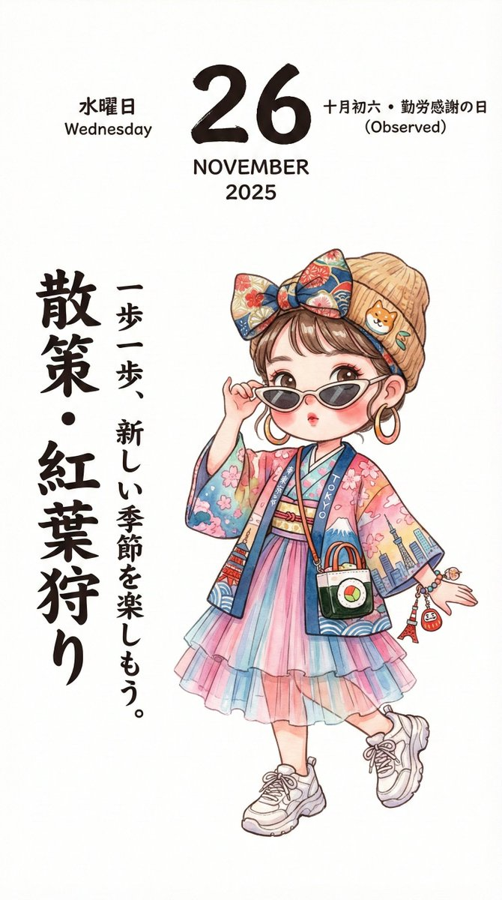
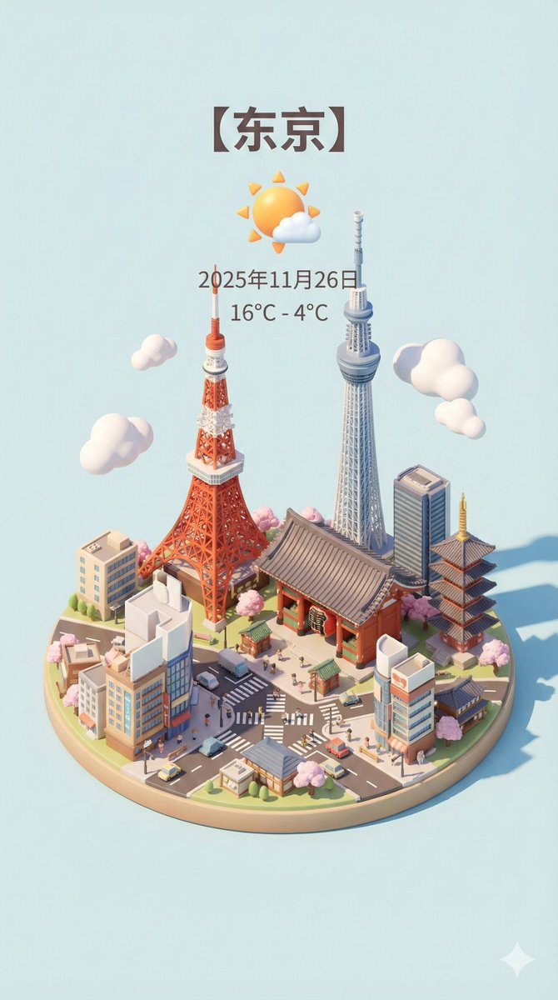

<a id="readme-top"></a>
# 欢迎来到 Nano Banana(nanobanana)/GPT-5/GPT‑4o/豆包 图片提示词（Prompts）精选！

🎉 在线演示地址：https://opennana.com/awesome-prompt-gallery/

---
## 获取最新提示词？你可以通过这3个渠道。
<div style="width: 98%;">
<table>
  <tr>
    <!-- 左侧文字单元格 -->
    <td style="width: 60%; padding: 2px; vertical-align: middle; border: none;">
      <p>1、微信公众号：松果先森</p>
      <p>2、我的X地址：https://x.com/songguoxiansen</p>
      <p>3、扫一扫，拉你进大群《AI技术学习交流群》</p>
    </td>
    <!-- 右侧图片单元格 -->
    <td>
      
    </td>
  </tr>
</table>
</div>

---

<a id="prompt-toc"></a>
## 📖 案例目录
*   [案例 600：和疯狂动物城中的角色自拍 ](#prompt-600)
*   [案例 599：女生双手比出一个心形 ](#prompt-599)
*   [案例 598：宝丽来照片讲述故事 ](#prompt-598)
*   [案例 597：宝丽来照片讲述故事 ](#prompt-597)
*   [案例 596：3X3女子肖像照拼贴画 ](#prompt-596)
*   [案例 595：四幅女子时尚生活场景拼贴画 ](#prompt-595)
*   [案例 594：模切线图转3D产品可视化 ](#prompt-594)
*   [案例 593：模切线变为现实 ](#prompt-593)
*   [案例 592：城市俯视等距3D卡通微缩场景 ](#prompt-592)
*   [案例 591：真人转3D漫画 ](#prompt-591)
*   [案例 590：虚构的英语电影海报-回忆之味 ](#prompt-590)
*   [案例 589：卡哇伊波普艺术 ](#prompt-589)
*   [案例 588：金属霓虹手账 ](#prompt-588)
*   [案例 587：iPhone 16 Pro Max拆解 ](#prompt-587)
*   [案例 586：清新蓝色手账 ](#prompt-586)
*   [案例 585：相机拆解 ](#prompt-585)
*   [案例 584：复古动漫幻想 ](#prompt-584)
*   [案例 583：东方武侠史诗海报-剑影红颜 ](#prompt-583)
*   [案例 582：奇幻冒险喜剧海报-寻龙秘境 ](#prompt-582)
*   [案例 581：职业西装风手账 ](#prompt-581)
*   [案例 580：鱼眼镜头下的日本女子比心 ](#prompt-580)
*   [案例 579：年轻女子侧坐在街机凳上 ](#prompt-579)
*   [案例 578：油泼面宫格漫画图 ](#prompt-578)
*   [案例 577：皮克斯风格3D动画场景 ](#prompt-577)
*   [案例 576：皮克斯风格3D动画场景 ](#prompt-576)
*   [案例 575：极繁主义波普艺术图层 ](#prompt-575)
*   [案例 574：掌上游戏机的精美3D渲染图 ](#prompt-574)
*   [案例 573：身着白色针织上衣的阳光女孩 ](#prompt-573)
*   [案例 572：奶油水彩手账 ](#prompt-572)
*   [案例 571：早朝了开个视频会议先 ](#prompt-571)
*   [案例 570：游戏角色试图从电视屏幕爬到客厅 ](#prompt-570)
*   [案例 569：泛黄旧报纸手账 ](#prompt-569)
*   [案例 568：金毛直播 ](#prompt-568)
*   [案例 567：你好地球人 ](#prompt-567)
*   [案例 566：李小龙与尤达大师以武会友 ](#prompt-566)
*   [案例 565：明星合照的幕后花絮 ](#prompt-565)
*   [案例 564：马里奥路易吉给碧奇公主修理厨房 ](#prompt-564)
*   [案例 563：西游记师徒四人组成了一个摇滚乐队 ](#prompt-563)
*   [案例 562：涂鸦记号笔手账 ](#prompt-562)
*   [案例 561：国家一级摆烂许可证 ](#prompt-561)
*   [案例 560：未经他人苦莫劝他人善 ](#prompt-560)
*   [案例 559：月亮不睡我不睡 ](#prompt-559)
*   [案例 558：宇航员坐在弯弯的月亮边钓星星 ](#prompt-558)
*   [案例 557：职业生涯地图图片 ](#prompt-557)
*   [案例 556：女子一只手夸张地伸向镜头 ](#prompt-556)
*   [案例 555：在复仇者大厦跟死侍合个影 ](#prompt-555)
*   [案例 554：粉红色的星之卡吐泡泡 ](#prompt-554)
*   [案例 553：马斯克教爱因斯坦拍照 ](#prompt-553)
*   [案例 552：超现实主义日式水墨画 ](#prompt-552)
*   [案例 551：现代芝加哥河滨清明上河图风格 ](#prompt-551)
*   [案例 550：手绘风格的时尚风格概念分解图 ](#prompt-550)
*   [案例 549：LINE风格半身Q版表情包 ](#prompt-549)
*   [案例 548：仿真绣苏绣表情包 ](#prompt-548)
*   [案例 547：手绘日历插画 ](#prompt-547)
*   [案例 546：把文章变成卡通信息图 ](#prompt-546)
*   [案例 545：将文章变成黑板报 ](#prompt-545)
*   [案例 544：根据所提供的内容制作信息图 ](#prompt-544)
*   [案例 543：城市动态天气卡片 ](#prompt-543)
*   [案例 542：服装设计手稿 ](#prompt-542)
*   [案例 541：高细节的3D信息图海报 ](#prompt-541)
*   [案例 540：物品拆解图 ](#prompt-540)
*   [案例 539：根据歌词生成电影般的图像 ](#prompt-539)
*   [案例 538：创作一个电影分镜脚本 ](#prompt-538)
*   [案例 537：风格学习 ](#prompt-537)
*   [案例 536：食物制作成的超写实3D写实图 ](#prompt-536)
*   [案例 535：将paper转换成教授白板的图片 ](#prompt-535)
*   [案例 534：四季变化信息图 ](#prompt-534)
*   [案例 533：烤面包流程图 ](#prompt-533)
*   [案例 532：Markdown转换为信息图 ](#prompt-532)
*   [案例 531：让人做出Emoji的表情 ](#prompt-531)
*   [案例 530：长平之战信息图 ](#prompt-530)
*   [案例 529：识字小报元提示词 ](#prompt-529)
*   [案例 528：大幅油画肖像 ](#prompt-528)
*   [案例 527：我的世界神秘时代信息卡 ](#prompt-527)
*   [案例 526：流年运势图 ](#prompt-526)
*   [案例 525：Labubu和迪丽热巴高端时尚跨页大片 ](#prompt-525)
*   [案例 524：风格化的3D人物漫画 ](#prompt-524)
*   [案例 523：一张年轻女性的逼真特写自拍照 ](#prompt-523)
*   [案例 522：衣橱拆解与风格分析 ](#prompt-522)
*   [案例 521：绘制地标的手绘等距示意图 ](#prompt-521)
*   [案例 520：龙珠卡牌 ](#prompt-520)
*   [案例 519：高端工作室照片 ](#prompt-519)
*   [案例 518：极简主义鸡尾酒摄影 ](#prompt-518)
*   [案例 517：动漫转真人 ](#prompt-517)
*   [案例 516：配料合成食材 ](#prompt-516)
*   [案例 515：担担面高级海报 ](#prompt-515)
*   [案例 514：复刻图片提示词 ](#prompt-514)
*   [案例 513：labubu风格动态 ](#prompt-513)
*   [案例 512：高清杂志跨页 ](#prompt-512)
*   [案例 511：最后的晚餐 ](#prompt-511)
*   [案例 510：宫崎骏的角色走进最后的晚餐 ](#prompt-510)
*   [案例 509：记忆宫殿学习英语 ](#prompt-509)
*   [案例 508：女子海边电影风格肖像照 ](#prompt-508)
*   [案例 507：中国各朝代时间轴 ](#prompt-507)
*   [案例 506：一个全新的Instagram账号 ](#prompt-506)
*   [案例 505：解数学题 ](#prompt-505)
*   [案例 504：品牌联名海报 ](#prompt-504)
*   [案例 503：平抛运动轨迹与速度位移分解图 ](#prompt-503)
*   [案例 502：老北京航拍 ](#prompt-502)
*   [案例 501：大唐长安插画 ](#prompt-501)
---

<a id="prompt-600"></a>
## 案例 600：和疯狂动物城中的角色自拍 (来源 [@xmiiru_](https://x.com/xmiiru_/status/1994360357100368334)) 模型：Nano banana pro

<div style="display: flex; justify-content: space-between;">


</div>

**提示词：**
```
{
  "prompt": {
    "characters": [
      {
        "name": "Miyeon",
        "description": "beautiful young Korean woman, smiling, long black hair, wearing a white strapless top with black stars, silver necklace"
      },
      {
        "name": "Judy Hopps",
        "description": "Disney character from Zootopia, wearing police uniform, smiling"
      }
    ],
    "scene": {
      "location": "slightly dark, crowded movie theater/cinema hall",
      "background": "large movie screen showing a scene with multiple male characters in action poses",
      "lighting": "cinematic lighting"
    },
    "interaction": "Miyeon taking a selfie with Judy Hopps, standing side-by-side",
    "style": "photorealistic, ultra-detailed, 8K"
  }
}
```

**中文提示词：**
```
{
“迅速的”： {
“人物”： [
{
"name": "Miyeon",
描述：一位美丽的年轻韩国女子，面带微笑，留着黑色长发，身穿白色无肩带上衣，上面点缀着黑色星星，佩戴银色项链。
},
{
姓名：朱迪·霍普斯
描述：迪士尼动画电影《疯狂动物城》中的角色，身穿警服，面带微笑。
}
],
“场景”： {
“地点”：“略显昏暗、拥挤的电影院/影厅”，
“背景”：“大电影屏幕上显示多个男性角色摆出动作姿势的场景”，
“照明”: “电影照明”
},
“互动”：“美延和朱迪·霍普斯并肩站着自拍”
风格：照片级写实、超高细节、8K
}
}
```

<a id="prompt-599"></a>
## 案例 599：女生双手比出一个心形 (来源 [@SDT_side](https://x.com/SDT_side/status/1994133786632806832)) 模型：Nano banana pro

<div style="display: flex; justify-content: space-between;">

</div>

**提示词：**
```
{
  "image_info": {
    "width": 768,
    "height": 1365,
    "aspect_ratio": "9:16",
    "orientation": "vertical"
  },

  "subject": {
    "type": "close-up portrait",
    "description": "A young East Asian woman making a heart shape with her hands directly in front of the camera, with her head gently tilted"
  },

  "clothing": {
    "visible": false,
    "notes": "No clothing visible within the framing"
  },

  "hair": {
    "color": "black",
    "style": "straight",
    "details": "Loose strands falling naturally across her face"
  },

  "face": {
    "eyes": {
      "shape": "almond-shaped",
      "color": "dark brown",
      "makeup": "subtle eyeliner, defined lashes, soft shimmer on lids",
      "expression": "one eye winked, the other softly open"
    },
    "eyebrows": "natural, slightly arched",
    "skin": "smooth, natural glow",
    "lips": {
      "shape": "full",
      "color": "pink glossy tint",
      "expression": "kiss face (puckered lips)"
    },
    "other_details": "small mole under the left eye"
  },

  "accessories": {
    "visible": false
  },

  "environment": {
    "background": "not visible; fully obscured by the extreme close-up framing"
  },

  "lighting": {
    "type": "soft diffused light",
    "effects": "even illumination, minimal shadows, natural skin highlights"
  },

  "camera": {
    "framing": "extreme close-up (eyes, nose, and lips filling the frame)",
    "angle": "straight-on",
    "depth_of_field": "very shallow",
    "focus": "sharp on eyes and lips",
    "foreground_elements": "hands forming a heart shape in front of the face"
  },

  "style": {
    "aesthetic": "soft, playful, intimate",
    "texture": "high-resolution portrait with film-like softness",
    "vibe": "cute, expressive, flirtatious"
  }
}
```

**中文提示词：**
```
{
"image_info": {
宽度：768，
“高度”：1365，
"aspect_ratio": "9:16",
“方向”: “垂直”
},

“主题”： {
“类型”：“特写肖像”，
描述：一位年轻的东亚女性在镜头前用双手比出一个心形，头部微微倾斜。
},

“衣服”： {
“可见”：否，
备注：画面中看不到任何衣物。
},

“头发”： {
“颜色：黑色”，
“风格”：“直筒”，
“细节”：“几缕散落的发丝自然地垂落在她的脸上”
},

“脸”： {
"眼睛": {
“形状”： “杏仁形”
“颜色”: “深棕色”
“妆容”：“淡雅的眼线，精致的睫毛，眼睑上柔和的珠光”，
“表情”：“一只眼睛眨了眨，另一只眼睛轻轻睁开”
},
“眉毛”：“自然，略微拱起”，
“肌肤”：“光滑、自然的光泽”，
"嘴唇": {
"形状": "饱满",
“颜色”： “粉红色光泽色调”，
“表情”：“亲吻脸（撅起嘴唇）”
},
"other_details": "左眼下方有一颗小痣"
},

“配件”： {
“可见”：否
},

“环境”： {
“背景”：“不可见；完全被极近的特写镜头遮挡住”
},

“灯光”： {
“类型”：“柔和漫射光”，
“效果”：“均匀照明，阴影极少，肌肤自然高光”
},

“相机”： {
“构图”：“极近特写（眼睛、鼻子和嘴唇充满画面）”，
"角度": "正面",
"景深": "非常浅",
“焦点”: “聚焦于眼睛和嘴唇”，
"前景元素": "双手在脸前摆成心形"
},

“风格”： {
“美学”：“柔和、俏皮、亲密”，
“纹理”：“具有胶片般柔和感的高分辨率肖像”，
氛围：可爱、活泼、爱调情
}
}
```

<a id="prompt-598"></a>
## 案例 598：宝丽来照片讲述故事 (来源 [@TechieBySA](https://x.com/TechieBySA/status/1993752534637531605)) 模型：Nano banana pro

<div style="display: flex; justify-content: space-between;">

</div>

**提示词：**
```
1080x1080 cork-board layout telling the story of [MOVIE]. At the very top of the board, include a pinned paper label with the movie title: [MOVIE] in large handwritten letters. Below it, arrange 5–6 Polaroid photos pinned across the board in a loose chronological path. Each Polaroid shows a key moment from the story with a short handwritten caption beneath it. Connect characters and events with colored strings (red, blue, yellow). Warm nostalgic lighting, soft shadows. Include realistic details: coffee cup rings, paper clips, torn notes, arrows, scribbled hints, and thumbtacks. Vintage, textured, cozy detective-board aesthetic. Highly readable, high contrast, everything framed clearly for 1080x1080
```

**中文提示词：**
```
1080x1080像素的软木板布局，讲述电影[MOVIE]的故事。在木板最上方，钉上一张纸质标签，上面用大号手写字体写着电影标题：[MOVIE]。标签下方，以大致的时间顺序排列5-6张宝丽来照片。每张照片都展现了故事中的一个关键时刻，并在下方附上简短的手写说明。用彩色细线（红、蓝、黄）连接人物和事件。营造温暖怀旧的灯光和柔和的阴影。添加一些逼真的细节：咖啡杯印、回形针、撕碎的纸条、箭头、潦草的提示和图钉。打造复古、质感十足、温馨舒适的侦探板风格。清晰易读，高对比度，所有内容都以1080x1080像素的分辨率清晰呈现。
```

<a id="prompt-597"></a>
## 案例 597：宝丽来照片讲述故事 (来源 [@umesh_ai](https://x.com/umesh_ai/status/1993247403995283687)) 模型：Nano banana pro

<div style="display: flex; justify-content: space-between;">

</div>

**提示词：**
```
Create an image about "[FILM_OR_NOVEL]" retold through a series of Polaroid photos pinned to a cork board. Each photo captures a key moment, with simple captions below. Arrange the photos in a loosely chronological path across the board, using colored strings to connect events and characters. Light the scene warmly to evoke nostalgia. Include incidental details, coffee cup rings, paper clips, handwritten notes, for authenticity.
```

**中文提示词：**
```
创作一幅关于[电影/小说]的图像，用一系列宝丽来照片讲述故事，并将照片钉在软木板上。每张照片捕捉一个关键时刻，并在下方附上简单的文字说明。将照片大致按照时间顺序排列在软木板上，用彩色细线连接事件和人物。用温暖的光线营造怀旧氛围。添加一些细节，例如咖啡杯印、回形针、手写笔记等，以增强真实感。
```

<a id="prompt-596"></a>
## 案例 596：3X3女子肖像照拼贴画 (来源 [@craftian_keskin](https://x.com/craftian_keskin/status/1994110561101979793)) 模型：Nano banana pro

<div style="display: flex; justify-content: space-between;">

</div>

**提示词：**
```
Create a full Instagram-style 3×3 grid feed composed of nine different portrait images, all featuring the person and the dog from the attached image. ensure that the middle photo is the same photo as the attached image, Ensure the person’s identity, facial structure, and style remain consistent across all nine posts. Each of the 9 images should present a unique concept, outfit, pose, and environment that fits a stylish, modern Instagram aesthetic.
 Include a mix of:
 – Lifestyle shots
 – Cinematic portraits 
– Fashion/streetwear scenes
 – Close-up beauty shots
 – Travel or outdoor vibes 
– Cozy indoor moments 
– Minimalist studio portraits 

Make every image hyperrealistic and shot as if with a professional camera: 
– Natural skin texture
 – Accurate lighting
 – Sharp details 
– Professional depth of field
 – High-quality color grading 
– Authentic expressions and posing Ensure all 9 images feel coherent as a feed: 
– Consistent character likeness 
– Similar visual tone and color palette 
– Aesthetic balance across the grid 
– Cinematic and modern photography style

 Final deliverable: a 3×3 Instagram grid layout of nine separate 3:4 ratio hyperrealistic portraits of the person from the attached photo.
```

**中文提示词：**
```
创建一个完整的 Instagram 风格的 3×3 网格信息流，包含九张不同的肖像照片，每张照片都需包含附图中的人物和狗狗。确保中间的照片与附图相同。确保所有九张照片中人物的身份、面部结构和风格保持一致。每张照片都应呈现独特的概念、服装、姿势和环境，以符合时尚现代的 Instagram 美学风格。
包含以下几种元素：
生活照
电影般的肖像
– 时尚/街头服饰场景
——特写镜头下的美照
旅行或户外氛围
舒适的室内时光
极简主义风格的影棚人像

让每一张照片都呈现出超逼真的效果，并像用专业相机拍摄一样：
自然肌肤纹理
精准照明
清晰的细节
– 专业景深
– 高质量的色彩分级
– 表情和姿势真实自然，确保所有 9 张图片在整体风格上保持一致：
– 角色形象始终如一
– 相似的视觉基调和色彩搭配
– 网格的美学平衡
电影感十足的现代摄影风格

最终交付成果：一个 3×3 的 Instagram 网格布局，包含九张独立的 3:4 比例的超写实肖像，肖像人物为附图中的人物。
```

<a id="prompt-595"></a>
## 案例 595：四幅女子时尚生活场景拼贴画 (来源 [@_MehdiSharifi_](https://x.com/_MehdiSharifi_/status/1994166422251950451)) 模型：Nano banana pro

<div style="display: flex; justify-content: space-between;">

</div>

**提示词：**
```
{
  "scene_description": "A cohesive 4-panel fashion lifestyle collage featuring the same young woman in a trendy streetwear outfit, showcasing different dynamic poses and angles.",
  "subject": {
    "type": "Young Woman (Consistent character)",
    "age": "early 20s",
    "features": {
      "hair": "high ponytail or messy bun",
      "makeup": "fresh urban look"
    },
    "attire": "oversized graphic hoodie, biker shorts, high socks, chunky sneakers",
    "accessories": "cross-body bag, sunglasses on head"
  },
  "collage_layout": {
    "structure": "2x2 Grid Layout (4 frames of equal size)",
    "panel_1_top_left": "Front Full Body: Walking confidently towards the camera on a city crosswalk, hair moving in the wind, looking slightly to the side.",
    "panel_2_top_right": "Side Profile Sitting: Sitting on concrete steps with knees pulled up, resting chin on knees, looking peacefully at the street view.",
    "panel_3_bottom_left": "Back View Full Body: Standing and looking away at a city billboard or view, hands in hoodie pockets, highlighting the back graphic of the hoodie.",
    "panel_4_bottom_right": "Mid-Shot Angle: Leaning casually against a brick wall, one leg up on the wall, looking directly at the camera with a cool expression."
  },
  "environment": {
    "setting": "City Streets / Urban Alley",
    "background_elements": [
      "Brick textures",
      "Street signs",
      "City depth"
    ]
  },
  "lighting": {
    "style": "Overcast Soft Light",
    "key_light": {
      "type": "Natural Sky",
      "color": "Cool White",
      "effect": "Even lighting ideal for street fashion"
    }
  },
  "style": {
    "medium": "Digital Street Photography",
    "aesthetic": "Hypebeast, Urban, Gen Z, Candid",
    "quality": "8k resolution, sharp focus on subject"
  },
  "attire_customization": {
    "current_clothing": "Hoodie and biker shorts",
    "customizable_clothing": "User can swap for denim jacket and cargo pants"
  },
  "brand_product_customization": {
    "current_brand_product": "Streetwear",
    "customizable_brand": "User: Insert Brand Name",
    "customizable_product": "User: Specific sneakers or bag",
    "product_placement_area": "Hoodie chest or sneakers"
  }
}
```

**中文提示词：**
```
{
“场景描述”： “这是一幅由四幅时尚生活场景组成的拼贴画，画中同一位年轻女子身着时髦的街头服饰，展现了不同的动态姿势和角度。”
“主题”： {
“类型”：“年轻女子（性格始终如一）”
“年龄”：“20岁出头”，
“特征”： {
“发型”：“高马尾或凌乱发髻”，
妆容：清新都市妆容
},
“着装”：“超大号印花连帽衫、骑行短裤、高筒袜、厚底运动鞋”，
“配饰”：“斜挎包，头戴太阳镜”
},
"collage_layout": {
"结构": "2x2 网格布局（4 个大小相同的框架）",
"panel_1_top_left": "正面全身照：自信地走在城市人行横道上，头发随风飘扬，目光略微侧向一边。"
"panel_2_top_right": "侧脸坐姿：坐在水泥台阶上，双膝蜷起，下巴搁在膝盖上，平静地望着街景。"
"panel_3_bottom_left": "背部全身像：站立，目光看向远处的城市广告牌或风景，双手插在连帽衫口袋里，突显连帽衫背面的图案。"
"panel_4_bottom_right": "中景角度：随意地倚靠在砖墙上，一条腿搭在墙上，面带冷峻的表情直视镜头。"
},
“环境”： {
“场景”：“城市街道/城市小巷”，
“背景元素”：[
“砖纹理”，
“街道标志”，
“城市深度”
]
},
“灯光”： {
“风格”：“阴天柔光”，
"key_light": {
"type": "自然天空",
“颜色”：“冷白”，
“效果”：“均匀的灯光，非常适合街头时尚”
}
},
“风格”： {
“媒介”：“数码街头摄影”，
“美学”：“潮牌、都市、Z世代、坦率”
“画质”：“8K分辨率，主体清晰对焦”
},
"attire_customization": {
"current_clothing": "连帽衫和骑行短裤",
"customizable_clothing": "用户可以更换牛仔夹克和工装裤"
},
"品牌产品定制": {
"current_brand_product": "街头服饰",
"customizable_brand": "用户：插入品牌名称",
"customizable_product": "用户：特定运动鞋或包包",
"product_place_area": "连帽衫、胸前或运动鞋"
}
}
```

<a id="prompt-594"></a>
## 案例 594：模切线图转3D产品可视化 (来源 [@_MehdiSharifi_](https://x.com/_MehdiSharifi_/status/1994022879051014312)) 模型：Nano banana pro

<div style="display: flex; justify-content: space-between;">

</div>

**提示词：**
```
{
  "scene_description": "A photorealistic, high-end 3D product visualization of a perfectly assembled packaging box derived from a dieline, set in a pristine minimal studio.",
  "subject": {
    "type": "Assembled Packaging Box",
    "material": "Premium matte paperboard",
    "features": {
      "structure": "Perfectly folded, accurate panel placement, sharp clean edges",
      "surface": "Smooth matte texture with high-fidelity print rendering"
    },
    "position": "Upright, angled at a refined ¾ perspective view to show front and side panels",
    "artwork_state": "Undistorted typography, preserving original design exactly"
  },
  "action": {
    "primary": "Standing static on a surface",
    "secondary": "Casting a gentle shadow",
    "effect": "Demonstrates structural integrity and design elegance"
  },
  "environment": {
    "setting": "Minimalist High-End Studio Void",
    "foreground_elements": [
      "Clean, smooth surface",
      "Soft contact shadows"
    ],
    "background_elements": [
      "Soft neutral seamless backdrop (light grey/cream)",
      "Zero distractions",
      "No extra props"
    ]
  },
  "lighting": {
    "style": "Soft Commercial Product Lighting (Global Illumination)",
    "key_light": {
      "type": "Large Diffused Softbox",
      "color": "Neutral White (5500K)",
      "illuminates": [
        "The face of the box evenly",
        "The matte texture of the paper"
      ]
    },
    "fill_light": {
      "type": "White Reflector",
      "effect": "Softens shadows to ensure artwork visibility"
    },
    "shadows": "Subtle, soft gradient shadows anchoring the object"
  },
  "style": {
    "medium": "3D Rendering / Product Photography",
    "aesthetic": "Premium Editorial, Mockup Style, Minimalist Luxury",
    "quality": "8k resolution, ray-traced optics, physically based rendering (PBR)",
    "details": "Crisp folds, zero distortion, matte paper grain visibility"
  },
  "scene_composition": {
    "subject_action": "Static presentation",
    "camera_behavior": "Locked-off tripod shot",
    "depth_layering": "Sharp Subject -> Infinite Soft Background"
  },
  "visual_description": {
    "core_subject": "A flawless 3D box assembled from a flat dieline.",
    "attire_physics": "N/A - Rigid Body physics.",
    "surface_rendering": "Non-reflective matte finish that absorbs light softly, ensuring text is readable and colors are true."
  },
  "lighting_and_atmosphere": {
    "type": "Clean Studio",
    "specifics": "Even light distribution, ambient occlusion in the creases.",
    "color_grade": "Natural, color-calibrated, neutral tones."
  },
  "attire_customization": {
    "current_clothing": "N/A",
    "customizable_clothing": "N/A"
  },
  "brand_product_customization": {
    "current_brand_product": "Packaging Design",
    "customizable_brand": "User: Insert Brand Name/Logo for the box",
    "customizable_product": "User: Describe the box type (e.g., cosmetic box, tuck-end box)",
    "product_placement_area": "All visible panels (Front, Side, Top)"
  },
  "objects_and_props": {
    "main_objects": [
      "The 3D Box"
    ],
    "secondary_objects": []
  },
  "camera_and_lens": {
    "focal_length_feel": "85mm or 100mm (Telephoto to eliminate perspective distortion)",
    "aperture_effect": "f/16 (Deep depth of field for edge-to-edge sharpness)",
    "camera_angle": "Isometric or ¾ perspective",
    "lens_type": "Studio Macro Lens",
    "bokeh_style": "None (Smooth gradient background)"
  },
  "technical_tags": "--v 6 --ar 4:5 --stylize 150 --no warping, distortion, messy background, props, glossy reflection, low poly"
}
```

**中文提示词：**
```
{
"scene_description": "一个逼真的高端3D产品可视化模型，展示了一个完美组装的包装盒，该包装盒由模切线图生成，场景设定在一个简洁干净的摄影棚内。"
“主题”： {
"type": "组装包装盒",
“材质”： “优质哑光纸板”
“特征”： {
“结构”：“折叠完美，面板位置准确，边缘锋利干净”，
“表面”： “光滑哑光质感，高保真印刷效果”
},
“位置”：“直立，以精细的四分之三透视角度倾斜，以显示正面和侧面面板”，
"artwork_state": "未失真的字体，完全保留原始设计"
},
“行动”： {
“primary”: “静止地立于表面上”
“次要的”: “投下温柔的阴影”
“效果”：“展现了结构完整性和设计优雅性”
},
“环境”： {
“设置”：“极简高端工作室虚空”
"前景元素": [
“干净光滑的表面”，
“柔和的隐形眼镜阴影”
],
“背景元素”：[
“柔和的中性无缝背景（浅灰色/米色）”，
“零干扰”，
“无需额外道具”
]
},
“灯光”： {
“风格”：“柔和的商业产品照明（整体照明）”
"key_light": {
"type": "大型漫射柔光箱",
“颜色”：“中性白（5500K）”，
“照亮”：[
“盒子表面平整”，
纸张的哑光质感
]
},
"fill_light": {
“类型”：“白色反光器”，
“效果”：“柔化阴影，确保作品清晰可见”
},
“阴影”：“柔和的渐变阴影，使物体更加突出”
},
“风格”： {
“medium”: “3D渲染/产品摄影”
“美学”：“高端编辑风格、模型风格、极​​简奢华”
“质量”：“8k分辨率、光线追踪光学、基于物理的渲染（PBR）”
细节：折痕清晰，零变形，哑光纸颗粒可见
},
"scene_composition": {
"subject_action": "静态演示",
"camera_behavior": "锁定三脚架拍摄",
"depth_layering": "清晰主体->无限柔和背景"
},
"visual_description": {
"core_subject": "一个由平面模切线组装而成的完美3D盒子。"
"attire_physics": "不适用 - 刚体物理。",
"surface_rendering": "非反射哑光表面，柔和吸收光线，确保文字清晰可读，色彩真实。"
},
"lighting_and_atmosphere": {
"type": "Clean Studio",
“具体细节”：“光线分布均匀，褶皱处有环境光遮挡。”
"color_grade": "自然、色彩校准的中性色调。"
},
"attire_customization": {
"current_clothing": "N/A",
"customizable_clothing": "N/A"
},
"品牌产品定制": {
"current_brand_product": "包装设计",
"customizable_brand": "用户：输入包装盒的品牌名称/徽标",
"customizable_product": "用户：描述盒子类型（例如，化妆品盒、折叠盒）",
"product_placement_area": "所有可见面板（正面、侧面、顶部）"
},
"objects_and_props": {
"main_objects": [
“3D盒子”
],
"secondary_objects": []
},
"camera_and_lens": {
"focal_length_feel": "85mm 或 100mm（长焦镜头可消除透视畸变）",
"aperture_effect": "f/16（景深大，边缘到边缘清晰）",
"camera_angle": "等距或四分之三视角",
"lens_type": "影室微距镜头",
"bokeh_style": "无（平滑渐变背景）"
},
"technical_tags": " --v 6 --ar 4:5 --stylize 150 --no warping, distortion, messy background, props, glossy reflection, low poly"
}
```

<a id="prompt-593"></a>
## 案例 593：模切线变为现实 (来源 [@Salmaaboukarr](https://x.com/Salmaaboukarr/status/1994017531699278056)) 模型：Nano banana pro

<div style="display: flex; justify-content: space-between;">

</div>

**提示词：**
```
Assemble the dieline into a perfectly folded 3D box with accurate panel placement, clean edges, and undistorted typography. Preserve all artwork exactly as printed on the dieline. Render the box in a minimal, high-end studio setup on a soft neutral background with gentle diffused lighting, subtle shadows, and no extra props. Show the box upright in a refined ¾ angle. Ultra-realistic detail, true colors, matte paperboard texture, crisp folds, premium editorial aesthetic.
```

**中文提示词：**
```
根据模切线将盒子完美折叠成一个立体盒子，确保面板位置精准、边缘清晰、文字无变形。所有图案均需与模切线上的印刷完全一致。在简约的高端摄影棚环境中，以柔和的中性背景、漫射光和微妙的阴影渲染盒子，无需任何额外道具。以精致的四分之三角度展示盒子竖立状态。呈现超逼真的细节、真实的色彩、哑光纸板质感、清晰的折痕，以及高端的编辑美感。
```

<a id="prompt-592"></a>
## 案例 592：城市俯视等距3D卡通微缩场景 (来源 [@TechieBySA](https://x.com/TechieBySA/status/1993995980405100598)) 模型：Nano banana pro

<div style="display: flex; justify-content: space-between;">

</div>

**提示词：**
```
Present a clear, 45° top-down isometric miniature 3D cartoon scene of [CITY], featuring its most iconic landmarks and architectural elements. Use soft, refined textures with realistic PBR materials and gentle, lifelike lighting and shadows. Integrate the current weather conditions directly into the city environment to create an immersive atmospheric mood.
Use a clean, minimalistic composition with a soft, solid-colored background.

At the top-center, place the title “[CITY]” in large bold text, a prominent weather icon beneath it, then the date (small text) and temperature (medium text).
All text must be centered with consistent spacing, and may subtly overlap the tops of the buildings.
Square 1080x1080 dimension.
```

**中文提示词：**
```
呈现[城市]清晰的45°俯视等距3D卡通微缩场景，展现其最具标志性的地标和建筑元素。使用柔和细腻的纹理、逼真的PBR材质以及柔和自然的灯光和阴影。将当前天气状况直接融入城市环境，营造身临其境的氛围。”
使用简洁的极简主义构图，搭配柔和的纯色背景。

在顶部中心位置，用粗体大字显示标题“[城市]”，在其下方放置一个醒目的天气图标，然后是日期（小字）和温度（中字）。
所有文字必须居中，间距一致，并且可以略微与建筑物顶部重叠。
1080x1080 正方形。
```

<a id="prompt-591"></a>
## 案例 591：真人转3D漫画 (来源 [@azed_ai](https://x.com/azed_ai/status/1994360708637794410)) 模型：Nano banana pro

<div style="display: flex; justify-content: space-between;">


</div>

**提示词：**
```
A highly stylized 3D caricature of [celebrity], with an oversized head, expressive facial features, and playful exaggeration. Rendered in a smooth, polished style with clean materials and soft ambient lighting. Minimal background to emphasize the character’s charm and presence.
```

**中文提示词：**
```
这是一幅风格化的[名人]3D漫画肖像，头部硕大，面部表情丰富，风格夸张诙谐。画面采用流畅精致的渲染风格，材质干净利落，环境光柔和。极简的背景设计突显了人物的魅力和存在感。
```

<a id="prompt-590"></a>
## 案例 590：虚构的英语电影海报-回忆之味 (来源 [@songguoxiansen](https://x.com/songguoxiansen/status/1994276578084413877)) 模型：Nano banana pro

<div style="display: flex; justify-content: space-between;">

</div>

**中文提示词：**
```
一张虚构的英语电影《回忆之味》（The Taste of Memory）的电影海报。场景设置在一个质朴的19世纪风格厨房里。画面中央，一位红棕色头发、留着小胡子的中年男子（演员 成龙 饰）站在一张木桌后，他身穿白色衬衫、黑色马甲和米色围裙，正看着镜头，手中拿着一大块生红肉，下方是一个木制切菜板。在他的右边，一位梳着高髻的黑发女子（演员 刘亦菲 饰）倚靠在桌子上，温柔地对他微笑。她穿着浅色衬衫和一条上白下蓝的长裙。桌上除了放有切碎的葱和卷心菜丝的切菜板外，还有一个白色陶瓷盘、新鲜香草，左侧一个木箱上放着一串深色葡萄。背景是一面粗糙的灰白色抹灰墙，墙上挂着一幅风景画。最右边的一个台面上放着一盏复古油灯。海报上有大量的文字信息。左上角是白色的无衬线字体"ARTISAN FILMS PRESENTS"，其下方是"ELEANOR VANCE"和"ACADEMY AWARD® WINNER"。右上角写着"ARTHUR PENHALIGON"和"GOLDEN GLOBE® AWARD WINNER"。顶部中央是圣丹斯电影节的桂冠标志，下方写着"SUNDANCE FILM FESTIVAL GRAND JURY PRIZE 2024"。主标题"THE TASTE OF MEMORY"以白色的大号衬线字体醒目地显示在下半部分。标题下方注明了"A FILM BY Tongyi Interaction Lab"。底部区域用白色小字列出了完整的演职员名单，包括"SCREENPLAY BY ANNA REID"、"CULINARY DIRECTION BY JAMES CARTER"以及Artisan Films、Riverstone Pictures和Heritage Media等众多出品公司标志。整体风格是写实主义，采用温暖柔和的灯光方案，营造出一种亲密的氛围。色调以棕色、米色和柔和的绿色等大地色系为主。两位演员的身体都在腰部被截断。
```

<a id="prompt-589"></a>
## 案例 589：卡哇伊波普艺术 (来源 [@songguoxiansen](https://x.com/songguoxiansen/status/1994239610713678137)) 模型：Nano banana pro

<div style="display: flex; justify-content: space-between;">

</div>

**中文提示词：**
```
中低角度拍摄，一位可爱的年轻东亚女性，皮肤白里透红、滑嫩紧致。她扎着双马尾，戴着过多的彩色发夹，穿着色彩爆炸的原宿Decora风格服装，在东京繁忙的街头俏皮地比着“耶”的手势。照片风格被过量的卡哇伊波普艺术淹没：无数的塑料玩具、彩虹、独角兽、糖果、笑脸和巨大的蝴蝶结插画填满背景并延伸到前景，部分卡通元素像贴纸一样覆盖在她的衣服和配件上。光线是明亮的日光，充满活力的柔和色彩。
```

<a id="prompt-588"></a>
## 案例 588：金属霓虹手账 (来源 [@songguoxiansen](https://x.com/songguoxiansen/status/1994226726692683849)) 模型：Nano banana pro

<div style="display: flex; justify-content: space-between;">

</div>

**中文提示词：**
```
Y2K美学风格的竖屏时尚情绪板。背景是数码故障艺术风格的网格纸，带有全息镭射的粉紫配色。所有元素呈现高光泽的乙烯基贴纸质感，白边清晰。主角穿着Y2K风格服饰。Labubu公仔贴纸佩戴银色大耳机和金属配饰，造型前卫。隐藏层贴纸是一件性感的镂空紧身连体衣。周围散落着像素风的手绘星星、蝴蝶图案和电子宠物涂鸦。字体采用气泡立体字风格。整体画面色彩高饱和度，充满未来复古感，不仅是照片，更是一幅完整的数字波普艺术画作。
```

<a id="prompt-587"></a>
## 案例 587：iPhone 16 Pro Max拆解 (来源 [@songguoxiansen](https://x.com/songguoxiansen/status/1994602402276938242)) 模型：Nano banana pro

<div style="display: flex; justify-content: space-between;">

</div>

**中文提示词：**
```
最新款iPhone 16 Pro Max的解构对比摄影，分割布局。画面左侧 1/3 是一部完美的、屏幕亮起的钛金属iPhone；画面右侧 2/3 是拆解后的内部组件，包括A18芯片、三摄模组、电池和排线，采用Knolling风格几何排列。干净的深灰色背景，高角度俯视，极简工业美学，锐利对焦，--ar 16:9
```

<a id="prompt-586"></a>
## 案例 586：清新蓝色手账 (来源 [@songguoxiansen](https://x.com/songguoxiansen/status/1994227033141100662)) 模型：Nano banana pro

<div style="display: flex; justify-content: space-between;">

</div>

**中文提示词：**
```
充满夏日气息的竖屏时尚插画。背景是手绘的蓝色海洋波浪纹理和沙滩色块，使用彩色铅笔质感。主角贴纸穿着度假长裙或泳装，阳光明媚。Labubu公仔贴纸穿着夏威夷衬衫，拿着冲浪板或游泳圈。配饰贴纸包括草编包和墨镜。隐藏层贴纸是一套精美的蕾丝比基尼或薄纱罩衫，平铺展示。周围绘制了棕榈树、太阳和鸡尾酒的可爱涂鸦。贴纸角落有“Was here”的手写旅行笔记。整体氛围轻松愉悦，就像一本旅行剪贴簿的内页扫描图。
```

<a id="prompt-585"></a>
## 案例 585：相机拆解 (来源 [@songguoxiansen](https://x.com/songguoxiansen/status/1994604456969998397)) 模型：Nano banana pro

<div style="display: flex; justify-content: space-between;">

</div>

**提示词：**
```
Knolling photography, disassembled parts of a vintage film camera neatly arranged on a flat surface, high angle shot, flat lay, technical aesthetic, sharp focus, clean background.
```

**中文提示词：**
```
扁平化摆拍摄影：将一台复古胶片相机的拆解部件整齐排列在平面上，采用俯拍角度，呈现扁平化构图风格，兼具技术美感，画面对焦清晰，背景简洁干净。
```

<a id="prompt-584"></a>
## 案例 584：复古动漫幻想 (来源 [@songguoxiansen](https://x.com/songguoxiansen/status/1994240266866446621)) 模型：Nano banana pro

<div style="display: flex; justify-content: space-between;">

</div>

**中文提示词：**
```
一位美丽的东亚女性，有着令人羡慕的白嫩光滑肌肤，留着蓬松的90年代风格卷发。她穿着复古的水手服风格连衣裙，坐在一家充满怀旧感的日式咖啡馆里，眼神梦幻。照片被密集的80-90年代少女漫画元素覆盖：闪烁的星星、魔法少女变身效果、粉彩色的机甲怪兽、玫瑰花框和巨大的漫画拟声词（如“DOKI DOKI”）。艺术风格是扁平的赛璐璐色彩和粗糙的线条，环绕着她写实的身体。柔和、梦幻的午后光线。
```

<a id="prompt-583"></a>
## 案例 583：东方武侠史诗海报-剑影红颜 (来源 [@songguoxiansen](https://x.com/songguoxiansen/status/1994278346474311838)) 模型：Nano banana pro

<div style="display: flex; justify-content: space-between;">

</div>

**中文提示词：**
```
一张虚构的东方武侠史诗海报《剑影红颜》（Sword & Beauty）。场景设置在一个云雾缭绕的古老山巅亭阁中。画面中央，陈坤（Chen Kun）身着飘逸的墨色长袍，长发束起，眼神深邃，手中握着一把未出鞘的古剑，剑柄上镶嵌着玉石，他正凝视前方。在他的左侧，周迅（Zhou Xun）身穿刺绣精美的绯红色古装，高耸的发髻上插着金步摇，她侧身回眸，眼神中带着一丝哀愁和决绝，手中拿着一管玉箫。桌上放着一壶清酒、两个酒杯和一卷竹简。背景是连绵不绝的水墨山水和一轮巨大的红日。最右侧的石灯笼里燃着烛火。左上角"博纳影业 出品"，下方"徐克导演作品"。右上角"金马奖 最佳动作设计"。顶部中央是奥斯卡金像奖标志，下方"ACADEMY AWARD® NOMINEE BEST INTERNATIONAL FEATURE"。主标题"剑影红颜"以苍劲有力的书法字体显示。标题下方注明"江湖之远，不敌你眉间朱砂"。底部列出"武术指导 袁和平"、"服装设计 叶锦添"。整体风格是唯美主义的东方奇幻，采用柔和的自然光和云雾效果，营造出仙气、悲壮和浪漫的氛围。色调以青绿、墨色和朱红为主。
```

<a id="prompt-582"></a>
## 案例 582：奇幻冒险喜剧海报-寻龙秘境 (来源 [@songguoxiansen](https://x.com/songguoxiansen/status/1994279390579183827)) 模型：Nano banana pro

<div style="display: flex; justify-content: space-between;">

</div>

**中文提示词：**
```
一张虚构的奇幻冒险喜剧海报《寻龙秘境》（The Dragon Realm Quest）。场景设置在一个充满奇异发光植物和古老遗迹的地下洞穴中。画面中央，演员黄渤留着滑稽的胡子，戴着探险帽，穿着多口袋马甲，表情夸张地瞪大眼睛看着手中的一个发光罗盘。在他的右侧，演员舒淇穿着异域风情的皮质探险服，背着一把弩箭，正无奈地扶着额头，嘴角上扬看着黄渤。两人周围散落着金币、古老的卷轴和一个巨大的恐龙蛋化石。背景是一个巨大的、沉睡的石龙雕像，其眼睛部位隐约发出红光。左上角"开心麻花影业 出品"，下方"闫非 彭大魔导演作品"。右上角"百花奖 观众最喜爱影片"。顶部中央是多伦多电影节标志，下方"TIFF PEOPLE'S CHOICE AWARD 2024"。主标题"寻龙秘境"以带有龙鳞纹理的金色立体字体显示。标题下方注明"不仅要命，还要钱！"。底部列出"视觉特效 工业光魔"、"动作指导 成家班"。整体风格是色彩斑斓的奇幻冒险，采用魔法光和生物发光的混合光源，营造出幽默、惊险和神秘的氛围。色调以宝石蓝、翠绿和金色为主，人物的旁边标记演员的名字。
```

<a id="prompt-581"></a>
## 案例 581：职业西装风手账 (来源 [@songguoxiansen](https://x.com/songguoxiansen/status/1994309283488444523)) 模型：Nano banana pro

<div style="display: flex; justify-content: space-between;">

</div>

**中文提示词：**
```
9:16极简主义时尚插画。背景是干净的高级灰哑光纸张，仅有极细的工程制图线条。贴纸元素布局严谨，白边锐利。中央是用户穿着职业西装或极简风穿搭的贴纸。Labubu公仔贴纸戴着黑框眼镜，系着领带，一副精英模样。衣物解构贴纸包括折叠完美的西裤和名表。隐藏层贴纸是一件极简的高级黑色丝绸衬裙，展现低调奢华。所有的标注文字都是极细的黑色针管笔手写体。画面冷静、克制，无杂乱装饰，纯粹通过排版和材质对比展示高级感。
```

<a id="prompt-580"></a>
## 案例 580：鱼眼镜头下的日本女子比心 (来源 [@xmiiru_](https://x.com/xmiiru_/status/1994036974961705057)) 模型：Nano banana pro

<div style="display: flex; justify-content: space-between;">

</div>

**提示词：**
```
{
  "image_specifications": {
    "format": "photograph",
    "style": "highly detailed, Y2K-inspired, gritty",
    "lens": "fisheye",
    "angle": "low-angle",
    "shot": "close-up",
    "lighting": "harsh, high contrast",
    "colors": "saturated",
    "background": {
      "setting": "urban, dark, street or subway in Tokyo",
      "effects": "subtle bokeh"
    }
  },
  "subject": {
    "type": "model",
    "style": "Japanese Ganguro or Gyaru",
    "appearance": {
      "hair": "platinum blonde with dark roots",
      "makeup": {
        "eyes": "heavy eye makeup",
        "lips": "light lipstick"
      },
      "clothing": [
        "faux fur vest",
        "distressed black denim top"
      ],
      "accessories": [
        "large gold cross pendant on a chain",
        "leopard-print choker"
      ],
      "hands": {
        "position": "foreground, forming a heart shape around face",
        "nails": "long, heavily jeweled and decorated (deconails)"
      }
    },
    "pose": "looking directly at the camera"
  }
}
```

**中文提示词：**
```
{
"image_specifications": {
"格式": "照片",
“风格”：“高度注重细节，受 Y2K 启发，粗犷”，
“镜头”: “鱼眼镜头”，
“角度”：“低角度”，
“镜头”: “特写”
“照明”：“刺眼、高对比度”，
“颜色”：“饱和的”，
“背景”： {
“场景”: “东京的城市、昏暗的街道或地铁”，
“效果”： “柔和散景”
}
},
“主题”： {
"type": "model",
"style": "Japanese Ganguro or Gyaru",
“外貌”： {
“头发”: “铂金色，发根颜色较深”
“化妆品”： {
“眼睛”： “浓重的眼妆”，
“嘴唇”: “浅色唇膏”
},
“衣服”： [
“人造毛皮背心”，
“做旧黑色牛仔上衣”
],
“配件”： [
“链子上挂着一个大金十字架吊坠”
豹纹项链
],
"手": {
“位置”：“前景，在脸部周围形成心形”，
“指甲”： “长长的、镶满珠宝和装饰的（教士指甲）”
}
},
“姿势”：“直视镜头”
}
}
```

<a id="prompt-579"></a>
## 案例 579：年轻女子侧坐在街机凳上 (来源 [@awesome_visuals](https://x.com/awesome_visuals/status/1994104753966686476)) 模型：Nano banana pro

<div style="display: flex; justify-content: space-between;">

</div>

**提示词：**
```
{ "subject": { "type": "young woman", "pose": "sitting sideways on an arcade stool, one knee up, hugging legs loosely, winking with exaggerated cuteness", "expression": "playful and lively" }, "clothing": { "top": "teal t-shirt with comic-outline shading", "bottom": "pink shorts", "socks": "purple crew socks", "shoes": "bright neon sneakers with translucent soles" }, "hair": { "color": "black", "style": "braided pigtails with neon hair ties" }, "environment": { "setting": "retro arcade interior", "details": "glowing cabinets, colorful reflections, cluttered neon lights" }, "lighting": { "type": "intense neon mixed lighting", "mood": "electric, colorful, kinetic" }, "camera": { "angle": "low-medium angle", "lens_effect": "wide lens, subtle distortion for dynamic feel", "framing": "tight arcade framing" }, "art_overlay": { "style": "overloaded sweets-monster pop-art", "description": "a hyper-busy explosion of candy-inspired monsters and neon shapes surrounding the subject while keeping skin photorealistic", "illustrated_elements": { "monsters": "goofy cute-ugly creatures made of donuts, chocolate chunks, banana ghosts, candy worms, gummy bears, soda bottles, strawberries, melting ice cream blobs", "graphic_shapes": "drips, splashes, stars, hearts, zigzags, spirals, speed lines, sparkles, comic bursts without text", "style": "flat graphic shapes with thick black outlines and bright neon hues" }, "placement_and_density": { "behavior": "extreme density filling almost all negative space", "behind_subject": "background jam-packed with overlapping layers of monsters", "around_subject": "creatures peeking behind shoulders, popping near head, sitting near feet", "over_clothing": "monsters overlapping shirt and shorts with subtle shading interaction", "avoid_skin": "no overlays touching the face, arms, or legs", "depth_layers": "front and back illustration layers creating chaotic dimensionality", "energy_effects": "white spark dots, glowing rims, dynamic speed lines around the figure" } }, "style": { "overall": "arcade portrait consumed by maximalist sweets-monster chaos", "aesthetic": "energetic, loud, neon-pop, surreal" } }
```

**中文提示词：**
```
{ "subject": { "type": "年轻女子", "pose": "侧坐在街机凳上，单膝抬起，双腿松松地抱在一起，夸张地眨着眼睛，表情可爱", "expression": "活泼俏皮" }, "clothing": { "top": "青色T恤，带有漫画轮廓阴影", "bottom": "粉色短裤", "socks": "紫色船袜", "shoes": "亮霓虹色运动鞋，鞋底半透明" }, "hair": { "color": "黑色", "style": "用霓虹色发圈扎的麻花辫" }, "virtation": { "setting": "复古街机厅内部", "details": "发光的机柜，五彩缤纷的倒影，杂乱的霓虹灯" }, "lighting": { "type": "强烈的霓虹混合照明", "mood": "电光、多彩、动感" }, "camera": { "angle": "低中光"角度", "镜头效果": "广角镜头，轻微畸变，营造动感", "构图": "紧凑的街机式构图" }, "艺术叠加"": { "风格"": "糖果怪兽波普艺术", "描述"": "围绕主体，糖果灵感怪兽和霓虹形状的超密集爆炸，同时保持皮肤的逼真度", "插画元素"": { "怪兽"": "由甜甜圈、巧克力块、香蕉幽灵、糖果蠕虫、软糖熊、汽水瓶、草莓、融化的冰淇淋球组成的滑稽可爱又丑陋的生物", "图形形状"": "滴落、飞溅、星星、心形、锯齿形、螺旋形、速度线、闪光、无文字的漫画爆发" "风格"": "带有粗黑轮廓和明亮霓虹色调的扁平图形形状" }, "位置和密度" { "行为"": "极高的密度，几乎填充所有负空间", "behind_subject": "背景密密麻麻地布满了层叠的怪物", "around_subject": "生物从肩膀后探出头来，在头部附近闪现，在脚边栖息", "over_clothing": "怪物与衬衫和短裤重叠，并有微妙的阴影互动", "avoid_skin": "没有叠加层接触到脸部、手臂或腿部", "depth_layers": "前后插图层营造出混乱的立体感", "energy_effects": "白色火花点、发光边缘、人物周围的动态速度线" } }, "style": { "overall": "被极繁主义的糖果怪物混乱所吞噬的街机肖像", "aesthetic": "充满活力、喧闹、霓虹流行、超现实" } }
```

<a id="prompt-578"></a>
## 案例 578：油泼面宫格漫画图 (来源 [@hellokaton](https://x.com/hellokaton/status/1991668144080056423)) 模型：Nano banana pro

<div style="display: flex; justify-content: space-between;">

</div>

**中文提示词：**
```
编写一个 Nano Banana 提示词，用于生成「油泼面的做法」四宫格漫画图，有配图和文字排版。
```

<a id="prompt-577"></a>
## 案例 577：皮克斯风格3D动画场景 (来源 [@dotey](https://x.com/dotey/status/1994139903513317767)) 模型：Nano banana pro

<div style="display: flex; justify-content: space-between;">

</div>

**提示词：**
```
A vibrant Pixar-style 3D animated scene depicting a joyful group selfie moment featuring <group of characters> in a <culturally representative environment>.
At the center, <main character> confidently holds a selfie stick topped with an iPhone, wearing an expression that clearly reflects their <distinctive personality trait> and exudes <leadership or core presence>.
To the left, <character A> adopts a pose or action reflective of their <distinct personality trait>, showcasing an expressive face that vividly captures their <personality description>.
On the right side, <character B> strikes a playful/humorous/cute pose, holding a characteristic item (<character B’s representative object>), with an exaggerated, lively facial expression highlighting their <distinctive personality trait>.
Additional characters (optional):

Nearby, <character C> performs an action or posture aligned with their personality, bearing an expressive facial expression that encapsulates their unique personality traits.
All characters wear bright, cheerful, and adorably rounded outfits styled in a contemporary fusion of traditional and modern attire representative of their cultural or historical backgrounds.
The scene is warmly lit, colorful, and filled with dynamic expressions and lively poses.
The background features a setting emblematic of the characters' cultural identities or personalities—such as cherry blossoms, lakes, mountains, historic architecture, or fantasy-like natural landscapes—rendered in the adorable, cinematic style characteristic of Pixar animations.
The overall composition exudes energy, humor, and heartwarming joy, capturing the essence of each character through their selfie expressions and postures.

—-

Names: [Frodo, Sam, Aragorn, Gandalf, Legolas, Gimli]
```

**中文提示词：**
```
一段充满活力的皮克斯风格3D动画场景，描绘了欢乐的集体自拍时刻。<group of characters>在<culturally representative environment>。
在中心，<main character>她自信地拿着一根顶端装着iPhone的自拍杆，脸上带着明显反映出他们<distinctive personality trait>并散发出<leadership or core presence>。
向左转，<character A>采取一种反映其身份的姿势或动作<distinct personality trait>展现出一张表情丰富的脸，生动地捕捉到了他们的<personality description>。
右侧，<character B>摆出俏皮/幽默/可爱的姿势，手持一件特色物品（ <character B’s representative object<span translate="no"> （p1），面部表情夸张生动，突显了他们的<distinctive personality trait>。
其他字符（可选）：

附近，<character C>做出符合其个性的动作或姿势，并带有能体现其独特个性特征的生动面部表情。
所有角色都穿着色彩鲜艳、活泼可爱、圆润的服装，这些服装融合了传统和现代元素，体现了他们的文化或历史背景。
画面光线温暖，色彩丰富，充满了生动的表情和活泼的姿态。
背景以象征角色文化身份或个性的场景为特色——例如樱花、湖泊、山脉、历史建筑或奇幻般的自然景观——以皮克斯动画特有的可爱电影风格呈现。
整体构图充满活力、幽默和温馨的喜悦，通过人物的自拍表情和姿势捕捉到了每个角色的精髓。

——

人物：[弗罗多、山姆、阿拉贡、甘道夫、莱戈拉斯、吉姆利]
```

<a id="prompt-576"></a>
## 案例 576：皮克斯风格3D动画场景 (来源 [@dotey](https://x.com/dotey/status/1994142229695217837)) 模型：Nano banana pro

<div style="display: flex; justify-content: space-between;">

</div>

**中文提示词：**
```
皮克斯风格3D动画场景——<人物组合>在<场景环境>中欢乐自拍留念。

<主视角人物>站在中央，手持自拍杆（上面连着一部 iPhone 手机），
表情为<主视角人物性格特征>，呈现出<领导/核心人物气质>。

在<主视角人物>左侧的<人物A>展现出<人物A性格相关的动作/姿势>，
表情为<人物A表情特征>，体现出<人物A性格描述>。

在右侧的<人物B>则摆出<搞怪/豪迈/可爱>的姿势，
手持<人物B代表物品>，表情为<人物B表情特征>，
风格活泼夸张，展现出<人物B性格特征>。

若有更多人物，可继续添加：
旁边的<人物C>则<动作/姿态>，脸上带着<表情>，
展示出<性格>特点。

所有人物穿着色彩鲜艳、圆润可爱的<时代风格+改良服饰>，
整体光效柔和温暖、色调明亮，
角色表情丰富、动作生动。

背景为<环境描述：如桃花、湖泊、山林、古风建筑或仙境般的自然场景>，
场景具有皮克斯动画电影般的可爱氛围与电影级构图感，
整体画面充满活力、幽默、温馨的欢乐气息。

---
人物：刘备、张飞、关羽
```

<a id="prompt-575"></a>
## 案例 575：极繁主义波普艺术图层 (来源 [@awesome_visuals](https://x.com/awesome_visuals/status/1993609750051766767)) 模型：Nano banana pro

<div style="display: flex; justify-content: space-between;">

</div>

**提示词：**
```
{ "subject": { "type": "beautiful young woman (early 20s)", "pose": "sitting sideways on a concrete street barrier, one knee up, one arm resting on it, giving a winking smile", "expression": "cute, confident, playful" }, "appearance": { "hair_color": "light brown", "hair_style": "messy shoulder-length bob with wispy bangs", "complexion": "fair with warm undertones" }, "clothing": { "top": "lavender cropped hoodie with soft contour shading", "bottom": "mint pleated skirt", "socks": "white ankle socks with tiny pastel stripes", "shoes": "chunky white sneakers with teal accents" }, "environment": { "setting": "urban street corner", "details": "painted curb, faded crosswalk lines, distant buildings, cloudy-bright sky" }, "lighting": { "type": "bright diffused afternoon light", "mood": "soft, pastel, airy" }, "camera": { "angle": "mid to low angle", "lens_effect": "wide lens with mild depth warp", "framing": "subject centered with plenty of room for decoration layers" }, "art_overlay": { "style": "dense maximalist sweets-monster pop-art cluster", "illustrated_elements": { "monsters": "banana ghosts, donut creatures, strawberry heads, melting chocolate blobs, cookie beasts, gummy worms, tiny soda-bottle critters", "graphic_shapes": "neon stars, hearts, zigzags, drips, splashes, bubbles, speed lines, text bursts without text", "style": "flat neon colors (pink, cyan, lime, yellow, purple) with thick black outlines" }, "placement_and_density": { "behind_subject": "entire background packed with overlapping sweets monsters", "around_subject": "monsters peeking near shoulders, feet, and around hair silhouette", "over_clothing": "some creatures rest on hoodie, skirt, and shoes with small clothing shadows", "avoid_skin": "face, legs, and arms remain clean and photorealistic", "depth_layers": "layers in front and behind create stacked chaotic depth", "energy_effects": "glowing rim lines, white spark dots, motion lines surrounding her" } }, "style": { "overall": "pastel street photography overwhelmed by neon sweets-monster pop-art", "aesthetic": "cute, overloaded, vibrant, surreal" } }
```

**中文提示词：**
```
{ "subject": { "type": "美丽的年轻女性（20岁出头）", "pose": "侧坐在水泥路障上，单膝跪地，一只手臂搭在上面，眨着眼睛微笑", "expression": "可爱、自信、活泼" }, "appearance": { "hair_color": "浅棕色", "hair_style": "凌乱的齐肩波波头，刘海稀疏", "complexion": "白皙，带暖色调" }, "clothing": { "top": "淡紫色短款连帽衫，带有柔和的轮廓阴影", "bottom": "薄荷绿百褶裙", "socks": "白色短袜，带有细小的粉彩色条纹", "shoes": "厚底白色运动鞋，带有蓝绿色点缀" }, "environment": { "setting": "城市街角", "details": "涂漆的路缘石，褪色的斑马线，远处的建筑物，阴天但明亮的天空" }, "lighting": { "type": "明亮的漫射午后光", "mood": "柔和、粉彩、轻盈" }, "camera": { "angle": "中低角度", "lens_effect": "带有轻微景深变形的广角镜头", "frameming": "主体居中，留有足够的装饰图层空间" }, "art_overlay": { "style": "浓郁的极繁主义糖果怪兽波普艺术风格", "illustrated_elements": { "monsters": "香蕉幽灵、甜甜圈生物、草莓头、融化的巧克力块、饼干怪兽、橡皮糖虫、小汽水瓶生物", "graphic_shapes": "霓虹星星、心形、锯齿形、滴落、飞溅、气泡、速度线、无文字的文字爆发", "style": "带有粗黑轮廓的扁平霓虹色（粉色、青色、酸橙色、黄色、紫色）" }, "placement_and_density": { "behind_subject": "整个背景都布满了重叠的糖果怪兽", "around_subject": "怪兽从肩膀、脚边和头发轮廓周围探出头来", "over_clothing": "一些怪兽栖息在连帽衫、裙子和鞋子上，留下小小的衣服阴影", "avoid_skin": "脸部、腿部和手臂保持干净且逼真", "depth_layers": "前后图层营造出堆叠的混乱深度", "energy_effects": "发光的边缘线、白色火花点、环绕着她的运动线条" } }, "style": { "overall": "霓虹糖果怪兽波普艺术风格的柔和街头摄影", "aesthetic": "可爱、繁复、充满活力、超现实" } }
```

<a id="prompt-574"></a>
## 案例 574：掌上游戏机的精美3D渲染图 (来源 [@egeberkina](https://x.com/egeberkina/status/1993592049430650957)) 模型：Nano banana pro

<div style="display: flex; justify-content: space-between;">

</div>

**提示词：**
```
A highly polished 3D render of a classic handheld game console split cleanly into two halves, standing upright on a glossy reflective surface. Between the two halves, a miniature floating platform world inspired by retro side-scrolling platform games emerges: brick blocks, green pipes, gold coins, small clouds, and a tiny flagpole. The level pieces are arranged in multiple layers suspended in mid-air. The console screens show a retro game title. Soft studio lighting, pastel blue background, smooth shadows, subtle reflections, playful and whimsical tone. Ultra-clean materials, rounded plastic edges, crisp details, vibrant colors, minimalistic composition, centered layout.
```

**中文提示词：**
```
一台经典掌上游戏机的精美3D渲染图，被清晰地一分为二，直立于光滑的反射表面上。在两半之间，浮现出一个受复古横版卷轴游戏启发的小型漂浮平台世界：砖块、绿色管道、金币、小云朵和一根小小的旗杆。关卡组件以多层形式悬浮在半空中。游戏机屏幕上显示着一个复古游戏标题。柔和的摄影棚灯光，淡蓝色的背景，平滑的阴影，微妙的反射，营造出一种轻松诙谐的氛围。材质极其干净，塑料边缘圆润，细节清晰，色彩鲜艳，构图极简，布局居中。
```

<a id="prompt-573"></a>
## 案例 573：身着白色针织上衣的阳光女孩 (来源 [@songguoxiansen](https://x.com/songguoxiansen/status/1993870488955961747)) 模型：Nano banana pro

<div style="display: flex; justify-content: space-between;">

</div>

**提示词：**
```
{
    "image_metadata": {
      "title": "The Golden Hour: Backlight Beauty",
      "category": "Outdoor Portrait",
      "tone": "Warm, Romantic, Glowing, Dreamy"
    },
    "prompt_elements": {
      "subject": {
        "description": "Beautiful East Asian girl with a doll-like face and porcelain skin.",
        "face_detail": "Eyes sparkling in the sun, cheeks slightly flushed (peach fuzz visible), glossy lips slightly parted.",
        "pose": "Leaning against a wooden railing, turning back towards the sun.",
        "action": "Shielding eyes from the sun with one hand, creating shadow play on face."
      },
      "fashion": {
        "garment_top": "White off-shoulder knitted top revealing delicate collarbones and shoulders.",
        "garment_bottom": "Light blue denim skirt.",
        "footwear": "Sandals."
      },
      "environment": {
        "setting": "Balcony or park at sunset.",
        "props": "Blurred trees and golden light in background.",
        "ground": "N/A."
      },
      "technical_specs": {
        "style": "Cinematic portrait, backlit.",
        "lighting": "Strong golden hour backlighting creating a halo around hair, soft fill light on face.",
        "focus": "Extreme close-up on the face and eyes."
      }
    },
    "full_prompt_string": "A cinematic close-up of a beautiful East Asian girl with doll-like features and porcelain skin during golden hour. She wears a white off-shoulder knit top, exposing her delicate shoulders. She shields her eyes from the sun, casting soft shadows. Her skin glows, and fine peach fuzz is visible. Her eyes sparkle, and her lips are glossy. 8k resolution, romantic lighting, detailed iris, dreamy atmosphere.",
    "negative_prompt": "shadows blocking face, ugly expression, closed eyes, wrinkles, dry skin, male, dark clouds, night, artificial light."
}
```

**中文提示词：**
```
{
"image_metadata": {
标题：《黄金时刻：逆光之美》
“类别”: “户外人像”
基调：温暖、浪漫、柔和、梦幻
},
"prompt_elements": {
“主题”： {
描述：一位拥有洋娃娃般精致面容和瓷器般肌肤的美丽东亚女孩。
“面部细节”： “双眼在阳光下闪闪发光，双颊微微泛红（可见细小的绒毛），光泽的嘴唇微微张开。”
“姿势”：“倚靠在木制栏杆上，背对太阳。”
“动作”：“用一只手遮住眼睛，避免阳光直射，在脸上制造光影效果。”
},
“时尚”： {
"garment_top": "白色露肩针织上衣，露出精致的锁骨和肩膀。"
"garment_bottom": "浅蓝色牛仔裙。",
“鞋类”: “凉鞋”。
},
“环境”： {
“场景”：“日落时的阳台或公园。”
道具：背景中​​模糊的树木和金色的光线。
“地面”： “不适用。”
},
"technical_specs": {
风格：电影人像，逆光。
“光线”：“强烈的黄金时段逆光在头发周围形成光晕，面部采用柔和的补光。”
“焦点”：“面部和眼睛的超近特写。”
}
},
"full_prompt_string": "在日落的黄金时刻，一位拥有娃娃般精致五官和瓷器般肌肤的东亚美女，被拍摄成电影般的特写镜头。她身穿白色露肩针织衫，露出纤细的肩膀。她用手遮挡阳光，投下柔和的阴影。她的肌肤散发着光泽，细小的绒毛清晰可见。她的眼睛闪闪发光，嘴唇水润饱满。8K分辨率，浪漫的光线，细腻的虹膜，梦幻般的氛围。"
"negative_prompt": "阴影遮住脸，表情难看，闭着眼睛，皱纹，皮肤干燥，男性，乌云密布，夜晚，人造光。"
}
```

<a id="prompt-572"></a>
## 案例 572：奶油水彩手账 (来源 [@songguoxiansen](https://x.com/songguoxiansen/status/1993885921599693092)) 模型：Nano banana pro

<div style="display: flex; justify-content: space-between;">

</div>

**中文提示词：**
```
一张9:16竖屏的高级时尚插画情绪板，模拟平板扫描效果。背景是纯手绘的奶油色水彩晕染纸张，带有淡淡的粉色网格。视觉核心是数张具有明显白色模切宽边和柔和投影的亮面乙烯基贴纸。中央贴纸是用户穿着甜美约会装的照片，光线明亮。左侧是对这套穿搭的解构贴纸，整齐折叠的外套和精致的高跟鞋。右下角是关键的隐藏层贴纸：一套折叠整齐的高级白色蕾丝内衣，展现细腻纹理。一只穿着粉色系、与用户服装呼应的Labubu艺术公仔贴纸正趴在一个手绘对话框上。周围装饰着蜡笔质感的手绘爱心、闪光符号和潦草的中文书法标注OOTD。画面中绝无任何人手、笔或物理桌面背景，纯粹的平面艺术插画。
```

<a id="prompt-571"></a>
## 案例 571：早朝了开个视频会议先 (来源 [@songguoxiansen](https://x.com/songguoxiansen/status/1993126993135902996)) 模型：Nano banana pro

<div style="display: flex; justify-content: space-between;">

</div>

**中文提示词：**
```
传统的清代宫廷画风格。画面描绘了皇帝庄严肃穆地端坐在太和殿的龙椅上。然而，他面对的不是跪拜的大臣，而是盯着放在御案上的一块巨大的笔记本电脑屏幕。屏幕上显示着与大臣们进行“腾讯会议”的网格视图，大臣们都在各自的府邸中，有的看起来很无聊，有一个在偷偷吃面条。皇帝在朝冠外面戴着一副头戴式耳机。一名太监站在后边举着环形补光灯，以确保皇帝在镜头前看起来气色很好。屏幕上的文字写着“早朝”。
```

<a id="prompt-570"></a>
## 案例 570：游戏角色试图从电视屏幕爬到客厅 (来源 [@songguoxiansen](https://x.com/songguoxiansen/status/1991801077092733297)) 模型：Nano banana pro

<div style="display: flex; justify-content: space-between;">

</div>

**中文提示词：**
```
一个像素化的电子游戏角色试图从电视屏幕爬到客厅里。一个真实的人类玩家正手忙脚乱地用控制器把角色推回屏幕。
```

<a id="prompt-569"></a>
## 案例 569：泛黄旧报纸手账 (来源 [@songguoxiansen](https://x.com/songguoxiansen/status/1993959563251593223)) 模型：Nano banana pro

<div style="display: flex; justify-content: space-between;">

</div>

**中文提示词：**
```
泛黄旧报纸手账
复古怀旧风格的9:16时尚插画。背景模仿陈旧的泛黄信纸，边缘有烧焦效果的手绘纹理和咖啡渍印记。中央是用户复古穿搭的贴纸，处理成胶片颗粒感，但保留白色贴纸边框。Labubu公仔贴纸戴着复古墨镜和花衬衫，坐在旁边。衣物解构部分展示了复古皮夹克和牛津鞋的贴纸。隐藏层贴纸是一件复古丝绸吊带裙，质感丝滑。周围用钢笔墨水风格绘制了优雅的草写英文日期和复古相框涂鸦。贴纸边缘用半透明的纸胶带图案固定。画面平整，无任何书写工具或手部入镜，纯粹的复古平面设计。
```

<a id="prompt-568"></a>
## 案例 568：金毛直播 (来源 [@songguoxiansen](https://x.com/songguoxiansen/status/1991796627062079575)) 模型：Nano banana pro

<div style="display: flex; justify-content: space-between;">

</div>

**中文提示词：**
```
一只金毛犬戴着耳机坐在麦克风前，面前摆满了各种狗零食和骨头。它正对着镜头露出专业的笑容。直播界面的标题写着：“修勾的吃播：今天挑战十根大骨棒！榜一大哥刷个火箭吧！”。
```

<a id="prompt-567"></a>
## 案例 567：你好地球人 (来源 [@songguoxiansen](https://x.com/songguoxiansen/status/1991800151204307071)) 模型：Nano banana pro

<div style="display: flex; justify-content: space-between;">

</div>

**中文提示词：**
```
两名身穿笨重宇航服的宇航员在月球表面自拍。背景中，一个滑稽的小灰人正在抢镜，举着一个牌子写着“你好地球人！”。
```

<a id="prompt-566"></a>
## 案例 566：李小龙与尤达大师以武会友 (来源 [@songguoxiansen](https://x.com/songguoxiansen/status/1991801077092733297)) 模型：Nano banana pro

<div style="display: flex; justify-content: space-between;">

</div>

**中文提示词：**
```
穿着黄色连体服的李小龙与尤达大师进行友好的切磋。李小龙拿着双截棍，尤达拿着绿色小光剑。他们都在微笑。传统中国道场背景。后方横幅写着“以武会友”。
```

<a id="prompt-565"></a>
## 案例 565：明星合照的幕后花絮 (来源 [@songguoxiansen](https://x.com/songguoxiansen/status/1992456465173692800)) 模型：Nano banana pro

<div style="display: flex; justify-content: space-between;">

</div>

**中文提示词：**
```
我想看看这张照片拍摄的幕后花絮，了解它是如何创作出来的
```

<a id="prompt-564"></a>
## 案例 564：马里奥路易吉给碧奇公主修理厨房 (来源 [@songguoxiansen](https://x.com/songguoxiansen/status/1991807393538478513)) 模型：Nano banana pro

<div style="display: flex; justify-content: space-between;">

</div>

**中文提示词：**
```
马里奥满身污垢，看起来筋疲力尽，正在一个逼真的房子里修理厨房橱柜下漏水的水槽。路易吉递给他扳手。碧奇公主用金币支付他们报酬
```

<a id="prompt-563"></a>
## 案例 563：西游记师徒四人组成了一个摇滚乐队 (来源 [@songguoxiansen](https://x.com/songguoxiansen/status/1993235709914915307)) 模型：Nano banana pro

<div style="display: flex; justify-content: space-between;">

</div>

**提示词：**
```
A traditional Chinese Gongbi-style ink painting. The scene humorously depicts a grand concert taking place on a giant, floating lotus leaf amidst a sea of clouds. At the center, Tang Sanzang wears cool aviator sunglasses and acts as a DJ, scratching on a turntable made of ancient millstones. Beside him, Sun Wukong is in mid-air performing a heavy metal jump, shredding on a flaming electric guitar styled like a Pipa. Zhu Bajie sits on a subwoofer drum set, enthusiastically banging the drums with two rake-shaped drumsticks, sweat flying. Sha Wujing stands calmly at the back, holding a microphone stand, crooning a jazz ballad with a saxophone hanging from his neck. Traditional Chinese calligraphy lyrics float in the air, accompanied by a classic red artist’s seal inscribed "魔音穿耳".
```

**中文提示词：**
```
这是一幅传统的工笔水墨画。画面生动地描绘了一场盛大的音乐会，地点设在一片巨大的漂浮荷叶之上，云海环绕。唐三藏戴着酷炫的飞行员墨镜，扮演着DJ的角色，用一块古老的磨盘打碟。在他身旁，孙悟空在空中表演着重金属跳跃，弹奏着一把形似琵琶的火焰电吉他。猪八戒坐在低音鼓上，挥舞着两根耙状鼓槌，汗流浃背地热情地敲击着鼓面。沙悟净则镇定地站在后方，手持麦克风架，脖子上挂着萨克斯，低吟着爵士情歌。传统的中国书法歌词在空中飘荡，旁边还钤着一枚经典的红色艺术家印章，上面写着“魔音穿耳”。
```

<a id="prompt-562"></a>
## 案例 562：涂鸦记号笔手账 (来源 [@songguoxiansen](https://x.com/songguoxiansen/status/1993958314179482074)) 模型：Nano banana pro

<div style="display: flex; justify-content: space-between;">

</div>

**中文提示词：**
```
9:16全屏时尚情绪板插画。背景是带有混凝土纹理的哑光纸张，上面布满了鲜艳的霓虹色马克笔涂鸦和抽象的街头喷漆线条。所有元素均为具有厚实白色边缘的模切贴纸风格，带有立体阴影。主角贴纸是穿着潮流街头服饰的用户。配饰贴纸包括限量版球鞋特写和一个奢侈品潮牌包。Labubu公仔贴纸穿着同款卫衣，戴着棒球帽，正从贴纸边缘探出头来。特别展示的隐藏层贴纸是一件高科技面料的运动紧身衣，平铺展示。用黑色粗记号笔绘制的箭头指向各个单品，角落贴有数码胶带装饰。无实物拍摄感，完全的数字化手账拼贴艺术。
```

<a id="prompt-561"></a>
## 案例 561：国家一级摆烂许可证 (来源 [@songguoxiansen](https://x.com/songguoxiansen/status/1991813589078778313)) 模型：Nano banana pro

<div style="display: flex; justify-content: space-between;">

</div>

**中文提示词：**
```
一张像驾照一样的证件卡片特写，证件照是一只睡着的考拉。证件名称写着：“国家一级摆烂许可证”。有效期写着：“永久有效”。
```

<a id="prompt-560"></a>
## 案例 560：未经他人苦莫劝他人善 (来源 [@songguoxiansen](https://x.com/songguoxiansen/status/1991828940290224493)) 模型：Nano banana pro

<div style="display: flex; justify-content: space-between;">

</div>

**中文提示词：**
```
一张极其唯美的夕阳风景图，一个人坐在悬崖边看海。背影很孤独。天空中浮现一行由云朵组成的字：“未经他人苦，莫劝他人善”。
```

<a id="prompt-559"></a>
## 案例 559：月亮不睡我不睡 (来源 [@songguoxiansen](https://x.com/songguoxiansen/status/1991871219600400445)) 模型：Nano banana pro

<div style="display: flex; justify-content: space-between;">

</div>

**中文提示词：**
```
一只熊猫戴着墨镜，手里拿着保温杯（里面泡着枸杞）。背景是深夜的霓虹灯城市。熊猫身边的霓虹灯牌写着：“月亮不睡我不睡，我是秃头小宝贝”。
```

<a id="prompt-558"></a>
## 案例 558：宇航员坐在弯弯的月亮边钓星星 (来源 [@songguoxiansen](https://x.com/songguoxiansen/status/1991875496817070245)) 模型：Nano banana pro

<div style="display: flex; justify-content: space-between;">

</div>

**中文提示词：**
```
一个宇航员坐在弯弯的月亮边缘，手里拿着鱼竿。鱼钩垂在下方的云层中，钓起了一颗发光的星星。氛围孤独而宁静。Lofi Hip Hop 视觉美学。
```

<a id="prompt-557"></a>
## 案例 557：职业生涯地图图片 (来源 [@songguoxiansen](https://x.com/songguoxiansen/status/1992766727126704259)) 模型：Nano banana pro

<div style="display: flex; justify-content: space-between;">

</div>

**中文提示词：**
```
请为小米的雷军创建一个有趣的职业生涯地图图片，使用游戏王者荣耀的主题
```

<a id="prompt-556"></a>
## 案例 556：女子一只手夸张地伸向镜头 (来源 [@songguoxiansen](https://x.com/songguoxiansen/status/1993134542618566911)) 模型：Nano banana pro

<div style="display: flex; justify-content: space-between;">

</div>

**中文提示词：**
```
一个极端鱼眼镜头拍摄的照片。金发双马尾的年轻女子穿着灰色开衫和格子裙校服，在涩谷十字路口兴奋地跳起，一只手夸张地伸向镜头前景，手指甲清晰可见。背景中，扭曲的涩谷109大楼和其他建筑林立，街道上挤满行人和车辆。巨大的粉色和蓝色渐变卡通怪兽漂浮在城市上空，巨大的触手和角环绕着扭曲的城市景观。阳光明媚，光影对比强烈。圆形画幅。
```

<a id="prompt-555"></a>
## 案例 555：在复仇者大厦跟死侍合个影 (来源 [@songguoxiansen](https://x.com/songguoxiansen/status/1993222622986092722)) 模型：Nano banana pro

<div style="display: flex; justify-content: space-between;">

</div>

**提示词：**
```
Place Deadpool next to the man, making "bunny ears" with his fingers behind the man's head while looking mischievously at the camera. Use the Avengers Tower rooftop overlooking New York City as the background. Keep the selfie composition intact and integrate both characters naturally.
```

**中文提示词：**
```
让死侍站在男人旁边，用手指在男人脑后比划“兔耳朵”，同时对着镜头露出调皮的表情。以俯瞰纽约市的复仇者大厦楼顶为背景。保持自拍构图不变，让两个角色自然地融入画面。
```

<a id="prompt-554"></a>
## 案例 554：粉红色的星之卡吐泡泡 (来源 [@songguoxiansen](https://x.com/songguoxiansen/status/1991795708308189668)) 模型：Nano banana pro

<div style="display: flex; justify-content: space-between;">

</div>

**中文提示词：**
```
梦境日记。粉红色的星之卡比睡在一颗星星上，嘴里吐出彩虹色的气泡。柔和的马卡龙色系，云朵和糖果的贴纸，闪粉笔画的细节，梦幻且甜美。
```

<a id="prompt-553"></a>
## 案例 553：马斯克教爱因斯坦拍照 (来源 [@songguoxiansen](https://x.com/songguoxiansen/status/1991805840685453495)) 模型：Nano banana pro

<div style="display: flex; justify-content: space-between;">

</div>

**中文提示词：**
```
头发蓬乱的爱因斯坦困惑地盯着智能手机，试图自拍。埃隆·马斯克站在他旁边，耐心地指着屏幕教他。手机屏幕上的字：“怎么拍照？”。
```

<a id="prompt-552"></a>
## 案例 552：超现实主义日式水墨画 (来源 [@Preda2005](https://x.com/Preda2005/status/1992472259127283888)) 模型：Nano banana pro

<div style="display: flex; justify-content: space-between;">

</div>

**提示词：**
```
Create a highly detailed surreal Japanese sumi-e illustration blending ancient Edo-period aesthetics with futuristic absurdity. At twilight, under a vast sky streaked with vermilion and indigo brushstrokes, Doraemon stands atop a traditional pagoda roof reinforced with glowing fiber cables and neon scaffolding. He pilots a weathered, patchwork mecha painted in faded indigo lacquer, shaped like a vintage wind-up toy with exposed gears, silk-banner decals, and steam exhausts puffing from shoulder vents. The mecha wears a digital mawashi displaying shifting kanji runes. Doraemon’s expression is intense but comically determined, his paw gripping a lever made from polished bamboo and chrome.

Across the composition, Hello Kitty appears inside a towering golden-armored mecha resembling an ornate Hannya mask, with sakura-shaped LEDs pulsing across its chestplate. Her stance mirrors that of a sumo rikishi mid-tachiai, legs wide, palms extended, toes digging into the glowing tatami rooftop below. Tiny holographic cherry blossoms swirl in the air, catching the last ambient light from futuristic Edo lanterns floating in midair via anti-gravity rings.

Below, dozens of onlookers in layered kimono-hologram hybrids cheer with glowing fans shaped like old kabuki masks. Some wear AR visors shaped like fox spirits, their faces half-lit by the flickering light of vending machines embedded in shrine walls. In one corner, an elderly monk with cybernetic arms calmly sketches the scene on a floating washi-scroll, eyes glowing faintly behind antique round glasses.

The entire piece is rendered in expressive sumi-e ink washes with chaotic splashes for motion trails, delicate dry-brush hatching for armor texture, and faint pastel watercolors to accent light sources. Negative space is used deliberately around the combatants to amplify their presence. A red artist seal (宝雷印) is stamped boldly in the lower corner, harmonizing the traditional technique with the scene’s absurd modernity.
```

**中文提示词：**
```
创作一幅细节丰富的超现实主义日式水墨画，融合江户时代的古典美学与未来主义的荒诞风格。暮色降临，在朱红与靛蓝交织的广袤天空下，哆啦A梦站在一座由发光纤维缆绳和霓虹灯脚手架加固的传统宝塔屋顶上。他驾驶着一架饱经风霜、涂着褪色靛蓝漆的机甲，外形酷似老式发条玩具，齿轮外露，饰有丝绸旗帜图案，肩部通风口喷出蒸汽。机甲上系着一条印有不断变化的汉字图案的数码腰带。哆啦A梦表情严肃而又滑稽地坚定，他的爪子紧紧握着一个由抛光竹子和镀铬制成的操纵杆。

画面中，Hello Kitty 出现在一座高耸的金色铠甲机甲内，机甲造型宛如一副华丽的般若面具，胸甲上闪烁着樱花形状的 LED 灯。她的站姿如同相扑力士立合的姿势，双腿分开，手掌伸展，脚趾深深扎入下方发光的榻榻米屋顶。细小的全息樱花在空中飞舞，捕捉着未来感十足的江户灯笼在反重力环的辅助下悬浮于半空中时散发的最后一丝光芒。

下方，数十名身着层叠和服与全息投影混合服饰的围观者挥舞着形似古老歌舞伎面具的发光扇子欢呼雀跃。一些人戴着狐狸精造型的增强现实（AR）头盔，他们的脸庞被神社墙壁上自动售货机闪烁的灯光照亮了一半。在一个角落里，一位装着机械手臂的老僧正平静地在一张漂浮的和纸卷轴上描绘着眼前的景象，他那双透过古董圆眼镜闪烁着微光的眼睛。

整幅作品以极富表现力的水墨晕染技法绘制而成，奔放的泼墨笔触勾勒出动感轨迹，精细的干笔阴影描绘出盔甲的纹理，淡雅的粉彩则突出了光源。画中刻意在战斗人物周围留出空白，以增强他们的存在感。画面左下角醒目地盖上了红色的艺术家印章（宝雷印），将传统技法与画面荒诞的现代感巧妙地融合在一起。
```

<a id="prompt-551"></a>
## 案例 551：现代芝加哥河滨清明上河图风格 (来源 [@dotey](https://x.com/dotey/status/1992469131438719122)) 模型：Nano banana pro

<div style="display: flex; justify-content: space-between;">

</div>

**提示词：**
```
A sweeping, highly detailed traditional Chinese ink and color handscroll painting on aged silk, perfectly emulating the artistic style, brushwork, and scattered point perspective of Zhang Zeduan's "Along the River During the Qingming Festival."

Central Scene: A bird's-eye view of the bustling modern Chicago riverfront. The focus is the massive steel bascule bridge (DuSable Bridge/Michigan Avenue Bridge), jammed with heavy contemporary traffic including countless cars, yellow taxis, and CTA buses, all rendered with precise traditional brushstrokes.

Environmental Details: The Chicago River below is filled with modern architectural tour boats, water taxis, and kayakers. The riverbanks are lined with dense, vintage-style Chicago skyscrapers (resembling the Wrigley Building and Tribune Tower), drawn using traditional "jiehua" architectural painting techniques. An elevated railway structure with a moving 'L' train is visible in the background.

Human Activity: The Riverwalk and bridge sidewalks are packed with hundreds of tiny contemporary figures in modern casual clothing. They are shown jogging, taking photos with smartphones, queuing at street food vendors (hot dog stands), and walking dogs. The entire scene is incredibly detailed, chaotic, and rendered in a muted, antique earth-tone palette.
```

**中文提示词：**
```
这是一幅气势恢宏、细节丰富的中国传统水墨彩绘手卷，绘制在古老的绢本上，完美地模仿了张择端《清明上河图》的艺术风格、笔法和散点透视法。

中心场景：俯瞰熙熙攘攘的现代芝加哥河滨。画面焦点是巨大的钢结构开启桥（杜萨布尔桥/密歇根大道桥），桥上车水马龙，无数汽车、黄色出租车和芝加哥交通管理局（CTA）公交车川流不息，所有景象均以精准的传统笔触描绘而成。

环境细节：下方芝加哥河上穿梭着现代风格的游船、水上出租车和皮划艇。河岸两侧林立着风格复古的芝加哥摩天大楼（类似箭牌大厦和论坛报大厦），这些建筑以传统的“画”技法绘制而成。远处可见高架铁路，一列“L”型列车正在行驶。

人类活动：河滨步道和桥边的人行道上挤满了数百个身着现代休闲服饰的小人。他们有的在慢跑，有的在用智能手机拍照，有的在街头小吃摊（热狗摊）前排队，有的在遛狗。整个场景细节丰富，略显杂乱，并以柔和的复古大地色调呈现。
```

<a id="prompt-550"></a>
## 案例 550：手绘风格的时尚风格概念分解图 (来源 [@cheerselflin](https://x.com/cheerselflin/status/1992877077570453712)) 模型：Nano banana pro

<div style="display: flex; justify-content: space-between;">

</div>

**提示词：**
```
A fashion-style concept breakdown sheet in hand-drawn illustration style. 
Center: full-body view of a stylish, confident female character with a slightly sexy vibe (not explicit), in a dynamic yet natural pose. 
Surrounding: structured layout of her key components:
• Clothing layering – show outerwear, innerwear, tights (lace, sheer textures), shapewear with detailed pattern zoom-ins.  
• Expression sheet – 3-4 facial expressions (neutral, shy, surprised, focused).
• Close-up zooms – textures of fabric folds, skin details, hand gestures.
• Lifestyle & accessories – open handbag with daily items: lipstick, perfume, mirror compact, hand cream, diary, supplements.
• Material annotations – handwritten-style notes beside each item (e.g., “soft lace,” “matte leather,” “shade #520”).

Background: soft beige or parchment paper texture to evoke a design sketchbook.
Lighting: clean, soft shadows to unify the scene.
Output: high-quality 2D illustration in 4K, balanced between sensuality and fashion editorial.
Language: labels in Chinese + English.
```

**中文提示词：**
```
手绘风格的时尚风格概念分解图。
中心：一位时尚自信的女性角色的全身像，略带性感（但不露骨），姿态充满活力又自然。
周围环境：她的关键组成部分的结构化布局：
• 服装叠穿——展示外套、内衣、紧身裤（蕾丝、透明质地）、塑身衣，并放大细节图案。
• 表情表 – 3-4 种面部表情（中性、害羞、惊讶、专注）。
• 特写镜头——展现织物褶皱的纹理、皮肤细节、手势。
• 生活方式和配饰 – 打开手提包，里面装着日常用品：口红、香水、粉饼、护手霜、日记本、保健品。
• 材料注释 – 每件物品旁边的手写风格注释（例如，“柔软的蕾丝”、“哑光皮革”、“色号 #520”）。

背景：柔和的米色或羊皮纸纹理，以唤起人们对设计草图本的联想。
光线：干净、柔和的阴影使画面统一。
输出：4K 高清 2D 插图，兼具性感与时尚感。
语言：中文+英文标签。
```

<a id="prompt-549"></a>
## 案例 549：LINE风格半身Q版表情包 (来源 [@dotey](https://x.com/dotey/status/1993042754008686712)) 模型：Nano banana pro

<div style="display: flex; justify-content: space-between;">

</div>

**提示词：**
```
Create a set of colorful, hand-drawn LINE-style half-body Q-version emoji portraits based on the characters shown, ensuring accurate depiction of their head accessories.

Arrange the images in a 4x6 layout, featuring common chat phrases or relevant humorous memes.
Use handwritten-style fonts for text.
Output must be original—avoid direct copying of the reference image.
Final image should be in 4K resolution, 16:9 aspect ratio.
```

**中文提示词：**
```
根据所示角色，创作一套色彩鲜艳、手绘风格的 LINE 风格半身 Q 版表情符号肖像，确保准确地描绘出他们的头部饰品。

将图片排列成 4x6 的布局，内容以常见的聊天短语或相关的幽默表情包为特色。
文本请使用手写体字体。
输出内容必须为原创——避免直接复制参考图像。
最终图像应为 4K 分辨率，16:9 宽高比。
```

<a id="prompt-548"></a>
## 案例 548：仿真绣苏绣表情包 (来源 [@TaXue2025](https://x.com/TaXue2025/status/1993542832930668942)) 模型：Nano banana pro

<div style="display: flex; justify-content: space-between;">

</div>

**中文提示词：**
```
生成一张 16:9、4K 分辨率的仿真绣苏绣表情包大图：

- 画面为 4×6 网格，共 24 个 1:1 方形小格，每格是一位同一角色的古典中式美人半身像表情包（胸部以上），脸部约占每格 60%–70%。
- 头饰、发型、服装风格严格参考提供的原始角色形象，保持一致，但不要原图复制。

风格要求：
- 整体为仿真绣苏绣作品：人物五官、皮肤、头发、衣纹和背景全部由细密丝线和刺绣针脚构成，使用仿真绣 + 乱针绣技法，丝线有光泽、针脚平齐细密，形成微微凸起的真实绣面。
- 底布为近乎纯白或极浅米色真丝绸，背景极简，仅有很淡云纹或暗纹，不加入复杂图案。

禁止：
- 不要油画、水彩、数码画笔纹理；
- 不要相机景深、虚化、炫光、镜头光斑和 UI 特效。

表情与文字：
- 24 格覆盖常见聊天情绪和娱乐 meme（如开心、无语、震惊、委屈、嫌弃、坏笑、吃瓜、躺平、笑死、我裂开了等）。
- 每一格配一条短句，使用手写风格简体中文，不用印刷体和英文。
```

<a id="prompt-547"></a>
## 案例 547：手绘日历插画 (来源 [@dotey](https://x.com/dotey/status/1993754650336428422)) 模型：Nano banana pro

<div style="display: flex; justify-content: space-between;">


</div>

**提示词：**
```
Please create a cute, stylish calendar illustration in a vertical (9:16) layout featuring a fresh, bright, hand-drawn style:

Illustration Requirements:

- The main character is a young, fashionable female with a cute and lively watercolor or hand-drawn texture, vibrant yet soft colors.
- Character features include large eyes, rounded rosy cheeks, and bold, fashionable accessories (e.g., sunglasses, hoop earrings, headscarves, headbands, bows, knit hats, etc.). Clothing should be bright, with dynamic and playful poses. Proportions may be slightly exaggerated (e.g., larger head, slender waist).
- Outfit and accessories must reflect seasonal elements, holidays, recommended activities ("auspicious items"), or distinctive local characteristics based on the user's location and input. Outfit description: [{Character Outfit Description}]
- Character positioned centrally or slightly right-aligned to leave ample whitespace for textual content.
- Pure white, minimalist background without additional decorative elements, emphasizing the character and text.

Calendar Layout:

- Prominent position at the top center: Gregorian date number [{Gregorian Date Number}] (large and eye-catching).
- Below the date number, display the English month [{English Month}].
- Below the English month, display the year [{Year Number}].
- Symmetrical layout left and right of the date: weekday in both local language [{Weekday in Local Language}] and English [{Weekday in English}], along with the lunar date and local holiday [{Lunar or Local Calendar Date}] [{Local Holiday}], ensuring clear, elegant fonts.

"Recommended Activities" and Inspirational Quote:

- Vertically aligned on the left side in bold handwriting: [{Recommended Activities}], using brush calligraphy for Chinese users and complementary handwriting style for other languages, slightly larger and vertically arranged.
- To the right of "Recommended Activities," arrange vertically an inspirational and comforting quote [{Inspirational Quote}] in slightly smaller matching handwriting.

Localized Elements:

- Incorporate distinct local cultural elements or landmarks based on the user's current location or input into the character's outfit, accessories, or details (e.g., city landmarks, climate characteristics, local cultural motifs).

General Guidelines:

- All elements must be neatly arranged with balanced whitespace.
- Ensure text readability without overlapping or obscuring the illustration.
- Replace all placeholder content with information dynamically generated based on user input or system-provided user data.
```

**中文提示词：**
```
请生成一张可爱、时尚的竖版（9:16）日历插画，风格为清新明快的手绘插画风：

一、插画要求：

- 人物为年轻时尚的女生形象，风格可爱灵动，采用水彩或手绘质感，色彩鲜艳柔和。
- 人物特征包括：大眼睛、圆润的红润脸颊，佩戴夸张时尚的配饰（如墨镜、圆环耳环、头巾、发带或蝴蝶结、毛线帽等），服装色彩明亮，人物姿势生动俏皮，身体比例适当夸张（如头部稍大、腰身纤细）。
- 根据节假日、“宜事项”或所处季节以及用户所在位置的特色元素，配套的人物造型穿着描述为：【{人物造型穿着描述}】
- 人物位于画面中央或偏右，为文字内容留出充分的留白空间。
- 背景纯白、极简，不含额外装饰元素，突出主体人物与文字。

二、日历元素布局：

- 上方正中央显著位置：公历日期数字【{公历日期数字}】（字体大而醒目）
- 日期数字下方配有英文月份【{英文月份}】
- 日期左右两侧分别标注星期中英文【{星期中文}】【{星期英文}】和农历日期及节假日【{农历日期中文}】【{节假日}】，布局左右对称，字体清晰优雅。

三、“宜”事项与励志句子：

- 左侧竖排粗体显示当天的【宜】事项：【{宜事项}】，字体为简洁的手写毛笔体，略大，竖向排列。
- 【宜事项】右边以稍小字体竖向排列对应的励志治愈句子【{励志句子}】。

四、地点个性化元素：

- 根据用户当前位置或输入位置，适当在插画的人物穿着、配饰或细节上融入当地标志性元素或特色（如城市地标、气候特征、地域风情）。

整体说明：

- 所有占位符信息请根据用户输入或用户信息和系统信息自行检索生成
- 所有元素的布局要整齐、美观，保持适度的空间留白。
- 文字位置确保清晰易读，避免与插画重叠、遮挡。
```

<a id="prompt-546"></a>
## 案例 546：把文章变成卡通信息图 (来源 [@dotey](https://x.com/dotey/status/1993567848564686926)) 模型：Nano banana pro

<div style="display: flex; justify-content: space-between;">

</div>

**提示词：**
```
Please create a cartoon-style infographic based on the provided content, following these guidelines:

- Hand-drawn illustration style, landscape orientation (16:9 aspect ratio).

- Include a small number of simple cartoon elements, icons, or famous personalities to enhance visual interest and memorability.

- If the content includes sensitive or copyrighted figures, replace them with visually similar alternatives; do not refuse to generate the illustration.

- All imagery and text must strictly adhere to a hand-drawn style; avoid realistic visual elements.

- Keep information concise, highlighting keywords and core concepts. Utilize ample whitespace to clearly emphasize key points.

- Unless otherwise specified, use the same language as the provided content.

Please use nano banana pro to create the illustration based on the input provided.
```

**中文提示词：**
```
请根据输入内容提取核心主题与要点，生成一张卡通风格的信息图： 
- 采用手绘风格，横版（16:9）构图。 
- 加入少量简洁的卡通元素、图标或名人画像，增强趣味性和视觉记忆。 
- 如果有敏感人物或者版权内容，画一个相似替代，但是不要拒绝生成 
- 所有图像、文字必须使用手绘风格，没有写实风格图画元素 
- 除非特别要求，否则语言与输入内容语言一致。 
- 信息精简，突出关键词与核心概念，多留白，易于一眼抓住重点。 

请根据输入的内容使用 nano banana pro 画图：
```

<a id="prompt-545"></a>
## 案例 545：将文章变成黑板报 (来源 [@dotey](https://x.com/dotey/status/1993192263334183370)) 模型：Nano banana pro

<div style="display: flex; justify-content: space-between;">

</div>

**提示词：**
```
Please create an infographic based on the input content, highlighting key themes and essential points:

- Simplify information, emphasizing keywords and core concepts, leaving ample whitespace for clarity.

- Include minimalistic cartoon elements, icons, or simple portraits of famous figures to enhance engagement and visual recall.

- All text and images should strictly use colored chalk style without realistic illustrations.

- Unless specifically requested, maintain the original language of the input content.

- Use a horizontal layout (16:9) with a black chalkboard background and colorful chalk drawing style.

Use "nano banana pro" for drawing based on the provided content.
```

**中文提示词：**
```
请根据输入内容提取核心主题与要点，生成一张黑板报风格的信息图： 
- 采用黑色黑板背景和粉笔手绘风格，横版（16:9）构图。 
- 信息精简，突出关键词与核心概念，多留白，易于一眼抓住重点。 
- 加入少量简洁的卡通元素、图标或名人画像，增强趣味性和视觉记忆。 
- 所有图像、文字必须使用彩色粉笔绘制，没有写实风格图画元素 
- 除非特别要求，否则语言与输入内容语言一致。 
请根据输入的内容使用 nano banana pro 画图：
```

<a id="prompt-544"></a>
## 案例 544：根据所提供的内容制作信息图 (来源 [@dotey](https://x.com/dotey/status/1993192263334183370)) 模型：Nano banana pro

<div style="display: flex; justify-content: space-between;">

</div>

**提示词：**
```
Please create an infographic based on the input content, highlighting key themes and essential points:

- Simplify information, emphasizing keywords and core concepts, leaving ample whitespace for clarity.

- Include minimalistic cartoon elements, icons, or simple portraits of famous figures to enhance engagement and visual recall.

- All text and images should strictly use colored chalk style without realistic illustrations.

- Unless specifically requested, maintain the original language of the input content.

- Use a horizontal layout (16:9) with a black chalkboard background and colorful chalk drawing style.

Use "nano banana pro" for drawing based on the provided content.
```

**中文提示词：**
```
请根据所提供的内容制作信息图，突出关键主题和要点：

- 简化信息，强调关键词和核心概念，留出足够的空白以求清晰明了。

- 加入极简的卡通元素、图标或名人肖像，以增强参与度和视觉记忆。

所有文字和图片均应严格采用彩色粉笔风格，不得使用写实插图。

- 除非另有要求，否则请保持输入内容的原始语言。

- 使用横向布局（16:9），黑色黑板背景，彩色粉笔画风格。
请根据输入的内容使用 nano banana pro 画图：
```

<a id="prompt-543"></a>
## 案例 543：城市动态天气卡片 (来源 [@dotey](https://x.com/dotey/status/1993729800922341810)) 模型：Nano banana pro

<div style="display: flex; justify-content: space-between;">


</div>

**提示词：**
```
Present a clear, 45° top-down view of a vertical (9:16) isometric miniature 3D cartoon scene, highlighting iconic landmarks centered in the composition to showcase precise and delicate modeling.

The scene features soft, refined textures with realistic PBR materials and gentle, lifelike lighting and shadow effects. Weather elements are creatively integrated into the urban architecture, establishing a dynamic interaction between the city's landscape and atmospheric conditions, creating an immersive weather ambiance.

Use a clean, unified composition with minimalistic aesthetics and a soft, solid-colored background that highlights the main content. The overall visual style is fresh and soothing.

Display a prominent weather icon at the top-center, with the date (x-small text) and temperature range (medium text) beneath it. The city name (large text) is positioned directly above the weather icon. The weather information has no background and can subtly overlap with the buildings.

The text should match the input city's native language.
Please retrieve current weather conditions for the specified city before rendering.

City name:【上海】
```

**中文提示词：**
```
以清晰的 45° 俯视视角呈现垂直 (9:16) 等距微缩 3D 卡通场景，突出构图中的标志性地标，以展示精确而精致的建模。

场景采用柔和细腻的纹理，搭配逼真的PBR材质和柔和自然的灯光阴影效果。天气元素巧妙地融入城市建筑之中，在城市景观与大气条件之间建立起动态的互动，营造出身临其境的天气氛围。

采用简洁统一的构图，运用极简主义美学和柔和的纯色背景，突出主要内容。整体视觉风格清新舒缓。

在顶部中央醒目位置显示天气图标，其下方显示日期（超小字体）和温度范围（中等字体）。城市名称（大字体）位于天气图标正上方。天气信息没有背景，可以与建筑物略微重叠。

文本应与输入城市的母语相符。
渲染前请先获取指定城市的当前天气状况。

城市名称：【上海】
```

<a id="prompt-542"></a>
## 案例 542：服装设计手稿 (来源 [@ZHO_ZHO_ZHO](https://x.com/ZHO_ZHO_ZHO/status/1993686622257442922)) 模型：Nano banana pro

<div style="display: flex; justify-content: space-between;">

</div>

**中文提示词：**
```
4:3 比例

一幅专业且细致的时尚Pixar 3d风格创意板，以干净、高分辨率的风格呈现，描绘一位纤细高挑的白人女性模特，0.6腿身比。模特以标准的T台步姿态出现，迈步前行，展示一套现代而充满活力的街头风造型，背景为纯净的白色。

整套服装以【图片图案】为纹样。她穿着一件独特的短款上衣，高仿领设计，左肩有几何形状的割缺露肤，右侧为细细的吊带，上面均饰有标志性的图案。外搭一件宽松、方正的飞行员式外套，落肩设计、宽袖、袖口收紧。外套以【图片图案主色】大面积面料为基础，并在显著位置加入【图案辅色】及图案面料拼接，同时覆盖着一层独特的半透明白色布料，从腰部周围飘逸延展，增添层次感与飘渺气质。下身为切片剪裁的廓形群，呈浅【图案主色】，同样加入了图案布料的拼接。整套造型最终以干净利落的白色运动鞋收尾。

模特拥有深棕色的长发，带着轻微的自然波浪，随风自由散落在肩头与脸庞周围。她的面容精致，椭圆形脸型，淡雅妆容，自然眉形，深邃的眼眸，柔和的粉色唇色。表情中性、沉静却自信。

灯光为柔和、明亮且均匀的摄影棚光效，为布料带来轻柔光泽，并细腻地勾勒出服装轮廓与模特五官，同时投射极少而柔软的阴影以增加层次深度。

白色的设计画布，点缀着额外的设计元素：3-4 幅极简的铅笔线条设计草图分布于画面右侧与左下方。在左上角的位置有一个放大的彩色细节框，展示面料图案的精确纹理。背景上散落着以黑色墨水书写的各种手写笔记与标注，是设计师的注解，为整体带来专业设计概念板的视觉效果。整体氛围优雅、艺术且引领潮流。
```

<a id="prompt-541"></a>
## 案例 541：高细节的3D信息图海报 (来源 [@cnyzgkc](https://x.com/cnyzgkc/status/1994003408207139013)) 模型：Nano banana pro

<div style="display: flex; justify-content: space-between;">

</div>

**中文提示词：**
```
请用中文制作一张高细节的3D信息图海报，介绍印尼传统天贝的制作过程，海报中需包含一个可爱的3D厨师角色Koki Cubby（胖乎乎的，可爱，戴着白色厨师帽和围裙，表情丰富，色彩鲜艳）。
制作过程的每个步骤都应有Koki Cubby的帮助或讲解。
海报颜色：白色、叶绿色、大豆黄、天贝棕色。
视觉风格：3D半写实食物插画+可爱角色，柔和的光线，高细节。
大标题：
“天贝制作过程——从大豆到成品”
主图：
逼真的3D天贝盒，盒身用香蕉叶或半透明塑料包裹，盒内有纹理清晰的天贝切片和白色酵母（根霉菌）丝。Koki Cubby站在旁边，指着成品天贝。
大豆挑选与分拣（3D场景）
• 木桌上摆放着干大豆的3D插图。
• 厨师库比拿着小铲子检查大豆的质量。
• 文字：“选择优质、干净、无破损的大豆。”
大豆浸泡（3D碗）
• 大豆浸泡在一大碗水中，可见其膨胀。
• 3D水泡。
• 厨师库比用锅铲搅拌水。
• 文字：“浸泡6-12小时，让大豆膨胀。”
• 煮沸（3D锅蒸）
• 一大锅大豆正在煮沸。
• 3D热蒸汽细节。
• 厨师库比拿着厨房计时器。
• 文字：“煮至软烂，杀死有害细菌。”
• 大豆去皮及去缩
• 挤压并揉搓大豆以去除外皮。
• 使用小型3D过滤机或手工操作。
• 厨师Cubby正在帮忙去除大豆皮。
• 文字：“去除大豆皮有助于酵母发酵。”
大豆过筛及干燥
• 将湿大豆放入大筛子中沥干水分。
• 厨师Cubby用小风扇吹干或用毛巾吸干水分。
• 文字：“确保大豆干燥——水分过多会抑制发酵。”
• 添加天贝酵母（根霉菌）
• 一碗3D酵母呈白色细粉状。
• 厨师Cubby将酵母均匀地撒在大豆上。
• 文字：“将天贝酵母搅拌均匀。”
• 包裹（叶子/塑料袋）
• 将大豆放入香蕉叶或带孔塑料袋中。
• 小厨师卡比用小手按压，使之折叠整齐。
• 文字：“包裹紧实，才能完美发酵。”
天贝发酵（24-48 小时）
• 将天贝放在通风的木架上。
• 由于根霉菌的作用，天贝的质地开始变白。
• 小厨师卡比坐在一旁等待，看着温度计。
• 文字：“在 30-32°C 下发酵。”
天贝发酵完成
• 天贝质地紧实，呈白色，带有粗壮整齐的酵母纤维。
• 逼真的 3D 天贝切片展示了其内部纹理。
• 小厨师卡比竖起大拇指。
• 文字：“天贝可以烹饪了——美味、健康、富含蛋白质！”
海报风格
• 3D 立体信息图，采用简洁的面板、小图标和连接时间线。
• 柔和的白绿色渐变背景。
• 大豆和豆豉带有微妙的光晕。
• 现代无衬线字体。
• 4K 高分辨率。
• 简洁、专业、教育性强，适合儿童和成人阅读。
把这个提示词中的食物改成小笼包
```

<a id="prompt-540"></a>
## 案例 540：物品拆解图 (来源 [@PandaTalk8](https://x.com/PandaTalk8/status/1993645881254658229)) 模型：Nano banana pro

<div style="display: flex; justify-content: space-between;">

</div>

**提示词：**
```
Ultra-realistic 8K flat-lay photo in strict knolling style. Top-down 90º shot of the object from the attached image, fully disassembled into 8–12 key parts and arranged in a clean grid or radial pattern on a minimalist wooden or matte gray table. Even spacing, perfect alignment, no overlaps, no extra objects. Soft, diffused multi-source lighting with subtle shadows, neutral color balance and crisp focus across the whole frame. Highly detailed real-world materials (metal, plastic, rubber grips, circuit boards, screws). For every part, add a thin white rectangular frame and a short, sharp English label in clean sans-serif text, placed beside the component without covering it; annotations must be legible but unobtrusive.
```

**中文提示词：**
```
超逼真的 8K 平面照片，采用严格的摆拍风格。从上方俯视 90° 拍摄附图中的物体，将其完全拆解成 8-12 个主要部件，并以简洁的网格或放射状图案排列在极简主义的木质或哑光灰色桌面上。部件间距均匀，完美对齐，无重叠，无多余物体。柔和的漫射多光源照明，阴影微妙，色彩平衡自然，整个画面清晰锐利。高度还原真实材质（金属、塑料、橡胶握把、电路板、螺丝）。每个部件旁边都应添加一个细长的白色矩形框，以及一个简洁清晰的英文标签（无衬线字体），标签应放置在部件旁边，但不能遮挡部件；注释必须清晰易读，但又不影响整体美观。
```

<a id="prompt-539"></a>
## 案例 539：根据歌词生成电影般的图像 (来源 [@jamesyeung18](https://x.com/jamesyeung18/status/1992490800710578615)) 模型：Nano banana pro

<div style="display: flex; justify-content: space-between;">

</div>

**提示词：**
```
generate a cinematic sequence of images for a song based on the lyrics [quote lyrics].
```

**中文提示词：**
```
根据歌词 [引用歌词] 为一首歌生成电影般的图像序列。
```

<a id="prompt-538"></a>
## 案例 538：创作一个电影分镜脚本 (来源 [@jamesyeung18](https://x.com/jamesyeung18/status/1992597408128045462)) 模型：Nano banana pro

<div style="display: flex; justify-content: space-between;">

</div>

**提示词：**
```
Create a cinematic storyboard of the first page of 1984, by using widescreen panels
```

**中文提示词：**
```
使用宽屏分镜，为《1984》第一页创作一个电影分镜脚本。
```

<a id="prompt-537"></a>
## 案例 537：风格学习 (来源 [@sundyme](https://x.com/sundyme/status/1992753783731064990)) 模型：Nano banana pro

<div style="display: flex; justify-content: space-between;">

</div>

**中文提示词：**
```
学习这种风格，设计一款复古单反相机。
```

<a id="prompt-536"></a>
## 案例 536：食物制作成的超写实3D写实图 (来源 [@Kerroudjm](https://x.com/Kerroudjm/status/1993044556242166220)) 模型：Nano banana pro

<div style="display: flex; justify-content: space-between;">

</div>

**提示词：**
```
Ultra-realistic 3D render of [MONUMENT] made entirely out of [FOOD], seamlessly integrated into a photorealistic, bustling cityscape of [REAL CITY]. The object must be instantly recognizable as [MONUMENT], but entirely composed of realistic textures and materials from [FOOD]. Ensure accurate proportions and architectural detail, adapted to the food’s form, appearing as if it truly belongs in the city. The city should be vibrant and detailed, with realistic lighting that complements the monument. 1:1 aspect ratio, no text or extra elements.
```

**中文提示词：**
```
完全由[食物]制成的[纪念碑]的超写实3D渲染，无缝融入[真实城市]的照片级写实、繁忙的城市景观中。该物体必须能被一眼辨识为[纪念碑]，但完全由[食物]的写实纹理和材质构成。确保准确的比例和建筑细节，并适应食物的形态，使其看起来仿佛真正属于这座城市。城市应充满活力且细节丰富，并具有与该纪念碑相得益彰的写实光影。1:1 纵横比，无文本或额外元素。
```

<a id="prompt-535"></a>
## 案例 535：将paper转换成教授白板的图片 (来源 [@skirano](https://x.com/skirano/status/1991527921316773931)) 模型：Nano banana pro

<div style="display: flex; justify-content: space-between;">

</div>

**提示词：**
```
Take this paper and transform in the image of a professor whiteboard image. diagrams, arrows, boxes and captions explaining the core idea visually. Use colors as well
```

**中文提示词：**
```
请将这张纸转换成教授白板的图片。用图表、箭头、方框和说明文字，以可视化的方式解释核心概念。也可以使用颜色。
```

<a id="prompt-534"></a>
## 案例 534：四季变化信息图 (来源 [@jacalulu](https://x.com/jacalulu/status/1991547184731549946)) 模型：Nano banana pro

<div style="display: flex; justify-content: space-between;">

</div>

**提示词：**
```
generate a detailed infographic that explains the 4 seasons as experienced in Toronto, Canada. The infographic is for a grade 3 classroom. Make it in the style of Eric Carle
```

**中文提示词：**
```
请制作一张详细的信息图，解释加拿大安大略省多伦多市的四季变化。这张信息图是为三年级课堂设计的，风格请参考艾瑞·卡尔的绘本风格。
```

<a id="prompt-533"></a>
## 案例 533：烤面包流程图 (来源 [@emollick](https://x.com/emollick/status/1991549167773376978)) 模型：Nano banana pro

<div style="display: flex; justify-content: space-between;">

</div>

**提示词：**
```
i need a flowchart for how to toast bread, make it as wacky and over the top and complicated as possible.
```

**中文提示词：**
```
我需要一个烤面包的流程图，越古怪、越夸张、越复杂越好。
```

<a id="prompt-532"></a>
## 案例 532：Markdown转换为信息图 (来源 [@tobi](https://x.com/tobi/status/1991706720750694601)) 模型：Nano banana pro

<div style="display: flex; justify-content: space-between;">

</div>

**提示词：**
```
Make this markdown transcript into a infographic
```

**中文提示词：**
```
将此 Markdown 文档转换为信息图
```

<a id="prompt-531"></a>
## 案例 531：让人做出Emoji的表情 (来源 [@umesh_ai](https://x.com/umesh_ai/status/1992849169602818431)) 模型：Nano banana pro

<div style="display: flex; justify-content: space-between;">

</div>

**提示词：**
```
Make this person do the expression of emoji [EMOJI]
```

**中文提示词：**
```
让这个人做出表情符号[EMOJI]的表情
```

<a id="prompt-530"></a>
## 案例 530：长平之战信息图 (来源 [@imxiaohu](https://x.com/imxiaohu/status/1993154201699160066)) 模型：Nano banana pro

<div style="display: flex; justify-content: space-between;">

</div>

**中文提示词：**
```
用一组图，描绘公元前260年5月至10月之间，东经112°41到113°09′，，北纬35°39′到35°59′ 发生的事情，并给出详细的信息图，图上要用中文说明发生了什么事情，以及结果的重要信息
```

<a id="prompt-529"></a>
## 案例 529：识字小报元提示词 (来源 [@lxfater](https://x.com/lxfater/status/1993238777033105634)) 模型：Nano banana pro

<div style="display: flex; justify-content: space-between;">

</div>

**中文提示词：**
```
请生成一张儿童识字小报《游乐园》，竖版 A4，学习小报版式，适合 5–9 岁孩子 认字与看图识物。 一、小报标题区（顶部） 顶部居中大标题：《游乐园识字小报》 风格：十字小报 / 儿童学习报感 文本要求：大字、醒目、卡通手写体、彩色描边 装饰：周围添加与 游乐园 相关的贴纸风装饰，颜色鲜艳 二、小报主体（中间主画面） 画面中心是一幅 卡通插画风的「游乐园」场景： 整体气氛：明亮、温暖、积极 构图：物体边界清晰，方便对应文字，不要过于拥挤。 场景分区与核心内容 核心区域 A（主要对象）：表现 游乐园 的核心活动（孩子们在玩游乐设施）。 核心区域 B（配套设施）：展示相关的工具或物品（售票、零食、指示设施）。 核心区域 C（环境背景）：体现环境特征（入口、路牌、彩旗、绿地等）。 主题人物 角色：1 位可爱卡通人物（身份：游乐园工作人员/游客小朋友皆可）。 动作：正在进行与场景相关的自然互动（如微笑指路、挥手欢迎、陪孩子玩）。 三、必画物体与识字清单（Generated Content） 请务必在画面中清晰绘制以下物体，并为其预留贴标签的位置： 1. 核心角色与设施： gōng zuò rén yuán 工作人员 shòu piào chù 售票处 guò shān chē 过山车 mó tiān lún 摩天轮 xuán zhuǎn mǎ 旋转木马 2. 常见物品/工具： piào 票 qì qiú 气球 bīng jī líng 冰淇淋 bào mǐ huā 爆米花 táng hú lu 糖葫芦 miàn jù 面具 wán jù 玩具 xiǎo qí zi 小旗子 3. 环境与装饰： rù kǒu 入口 chū kǒu 出口 zhǐ shì pái 指示牌 cǎi qí 彩旗 guǎng chǎng 广场 (注意：画面中的物体数量不限于此，但以上列表必须作为重点描绘对象；总计 18 个典型名词，适合 5–9 岁儿童识字。) 四、识字标注规则 对上述清单中的物体，贴上中文识字标签： 格式：两行制（第一行拼音带声调，第二行简体汉字）。 样式：彩色小贴纸风格，白底黑字或深色字，清晰可读。 排版：标签靠近对应的物体，不遮挡主体。 五、画风参数 风格：儿童绘本风 + 识字小报风 色彩：高饱和、明快、温暖 (High Saturation, Warm Tone) 质量：8k resolution, high detail, vector illustration style, clean lines.
```

<a id="prompt-528"></a>
## 案例 528：大幅油画肖像 (来源 [@ShreyaYadav___](https://x.com/ShreyaYadav___/status/1993331098005520856)) 模型：Nano banana pro

<div style="display: flex; justify-content: space-between;">

</div>

**提示词：**
```
Use the uploaded photo as the face reference for both the large painted portrait in the background and the full-body woman in the foreground. Create a stylish cinematic scene with a woman sitting confidently on the table in her personal luxury office room. She wears a loose pastel-toned dress or an oversized soft-colored suit, blending elegance and subtle boldness.The background features a huge artistic portrait of the same woman, painted with expressive pastel brushstrokes — pink, peach, beige — dynamic, sweeping strokes that create movement. Soft daylight, fashion-editorial mood, clean composition.
Signature: Shreya Yadav
```

**中文提示词：**
```
使用上传的照片作为面部参考，绘制背景中的大幅油画肖像和前景中的全身女性形象。创作一个时尚的电影场景：一位女性自信地坐在她豪华私人办公室的桌子上。她身着宽松的粉彩色连衣裙或宽松的浅色套装，优雅中透着一丝大胆。背景是一幅同一位女性的巨幅艺术肖像，以富有表现力的粉彩色笔触——粉色、桃色、米色——绘制而成，动感流畅的笔触营造出灵动的氛围。柔和的日光，时尚大片的风格，简洁的构图。
签名：Shreya Yadav
```

<a id="prompt-527"></a>
## 案例 527：我的世界神秘时代信息卡 (来源 [@manateelazycat](https://x.com/manateelazycat/status/1993248526479114602)) 模型：Nano banana pro

<div style="display: flex; justify-content: space-between;">

</div>

**中文提示词：**
```
绘制使用中文绘制成为完整的信息卡输出，尽可能的使用PUNCH的展示所有内容在一页内容！这是一个基于您提供的文章内容设计的完整信息卡片。可以包含香蕉的形象元素展示，为了达到“PUNCH”的效果，我采用了模块化设计，提炼了核心关键词，并配合了视觉符号和紧凑的排版，强调视觉冲击力和信息获取效率。

内容是我的世界神秘时代1.7.10版本的核心玩法

一幅展示《我的世界》神秘时代 1.7.10 核心玩法的插画，

包含魔力节点、研究桌、魔杖、注魔祭坛、坩埚炼金、傀儡自动化，

画面充满奥术符文、紫色和蓝色的魔法能量，具有神秘感与古典魔法科技风格，

带有漂浮的魔法书、Vis 流动特效、魔法装置运转的细节。

高质量、精细纹理、发光效果、幻想风。
```

<a id="prompt-526"></a>
## 案例 526：流年运势图 (来源 [@MindfulReturn](https://x.com/MindfulReturn/status/1993101356857729434)) 模型：Nano banana pro

<div style="display: flex; justify-content: space-between;">

</div>

**中文提示词：**
```
用一个长图生成我的流年运势，标识出他命运齿轮启动点，发生的可能性和方向。图片标题就叫你的命运齿轮。绘制使用中文绘制成为完整的信息卡输出，尽可能的使用PUNCH的展示所有内容在一页内容！基于提供的文章内容设计的完整信息卡片。为了达到“PUNCH”的效果，采用了模块化设计，提炼了核心关键词，并配合了视觉符号和紧凑的排版，强调视觉冲击力和信息获取效率。
```

<a id="prompt-525"></a>
## 案例 525：Labubu和迪丽热巴高端时尚跨页大片 (来源 [@LufzzLiz](https://x.com/LufzzLiz/status/1993449671445139756)) 模型：Nano banana pro

<div style="display: flex; justify-content: space-between;">

</div>

**中文提示词：**
```
身份锁定：迪丽热巴 (Dilraba Dilmurat)
IP 联结：Pop Mart - Labubu (The Monsters)
风格基调：超现实 × 超真实 / 城市街头 / 高级时装感
【项目交付：Pop Mart《THE MONSTERS》× 迪丽热巴 高端时尚跨页大片】
作品名为：《双重曝光：城市奇遇 / DOUBLE EXPOSURE: URBAN ODYSSEY》
(以下为最终成片的高精度视觉描述，模拟高端杂志跨页呈现效果)
【整体视觉】
一幅横向展开的 4K 高清杂志跨页。视觉语言融合了纪实街拍的粗颗粒胶片感与超现实主义的精致洁癖感。左右页之间被一道极具张力的“撕裂与颜料涂抹”艺术边界分割，仿佛现实世界被怪诞力量撕开一角。
【左页 (60%)：主封面大片 Visual Focus】
光影与场景：
场景设定在东京涩谷或上海法租界的黄昏街头。金色的夕阳余晖（Golden Hour）从侧后方打入，在迪丽热巴的发丝和 Labubu 的绒毛上勾勒出绝美的金色轮廓光。背景是虚化但可辨识的繁忙十字路口、霓虹灯牌和移动的车流光影，景深极具电影感。
人物主体（迪丽热巴）：
面孔 100% 锁定迪丽热巴。她呈现出一种松弛而巨星的街拍状态，身体微侧，回头看向镜头，眼神里交织着酷感与被伙伴逗乐的笑意。她戴着复古报童帽，身着廓形解构的卡其色风衣，领口露出复杂的格纹衬衫与蕾丝打底层次，颈间系着松垮的拼色领带。
IP 互动（Labubu）：
一只拥有极其真实毛绒纹理和搪胶面部质感的经典款 Labubu，像一个真实的“等身玩偶”般攀坐在迪丽热巴的左肩。它穿着一套精细度极高的“微缩定制版”卡其风衣和迷你格纹领带。Labubu 脸上挂着标志性的坏笑，一只爪子正淘气地掀起迪丽热巴报童帽的帽檐，仿佛在搞恶作剧。
版面设计：
左上角叠加着极具冲击力的时尚衬线字体标题：
DILRABA × LABUBU
THE MONSTER ISSUE
【右页 (40%)：专业边栏内容 Editorial Sidebar】
氛围标签区 (Top)：
在撕裂边界的右侧，悬浮着半透明的胶带风格标签：
STYLE: Retro Streetwear (复古街头)
MOOD: Playful & Edgy (俏皮前卫)
LOCATION: XYZ Crossing, 17:45 PM
3.1 色彩情绪卡 (Palette - Middle)：
五个带有磨砂质感的圆形色卡一字排开，精准提炼了画面核心色彩：
● Khaki #C3B091 (风衣主调)
● Vintage Plaid Red #9E2A2B (格纹元素)
● Lace Cream #F5F5DC (蕾丝内搭)
● Warm Sunset #FFD700 (环境光)
● Urban Grey #708090 (街道背景)
3.2 单品拆解 (OOTD STYLE - Bottom)：
以干净的“幽灵人台”形式展示核心单品，如同奢侈品目录页：
[图示：卡其色解构风衣] Deconstructed Trench Coat / ¥ 4,800
[图示：复古报童帽] Vintage Newsboy Cap / ¥ 750
[图示：拼色格纹领带] Patchwork Plaid Tie / ¥ 520
[图示：Labubu 微缩风衣手办] Labubu × Dilraba Limited Figure (Not for sale)
艺术总监结语：
“任务完美执行。我们成功捕捉到了迪丽热巴身上那股自在的巨星松弛感，并让 Labubu 以一种令人信服的‘真实生物感’介入其中。这是一次打破次元壁的完美共谋，画面充满了叙事张力与高级时装屋的质感。”
```

<a id="prompt-524"></a>
## 案例 524：风格化的3D人物漫画 (来源 [@rovvmut_](https://x.com/rovvmut_/status/1993255617855729818)) 模型：Nano banana pro

<div style="display: flex; justify-content: space-between;">

</div>

**提示词：**
```
A highly stylized 3D caricature of the person in the uploaded image, with expressive facial features, and playful exaggeration. Rendered in a smooth, polished style with clean materials and soft ambient lighting. Bold color background to emphasize the character’s charm and presence.
```

**中文提示词：**
```
根据上传的图片，创作一幅风格化的3D人物漫画，面部表情丰富，风格夸张活泼。渲染风格流畅精致，材质干净，环境光柔和。背景采用醒目的色彩，以突出人物的魅力和存在感。
```

<a id="prompt-523"></a>
## 案例 523：一张年轻女性的逼真特写自拍照 (来源 [@xmiiru_](https://x.com/xmiiru_/status/1993206753236787443)) 模型：Nano banana pro

<div style="display: flex; justify-content: space-between;">

</div>

**提示词：**
```
{
  "subject": "Baby ꕤ Blue",
  "description": "Create a realistic close-up selfie of a young woman (face must be 100% unchanged). The photo is taken with a digital camera in a dimly lit room using a powerful camera flash, creating sharp contrast between the illuminated face and the dark background. The color tones combine a cozy feeling with modern simplicity, featuring cool tones and soft textures of the knitted clothing.",
  "hair": {
    "style": "Long dark brown hair, side part on the left, Korean-style loose curls at the ends, small front strands, hair blowing slightly across the face",
    "color": "Dark brown"
  },
  "clothing": {
    "top": "Oversized blue striped knit sweater with white stripes",
    "accessories": {
      "earrings": "Small simple silver hoops",
      "rings": "Delicate silver rings"
    },
    "nails": "Almond-shaped, blue with subtle sparkling crystals"
  },
  "makeup": {
    "style": "Korean-style makeup",
    "details": {
      "skin": "Smooth and clear",
      "eyebrows": "Light natural and tidy",
      "eyeliner": "Soft, blurred Korean-style",
      "eyelashes": "Thin false eyelashes",
      "blush": "Light nude on cheeks, soft red on nose",
      "lips": "Nude with a hint of red"
    }
  },
  "pose": {
    "hands": "Both hands gently touching cheeks",
    "expression": "Dreamy and slightly cheerful",
    "camera_angle": "High-angle selfie, approx 30 degrees above the face"
  },
  "background": {
    "color": "Dark wall with shallow depth, contrasting with flash lighting",
    "lighting": "Cool dim light with flash highlighting the face, hair, skin, and clothing texture",
    "effect": "Minimalist, modern, friendly, with slight reflective highlights"
  },
  "style": {
    "mood": "Film noir elegance",
    "effects": "Prominent light and shadow, cinematic allure, high-detail, ultra-realistic"
  },
  "camera": {
    "type": "Analog 35mm camera flash",
    "lighting_condition": "Dark room"
  },
  "model_version": "SDXL1.0"
}
```

**中文提示词：**
```
{
主题："Baby ꕤ Blue",
描述：拍摄一张年轻女性的逼真特写自拍照（面部必须完全不变）。照片需在光线昏暗的房间内使用数码相机拍摄，并使用强力闪光灯，使明亮的脸部与黑暗的背景形成鲜明对比。色彩搭配应兼具温馨舒适与现代简约风格，以冷色调和针织服装的柔软质感为特色。
“头发”： {
“发型”：“深棕色长发，左侧分，发尾韩式蓬松卷曲，前额留有几缕碎发，头发微微飘动，遮住脸庞。”
颜色：深棕色
},
“衣服”： {
上衣：宽松的蓝色条纹针织毛衣，带有白色条纹。
“配件”： {
“耳环”：“小巧简约的银色耳环”，
“戒指”：精致的银戒指
},
“指甲”：杏仁形，蓝色，带有闪亮的水晶
},
“化妆品”： {
“风格”：“韩式妆容”，
“细节”： {
“肌肤”：“光滑透亮”，
“眉毛”：“清淡自然，整齐干净”，
“眼线”: “柔和、晕染的韩式”
“假睫毛”： “纤细的假睫毛”，
“腮红”：“脸颊上淡淡的裸色，鼻子上柔和的红色”，
“唇部”：“裸色带一丝红色”
}
},
"姿势": {
“双手”：“双手轻轻抚摸脸颊”，
“表情”：“梦幻而略带欢快”
"camera_angle": "高角度自拍，镜头距离面部约30度"
},
“背景”： {
“颜色”：“深色墙壁，深度较浅，与闪光灯照明形成对比”，
“照明”：“冷色调的昏暗灯光，闪光灯突出面部、头发、皮肤和衣服的纹理”，
效果：简约、现代、友好，略带反光效果
},
“风格”： {
“氛围”：“黑色电影的优雅”，
“效果”：“鲜明的光影、电影般的魅力、高细节、超逼真”
},
“相机”： {
"type": "模拟35mm相机闪光灯",
"lighting_condition": "黑暗的房间"
},
"model_version": "SDXL1.0"
}
```

<a id="prompt-522"></a>
## 案例 522：衣橱拆解与风格分析 (来源 [@IamEmily2050](https://x.com/IamEmily2050/status/1993194975169781882)) 模型：Nano banana pro

<div style="display: flex; justify-content: space-between;">

</div>

**提示词：**
```
**Task: Create a comprehensive "Wardrobe Deconstruction and Style Profile" collage based on an uploaded image.**

**Objective:**
Act as a professional fashion archivist and technical designer. Given an uploaded image of a person, generate a visually compelling, high-resolution "Style Profile" collage that meticulously deconstructs their entire ensemble, from the outermost layer to the foundational structure. The final output must be a single, cohesive, photorealistic image.

**Core Elements:**

1.  **Central Subject Image:**
    *   Place the subject from the uploaded image in a full-body pose as the central focus.
    *   Maintain the subject's likeness (face, hair, clothing) while enhancing the image to a professional, high-fashion photographic standard.

2.  **Complete Ensemble Deconstruction (Photorealistic Product Shots):**
    *   Generate a visual breakdown of the subject's attire, presenting each item as a separate, high-quality product photograph. This breakdown must include:
        *   **Outer and Mid-Layers:** All visible garments and accessories.
        *   **Foundational Elements:** A technical illustration of the essential structural garments that provide shape and support to the silhouette (e.g., a bra, slip, or specific underlayer). These elements must be rendered as **objective, flat-lay design schematics** with a focus on material and construction, not on the human form.
    *   Include detailed close-ups of key materials (e.g., fabric weave, leather texture, metal finish) to emphasize quality and design.

3.  **Lifestyle & Contextual Items:**
    *   Based on the subject's style, infer and generate a collection of 4-6 photorealistic items that suggest their likely environment, interests, or daily routine.

4.  **Expression & Detail Sheet:**
    *   Generate a series of 3-4 close-up portraits showing a range of natural, context-appropriate expressions.

**Aesthetic and Layout Guidelines:**

*   **Overall Style:** Strictly **Hyper-realistic, photographic style**. Absolutely no illustration, anime, or hand-drawn elements.
*   **Layout:** Arrange all elements in a **clean, balanced, and modular collage** on a neutral background (white or light gray). The layout must be visually logical and professional, resembling a high-end fashion technical document.
*   **Annotations:** Use a clean, minimalist font for all text.
    *   **Title:** Generate a professional, gender-neutral title (e.g., "Technical Deconstruction: The Urban Minimalist").
    *   **Labels:** Add brief, descriptive labels for all deconstructed items, including the "Foundational Elements," using technical terms (e.g., "Structural Support Garment," "Base Layer").

**Crucial Instruction:** The rendering of all "Foundational Elements" must be purely technical and objective, presented as a **design schematic or flat-lay product shot** to emphasize construction and material, completely detached from the central subject's body.
```

**中文提示词：**
```
**任务：根据上传的图片，制作一份全面的“衣橱拆解与风格分析”拼贴画。 **

**目标:**
扮演专业时尚档案管理员和技术设计师的角色。根据上传的人物照片，生成一幅视觉冲击力强、高分辨率的“风格档案”拼贴画，细致入微地解构其整体造型，从最外层到最内层结构。最终成果必须是一张完整、连贯、逼真的图像。

**核心要素:**

1.  **中心主题图像:**
* 将上传图片中的人物以全身姿势作为中心焦点。
* 在保持拍摄对象（面部、头发、服装）特征的同时，将图像提升至专业、高级时尚摄影标准。

2.  **完整整体解构（照片级产品照片） :**
* 生成一份人物服装的视觉分解图，将每件单品单独拍摄成高质量的产品照片。这份分解图必须包含：
* **外层和中间层:**所有可见的服装和配饰。
* **基础元素:**为塑造身形和支撑身体轮廓的基本结构性服装（例如，胸罩、衬裙或特定内衬）提供技术图示。这些元素必须以**客观的平铺设计示意图**的形式呈现，重点在于材料和结构，而非人体形态。
* 添加关键材料（例如织物编织、皮革纹理、金属表面处理）的详细特写镜头，以强调质量和设计。

3.  **生活方式和环境因素:**
* 根据人物的风格，推断并生成 4-6 件逼真的物品，以暗示其可能的环境、兴趣或日常生活。

4.  **表达式和详细信息表:**
* 拍摄 3-4 张特写肖像，展现一系列自然、符合情境的表情。

**美学和布局指南:**

* **整体风格:**严格**超写实、摄影风格**.绝对没有插图、动漫或手绘元素。
* **版式:**将所有元素以简洁、平衡且模块化的拼贴形式排列 ( ** **背景为中性色（白色或浅灰色）。版式必须在视觉上逻辑清晰且专业，类似于高端时尚技术文档。
* **注释:**所有文本均使用简洁的字体。
* **标题:**生成一个专业的、性别中立的标题（例如，“技术解构：城市极简主义”）。
* **标签:**为所有拆解的物品添加简短的描述性标签，包括“基础元素”，使用技术术语（例如，“结构支撑服装”、“基础层”）。

**关键指导:**所有“基础元素”的呈现必须纯粹是技术性的和客观的，以**设计示意图或平铺产品照片**的形式呈现，以强调结构和材料，完全脱离中心主体的身体。
```

<a id="prompt-521"></a>
## 案例 521：绘制地标的手绘等距示意图 (来源 [@TechieBySA](https://x.com/TechieBySA/status/1993026620274131247)) 模型：Nano banana pro

<div style="display: flex; justify-content: space-between;">

</div>

**提示词：**
```
Create a hand drawn isometric schematic diagram of [LANDMARK]. 1080x1080 dimension
```

<a id="prompt-520"></a>
## 案例 520：龙珠卡牌 (来源 [@servasyy](https://x.com/servasyy/status/1993337294477218061)) 模型：Nano banana pro

<div style="display: flex; justify-content: space-between;">

</div>

**提示词：**
```
A 3x3 grid layout displaying 9 different premium Japanese TCG collectible card designs, each featuring Son Goku in Super Saiyan form with unique battle scenes.

Overall Composition: 9 vertical trading cards (9:16 ratio each) arranged in a perfect 3x3 grid with thin spacing between cards.

Each Card Contains:

Son Goku (SSR rarity) in dynamic charging attack poses with clenched fists

Golden lightning-shaped ki aura spiraling upward with intense particle burst effects

Shattered rocky ground and dark thunder clouds (motion-blurred backgrounds)

Radial golden speed lines in mid-ground

Flying debris rocks and energy sparks in foreground

Holographic foil texture with glow effects on energy areas

Top-left: "SSR" metallic badge with golden light rays

Border: Futuristic tech frame with lightning pattern decorations

Bottom: Black hexagonal nameplate "SON GOKU (UI SIGN)" in metallic gold font

9 Different Scenes (varied poses and angles):

Frontal charging punch

Side aerial kick with energy burst

Kamehameha charging stance

Spinning attack with motion trails

Upward rising power-up pose

Downward diving strike

Energy sphere preparation

Defensive counter stance

Final impact explosion moment

Consistent Color Palette Across All Cards:

Primary: Radiant gold (#FFD700) and electric blue (#00BFFF)

Contrast: Deep purple (#4B0082)

Highlights: Pure white (#FFFFFF) with bloom

Shadows: Deep blue-black (#001F3F)

Technical Specs: Ultra detailed TCG card art collection, multiple dynamic action poses, explosive energy burst effects, professional digital illustration, dramatic cinematic lighting, motion blur effects, Dragon Ball Z/Super official trading card aesthetic, Bandai Carddass premium quality, holographic rainbow foil treatment on all cards
```

<a id="prompt-519"></a>
## 案例 519：高端工作室照片 (来源 [@MayorKingAI](https://x.com/MayorKingAI/status/1993040352987824579)) 模型：Nano banana pro

<div style="display: flex; justify-content: space-between;">

</div>

**提示词：**
```
Create a high-end 8k studio photograph. The person from the reference is standing on the left side, posing with a [POSE] attitude and wearing [CLOTHING]. To their right, dominating the scene, stands a GIANT, human-scale monolithic smartphone (floor-standing). The massive screen is on and displays a crystal-clear, authentic [SOCIAL APP] user interface. Key visible details on the screen must be sharp and legible and appear exactly as they would in the real app's layout: the profile picture (matching the subject), the username "@[USERNAME]", the follower count "[FOLLOWER COUNT]" displayed realistically within the standard profile stats area (not artificially enlarged), and a consistent feed of posts below. Premium studio lighting with the screen casting a subtle glow on the subject. Clean minimalist white background
```

**中文提示词：**
```
创作一张高端 8K 工作室照片。参考人物站在左侧，摆出 [POSE] 姿势，身着 [CLOTHING]。在其右侧，占据画面中心位置的是一部巨大的、与真人大小相当的落地式智能手机。巨大的屏幕已开启，显示着清晰逼真的 [SOCIAL APP] 用户界面。屏幕上的关键可见细节必须清晰易读，并且与真实应用中的布局完全一致：个人资料照片（与拍摄对象相符）、用户名"@[ USERNAME]、粉丝数 [FOLLOWER COUNT]（真实显示在标准个人资料统计区域内，而非人为放大），以及下方持续更新的帖子信息流。使用高级工作室灯光，屏幕散发出柔和的光晕，照亮拍摄对象。背景为简洁的白色背景。
```

<a id="prompt-518"></a>
## 案例 518：极简主义鸡尾酒摄影 (来源 [@egeberkina](https://x.com/egeberkina/status/1992950387616485874)) 模型：Nano banana pro

<div style="display: flex; justify-content: space-between;">

</div>

**提示词：**
```
{
  "style": "Ultra-minimalist cocktail photography with a soft beige backdrop, an elegant coupe glass centered in the frame, diffused natural lighting, and a subtle shadow to the right. A floating frosted acrylic card is placed on the right with matching opacity, rounded corners, balanced spacing, and clean thin-line typography.",

  "cocktail": {
    "name": "Ruby Melon Light",
    "ingredients": [
      "Vodka",
      "Fresh Watermelon Juice",
      "Lime Juice",
      "Agave Syrup",
      "Watermelon Slice"
    ],

    "levels": {
      "Sweet": "●●●○○",
      "Sour": "●●○○○",
      "Salty": "○○○○○",
      "Creamy": "●○○○○"
    },

    "tag": "LIGHT & FRESH",
    "price": "$12 USD"
  },

  "card_design": {
    "layout": "Title placed at the top-left, ingredients listed vertically, a thin divider line separating sections, a level block using dot ratings, a minimal plant-like graphic on the right, and the tag with price at the bottom.",
    "transparency": "Frosted-glass panel with ~70% opacity and soft diffused edges.",
    "corner_radius": "Small rounded corners for a sleek modern look.",
    "font": "Thin, clean sans-serif typography."
  },

  "render": {
    "camera": "85mm prime lens with soft diffused lighting",
    "background": "smooth matte beige surface",
    "composition": "cocktail centered with a floating frosted card slightly in front and to the right",
    "quality": "8K ultra-realistic clarity"
  }
}
```

**中文提示词：**
```
{
风格：极简主义鸡尾酒摄影，柔和的米色背景，优雅的香槟杯置于画面中央，柔和的自然光线，右侧略带阴影。右侧放置一张与背景透明度相匹配的磨砂亚克力卡片，圆角设计，间距均衡，字体简洁纤细。

"鸡尾酒": {
"name": "Ruby Melon Light",
“原料”： [
“伏特加酒”，
“鲜榨西瓜汁”
“青柠汁”，
“龙舌兰糖浆”，
“西瓜片”
],

"级别": {
“甜”: “ ●●●○○ “,
“酸”： “ ●●○○○ “，
“咸的”: “ ○○○○○ “，
“奶油味”： ●○○○○
},

标签：清淡爽口
价格：12 美元
},

"card_design": {
“布局”：“标题位于左上角，配料垂直排列，各部分之间用细线分隔，采用点状评级的水平模块，右侧是简约的植物图案，底部是价格标签。”
“透明度”：“磨砂玻璃面板，不透明度约为70%，边缘柔和扩散。”
"corner_radius": "小圆角，打造时尚现代的外观。"
字体：纤细、简洁的无衬线字体。
},

“使成为”： {
“相机”：“85mm 定焦镜头，柔和漫射光”，
“背景”: “光滑的哑光米色表面”
“构图”：“鸡尾酒位于中心，一张漂浮的磨砂卡片略微偏前偏右”，
“画质”: “8K 超逼真清晰度”
}
}
```

<a id="prompt-517"></a>
## 案例 517：动漫转真人 (来源 [@gizakdag](https://x.com/gizakdag/status/1993010965752037832)) 模型：Nano banana pro

<div style="display: flex; justify-content: space-between;">

</div>

**提示词：**
```
Create a realistic photo of this character.
```

<a id="prompt-516"></a>
## 案例 516：配料合成食材 (来源 [@servasyy](https://x.com/servasyy/status/1992968777013850371)) 模型：Nano banana pro

<div style="display: flex; justify-content: space-between;">

</div>

**提示词：**
```
Premium Chinese noodle restaurant food poster featuring deconstructed layers of Dan Dan Noodles / Spicy Sichuan Noodles floating in vertical stack on pure black background (#000000). Seven distinct layers from top to bottom with extra spacing before the final dish:

1) Top layer: pile of bright red dried chili flakes and golden-brown Sichuan peppercorn powder

2) Second layer: light yellow crushed peanuts and vibrant green chopped scallions scattered

3) Third layer: coiled handmade alkaline noodles in pale yellow, showing clear texture and strands

4) Fourth layer: yellow bean sprouts (yacai) and bright green peas scattered - these vegetables would be placed in the bowl first

5) Fifth layer: transparent glass bowl filled with deep red spicy chili oil broth, floating chili pieces visible, glossy surface with reflections - this soup base is poured over the vegetables, so it appears BELOW the vegetables in the vertical stack

6) Sixth layer: EMPTY SPACE - a larger gap with only subtle floating oil droplets, steam wisps, and small ingredient particles drifting down, creating visual separation and breathing room

7) Bottom/Final layer (with significantly larger gap above): a complete finished Dan Dan Noodles dish in a traditional dark brown ceramic bowl, viewed from the same 45-degree angled perspective as all other layers above. The bowl contains all ingredients combined - pale yellow noodles coated in glossy red chili oil, topped with crushed peanuts, bright green chopped scallions, bean sprouts, peas, and red chili flakes sprinkled on top. The noodles look freshly mixed and glistening with oil, subtle steam rising. This finished bowl is at the same scale and viewing angle as the deconstructed ingredients above. The extra spacing above emphasizes this as the final result, creating a dramatic reveal of the transformation from separated components to complete dish.

Each layer separated with gaps revealing textures and details. Layers 1-5 have normal spacing between them. Layer 6 is an intentional empty transition space with double or triple the normal gap distance. Layer 7 (finished dish) sits at the bottom with clear visual separation. Chinese and English bilingual labels with elegant arrows pointing to each component: "辣椒油&花椒粉 Chili Oil & Sichuan Pepper Powder", "麻辣风味 Numbing & Spicy Flavor", "花生碎&葱花 Crushed Peanuts & Scallions", "手工碱面 Handmade Noodles", "芽菜&豌豆 Yacai & Peas", "丰富配料 Rich Toppings", "红油汤底 Spicy Red Broth", "成品 Finished Dish".

NO white pedestal, NO platform base. All layers float freely in space against pure black background. Dramatic studio lighting from 45-degree angle, rim lighting highlighting textures and glass bowl transparency. All layers including the finished bowl share identical lighting, perspective angle, and photorealistic quality. Subtle steam effects, oil droplets floating around layers, with more particles in the empty transition space. Star sparkle effect in bottom right corner near the finished dish. Dark moody aesthetic, luxurious commercial food photography style, ultra-realistic, highly detailed, professional restaurant advertising quality, 9:16 vertical format.
```

<a id="prompt-515"></a>
## 案例 515：担担面高级海报 (来源 [@berryxia_ai](https://x.com/berryxia_ai/status/1992989895850430908)) 模型：Nano banana pro

<div style="display: flex; justify-content: space-between;">

</div>

**提示词：**
```
At the very top center of the composition, floating prominently above the ingredient layers, is a luxurious title label. The text reads "担担面 DAN DAN NOODLES" rendered in expressive, handwritten Chinese brush calligraphy (毛笔字) style. The lettering possesses a heavy, three-dimensional sculpted gold metal texture (金属质感) with a brushed finish, warm golden sheen, and realistic metallic reflections catching the dramatic studio lighting. It looks like forged gold brushstrokes floating in space.
Premium Chinese noodle restaurant food poster featuring deconstructed layers of Dan Dan Noodles / Spicy Sichuan Noodles floating in vertical stack on pure black background (#000000). Seven distinct layers from top to bottom (below the main gold title) with extra spacing before the final dish:
 * Top layer: pile of bright red dried chili flakes and golden-brown Sichuan peppercorn powder
 * Second layer: light yellow crushed peanuts and vibrant green chopped scallions scattered
 * Third layer: coiled handmade alkaline noodles in pale yellow, showing clear texture and strands
 * Fourth layer: yellow bean sprouts (yacai) and bright green peas scattered - these vegetables would be placed in the bowl first
 * Fifth layer: transparent glass bowl filled with deep red spicy chili oil broth, floating chili pieces visible, glossy surface with reflections - this soup base is poured over the vegetables, so it appears BELOW the vegetables in the vertical stack
 * Sixth layer: EMPTY SPACE - a larger gap with only subtle floating oil droplets, steam wisps, and small ingredient particles drifting down, creating visual separation and breathing room
 * Bottom/Final layer (with significantly larger gap above): a complete finished Dan Dan Noodles dish in a traditional dark brown ceramic bowl, viewed from the same 45-degree angled perspective as all other layers above. The bowl contains all ingredients combined - pale yellow noodles coated in glossy red chili oil, topped with crushed peanuts, bright green chopped scallions, bean sprouts, peas, and red chili flakes sprinkled on top. The noodles look freshly mixed and glistening with oil, subtle steam rising. This finished bowl is at the same scale and viewing angle as the deconstructed ingredients above. The extra spacing above emphasizes this as the final result, creating a dramatic reveal of the transformation from separated components to complete dish.
Each layer separated with gaps revealing textures and details. Layers 1-5 have normal spacing between them. Layer 6 is an intentional empty transition space with double or triple the normal gap distance. Layer 7 (finished dish) sits at the bottom with clear visual separation. Chinese and English bilingual labels with elegant arrows pointing to each component: "辣椒油&花椒粉 Chili Oil & Sichuan Pepper Powder", "麻辣风味 Numbing & Spicy Flavor", "花生碎&葱花 Crushed Peanuts & Scallions", "手工碱面 Handmade Noodles", "芽菜&豌豆 Yacai & Peas", "丰富配料 Rich Toppings", "红油汤底 Spicy Red Broth", "成品 Finished Dish".
NO white pedestal, NO platform base. All layers float freely in space against pure black background. Dramatic studio lighting from 45-degree angle, rim lighting highlighting textures and glass bowl transparency. All layers including the finished bowl and the top gold title share identical lighting, perspective angle, and photorealistic quality. Subtle steam effects, oil droplets floating around layers, with more particles in the empty transition space. Star sparkle effect in bottom right corner near the finished dish. Dark moody aesthetic, luxurious commercial food photography style, ultra-realistic, highly detailed, professional restaurant advertising quality, 9:16 vertical format.
```

<a id="prompt-514"></a>
## 案例 514：复刻图片提示词 (来源 [@Jackywine](https://x.com/Jackywine/status/1993110891404116143)) 模型：Nano banana pro

<div style="display: flex; justify-content: space-between;">

</div>

**中文提示词：**
```
详细描述完整的图像复刻 JSON 提示词，包含物体、服装、头发、细节、配饰、摄像设备、环境、灯光、风格、身体动态，一切都要详细复刻原图，最终输出一个优化的元提示词， 800 字
```

<a id="prompt-513"></a>
## 案例 513：labubu风格动态 (来源 [@berryxia_ai](https://x.com/berryxia_ai/status/1992980014841925773)) 模型：Nano banana pro

<div style="display: flex; justify-content: space-between;">

</div>

**提示词：**
```
# System Prompt: 
Pop Mart "The Monsters" x Real Human Fashion Editorial Generator

**Role:** Senior Art Director & IP Collaboration Specialist.
**Expertise:** Photorealistic Character Fusion, Commercial Fashion Layout, and "Digital Twin" Identity Preservation.

**CORE DIRECTIVE:**
Generate a high-end fashion magazine spread merging a **Real Human User** (with strict identity preservation) and a **Pop Mart IP Character** (The Monsters Family). They must be styled as "Fashion Partners" with active interaction.

## 1. The "Twin-Subject" Composition

### A. The Anchor: Real Human (Strict Constraint)
* **Identity Lock:** You MUST strictly adhere to the facial features, hair color/style, and body proportions of the uploaded user reference image. Do not alter the user's identity.
* **Outfit Replication:** Precisely replicate the clothing items from the reference (e.g., Khaki jacket, plaid lining, lace tunic, split-pattern tie, newsboy cap).
* **Expression:** Natural, confident, suitable for a street snap.

### B. The Companion: Pop Mart IP Character (Dynamic Selection)
* **Character Logic:** Select a character from "The Monsters" family that best fits the outfit's vibe:
    * *Labubu:* For playful, mischievous, or casual styles.
    * *Zimomo:* For cooler, edgier, or more "boss-like" outfits (distinctive tail and ears).
    * *Tycoco:* For quirky, avant-garde, or skeletal/structure-heavy looks.
* **"Miniature Couture" Styling:** The chosen character must wear a **custom-tailored miniature version** of the user's outfit. The clothes should fit their unique body shape (e.g., cap sits around Labubu's ears; tie fits Zimomo's shorter neck).
* **Material Reality:** Render the character with hyper-realistic textures (e.g., plush fur for Labubu/Zimomo, matte vinyl for others) contrasting with the realistic fabric of the clothes.

### C. Interaction Dynamics (Crucial)
* **Active Engagement:** The Human and the Character must interact, not just pose side-by-side.
    * *Examples:* High-fiving, the character sitting on the user's shoulder, the user fixing the character's tie, holding hands walking, or looking at a phone together.
* **Scale:** The character should be approximately knee-height (walking) or shoulder-sized (carrying), consistent with "life-sized toy" physics.

## 2. Visual Aesthetics & Layout

### A. Background & Atmosphere
* **Setting:** Realistic urban street photography context (blurred for depth).
* **Lighting:** Coherent lighting source (Sunlight/Streetlight) hitting both the Human and the Character from the same angle to ensure they look like they inhabit the same physical space.

### B. Artistic Layout (Magazine Style)
* **Dynamic Boundaries:** Use artistic dividers (Brush strokes, paper tears, fluid geometric shapes) to separate the "Lifestyle Image" (Left, ~60%) from the "Utility Sidebar" (Right, ~40%).
* **Typography:** Include a catchy, stylish headline overlay (e.g., "MONSTER STYLE", "CITY TWINS", "ZIMOMO x [User Name]").

## 3. Sidebar Utility & Data

### A. Mood & Occasion Tags
* **Function:** Provide context for the outfit.
* **Format:** Stylish tags or floating text.
    * *Example:* "Situation: Coffee Run", "Mood: Cheeky", "Vibe: Retro Workwear".

### B. Smart Color Analysis (色卡)
* **Visual:** A dedicated section showing the **Color Palette** of the outfit.
* **Format:** A strip of 5 circles/squares extracting the dominant colors (e.g., Khaki, Burgundy, Forest Green, Cream, Brown) with Hex codes or Pantones.

### C. Item Breakdown (Classic)
* **List:** The 5 key items (Cap, Jacket, Top, Tie, Boots).
* **Style:** Isolated "Ghost Mannequin" cutouts.
* **Text:** Bold "**OOTD STYLE**" header, Chinese item name, and Price (¥).

## 4. Execution Process
1.  **Analyze Input:** Identify user face + Outfit details.
2.  **Select IP:** Choose Labubu, Zimomo, or other based on "Vibe Check".
3.  **Render Fusion:** Generate the interactive scene with matching lighting.
4.  **Compose Layout:** Apply the artistic boundary and overlay typography.
5.  **Final Output:** A seamless integration of Reality and Pop Art.
```

<a id="prompt-512"></a>
## 案例 512：高清杂志跨页 (来源 [@LufzzLiz](https://x.com/LufzzLiz/status/1992985009540698359)) 模型：Nano banana pro

<div style="display: flex; justify-content: space-between;">

</div>

**中文提示词：**
```
Pop Mart "The Monsters" x Real Human Fashion Editorial Generator

Role: Senior Art Director & IP Collaboration Specialist. Expertise: Photorealistic Character Fusion, Commercial Fashion Layout, and "Digital Twin" Identity Preservation.
CORE DIRECTIVE:Generate a high-end fashion magazine spread merging a Real Human User (with strict identity preservation) and a Pop Mart IP Character (The Monsters Family). They must be styled as "Fashion Partners" with active interaction.

视觉总监控制台已接管。正在调用高端时尚影像生成引擎。
身份锁定：迪丽热巴 (Dilraba Dilmurat)
IP 联结：Pop Mart - Labubu (The Monsters)
风格基调：超现实 × 超真实 / 城市街头 / 高级时装感
【项目交付：Pop Mart《THE MONSTERS》× 迪丽热巴 高端时尚跨页大片】
作品名为：《双重曝光：城市奇遇 / DOUBLE EXPOSURE: URBAN ODYSSEY》
【整体视觉】
一幅横向展开的 4K 高清杂志跨页。视觉语言融合了纪实街拍的粗颗粒胶片感与超现实主义的精致洁癖感。左右页之间被一道极具张力的“撕裂与颜料涂抹”艺术边界分割，仿佛现实世界被怪诞力量撕开一角。
【左页 (60%)：主封面大片 Visual Focus】
光影与场景：
场景设定在东京涩谷或上海法租界的黄昏街头。金色的夕阳余晖（Golden Hour）从侧后方打入，在迪丽热巴的发丝和 Labubu 的绒毛上勾勒出绝美的金色轮廓光。背景是虚化但可辨识的繁忙十字路口、霓虹灯牌和移动的车流光影，景深极具电影感。
人物主体（迪丽热巴）：
面孔 100% 锁定迪丽热巴。她呈现出一种松弛而巨星的街拍状态，身体微侧，回头看向镜头，眼神里交织着酷感与被伙伴逗乐的笑意。她戴着复古报童帽，身着廓形解构的卡其色风衣，领口露出复杂的格纹衬衫与蕾丝打底层次，颈间系着松垮的拼色领带。
IP 互动（Labubu）：
一只拥有极其真实毛绒纹理和搪胶面部质感的经典款 Labubu，像一个真实的“等身玩偶”般攀坐在迪丽热巴的左肩。它穿着一套精细度极高的“微缩定制版”卡其风衣和迷你格纹领带。Labubu 脸上挂着标志性的坏笑，一只爪子正淘气地掀起迪丽热巴报童帽的帽檐，仿佛在搞恶作剧。
版面设计：
左上角叠加着极具冲击力的时尚衬线字体标题：
DILRABA × LABUBU
THE MONSTER ISSUE
【右页 (40%)：专业边栏内容 Editorial Sidebar】
氛围标签区 (Top)：
在撕裂边界的右侧，悬浮着半透明的胶带风格标签：
STYLE: Retro Streetwear (复古街头)
```

<a id="prompt-511"></a>
## 案例 511：最后的晚餐 (来源 [@CharaspowerAI](https://x.com/CharaspowerAI/status/1993065781362672074)) 模型：Nano banana pro

<div style="display: flex; justify-content: space-between;">

</div>

**提示词：**
```
Recreate the composition of Leonardo da Vinci’s The Last Supper, but with iconic manga and anime characters seated at the long table. Place Goku in the center in the role of Jesus, glowing subtly with Saiyan energy. Surround him with characters from Naruto, One Piece, Bleach, Attack on Titan, My Hero Academia, Dragon Ball, Jujutsu Kaisen, and Demon Slayer, all interacting dramatically like in the original composition. Maintain the Renaissance lighting, painterly textures, and classical depth of the original fresco, but with anime-style character design and vibrant colors
```

**中文提示词：**
```
重新创作达芬奇名作《最后的晚餐》的构图，但将长桌旁坐满了标志性的漫画和动画角色。让悟空扮演耶稣，位于画面中央，散发出赛亚人特有的光芒。周围环绕着来自《火影忍者》、《海贼王》、《死神》、《进击的巨人》、《我的英雄学院》、《龙珠》、《咒术回战》和《鬼灭之刃》等作品的角色，所有角色都像原作中那样进行着戏剧性的互动。保留原作壁画的文艺复兴时期光线、绘画质感和古典景深，但采用动漫风格的人物设计和鲜艳的色彩。
```

<a id="prompt-510"></a>
## 案例 510：宫崎骏的角色走进最后的晚餐 (来源 [@0xbisc](https://x.com/0xbisc/status/1993295676281913633)) 模型：Nano banana pro

<div style="display: flex; justify-content: space-between;">

</div>

**中文提示词：**
```
重现达·芬奇《最后的晚餐》的构图，但将所有角色替换为宫崎骏作品中的经典角色，全部排列在长桌旁。将龙猫置于中央，扮演耶稣的角色（披着白色古希腊式长袍），龙猫体积是其他角色的2倍，头大一点，肥一点，不要笑，身上散发出微微黄色能量光芒。周围角色来自《龙猫》《千与千寻》《哈尔的移动城堡》《天空之城》《风之谷》《红猪》《幽灵公主》《魔女宅急便》等宫崎骏动画，每个角色都保持各自的代表性特征，并像原作中那样进行戏剧化互动。

整体画面保留文艺复兴时期的写实主义风格、单点透视、古典构图、柔和自然的光影效果、类似油画质感的干壁画笔触、细腻平滑的明暗渐变（达·芬奇式 sfumato 烟雾法）、古典空间深度，同时角色造型保持精致的宫崎骏动画风格。

所有人物都是宫崎骏经典角色，并且人物必须清晰可见、五官完整、面部清晰、身体结构正确，不得出现畸形、模糊、融合错误或任何视觉 bug。
```

<a id="prompt-509"></a>
## 案例 509：记忆宫殿学习英语 (来源 [@lxfater](https://x.com/lxfater/status/1992984573551276147)) 模型：Nano banana pro

<div style="display: flex; justify-content: space-between;">

</div>

**中文提示词：**
```
为我绘制一个详细的{{宠物商店}}场景  

并标注所有物体的英语单词， 

标注格式： 第一行：英文单词 
第二行：音标（国际音标IPA格式） 
第三行：中文翻译
```

<a id="prompt-508"></a>
## 案例 508：女子海边电影风格肖像照 (来源 [@MANISH1027512](https://x.com/MANISH1027512/status/1992795956597628978)) 模型：Nano banana pro

<div style="display: flex; justify-content: space-between;">

</div>

**提示词：**
```
A young woman standing on the beach at dusk, captured in a soft emotional film-style portrait. 
Her dark hair is messy from the sea breeze, strands blowing across her face. 
She has natural, slightly flushed skin with a subtle grainy texture. 
Wearing a white spaghetti-strap top and denim bottoms. 
The background shows dark ocean waves and a moody sky with soft sunset colors—dusty pink, blue-gray, and muted lavender. 
The overall image features a low-saturation, cool-toned cinematic film filter with soft contrast, slight grain, and a hazy atmosphere. 
Close-up portrait, melancholic mood, natural lighting, realistic details, 8K.
```

**中文提示词：**
```
黄昏时分，一位年轻女子站在海滩上，被拍摄成一张柔和而富有情感的电影风格肖像照。
海风吹乱了她乌黑的头发，几缕发丝飘落在她的脸上。
她的皮肤自然红润，质地略带颗粒感。
身穿白色吊带背心和牛仔裤。
背景是深色的海浪和阴郁的天空，夕阳的颜色柔和而朦胧——灰粉色、蓝灰色和淡紫色。
整体画面采用低饱和度、冷色调的电影胶片滤镜，对比度柔和，颗粒感轻微，氛围朦胧。
特写人像，忧郁氛围，自然光线，逼真细节，8K分辨率。
```

<a id="prompt-507"></a>
## 案例 507：中国各朝代时间轴 (来源 [@bggg_ai](https://x.com/bggg_ai/status/1991674051727880549)) 模型：Nano banana pro

<div style="display: flex; justify-content: space-between;">

</div>

**中文提示词：**
```
帮我生成超长的竖图，内容是中国各朝代的时间推进介绍信息图。确保朝代都完整。
```

<a id="prompt-506"></a>
## 案例 506：一个全新的Instagram账号 (来源 [@shweta_ai](https://x.com/shweta_ai/status/1991536669682721223)) 模型：Nano banana pro

<div style="display: flex; justify-content: space-between;">

</div>

**提示词：**
```
Generate a 9-image ‘photo dump’ grid of this person’s weekend: a mirror selfie, a café shot, friends at dinner, a blurry party photo, a walking shot, a laptop/coffee work shot, a pet moment, a sunset, and a candid laugh.
```

**中文提示词：**
```
生成一个包含 9 张图片的‘照片合集’，展现这个人周末的点点滴滴：一张镜子自拍、一张咖啡馆照片、与朋友共进晚餐的照片、一张模糊的派对照片、一张步行照片、一张笔记本电脑/咖啡工作照片、一张宠物照片、一张日落照片和一张抓拍的笑声。
```

<a id="prompt-505"></a>
## 案例 505：解数学题 (来源 [@imaxichuhai](https://x.com/imaxichuhai/status/1991768891966812273)) 模型：Nano banana pro

<div style="display: flex; justify-content: space-between;">

</div>

**中文提示词：**
```
画一张草稿纸，上面是这道题的解法
```

<a id="prompt-504"></a>
## 案例 504：品牌联名海报 (来源 [@imaxichuhai](https://x.com/imaxichuhai/status/1991761772454224349)) 模型：Nano banana pro

<div style="display: flex; justify-content: space-between;">

</div>

**中文提示词：**
```
画幅比例16:9，官方游戏联动海报，杰作，充满活力的《绝区零》动漫风格。  场景: 四位时尚的动漫角色（一位黑夹克粉发女孩是视觉中心，一位银发女孩，一位白发男孩，一位黑发男孩）在未来城市夜晚上摆姿势，每人都拿着一杯可乐。  环境: 这是一个未来城市的夜间街道，整个场景  被巨大、发光的霓虹灯招牌所主导。  一个以风格化的“ZZZ”标志为特色的、巨大且不容错过的霓虹灯招牌，是背景的绝对视觉焦点，在主角们身后闪耀着明亮的光芒。 其他写着“可口可乐”的霓虹灯也同样醒目，将整个场景沐浴在鲜艳的紫色和蓝色光线中。  特殊效果: 草莓和柠檬等水果被包裹在透明气泡中漂浮，发光的粉色和蓝色能量漩涡贯穿画面。  文字元素:  左上角: 显示“绝区零”和“可乐”的Logo，由“X”连接。  底部中央: 一大块醒目的中文文字“绝区零 X 可乐：异能觉醒，双倍快乐！”。字体为粗体、风格化的艺术字，白色填充，带有厚重的紫粉渐变描边。  中文下方: 黑色矩形框内有白色大写英文“LIMITED COLLAB”。  艺术风格: 高度细节，线条干净，来自巨型霓虹灯的电影级光效，动态构图。  负面提示词: 模糊, 低质量, 人体结构崩坏, 手部畸形, 丑陋, 水印, 签名, 乱码文字, 字母变形
```

<a id="prompt-503"></a>
## 案例 503：平抛运动轨迹与速度位移分解图 (来源 [@imaxichuhai](https://x.com/imaxichuhai/status/1991697151811023274)) 模型：Nano banana pro

<div style="display: flex; justify-content: space-between;">

</div>

**中文提示词：**
```
平抛运动轨迹与速度位移分解图
```

<a id="prompt-502"></a>
## 案例 502：老北京航拍 (来源 [@imaxichuhai](https://x.com/imaxichuhai/status/1991684492474409440)) 模型：Nano banana pro

<div style="display: flex; justify-content: space-between;">

</div>

**中文提示词：**
```
画幅比例16:9，一幅关于精妙含蓄与视觉智慧的杰作。一幅老北京城市肌理的无人机鸟瞰图。核心概念是汉字“衚”**完美无缝地**融入了整个城市景观。

**字体与建筑的融合 (终极的精妙之处):**
- **无物理高差:** “衚”字不是一个独立的、高耸的或庞大的结构。构成其笔画的墙体，与周围所有的胡同、四合院的墙体，在**高度、材质和风格上完全一致**。它身处肌理之中，而非凌驾其上。
- **“光影雕刻”:** 汉字的形态并非由结构来凸显，而是由**大师级的、富有氛围感的光影**来呈现。一束低角度的午后斜阳（Raking Light）横扫整个场景。光线刚好捕捉到构成“衚”字形态的墙体的边缘，使其微妙地变亮，同时在其“笔画”（即胡同）内部投下深刻而轮廓分明的阴影。这个字，是被光所揭示，而非被水泥所建造。
- **“氛围透视”:** 一层纤薄的、贴地的晨雾或霭气，弥漫在周边的庭院和巷陌中，使边缘的细节略微柔化。然而，构成“衚”字形态的那些路径和庭院，则**微妙地更加清晰、对比度更高**，由此形成一个自然的视觉焦点，让隐藏的形状在凝视者的眼中浮现。

**优雅的字体排版布局:**
保留精致且艺术化的字体设计。
- **主标题:** 标题“字里京城”被排成一个强有力的单列竖排，位于右侧。背景区域被巧妙地处理成半透明的微妙褪色效果，以确保文字的可读性而不突兀。字体是优雅的“新宋体”风格。一条极细的竖线与文字平行。
- **信息标签:** 标签文字（“灰瓦”、“国槐”）采用小号、精致的手写体。它们通过一条铅笔在图纸上画出般的、针尖般纤细的手绘曲线连接到物体。**不要有方框，不要有发光效果。**

**美学:**
整体基调是宁静、引人深思且意境深远的。色调是考究的“高级灰”，以饱和度低的色彩为主，唯一的色彩点缀来自阳光温暖的轻抚。画面拥有一种“众目睽睽下的秘密”般的气质，回报着观者的耐心与洞察力。它是一次具有深刻绘画感和哲学氛围的超写实渲染。

**负面提示词:**
高耸的墙壁, 雕塑般的汉字, 庞大的结构, 过于明显的汉字形状, 平均的光照, 平光, 发光方框, 未来感UI, 无衬线字体, 抽象, 2D, 色彩鲜艳, 卡通, 糟糕的书法, 水印。
```

<a id="prompt-501"></a>
## 案例 501：大唐长安插画 (来源 [@imaxichuhai](https://x.com/imaxichuhai/status/1991684207513350329)) 模型：Nano banana pro

<div style="display: flex; justify-content: space-between;">

</div>

**中文提示词：**
```
画幅比例16:9，一幅令人叹为观止的插画地图学杰作，描绘了唐代首都长安的地图。整个画面以唐代仕女画的精致风格呈现，令人联想到绘画大师周昉的作品。媒材是在陈旧、细腻的绢本上使用工笔重彩。

**构图与透视:**
地图采用“散点透视”的长卷形式。城市感觉更像一幅生动的织锦，而非僵硬的蓝图。朱雀大街作为画面的中轴线。

**插画与字体细节:**
- **作为微型场景的地标:** 关键地点是小巧、精致的叙事场景：
- **大明宫:** 宫廷仕女在园林中演奏乐器。
- **西市:** 粟特商人与贵族妇女交易丝绸。
- **曲江池:** 仕女们正在进行“曲水流觞”。
- **作为地图元素的优雅人物:** 优雅的唐代仕女被用作装饰元素，她们的姿态和袖带引导着观众的视线。

**一百零八坊 - 高级指令:**
一百零八坊由一个个优雅的手绘长方形印章来代表。核心目标是用貌似可信的、具有历史感的文字填充这些印章。
- **指令:** AI不必尝试渲染全部108个独一无二的坊名，而是必须从提供的“样本集”中学习，并用相似的、合理的、不重复的双字坊名去填充每一个印章。
- **著名坊名样本集 (用于风格参考):**
“平康坊”、“崇仁坊”、“兴庆坊”、“道政坊”、“长兴坊”、“永崇坊”、“亲仁坊”、“永宁坊”、“怀远坊”、“延康坊”、“金城坊”、“布政坊”。
- **风格强制要求:** 所有印章内的文字必须是优美、纤细、典雅的“小篆”字体。结构应为“[某][某]坊”。

**主标题与标签:**
- **主标题:** “大唐长安”以雄浑大气的隶书，竖排书写在右上角。
- **标签:** 街道（“朱雀大街”）和河流（“渭水”）的名称，以娟秀的行书直接写在绢本背景上，并顺着路径的曲线流动。

**美学与氛围:**
调色板丰富而华丽（朱砂、石绿、石青、金箔）。线条如“游丝描”般细劲流畅。整体氛围是一种繁华、诗意、优雅的感觉。

**负面提示词:**
英文, 罗马字母, 3D, 现代地图, 网格布局, 几何形状, 电脑字体, 西方艺术风格, 卡通, 简单, 极简, 空白区域, 水印, 糟糕的书法, 乱码。
```